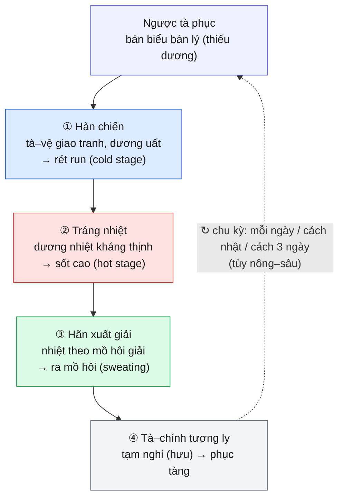
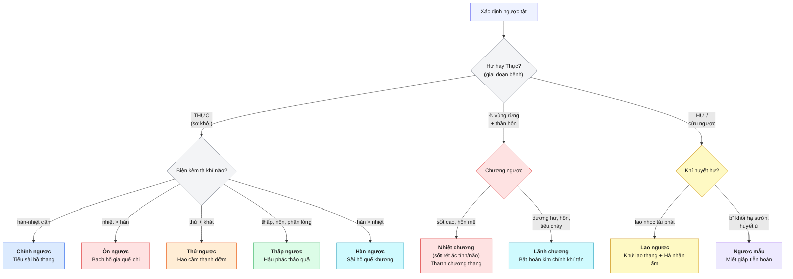

# Ngược tật (瘧疾 / Sốt rét)

> [!abstract] Tóm tắt 1 dòng
> **Ngược tật** = ngoại cảm nhiệt bệnh cấp tính do **ngược tà** (qua muỗi), đặc trưng **hàn chiến → tráng nhiệt → hãn xuất giải**, phát **có chu kỳ**; tà phục tại **bán biểu bán lý (thiếu dương)** xuất nhập dinh-vệ. YHHĐ tương ứng **sốt rét (malaria)** do *Plasmodium* spp.

> [!note] Nguồn & phạm vi
> - Phần **YHCT** trích từ KB `on_benh_dai_cuong` → `nguoc-tat_001/002.md` (Giáo trình Ôn Bệnh, TS.BS. Lê Minh Hoàng; BS.CKII. Lê Thị Ngoan).
> - Phần **YHHĐ** là **kiến thức nền y học hiện đại** (KB ôn bệnh thuần YHCT, **không** chứa ICD-10/thuốc Tây/guideline) — đánh dấu rõ ở từng mục.
> - Liên kết nội bộ: [[bai-01-dai-cuong-on-benh_001]] · [[bai-03-bien-chung_001]] (vệ-khí-dinh-huyết) · [[phong-on_001]] · [[xuan-on_001]] · [[thu-thap_001]]

---

## BƯỚC 1 — Định nghĩa & Phạm vi

### 1.1. YHCT cổ điển

Ngược tật là **ngoại cảm nhiệt bệnh cấp tính** do cảm thụ **ngược tà**, gây **hàn chiến (rét run), tráng nhiệt (sốt cao), đau đầu, hãn xuất (ra mồ hôi)**, **phát có chu kỳ**. Đa số phát mùa **hạ–thu**.

- Văn tự giáp cốt đời Thương (>3000 năm) đã có chữ tượng hình "ngược" → bệnh được ghi nhận rất sớm.
- *Tố vấn — Ngược luận*: bản chất là **"hàn nhiệt hưu tác"** (hưu = nghỉ, tác = phát) — tính chu kỳ ngắt quãng là dấu ấn cốt lõi.
  > "Phù ngược khí giả, **tịnh vu dương tắc dương thắng, tịnh vu âm tắc âm thắng. Âm thắng tắc hàn, dương thắng tắc nhiệt**."
- *Thần Nông bản thảo*: trị ngược có **Thường sơn** (hằng sơn).
- *Trửu hậu bị cấp phương* (Cát Hồng, nhà Tấn): **Thanh hao** một nắm, vắt nước uống chữa sốt rét. ⭐ → chính là chỉ dẫn lịch sử dẫn đến phát hiện **artemisinin** (xem [[#⭐ Cầu nối Đông–Tây artemisinin]]).

### 1.2. YHHĐ *(kiến thức nền)*

**Sốt rét (malaria)**: bệnh truyền nhiễm do ký sinh trùng **_Plasmodium_** truyền qua **muỗi *Anopheles* cái**. Năm loài gây bệnh người: *P. falciparum, P. vivax, P. ovale, P. malariae, P. knowlesi*. ICD-10 **B50–B54**.

### 1.3. Điểm tương đồng & khác biệt căn bản

| Trục | YHCT — Ngược tật | YHHĐ — Sốt rét |
|---|---|---|
| Tác nhân | **Ngược tà** (qua muỗi truyền nhiễm) | *Plasmodium* spp. (muỗi *Anopheles*) |
| Dấu ấn đặc trưng | Hàn chiến → tráng nhiệt → hãn giải, **chu kỳ** | Cơn kịch phát (paroxysm): cold–hot–sweating stage, **đồng bộ theo chu kỳ vỡ hồng cầu** |
| Vị trí bệnh | **Bán biểu bán lý** (thiếu dương), xuất nhập dinh-vệ | Hồng cầu (chu kỳ vô tính trong máu) |
| Cơ chế chu kỳ | Tà–chính giao tranh theo nhịp vận hành vệ khí ("nhất nhật nhất dạ chu vu thân") | Vỡ schizont đồng loạt → giải phóng pyrogen → sốt theo nhịp 48h/72h |
| Thể nặng | Nội truyền **dinh-huyết**, phạm tâm/can → thần hôn, kinh quyết (**chương ngược / nhiệt chương**) | **Sốt rét ác tính** (cerebral malaria, *P. falciparum*) |
| Di chứng mạn | **Ngược mẫu** (bĩ khối hạ sườn trái), **lao ngược** | Lách to (splenomegaly), thiếu máu, tái phát |

> [!tip] Khác biệt then chốt về nhận thức
> YHCT mô tả **kiểu hình lâm sàng** (chu kỳ, hàn–nhiệt, phục tà bán biểu bán lý) tinh tế từ 2000 năm trước, nhưng **không** có khái niệm ký sinh trùng/hồng cầu. YHHĐ giải thích **cơ chế phân tử** nhưng "cold–hot–sweating stage" gần như **trùng khít** mô tả "hàn chiến → tráng nhiệt → hãn xuất" — đây là một trong những song trùng đẹp nhất giữa hai nền y học.

---

## BƯỚC 2 — Cơ chế sinh lý / bệnh lý

### 2.1. YHCT — Cơ chế tà–chính giao tranh

Ngược tà xâm nhập → **chính khí bất túc** không thể kháng tà ngoại xuất → tà **phục tàng tại bán biểu bán lý**, chờ thời cơ. Triệu chứng quyết định bởi **sự ly–hợp giữa ngược tà và vệ khí**:

1. **Tà ngoại xuất, đấu vệ khí** → dương khí bị uất át không ngoại đạt → **ố hàn / hàn chiến** trước.
2. **Dương khí toàn thân huy động kháng tà** → dương nhiệt kháng thịnh → **tráng nhiệt (sốt cao)**.
3. **Chính thắng tà tạm thoái** → nhiệt bức tân tiết → **hãn xuất đầm đề** → nhiệt theo mồ hôi giải → cơ thể mát lại.
4. **Tà còn phục bán biểu bán lý** → tích tụ chờ thời → **tái phát** → tà–chính giao tranh lặp lại nhiều lần.

> *Tố vấn — Ngược luận*: "Vệ khí tương ly, cố bệnh đắc hưu (nghỉ); vệ khí tụ tập, tắc phục bệnh dã."

**Tính chu kỳ**: do dinh-vệ vận hành có quy luật ("vệ khí giả, nhất nhật nhất dạ chu vu thân"). Vị trí **nông–sâu** của tà phục quyết định **mỗi ngày phát / cách nhật / cách 3 ngày**. Tà phục **càng sâu → chu kỳ càng dài, càng khó khỏi**.

**Truyền biến**: đa số tại **vệ–khí phần**. Số ít nội truyền **dinh–huyết**, phạm **tâm, can, kinh quyết âm** → thần hôn, kinh quyết → **dạng nguy hiểm = sốt rét ác tính**.

### 2.2. YHHĐ — Sinh lý bệnh *(kiến thức nền)*

- **Chu kỳ vô tính hồng cầu (erythrocytic schizogony)**: merozoite xâm nhập hồng cầu → trophozoite → schizont → **vỡ đồng loạt** giải phóng merozoite mới + sản phẩm (hemozoin, GPI-anchor).
- **Cơn sốt kịch phát (paroxysm)** = hệ quả vỡ schizont đồng bộ → kích hoạt đại thực bào tiết **TNF-α, IL-1, IL-6** → tác động trung tâm điều nhiệt → **cold stage (rét run/co mạch) → hot stage (sốt cao) → sweating stage (giãn mạch, vã mồ hôi, hạ sốt)**.
- **Chu kỳ sốt theo loài** (do thời gian hoàn tất schizogony):

| Loài *Plasmodium* | Chu kỳ schizogony | Kiểu sốt cổ điển | Đối chiếu YHCT |
|---|---|---|---|
| *P. vivax*, *P. ovale* | 48 giờ | **Tertian** (cách nhật) | "cách nhật phát" |
| *P. falciparum* | ~48h (thường **không đều**) | Sốt liên tục/không điển hình, nặng | thiên về **ôn ngược / chương ngược** |
| *P. malariae* | 72 giờ | **Quartan** (cách 3 ngày) | "cách ba ngày phát" |
| *P. knowlesi* | 24 giờ | **Quotidian** (hằng ngày) | "mỗi ngày mỗi phát" |

- **Tái phát muộn (relapse)**: *P. vivax/ovale* có **hypnozoite** ngủ ở gan → tái phát sau nhiều tháng → đối chiếu **lao ngược** (tà phục lâu, gặp lao nhọc lại phát).
- **Sốt rét ác tính (severe/cerebral malaria)**: chủ yếu *P. falciparum* — hồng cầu nhiễm **cytoadherence/sequestration** vi mạch não → hôn mê, co giật → đối chiếu **chương ngược / nhiệt chứng** (nhiệt độc hãm tâm bào → thần hôn, kinh quyết).
- **Lách to + thiếu máu**: tán huyết + bắt giữ hồng cầu tại lách → đối chiếu **ngược mẫu** (bĩ khối hạ sườn trái) và thiếu máu của lao ngược.

> [!info] Trục đối chiếu cơ chế
> "Vỡ schizont đồng loạt theo nhịp" (YHHĐ) ≈ "vệ khí tụ tập, tà–chính giao tranh theo nhịp vận hành dinh-vệ" (YHCT). Cả hai đều giải thích **vì sao sốt có chu kỳ đều đặn** — điểm hội tụ hiếm có.

---

## BƯỚC 3 — Biểu hiện lâm sàng

### 3.1. Cơ năng (chủ quan)
Sơ khởi: tay chân nhừ mỏi, ngáp, uể oải → **lạnh run** → hết lạnh là **sốt nóng hầm hập**, đau đầu, mặt đỏ, miệng khát tâm phiền → **mồ hôi đầm đề, sốt hạ** → còn hơi chóng mặt, mệt. Chu kỳ lặp lại đúng giờ.

### 3.2. Thực thể (khách quan)
Sốt cao thành cơn đúng chu kỳ; **lách to**; **thiếu máu**; (YHHĐ thêm: vàng da nhẹ, gan to, có thể hạ huyết áp/suy đa cơ quan ở thể nặng).

### 3.3. Tứ chẩn YHCT đặc trưng

| Chẩn | Biểu hiện điển hình |
|---|---|
| **Vọng** | Mặt đỏ khi sốt; lưỡi đỏ rêu mỏng trắng (sơ khởi) → mỏng vàng (lý nhiệt nặng); thể chương ngược: lưỡi đỏ thẫm, rêu đen |
| **Văn** | (theo cơn) — khát, phiền; thể thấp ngược: nôn |
| **Vấn** | **Hàn chiến → tráng nhiệt → hãn xuất**, phát **đúng giờ có chu kỳ**; giữa 2 cơn thường không triệu chứng; yếu tố vùng/mùa |
| **Thiết** | **Mạch huyền** (mạch chủ của ngược); **huyền khẩn** = hàn nặng; **huyền sác** = nhiệt nặng |

---

## BƯỚC 4 — Chẩn đoán

### 4.1. Chẩn đoán xác định (KB)
- Phát quanh năm, nhiều nhất **hè–thu**; có **tính khu vực** (chướng ngược ở vùng rừng núi).
- Triệu chứng điển hình: **hàn chiến – tráng nhiệt – hãn xuất – nhiệt hạ thân mát**, **chu kỳ đúng giờ** (hằng ngày / cách nhật / cách 3 ngày). Thường kèm **lách to, thiếu máu**.
- **Xét nghiệm giúp xác định chẩn đoán.**

> [!note] Tiêu chuẩn YHHĐ *(kiến thức nền)*
> Tiêu chuẩn vàng: **soi lam máu nhuộm Giemsa** (giọt đặc + giọt mỏng) tìm KSTSR & định loài/đếm mật độ. Hỗ trợ: **RDT** (test nhanh kháng nguyên HRP-2/pLDH), **PCR**. Dịch tễ: vùng lưu hành, tiền sử đi rừng. ICD-10: B50 (*falciparum*), B51 (*vivax*), B52 (*malariae*), B53 (khác), B54 (không định loài).

### 4.2. Biện chứng YHCT (Bát cương + Tạng phủ + Kinh lạc)

- **Bát cương**: chủ yếu **biểu-lý chi gian (bán biểu bán lý)**, **hàn-nhiệt vãng lai**; sơ khởi **thực**, lâu ngày **chính hư tà luyến (hư-thực thác tạp)**.
- **Vệ-khí-dinh-huyết** ([[bai-03-bien-chung_001]]): bệnh biến chủ yếu **vệ–khí phần**; nội truyền **dinh–huyết** → thể nặng.
- **Kinh lạc / Tạng phủ**: tà tại **thiếu dương**; thể nặng phạm **tâm (bào), can, kinh quyết âm**; mạn → tổn **tỳ vị, khí huyết**, ứ tại **lạc hạ sườn (lách)**.

### 4.3. Chẩn đoán phân biệt YHCT (KB)

| Bệnh | Điểm phân biệt với ngược tật |
|---|---|
| **Thời hành cảm mạo** | Có triệu chứng **phế vệ rõ** (ngứa họng, ho, nghẹt mũi); ngược tật **không** có, mà **chu kỳ + tính vùng/mùa**, giữa cơn không triệu chứng |
| **Thấp ôn** ([[thu-thap_001]] liên quan) | Khởi chậm, ít hàn chiến; sốt cao **không chu kỳ**, kèm thân nặng, ngực-thượng vị bĩ, nôn, rêu nề; (ruột thuộc thấp ôn → cấy ra thương hàn) |
| **Thử ôn** | Hàn nhiệt khởi phục nhưng **rất ít hàn chiến**, **không chu kỳ**, nhiệt rõ kèm đau mình, bụng đầy |
| **Phế lao** | Sốt **âm hư về chiều/đêm**, không "đúng giờ" như ngược tật |

---

## BƯỚC 5 — Điều trị tích hợp

### 5.1. Đại pháp YHCT

> [!summary] Nguyên tắc tổng quát (KB)
> - **Thực chứng** (sơ khởi, tà mạnh chính chưa suy): **khứ tà tiết ngược**.
> - **Hư-thực thác tạp** (lâu ngày): **phò chính khứ tà, tiêu bản kiêm cố**.
> - **Hư chứng** (ngưng phát, chính hư): **phò chính bổ hư**.
> - Tà tại thiếu dương → **hòa giải thiếu dương**; thiên nhiệt → **thanh nhiệt đạt tà**; thiên hàn → **tân ôn tán hàn**; chương dịch → **tịch uế trừ chương giải độc**; kèm đàm/thực/ứ → khứ đàm/tiêu trệ/hóa ứ.
> - ⏱ **Dùng thuốc trước cơn ~2 giờ** là tốt nhất.

### 5.2. Bảng so sánh 8 thể lâm sàng (lõi của bài)

| Thể | Đặc trưng hàn–nhiệt | Cơ chế YHCT | Pháp trị | Phương chủ | Đối chiếu YHHĐ *(nền)* |
|---|---|---|---|---|---|
| **Chính ngược** | Hàn nhiệt vãng lai, đúng giờ | Tà phục thiếu dương xuất nhập dinh-vệ | Khứ tà tiết ngược, hòa giải đạt tà | **Tiểu sài hồ thang gia vị** (+Thường sơn, Bình lang, Thảo quả) | Sốt rét điển hình chưa biến chứng |
| **Ôn ngược** | **Nhiệt nhiều hàn ít** / chỉ nhiệt | Tố thể dương thịnh, thử tà nội uẩn | Thanh nhiệt hòa giải đạt tà | **Bạch hổ gia quế chi thang** gia giảm | Thể sốt cao nổi trội (vd *falciparum*) |
| **Thử ngược** | Hàn nhẹ nhiệt nặng, khát dữ | Thử nhiệt kháng thịnh kèm thấp | Thanh thử hóa thấp tiết ngược | **Hao cầm thanh đởm thang** gia giảm | Cơn mùa nóng, mất nước/khát rõ |
| **Thấp ngược** | Hàn nhiệt đúng giờ, **thân nhiệt bất dương**, nôn, phân lỏng | Thấp nhiệt khốn trở trung tiêu | Táo thấp hóa trọc, khứ tà tiết ngược | **Hậu phác thảo quả thang** | Thể tiêu hóa nổi trội |
| **Hàn ngược** | **Hàn nhiều nhiệt ít**, thích uống nóng | Tố thể dương hư + kiêm cảm hàn tà | Tán hàn tiết ngược, hòa giải khử tà | **Sài hồ quế khương thang** gia giảm (nặng: Phụ tử lý trung + Thục tất tán) | Thể rét trội (vd *vivax* cold-predominant) |
| **Chương ngược — Nhiệt chương** | Sốt cao, **thần hôn, chiêm ngữ, kinh quyết**, có thể hoàng đản | Sơn cương nhiệt độc, hãm tâm bào | Thanh nhiệt tịch uế giải độc | **Thanh chương thang** gia giảm (+ Tử tuyết đơn / Thanh hao tố) | ⚠ **Sốt rét ác tính thể não** (cerebral) |
| **Chương ngược — Lãnh chương** | Hàn nhiều / chỉ hàn, nôn, tiêu chảy, thân hôn | Dương hư + chương độc thấp trọc, úng át tam tiêu | Tán hàn tịch uế giải độc hóa trọc | **Bất hoán kim chính khí tán** gia vị (+ Tô hợp hương hoàn) | Thể nặng trụy mạch/chuyển nặng |
| **Lao ngược** | Hàn nhiệt lúc phát lúc không, **gặp lao nhọc lại phát** | Cửu ngược hao khí huyết, chính hư tà luyến | Bổ ích chính khí, phò chính khứ tà | **Khứ lao thang hợp Hà nhân ẩm** | Tái phát mạn (hypnozoite *vivax/ovale*) |
| **Ngược mẫu** | Bĩ khối **hạ sườn trái**, trướng thống, sắc mặt u tối, lưỡi ứ ban | Huyết ứ đàm ngưng (cửu ngược) | Dịch đàm tán ứ, tiết ngược tiêu tích, điều bổ khí huyết | **Miết giáp tiễn hoàn** | **Lách to** / cường lách sốt rét |

### 5.3. Cây quyết định biện chứng

> Tà tại thiếu dương → hòa giải; thiên nhiệt → thanh; thiên hàn → ôn; chương → tịch uế giải độc; hư → phò chính.

### 5.4. Phân tích phương chủ (KB)

> [!example] Tiểu sài hồ thang gia vị — **Chính ngược**
> Sài hồ · Hoàng cầm · Bán hạ · Nhân sâm · Sinh khương · Đại táo · Cam thảo · **Thường sơn · Bình lang · Thảo quả**.
> - **Sài hồ + Hoàng cầm**: hòa giải thiếu dương bán biểu bán lý.
> - Bán hạ + Sinh khương: giáng nghịch hòa vị.
> - Nhân sâm + Cam thảo + Đại táo: trợ chính đạt tà.
> - **Thường sơn + Bình lang + Thảo quả**: tiết ngược (= "đặc trị" sốt rét).
> - ⚠ Thường sơn **gây buồn nôn/nôn** → uống lúc **ấm**, không uống lúc nóng.
> - Gia giảm: nhiệt nặng + khát → +Thạch cao, Tri mẫu, Hoa phấn; hàn nặng ít mồ hôi, đau khớp → +Quế chi; đàm thấp → bỏ Sâm/Thảo/Táo, +Thương truật, Hoắc hương, Hậu phác.

Các phương còn lại (tra cứu nhanh):

| Thể | Phương | Vị chủ đạo |
|---|---|---|
| Ôn ngược | Bạch hổ gia quế chi thang | Thạch cao, Tri mẫu, Quế chi, Sài hồ, Thanh hao, Cam thảo |
| Thử ngược | Hao cầm thanh đởm thang | Thanh hao, Hoàng cầm, Bán hạ, Trần bì, Phục linh, Trúc nhự + Mã tiên thảo, Thường sơn |
| Thấp ngược | Hậu phác thảo quả thang | Thảo quả, Hậu phác, Thường sơn, Mã tiên thảo, Trần bì, Bán hạ, Phục linh, Hạnh nhân |
| Hàn ngược | Sài hồ quế khương thang | Sài hồ, Quế chi, Can khương, Hoàng cầm, Hoa phấn, Mẫu lệ + Thảo quả, Bình lang, Thường sơn |
| Nhiệt chương | Thanh chương thang | Cầm-Liên-Mẫu, Sài hồ, Thường sơn, Thanh hao… + Tử tuyết đơn |
| Lãnh chương | Bất hoán kim chính khí tán | Hoắc hương, Bội lan, Thương truật, Hậu phác, Thảo quả, Bình lang… |
| Lao ngược | Khứ lao thang hợp Hà nhân ẩm | Thường sơn, Thanh hao, Sài hồ, Tri mẫu, Miết giáp, Đương quy, Hà thủ ô, Đảng sâm |
| Ngược mẫu | Miết giáp tiễn hoàn | Miết giáp + Giá trùng, Đào nhân, Đại hoàng, Đơn bì (hoạt huyết hóa ứ) — *công bổ kiêm thi* |

### 5.5. Điều trị triệu chứng & dự phòng (KB)
- **Hàn chiến**: giữ ấm. **Sốt cao**: hạ nhiệt vật lý; hoặc Kinh giới 15g + Bạc hà 15g sắc lau mình; **châm**: Đại chùy, Thiếu thương, Khúc trì, Thái xung.
- **Hôn mê**: nhiệt nổi trội → **"Tam bảo"** (An cung/Tử tuyết/Chí bảo); thấp đàm uế trọc → **Tô hợp hương hoàn**. ⭐ **Thanh hao tố (artemisinin) rất tốt trong sốt rét thể não.**
- **Dự phòng**: diệt muỗi/khống chế ổ bệnh; điều trị triệt căn giai đoạn ngưng phát; rèn luyện thân thể; vùng dịch dùng thuốc phòng (bài Thủ ô–Nhân sâm–Phục linh–Hoắc hương…).

> [!warning] Phác đồ YHHĐ *(kiến thức nền — KB không chứa)*
> Theo **WHO Guidelines for malaria**: sốt rét *P. falciparum* chưa biến chứng → **ACT** (artemisinin-based combination therapy) 3 ngày; **sốt rét nặng → artesunate tĩnh mạch** ưu tiên (thay quinine). *P. vivax/ovale*: thuốc cắt cơn + **primaquine/tafenoquine** diệt hypnozoite chống tái phát (cần loại trừ thiếu G6PD). **Bắt buộc điều trị theo guideline + định loài + đếm KST**; YHCT đóng vai trò **hỗ trợ triệu chứng / phục hồi**, không thay thế thuốc đặc hiệu.

### ⭐ Cầu nối Đông–Tây: artemisinin

> [!quote] Một mạch nối 1700 năm
> *Trửu hậu bị cấp phương* (Cát Hồng, ~340 CN): **"Thanh hao một nắm, nước hai thăng, vắt nước uống"** trị sốt rét → gợi ý **chiết lạnh** (không sắc nóng) cho **Đồ U U (Tu Youyou)** phân lập **artemisinin (青蒿素)** từ *Artemisia annua* → **Nobel Y học 2015**. Ngày nay **ACT** là phác đồ chuẩn toàn cầu. Đây là minh chứng kinh điển: tri thức YHCT → dược phẩm hiện đại có bằng chứng RCT.
> Lưu ý dược liệu: **Thường sơn** (*Dichroa febrifuga*) chứa **febrifugine** — alkaloid kháng sốt rét mạnh nhưng gây **nôn** (khớp với mô tả KB "Thường sơn gây buồn nôn").

---

## BƯỚC 6 — Bằng chứng khoa học

> [!note] Mức độ bằng chứng *(kiến thức nền, KB ôn bệnh không chứa RCT)*
> - **Artemisinin/ACT**: bằng chứng **mức A** — nhiều RCT & meta-analysis; nền tảng khuyến cáo WHO; cơ sở giải Nobel 2015.
> - **Thanh hao tố trong sốt rét thể não/nặng**: artesunate TM > quinine (giảm tử vong) — RCT lớn (vd AQUAMAT, SEAQUAMAT) — mức A *(dẫn từ y văn nền)*.
> - **Các phương cổ phương đa vị** (Tiểu sài hồ thang…): bằng chứng chủ yếu **mức C** (kinh nghiệm/cổ điển), thiếu RCT chất lượng cao cho chỉ định sốt rét hiện đại → **không thay thế** thuốc đặc hiệu.
> - Khoảng trống: phần lớn dữ liệu hiện đại về sốt rét nằm ở thuốc đơn chất (artemisinin, primaquine…), không ở bài thuốc đa vị YHCT.

---

## BƯỚC 7 — Điểm cần nhớ & Câu hỏi phản biện

> [!success] 5 key points
> 1. **Dấu ấn nhận diện**: hàn chiến → tráng nhiệt → hãn xuất giải, **chu kỳ đúng giờ**, giữa cơn sạch triệu chứng, kèm lách to + thiếu máu — khớp **cold/hot/sweating stage** của paroxysm sốt rét.
> 2. **Định vị bệnh = bán biểu bán lý (thiếu dương)** → đại pháp gốc là **hòa giải thiếu dương** (Tiểu sài hồ thang); biến thể theo hàn/nhiệt/thấp/thử.
> 3. **8 thể**: chính – ôn – thử – thấp – hàn – chương (nhiệt/lãnh) – lao – ngược mẫu; trục **thực→hư** + **kèm tà** quyết định pháp & phương.
> 4. **Thể nguy hiểm = chương ngược/nhiệt chương** ≈ **sốt rét ác tính thể não** (thần hôn, kinh quyết) → cấp cứu, dùng Tam bảo + **artemisinin**.
> 5. **Cửu ngược** → lao ngược (chính hư tà luyến) & **ngược mẫu** (lách to/huyết ứ) — cần phò chính + hoạt huyết tiêu tích.

> [!question] 2 câu hỏi phản biện
> 1. Cơ chế "vỡ schizont đồng loạt → cytokine → sốt" giải thích **tertian/quartan** theo loài. Hãy biện luận: mô hình YHCT "tà phục nông–sâu → chu kỳ ngắn–dài" có **giá trị tiên lượng độc lập** nào không, hay chỉ là mô tả kiểu hình trùng với chu kỳ schizogony?
> 2. KB xếp **chính ngược** dùng Tiểu sài hồ thang (hòa giải thiếu dương), nhưng YHHĐ điều trị **mọi** sốt rét bằng thuốc đặc hiệu bất kể "thể". Vậy biện chứng phân thể YHCT còn vai trò lâm sàng ở đâu trong kỷ nguyên ACT — **hỗ trợ triệu chứng, phục hồi sau sốt rét, hay chỉ giá trị lịch sử/giáo dục**? Bảo vệ quan điểm của bạn.

---

> [!cite] Tham chiếu
> - **YHCT**: KB `on_benh_dai_cuong` — [[nguoc-tat_001]], [[nguoc-tat_002]] (Giáo trình Ôn Bệnh, ĐH YD Cần Thơ 2024). Cổ thư: *Tố vấn — Ngược luận*, *Thần Nông bản thảo*, *Trửu hậu bị cấp phương*, *Chư bệnh nguyên hầu luận*.
> - **YHHĐ**: kiến thức nền y học hiện đại (WHO malaria guidelines; sinh lý bệnh paroxysm; Tu Youyou — Nobel 2015). **Không** trích từ KB.
>
> *Mục đích giáo dục — áp dụng lâm sàng cần cá thể hóa và tuân thủ phác đồ đặc hiệu hiện hành.*
