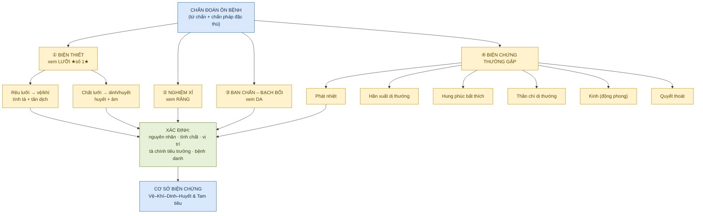
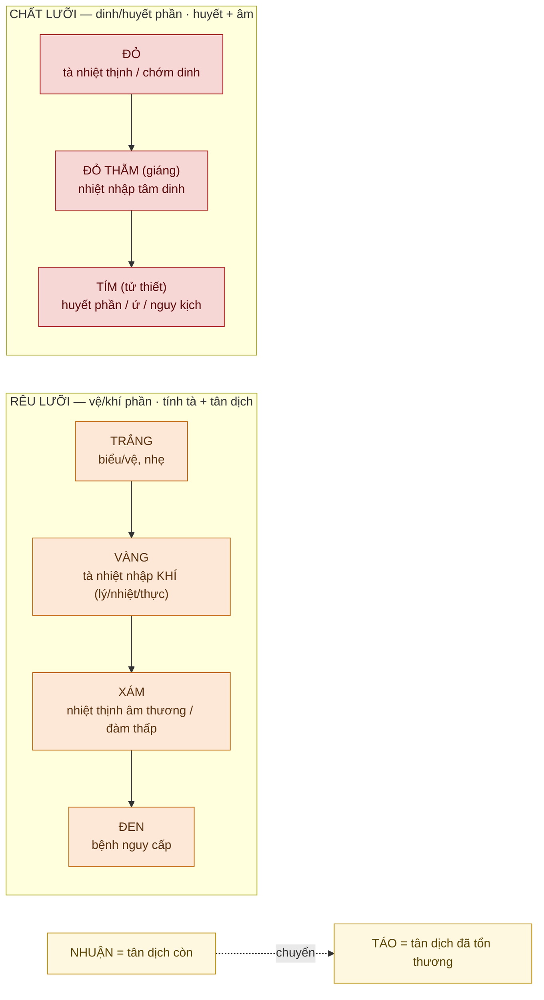
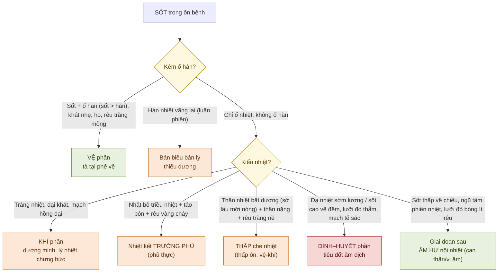
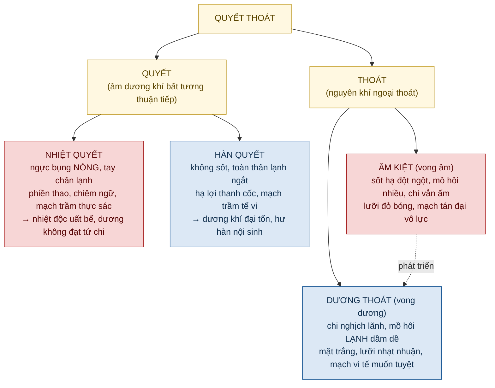

# CHẨN ĐOÁN ÔN BỆNH — Hệ Thống Hóa 20/80

> [!info] Định vị nguồn
> Toàn bộ phần lý luận YHCT lấy nguyên từ **KB Bài 4 — Chẩn đoán Ôn bệnh** (3 chunk: `bai-04-chan-doan_001..003`): biện thiết (lưỡi), nghiệm xỉ (răng), ban chẩn–bạch bối, và biện các chứng thường gặp (phát nhiệt, hãn xuất, hung phúc, thần chí, kinh, quyết thoát).
> → Các đoạn đối chiếu Tây y / cơ chế hiện đại được đánh dấu 🔸 **[Kiến thức nền — ngoài KB]**.

---

## ⚡ TL;DR — Nắm trong 60 giây

- **Chẩn đoán ôn bệnh = tứ chẩn (vọng–văn–vấn–thiết)** nhưng vì biểu hiện đặc thù nên hình thành các **chẩn pháp riêng**: biện thiết, nghiệm xỉ, biện ban chẩn–bạch bối, biện phát nhiệt–mồ hôi–thần chí–kinh quyết.
- **Câu thần chú:** *"Thương hàn trọng mạch, Ôn bệnh trọng thiết"* — trong ôn bệnh **xem LƯỠI là số 1** vì lưỡi biến hóa nhanh, nhạy, phản ánh trực tiếp tà chính & tân dịch.
- **Hai trục của lưỡi:** **RÊU lưỡi** phản ánh **vệ–khí phần** (tính tà + tân dịch) → màu tiến **trắng → vàng → xám → đen** = tà từ **biểu nhập lý, ngày càng nặng**. **CHẤT lưỡi** phản ánh **dinh–huyết phần** (huyết/âm) → **đỏ → đỏ thẫm (giáng) → tím (tử thiết)** = nhiệt **nhập dinh huyết, càng sâu càng nguy**.
- **Mục tiêu chẩn đoán:** xác định **nguyên nhân – tính chất – vị trí (nông/sâu) – tà chính tiêu trưởng – bệnh danh/bệnh chứng** → làm **cơ sở cho biện chứng Vệ–Khí–Dinh–Huyết và Tam tiêu**.
- **Ban vs Chẩn:** *"Ban là dương minh nhiệt độc (vị, huyết), Chẩn là thái âm phong nhiệt (phế, khí→dinh)"*; **Bạch bối (rôm sảy) = thấp nhiệt ở KHÍ phần**.
- **Cờ đỏ nguy cấp:** thần chí dị thường, kinh (động phong), quyết thoát; rêu **bạch sa / nám mốc / như phấn chất lưỡi tím**; lưỡi **tím tối khô**; ban **tím đen ám tối / hồng nhạt không thấu**.

---

## 🗺️ Bản đồ khái niệm

---

## ★ 20% CỐT LÕI — mang lại 80% giá trị

> [!important] Năm trụ phải thuộc nằm lòng
> 1. **Ôn bệnh trọng THIẾT (lưỡi).** Lưỡi nhanh – nhạy – khách quan; ưu tiên trước mạch.
> 2. **Tách RÊU và CHẤT lưỡi thành 2 trục độc lập** rồi hợp lại: rêu = vệ/khí + tân dịch; chất = dinh/huyết + âm. Khi hai trục **không thống nhất** (vd chất đỏ thẫm + rêu trắng hoạt nề) → tà **đã nhập dinh** mà **khí phần thấp trọc chưa giải**.
> 3. **Đọc màu theo chiều tiến triển = đọc giai đoạn bệnh.** Rêu trắng→vàng→xám→đen (biểu→lý, nặng dần). Chất đỏ→giáng→tím (vệ-khí→dinh→huyết, sâu dần). Nhuận→táo = tân dịch đang tổn thương.
> 4. **Sốt là triệu chứng bắt buộc — kiểu sốt định vị giai đoạn:** sốt+ố hàn (vệ) · tráng nhiệt (khí/dương minh) · nhật bô triều nhiệt (phủ thực) · thân nhiệt bất dương (thấp che nhiệt) · dạ nhiệt/sốt thấp về chiều (dinh-huyết/âm hư).
> 5. **Nhận diện CỜ ĐỎ nguy cấp ngay:** thần chí dị thường · kinh quyết · quyết thoát · rêu bạch sa/mốc/phấn-tím · lưỡi tím khô · ban tím đen ám tối hoặc hồng nhạt không thấu được.

> [!tip] Khung suy luận 1 dòng
> **"Lưỡi (rêu+chất) định giai đoạn → Sốt/mồ hôi định tính chất & tân dịch → Ban/răng định độ sâu nhiệt độc → Thần chí/kinh/quyết định mức nguy."**

---

## ① BIỆN THIẾT — Xem lưỡi (chẩn pháp số 1)

> [!note] Vì sao lưỡi là số 1 trong ôn bệnh
> KB: *"Thiệt vi tâm chi miêu"*, lưỡi thông kinh lạc nhiều tạng (can, thận, tỳ, bàng quang, tam tiêu) → lưỡi là **chỉnh thể** với toàn thân. Trong ôn bệnh hình ảnh lưỡi **biến hóa rất nhanh, nhạy** → *"Thương hàn trọng mạch, Ôn bệnh trọng thiết"*. Xem **2 mặt: RÊU lưỡi + CHẤT lưỡi**; quan sát hình thái, sắc trạch, **nhuận/táo**, động thái.

### 1.1. Trục tiến triển của lưỡi (nắm trước khi học chi tiết)

### 1.2. Rêu lưỡi (phản ánh VỆ – KHÍ phần)

| Màu rêu | Phân loại điển hình | Ý nghĩa (KB) |
|---|---|---|
| **Trắng** | Mỏng thiếu nhuận, chót/rìa hơi đỏ | Sơ khởi, tà ở **vệ phần** (đầu phong ôn). *Phân biệt phong hàn: trắng mỏng nhưng **nhuận**, sắc lưỡi bình thường* |
| | Trắng mỏng mà **khô**, rìa+đầu đỏ | Tà chưa giải, **phế tân đã thương**; phong nhiệt thịnh, vẫn còn ở vệ |
| | Trắng **dày dính** (kèm nước bọt đặc) | **Thấp nhiệt tương bác, trọc tà thượng phiếm** → thấp trở khí phần (thấp ôn, thấp trọc thiên thịnh) |
| | Trắng dày **khô táo**, chất đỏ | Tỳ thấp chưa hóa mà **vị tân đã thương** (vị táo, phế khí tổn) |
| | Trắng **nề**, chất **đỏ thẫm** | **Thấp át nhiệt phục** (khí phần); hoặc nhiệt đã nhập dinh còn kèm thấp chưa hóa |
| | ⚠ Trắng hoạt nề **như tích phấn**, chất **tím thẫm** | **Uế trọc uất bế mạc nguyên** — đa số **nguy hiểm**, gặp ở **ôn dịch** |
| | ⚠ **Bạch sa** (như cát, khô nứt, sờ ráp) | Nhiệt **hóa táo nhập vị quá nhanh**, tân dịch **đại tổn** |
| | ⚠ **Nám mốc trắng** (như nấm/xác đậu hũ) | **Uế trọc nội uất, vị khí suy bại** — dự hậu xấu |
| **Vàng** | (Trắng→vàng) | **Tiêu chí tà nhiệt nhập KHÍ phần.** Mỏng=nông, dày=nặng; nhuận=tân còn, khô=tân thương |
| | Vàng khô **nứt mọc gai** | **Dương minh phủ thực chứng** |
| | Vàng nề / vàng trọc | **Thấp nhiệt nội uẩn** lưu luyến khí phần |
| **Xám** | Xám **khô** (từ vàng táo) | **Nhiệt thịnh âm thương** / dương minh phủ thực |
| | Xám **nề** | Ôn bệnh kèm **thấp tà nội trở** (đàm thấp) |
| | Xám **hoạt** | **Dương hư / hàn** (thấp ôn giai đoạn sau, thấp thắng tổn dương) |
| **Đen** | Đen khô mọc gai, chất khô | **Dương minh phủ thực + thận âm hao kiệt** — nên tả hạ mà bỏ lỡ |
| | Đen mỏng khô/héo, chất thẫm khô | Giai đoạn sau, **tà nhập hạ tiêu, thận âm hao kiệt** |
| | Đen khô + chất đỏ + tâm phiền mất ngủ | **"Tân khô hỏa tích"** — chân âm muốn tuyệt |
| | Đen nhuận, rêu không rõ | Ôn bệnh **kèm đàm thấp** (đàm phục hung cách) — thường không nguy |
| | Đen khô + chất **trắng nhợt không tươi** | **Khí tùy huyết thoát** (xuất huyết lượng lớn) |

> [!warning] Nguyên tắc đọc rêu
> Rêu **trắng** đa số nhẹ, dự hậu tốt — **TRỪ** bạch sa, nám mốc, như-phấn-chất-tím (nguy). Rêu **vàng** chủ lý–nhiệt–thực (khí phần). Rêu **xám/đen** đa số nguy cấp, **nhưng phải chia hàn/nhiệt/hư/thực** bằng **nhuận hay táo** + triệu chứng toàn thân.

### 1.3. Chất lưỡi (phản ánh DINH – HUYẾT phần)

| Chất lưỡi | Hình ảnh điển hình | Ý nghĩa (KB) |
|---|---|---|
| **Đỏ** | Toàn lưỡi hơi đỏ hơn bình thường | Tà nhiệt kháng thịnh / **chớm nhập dinh** (vệ-khí thì chỉ đỏ rìa + có rêu; nhập dinh thì **đỏ toàn bộ, không rêu**) |
| | Đầu chót đỏ mọc gai | **Tâm hỏa thượng viêm** (xuất hiện sớm hơn đỏ thẫm) |
| | Giữa nứt như chữ "nhân" / nốt đỏ | **Tâm dinh nhiệt cực** |
| | Bóng đỏ non, nhìn nhuận sờ khô | Nhiệt **bắt đầu lui**, tân chưa hồi |
| | Đỏ nhạt **không tươi** | **Khí âm lưỡng hư** (giai đoạn sau, nhiệt lui khí âm chưa hồi) |
| **Đỏ thẫm (giáng thiệt)** | Phát triển từ đỏ, vị trí **sâu hơn** | **Tiêu chí tà nhiệt nhập TÂM DINH** |
| | Đỏ thẫm + rêu vàng trắng | Nhiệt **chớm nhập dinh** mà khí phần tà **chưa hết** |
| | Đỏ thẫm + rêu dính bản | Nhiệt dinh-huyết **+ đàm thấp/uế trọc** → dễ **thần chí dị thường** (đàm mông tâm bào) |
| | Đỏ thẫm bóng **như mặt kiếng**, khô | **Vị âm suy vong** |
| | Đỏ thẫm không tươi, **khô teo** | **Thận âm hao kiệt** — nguy kịch, giai đoạn sau |
| **Tím (tử thiết)** | Thẫm hơn + tối | Từ đỏ thẫm chuyển qua → **càng sâu nặng** |
| | Tím khô cháy mọc gai (**dương mai thiệt**) | **Huyết phần nhiệt độc cực thịnh** — báo trước động huyết/động phong |
| | Tím tối khô (như gan heo) | **Can thận âm kiệt** — dự hậu kém |
| | Tím ứ tối, sờ **ướt** | **Ứ huyết nội** (sẵn ứ + cảm ôn; kèm đau thích thống ngực sườn bụng) |

> [!important] Khi rêu & chất "đá nhau" — dấu hiệu vàng
> Bình thường rêu+chất **thống nhất** (đỏ + vàng táo = nhiệt nặng thương âm). Khi **không thống nhất** — vd **chất đỏ thẫm + rêu trắng hoạt nề** — nghĩa là **thấp trọc chưa hóa (khí) + tà nhiệt đã nhập dinh**. Đây là điểm dễ bỏ sót: phải **kết hợp cả hai** mới định đúng tầng bệnh.

### 1.4. Hình thái lưỡi & động thái

| Hình thái | Ý nghĩa (KB) |
|---|---|
| Cường ngạnh (cứng) | Khí dịch bất túc — **báo trước động phong, kinh quyết** |
| Rụt ngắn | Nội phong nhiễu động, **đàm trọc trở gốc lưỡi** |
| **Cuốn** (+ âm nang co) | **Nguy kịch, đã vào quyết âm** |
| Teo mềm, không le ra khỏi răng | **Can thận âm dịch gần tuyệt** |
| Lệch / run | **Can phong nội động** |

> [!tip] Động thái = phim, không phải ảnh
> Theo dõi chiều biến hóa: rêu **mỏng→dày, trắng→vàng→xám đen** = tà nhập lý mạnh dần. **Nhuận→táo** = tân thương / thấp hóa táo. Rêu **dày trọc→mỏng/rời rạc** = tà tiêu thoái (tốt). **Rêu cấu đột nhiên bóng sạch** = vị tân hao vong (xấu). Đỏ thẫm **đột ngột chuyển hồng nhạt** = **dương khí bạo thoát** (cấp cứu).

### 1.5. 🔸 Đối chiếu cơ chế hiện đại

🔸 **[Kiến thức nền — ngoài KB]**

| Quan sát YHCT | Tương quan hiện đại (KB có dẫn nghiên cứu) |
|---|---|
| Rêu trắng→vàng→xám đen | Tương quan **bạch cầu / BC trung tính ↑**, mức độ viêm nhiễm ↑ |
| Rêu vàng | Nhiều tế bào sừng hóa, trung tính, đơn nhân; gắn với **viêm – sốt – rối loạn tiêu hóa** |
| Rêu trắng dày nề | Tăng tiết nước bọt/đàm, tế bào sừng hóa bong chậm |
| Chất lưỡi đỏ thẫm | **Sốt cao mất nước, thiếu vitamin, mất K⁺** → viêm lưỡi, sung huyết, teo thượng bì |
| Lưỡi xanh tím | **Độ nhớt máu ↑, huyết lưu chậm** |
| Lưỡi có ứ ban (sốt xuất huyết) | Cảnh báo **xuất huyết não/tiêu hóa** → kiểm tra đông máu |

---

## ② NGHIỆM XỈ — Xem răng

> [!note] Diệp Thiên Sĩ
> *"Khám ôn bệnh, sau khi xem lưỡi phải xem răng, vì **răng là phần dư của thận, lợi là lạc mạch của vị**; nhiệt tà không táo vị tân tất sẽ táo thận dịch."* → Răng đánh giá **nhiệt nặng nhẹ & tồn vong tân dịch**.

| Vị trí | Dấu hiệu | Ý nghĩa (KB) |
|---|---|---|
| **Răng (cửa)** | Quang táo **như đá** (khô nhưng còn bóng) | **Vị nhiệt thương tân**, thận âm chưa kiệt — chưa nặng |
| | Khô **như xương khô** (khô + không bóng) | **Thận âm khô kiệt** — dự hậu không tốt |
| | Khô **sắc đen** | Tà nhiệt **nhập hạ tiêu**, can thận âm thương / hư phong sắp động |
| **Kẽ răng** | Chảy máu **kèm sưng đau nướu**, đỏ tươi lượng nhiều | **Vị hỏa xung kích** — thuộc **thực** |
| | Chảy máu **không sưng đau**, thấm rỉ | **Thận hỏa thượng viêm** — thuộc **hư** |

> [!tip] Mẹo nhớ
> Răng đầu giai đoạn còn **bóng** (như đá) → vị tân thương, nhẹ. Mất bóng (**như xương**) → thận âm kiệt, nặng. **Đen** → đã xuống hạ tiêu. Chảy máu **sưng = thực (vị)**, **không sưng = hư (thận)**.

---

## ③ BAN CHẨN & BẠCH BỐI — Xem da

> [!quote] Cốt lõi phân biệt
> *"**Ban** là dương minh nhiệt độc (vị nhiệt → bức huyết, **huyết phần**); **Chẩn** là thái âm phong nhiệt (tà nhiệt uất **phế** → xuyên **dinh** phần)."* — Lục Tử Hiền. Diệp Thiên Sĩ: *"Ban chẩn là biểu hiện **tà khí lộ ra ngoài**."*

| Tiêu chí | **BAN** | **CHẨN** | **BẠCH BỐI (rôm sảy)** |
|---|---|---|---|
| Hình thái | Mảng dưới da, **phẳng**, sờ không cộm, ấn không đổi màu | **Hạt nhỏ nổi**, sờ cộm tay | Bóng nước nhỏ trắng **như trân châu**, nổi cao, dịch trong |
| Phân bố | Ngực bụng → tứ chi | Họng/miệng → sau tai, đầu mặt lưng → (3–4 ngày) ngực bụng | Cổ, ngực, bụng; ít ở đầu mặt-tứ chi |
| Vị trí bệnh | **Vị, huyết phần** (dương minh nhiệt bức dinh huyết) | **Phế, khí→dinh** (phong nhiệt) | **Khí phần** (dù mọc ở da) |
| Nguyên nhân | Nhiệt uất dương minh, bức huyết vọng hành | Tà nhiệt uất phế, nội xuyên dinh | **Thấp nhiệt** uất khí phần, uẩn chưng vệ biểu |
| Gặp trong | Nhiệt độc nặng | Phong nhiệt | **Thấp ôn, thử thấp, phục thử** |

> [!warning] Đọc sắc & mật độ ban chẩn (tiên lượng)
> **Sắc:** hồng hoạt vinh nhuận = thuận (chính khí còn, tà thấu được). Đỏ tươi như son = huyết nhiệt thịnh. Đỏ thâm như mào gà = nhiệt độc nặng đã vào sâu. **Tím đen** = hỏa độc cực thịnh, **hung hiểm** (nhưng đen mà *bóng* còn chữa được; đen *ám tối* = nguyên khí suy bại, dự hậu rất kém). **Hồng nhạt** = khí huyết bất túc không thấu nổi tà → cũng nguy.
> **Mật độ (Diệp Thiên Sĩ "nghĩ kiến bất nghĩ kiến đa"):** thấy ban xuất hiện thưa, tươi, lan đều = tà thấu ra (tốt). **Mọc dày đặc như chui từ da ra, cứng nhọn = nhiệt độc phục sâu khó xuất** (nghịch chứng).

> [!note] "Ngoại giải lý hòa" vs nghịch chứng
> Sau khi ban/chẩn thấu phát mà **nhiệt hạ, tinh thần thư thái** = tà theo ban thoát ra (tốt). Nếu thấu phát mà **sốt không hạ, thần chí lơ mơ, chi lạnh, mạch vi/phục** = **chính bất thắng tà, độc hỏa nội bế** → nghịch chứng, dự hậu xấu. **Bạch bối**: hạt căng tròn, thấu xong hạ sốt = tân khí sung; hạt **khô khốc không dịch + sốt không hạ + hôn mê** = tân khí kiệt, tà nội hãm (nguy).

---

## ④ BIỆN CÁC CHỨNG THƯỜNG GẶP

### 4.1. Phát nhiệt (sốt) — định vị giai đoạn

> [!note] Đặc điểm sốt ôn bệnh vs nội thương vs thương hàn
> **Ôn bệnh:** khởi cấp nhanh, sơ khởi kèm ố hàn/hàn chiến tráng nhiệt, sốt thường cao, đi qua các giai đoạn VKDH, bệnh trình ngắn. **Nội thương:** khởi chậm, bệnh trình dài, sốt không cao / lúc sốt lúc dứt. **Thương hàn:** biểu **hàn** chứng — sốt nhẹ, **ố hàn nặng**, miệng không khát, mạch phù hoãn (ôn bệnh: dễ khát, dễ ra mồ hôi).

| Kiểu sốt | Đặc điểm | Định vị (KB) |
|---|---|---|
| Sốt + **ố hàn** | Sốt > hàn, khát nhẹ, ho, đau họng, mạch phù sác | **Vệ phần** (phế vệ) |
| **Hàn nhiệt vãng lai** | Ố hàn–sốt luân phiên | **Thiếu dương** (bán biểu bán lý) |
| Hàn nhiệt khởi phục | Lên xuống liên miên, ố hàn nhiều | **Thấp nhiệt uế trọc uất bế mạc nguyên** |
| **Tráng nhiệt** | Toàn thân nóng, chỉ ố nhiệt | **Khí phần / dương minh** |
| **Nhật bô triều nhiệt** | Sốt cao về chiều (15–17h) + táo bón + rêu vàng cháy | **Nhiệt kết trường phủ (phủ thực)** |
| **Thân nhiệt bất dương** | Sờ lâu mới thấy nóng, thân nặng, rêu trắng nề | **Thấp che nhiệt** (thấp > nhiệt) |
| Dạ nhiệt / phát nhiệt dạ thâm | Sốt cao về đêm | **Tiêu đốt âm dịch** (dinh-huyết) |
| Dạ nhiệt **táo lương** | Đêm nóng, sáng mát, không mồ hôi | Giai đoạn sau, **tà lưu âm phần** |
| **Sốt thấp** (về chiều) | Ngũ tâm phiền nhiệt, lưỡi đỏ bóng | **Âm hư** (vị âm / can thận âm) |

### 4.2. Hãn xuất dị thường (mồ hôi bất thường)

> [!quote] Chương Hư Cốc
> *"Quan sát mồ hôi để biết **sự tồn vong của tân dịch** và **các đường khí cơ thông hay bế**."*

| Dạng mồ hôi | Triệu chứng kèm | Ý nghĩa (KB) |
|---|---|---|
| **Vô hãn** (sơ khởi) | Sốt ố hàn, đau đầu, rêu trắng mỏng | Tà tại **vệ**, bế tắc tấu lý |
| Vô hãn (cao trào) | Sốt đêm, phiền thao, lưỡi đỏ thẫm, mạch tế sác | Tà tại **dinh-huyết**, cướp dinh âm → **nguồn hãn bất túc** |
| **Mồ hôi lúc có lúc không** | Hạn ra thì hạ sốt rồi sốt lại, lặp lại | **Thấp nhiệt uất chưng** (thấp ôn, thử thấp) |
| **Đại hãn** + sốt cao + đại khát + mạch hồng đại | | **Dương minh khí phần nhiệt** bức tân ngoại tiết |
| Đại hãn đột ngột dầm dề + khí đoản + môi khô răng táo + mạch tán đại | | **Vong âm** (tân khí ngoại thoát) |
| Mồ hôi **lạnh** dầm dề + chi quyết lãnh + mặt trắng/xám + mạch vi muốn tuyệt | | **Vong dương** (dương khí ngoại thoát) |
| **Chiến hãn** | Lạnh run → sốt cao → vã mồ hôi → hạ nhiệt | **Điểm ngoặt:** chính vùng lên đẩy tà |

> [!important] Đọc chiến hãn (bước ngoặt sinh tử)
> Sau chiến hãn **mạch bình hòa, thân mát** = chính thắng tà (khỏi). Nếu **sốt không hạ + phiền thao** = tà chưa suy. Nếu **mồ hôi lạnh + chi lạnh + mạch cấp hư** = chính bại, tà nội hãm + dương ngoại thoát. **Lạnh run mà KHÔNG ra mồ hôi = trung khí khuy hư, nguy** (Ngô Hựu Khả).

### 4.3. Hung phúc bất thích (khó chịu ngực bụng)

> [!note] Cần kết hợp thiết chẩn cục bộ
> Khám tại chỗ: nóng/lạnh, mềm/cứng, **ấn đau (cự án) hay thích án**, có u cục? Gõ **nặng đục = thấp trở**, **vang trống = khí trệ**. **Cự án = thực; thích án = hư.**

| Vị trí/kiểu | Ý nghĩa (KB) |
|---|---|
| **Hung bộ đông thống** (ngực) + sốt ho, hít sâu đau tăng | **Tà nhiệt úng phế** (phong ôn) |
| Ngực đau như châm chích + lưỡi tím sờ ướt | **Ứ huyết** vùng ngực cách + nhiệt |
| **Hung muộn quản bĩ** + thân nhiệt bất dương, rêu trắng nề | **Thấp nhiệt trở khí cơ** (thấp ôn) |
| Bĩ chứng: ấn **mềm** không đau | **Vô hình tà nhiệt úng tụ**, vị khí bất hòa |
| Bĩ: ấn **cứng đề kháng** không đau | Tà nhiệt úng + **vị hư bất vận** |
| **Hung hiệp đông thống** + hàn nhiệt vãng lai, miệng đắng, mạch huyền | **Đàm nhiệt uất trở thiếu dương** |
| **Vị quản mãn thống** ấn đau tăng | **Kết hung** (thấp nhiệt/đàm trọc/thực trệ) |
| **Phúc trướng ngạnh thống** + cự án + táo bón + chiêm ngữ + rêu vàng cháy + mạch trầm hữu lực | **Nhiệt kết trường phủ** |
| **Thiếu phúc ngạnh mãn đông thống** + tiêu phân đen + như cuồng + khát súc miệng không nuốt + lưỡi tím | **Súc huyết hạ tiêu** (ứ + nhiệt) |

### 4.4. Thần chí dị thường — ⚠ vùng nguy kịch

> [!warning] Cơ chế chung
> Tà nhiệt bạo liệt **nội hãm tâm bào lạc** → tổn thần minh. Phối hợp: **thấp/đàm mông che** (trọc hại thanh) hoặc **ứ nhiệt nội bế tâm khiếu**; hoặc **chính khí suy → tâm thần thất dưỡng**.

| Mức độ | Biểu hiện | Bệnh cơ (KB) |
|---|---|---|
| **Thần chí hôn mông** | Lãnh đạm, ngây ngô, lúc tỉnh lúc mê, **gọi vẫn đáp** | **Thấp nhiệt ủ đàm che tâm bào** (rêu cấu nê) |
| **Thần hôn chiêm ngữ** | Mất ý thức, nói nhảm không kiểm soát | Nhiệt **vào/bế tâm bào** (dinh nhiệt → ban lờ mờ; huyết nhiệt → la cuồng, thổ/tiện huyết) |
| chiêm ngữ + giọng nặng đục + táo bón + rêu vàng cháy | | **Nhiệt kết trường phủ** (vị nhiệt nhiễu tâm) |
| **Hôn mê bất ngữ** | Hôn mê sâu, **gọi không đáp** | Nhiệt/đàm/ứ **bế tâm bào**; +chi lạnh, lưỡi nhạt, mạch vi = **nội bế ngoại thoát** |
| **Thần chí như cuồng** | Vật vã như điên + thiếu phúc cứng đau + phân đen + lưỡi tím | **Hạ tiêu súc huyết, ứ nhiệt nhiễu tâm** |

### 4.5. Kinh (động phong) — co giật

> [!important] Phân thực vs hư (then chốt điều trị)
> | | **Thực chứng động phong** | **Hư chứng động phong** |
> |---|---|---|
> | Giai đoạn | Khí/dinh/huyết tà nhiệt thịnh | **Giai đoạn sau** |
> | Co giật | Cực nhanh, **mạnh liên tục**, trợn mắt, cắn răng, gáy cứng, giác cung phản trương | **Vô lực**, chỉ máy cơ tay/chân/mép |
> | Kèm | Sốt cao, thần hôn, mạch hồng/huyền sác hữu lực | Sốt thấp, ngũ tâm phiền nhiệt, hao gầy, lưỡi đỏ thẫm **khô teo**, mạch tế vô lực |
> | Cơ chế | **Nhiệt cực sinh phong** (thiêu đốt cân mạch) | **Thủy bất hàm mộc** (can thận âm hao → hư phong nội động) |
>
> Khi nhiệt hãm thủ quyết âm: **kinh (can phong) + quyết/thần hôn (tâm bào)** cùng xuất hiện → gọi chung **nhiệt hãm thủ quyết âm**.

### 4.6. Quyết thoát — ⚠ chứng nặng nhất

> [!caution] Phân biệt sống còn: quyết do NÓNG hay LẠNH
> **Nhiệt quyết** = ngực bụng nóng + tay chân lạnh ("nhiệt thâm quyết thâm", dương bị uất không đạt ra). **Hàn quyết** = toàn thân lạnh, không sốt (dương hư). **Vong âm**: mồ hôi nhiều **chi vẫn ấm**, lưỡi đỏ. **Vong dương**: mồ hôi **lạnh, chi lạnh**, lưỡi nhạt. Âm kiệt → có thể kéo theo dương thoát → **âm dương đều thoát**.

---

## 🔸 ĐỐI CHIẾU TÂY Y (định hướng)

🔸 **[Kiến thức nền — ngoài KB; chỉ để bắc cầu tư duy, KHÔNG thay chẩn đoán Tây y]**

| Dấu hiệu YHCT | Gợi ý tương quan hiện đại |
|---|---|
| Sốt + giai đoạn VKDH | Diễn tiến **nhiễm trùng cấp** (khu trú → toàn thân → nhiễm khuẩn huyết) |
| Rêu vàng/đen + BC↑ | Mức độ **viêm/nhiễm khuẩn** |
| Lưỡi/ban ứ tím, ban tím đen | **Rối loạn đông máu / DIC / xuất huyết** → check đông máu |
| Thần chí dị thường, kinh quyết | **Bệnh não nhiễm độc / viêm não-màng não / co giật do sốt** |
| Quyết thoát (vong âm/dương) | **Sốc** (giảm thể tích / nhiễm khuẩn) — cấp cứu bù dịch, vận mạch |
| Đại hãn/tiêu chảy → vong âm | **Mất nước – điện giải nặng** |

> [!caution] An toàn trước (safety first)
> Các cờ đỏ (thần chí, kinh, quyết thoát, xuất huyết) là **cấp cứu nội khoa** — xử trí Tây y theo căn nguyên **không trì hoãn**; YHCT chỉ bổ trợ. (Xem [[feedback-citation-rigor]].)

---

## 🔗 MỐI LIÊN HỆ & KHOẢNG TRỐNG

> [!note] Chẩn đoán này kết nối đi đâu
> - **Biện thiết/sốt → định tầng VKDH** = đầu vào cho **biện chứng luận trị** từng bệnh: [[Thử Thấp — Bài Giảng Chuyên Sâu]], [[Phong Ôn — Bài Giảng Chuyên Sâu]], [[Xuân Ôn — Bài Giảng Chuyên Sâu]].
> - **Ban/chẩn/bạch bối** ↔ bệnh có phát ban: lạn hầu sa, đại đầu ôn, thấp ôn.
> - **Quyết thoát/thần chí** ↔ cấp cứu YHCT–Tây y, tương tác thuốc [[duoc-hoc-tich-hop]].

> [!question] Khoảng trống & câu hỏi mở (tự nghiên cứu tiếp)
> - KB Bài 4 **chỉ là chẩn pháp** — chưa gắn **phác đồ điều trị** từng dấu hiệu; cần ghép với bài biện chứng luận trị.
> - Thiếu **ảnh lưỡi thực tế** (atlas) → khó chuẩn hóa "đỏ thẫm" vs "tím". Hướng: sưu tập bộ ảnh lưỡi đối chiếu.
> - Mức **bằng chứng hiện đại** cho thiệt chẩn còn quan sát/tương quan — chưa chuẩn hóa định lượng.

---

## 🧭 LỘ TRÌNH HỌC TẬP (đề xuất thứ tự)

1. **Thuộc 2 trục lưỡi trước tiên** (rêu = vệ/khí; chất = dinh/huyết) + quy luật **nhuận/táo** → đây là xương sống, học 1 lần dùng mãi.
2. **Ghép sốt vào VKDH** (sơ đồ 4.1) — luyện đến mức nghe kiểu sốt là định được tầng.
3. **Nhận diện cờ đỏ** (thần chí · kinh thực/hư · quyết thoát nóng/lạnh · rêu bạch sa/mốc · lưỡi tím khô) — ưu tiên an toàn.
4. **Ban vs Chẩn vs Bạch bối** + đọc sắc/mật độ (tiên lượng thuận/nghịch).
5. **Nghiệm xỉ + hung phúc + hãn xuất** — bổ trợ, củng cố định khu & tân dịch.
6. **Áp dụng:** lấy 1 bệnh đã học ([[Thử Thấp — Bài Giảng Chuyên Sâu]]) → dùng bộ chẩn pháp này "đọc ngược" từng thể.

---

## 🧠 CÂU HỎI PHẢN BIỆN (tự kiểm tra)

> [!question] Q1
> Bệnh nhân **chất lưỡi đỏ thẫm nhưng rêu trắng hoạt nề**. Hai trục lưỡi đang "đá nhau" — bạn đọc tầng bệnh ở đâu, và vì sao **không được** chỉ thanh dinh mà bỏ hóa thấp khí phần?

> [!question] Q2
> Hai bệnh nhân cùng **tay chân lạnh**: (A) ngực bụng nóng, phiền thao, mạch trầm thực sác; (B) toàn thân lạnh, hạ lợi thanh cốc, mạch vi muốn tuyệt. Phân biệt **nhiệt quyết vs hàn quyết** và hệ quả điều trị trái ngược thế nào?

> [!question] Q3
> Vì sao **"lạnh run mà không ra mồ hôi"** sau giai đoạn chiến hãn lại là dấu nguy, trong khi **"lạnh run rồi vã mồ hôi rồi hạ sốt"** lại là điểm ngoặt tốt? Cơ chế trung khí ở đây là gì?

---

> [!quote] Trích dẫn kim chỉ nam
> *"Thương hàn trọng mạch, Ôn bệnh trọng thiết."*
> *"Ban là dương minh nhiệt độc, chẩn là thái âm phong nhiệt."* — Lục Tử Hiền.
> *"Ban chẩn là biểu hiện tà khí lộ ra ngoài."* — Diệp Thiên Sĩ.

---
*Nguồn KB: `kb/on_benh_dai_cuong/01_ly-thuyet/bai-04-chan-doan_001..003.md` (toàn bài). Các phần 🔸 là kiến thức nền Tây y/cơ chế hiện đại ngoài KB. Mục đích giáo dục — áp dụng lâm sàng cần cá thể hóa.*
