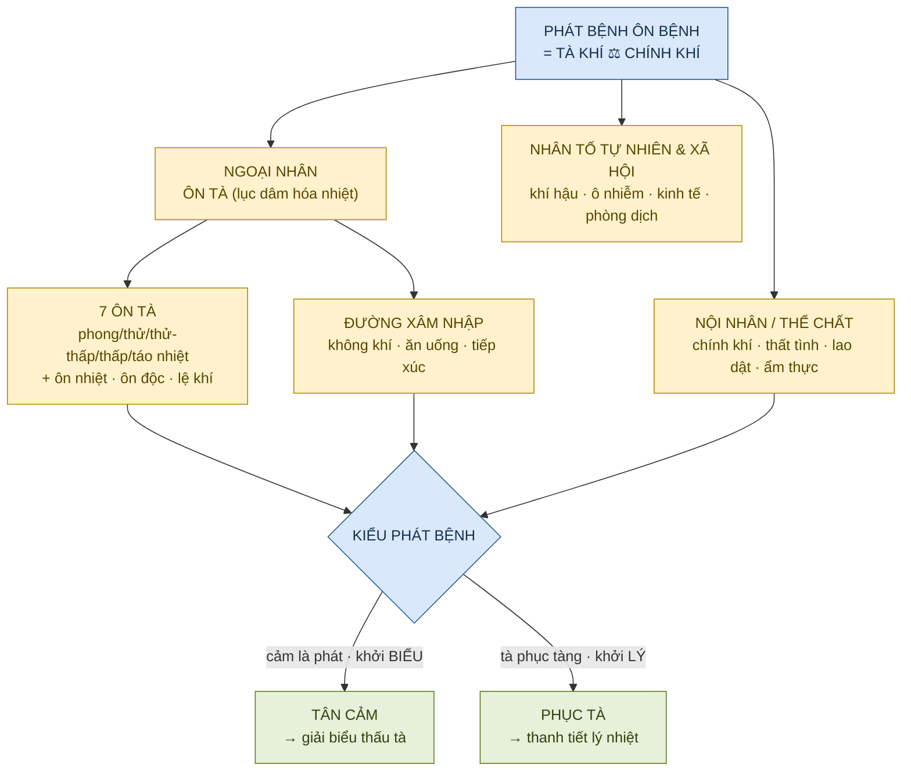
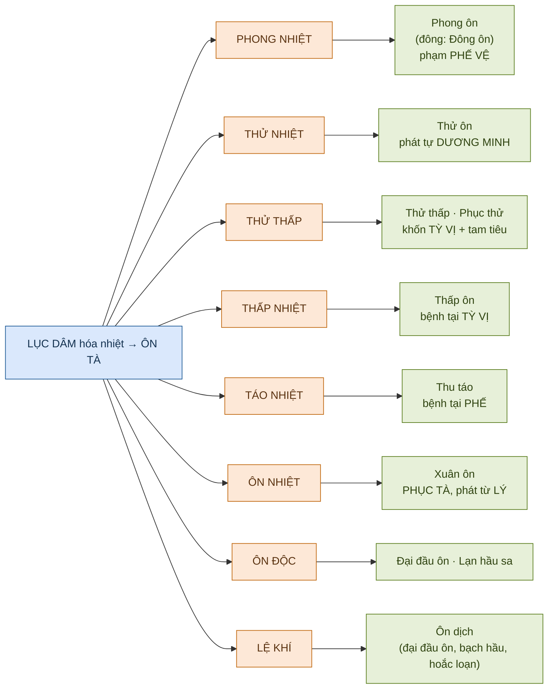
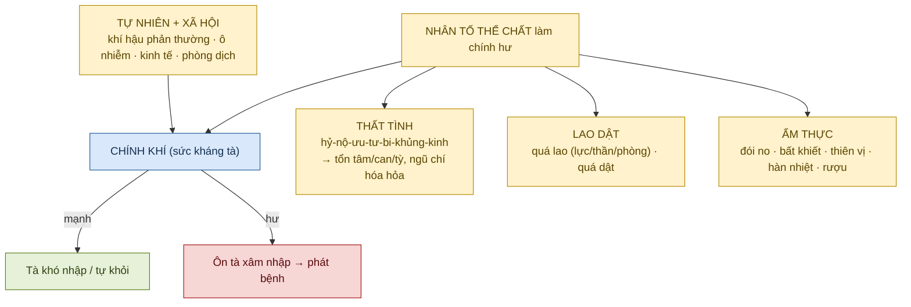
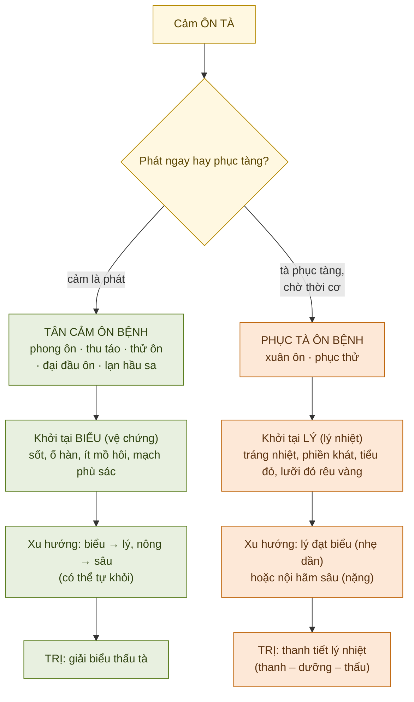

# NGUYÊN NHÂN & PHÁT BỆNH ÔN BỆNH — Hệ Thống Hóa 20/80

> [!info] Định vị nguồn
> Toàn bộ lý luận YHCT lấy nguyên từ **KB Bài 2 — Nguyên nhân bệnh & Phát bệnh** (3 chunk `bai-02-nguyen-nhan-phat-benh_001..003`): khái niệm ôn tà, lục khí↔lục dâm, **7 loại ôn tà**, cơ chế phát bệnh (thể chất–thất tình–lao dật–ẩm thực + tự nhiên + xã hội), đường xâm nhập, **tân cảm ↔ phục tà**, và học thuyết các y gia (lục dâm hóa hỏa, tạp khí).
> → Đoạn đối chiếu hiện đại đánh dấu 🔸 **[Kiến thức nền — ngoài KB]**.

---

## ⚡ TL;DR — Nắm trong 60 giây

- **Nguyên nhân ôn bệnh = ÔN TÀ** (lục dâm hóa nhiệt). Đặc tính chung: **(1) tính ôn nhiệt rõ; (2) vào từ miệng-mũi/bì mao, phát nhanh; (3) gắn mùa (thời tà); (4) chuyển hóa lẫn nhau; (5) mỗi tà phạm vị trí riêng.**
- **Phát bệnh hay không = tỷ lệ TÀ KHÍ ↔ CHÍNH KHÍ.** *"Nước nâng thuyền cũng lật thuyền"* — lục khí bình thường vô hại, **thái quá/phản thường hoặc cơ thể yếu** mới thành lục dâm gây bệnh.
- **7 ôn tà → ôn bệnh tương ứng:** phong nhiệt→**phong ôn** (phế vệ), thử nhiệt→**thử ôn** (dương minh), thử thấp→**thử thấp/phục thử** (tỳ vị+tam tiêu), thấp nhiệt→**thấp ôn** (tỳ vị), táo nhiệt→**thu táo** (phế), ôn nhiệt→**xuân ôn** (lý/phục tà), ôn độc→**đại đầu ôn/lạn hầu sa**, lệ khí→**ôn dịch**.
- **Mỗi tà có "địa chỉ" và "tính nết":** phong khinh-động-thiện hành (**bách bệnh chi trưởng**); nhiệt/hỏa thượng viêm, thương tân-động huyết-nhiễu thần; thử mãnh liệt hao khí thương tân, dễ kèm thấp; thấp trọng-trọc-niêm trệ (dai dẳng, khốn tỳ); táo khô thương tân thương phế.
- **Hai kiểu phát bệnh (quyết định pháp trị):** **TÂN CẢM** = cảm tà phát ngay, **khởi tại BIỂU** → trị **giải biểu thấu tà**. **PHỤC TÀ** = tà phục tàng rồi phát, **khởi tại LÝ (lý nhiệt)** → trị **thanh tiết lý nhiệt** (+thanh-dưỡng-thấu).
- **Hai mốc học thuyết:** **Lưu Nguyên Tố** — *lục dâm đều hóa hỏa* (nền tảng hàn lương thanh nhiệt). **Ngô Hựu Khả** — *học thuyết tạp khí* (ôn dịch ≠ thương hàn; bệnh nguyên đặc hiệu, vào miệng mũi, lây mạnh).

---

## 🗺️ Bản đồ khái niệm

---

## ★ 20% CỐT LÕI — mang lại 80% giá trị

> [!important] Sáu điều phải thuộc
> 1. **Ôn tà = lục dâm hóa nhiệt**, mang 5 đặc tính chung (ôn nhiệt · vào miệng mũi/bì mao · theo mùa · chuyển hóa · phạm vị trí riêng).
> 2. **Phát bệnh = cuộc đấu tà ↔ chính.** Chính khí mạnh thì không bệnh / tự khỏi; chính hư thì tà nhập sâu.
> 3. **Thuộc bảng 7 ôn tà → ôn bệnh + vị trí phạm** (đây là "bản đồ" để sau này biện chứng từng bệnh).
> 4. **Mỗi tà có tính nết riêng** quyết định triệu chứng: phong động & kèm khác (trưởng), nhiệt thương tân-động huyết-nhiễu thần, thử hao khí mãnh liệt, thấp trọng-trọc-niêm (dai dẳng khốn tỳ), táo khô thương phế.
> 5. **Tân cảm vs Phục tà = ngã ba pháp trị:** biểu chứng trước → giải biểu thấu tà; lý nhiệt trước → thanh tiết lý nhiệt.
> 6. **Lục dâm hóa hỏa (Lưu Nguyên Tố) + Tạp khí (Ngô Hựu Khả)** = 2 cột mốc lý luận nguyên nhân.

> [!tip] Khung suy luận 1 dòng
> **"Tà nào (7 ôn tà) → tính nết & địa chỉ phạm → cảm-là-phát hay phục-tàng → biểu hay lý → chọn giải biểu hay thanh lý."**

---

## ① ÔN TÀ — Đặc tính chung & Lục khí ↔ Lục dâm

> [!note] Lục khí vs Lục dâm — ranh giới "tương đối"
> **Lục khí** (phong-hàn-thử-thấp-táo-hỏa) = 6 khí hậu **bình thường**, vô hại, vạn vật nương theo. Thành **lục dâm/lục tà** khi: **(a)** khí hậu **thái quá / bất cập / phản thường / đột ngột** (xuân đáng ấm lại lạnh…); hoặc **(b)** cơ thể **thích ứng kém** dù khí bình thường. *"Dâm" = thái quá, thấm dần.* → Trong lục dâm, các tà có tính nhiệt (phong nhiệt, thử nhiệt, thấp nhiệt, thử thấp, táo nhiệt, ôn nhiệt) gọi chung là **ÔN TÀ**; thêm **ôn độc, lệ khí** cũng thuộc ôn tà.

| Đặc tính chung của ôn tà (KB) | Diễn giải |
|---|---|
| **Tính ôn nhiệt rõ** | Gây bệnh → phát nhiệt + hiện tượng nhiệt |
| **Xâm nhập từ ngoài** | Qua **miệng mũi, bì mao**; phát bệnh **nhanh** |
| **Gắn mùa/thời tiết** | "Thời lệnh ôn tà" — xuân phong, hạ thử, trường hạ thấp, thu táo |
| **Chuyển hóa** | Nhiệt chước→táo; nhiệt chưng→thấp động; hàn uất→hóa nhiệt |
| **Phạm vị trí riêng** | Phong nhiệt→**phế** (thủ thái âm); thử→**vị** (túc dương minh); thấp→**tỳ** (túc thái âm) |

> [!tip] Phương pháp luận: "Thẩm chứng cầu nhân" → "Thẩm nhân luận trị"
> Suy nguyên nhân **từ triệu chứng** (vd đau khớp di chuyển = phong tà có tính động). Vì xuất phát từ chỉnh thể & biện chứng nên **chữ "nhân" có khi không trùng tác nhân thực**, nhưng ứng dụng rộng — biết nhân rồi mới định được trị.

> [!note] 🔸 Góc nhìn hiện đại (KB có nhắc)
> 🔸 **[Kiến thức nền]** Lục dâm theo khoa học hiện đại bao hàm cả **sinh vật (vi khuẩn, virus), tác nhân vật lý, hóa học**. Phân biệt với **"nội sinh ngũ tà"** (nội phong/hàn/thấp/táo/hỏa) — giống lục dâm nhưng **do nội sinh**, không phải ngoại lai.

---

## ② BẢY ÔN TÀ — Bản đồ tà → bệnh (trung tâm bài)

| Ôn tà | Mùa | Vị trí phạm | Đặc điểm gây bệnh cốt lõi (KB) | Ôn bệnh sinh ra |
|---|---|---|---|---|
| **Phong nhiệt** | Xuân (đông ấm) | **Phế vệ** (thủ thái âm) | Vào miệng mũi **phạm phế đầu tiên**; **thương phế-vị âm tân** ("lưỡng dương tương kiếp"); **dễ tiêu nhưng dễ nghịch truyền tâm bào** | **Phong ôn** (đông→Đông ôn) |
| **Thử nhiệt** | Hè | **Dương minh** (vị) | Tổn thương **cực nhanh**, *"phát tự dương minh"*; **hao khí thương tân** mãnh liệt; **trực trúng tâm bào, bế khiếu động phong**; dễ kèm thấp. *Chỉ ngoại cảm, không nội sinh* | **Thử ôn** |
| **Thử thấp** | Hè / giao hè-thu | **Tỳ vị** + tam tiêu | Khốn trở tỳ vị, **lan tỏa tam tiêu**, tổn lạc động huyết, **hao nguyên khí** | **Thử thấp · Phục thử** |
| **Thấp nhiệt** | Trường hạ (4 mùa) | **Tỳ vị** (trung tiêu) | **Niêm nê chậm khó khỏi**; thương tỳ vị; **bế thanh dương, uất khí cơ** (thân nhiệt bất dương) | **Thấp ôn** |
| **Táo nhiệt** | Thu | **Phế** | Khô ráp **thương tân**, thương phế; **dễ tòng hỏa hóa** (ù tai, mắt đỏ, đau họng) | **Thu táo** (ôn táo) |
| **Ôn nhiệt** | Xuân | **Lý** (phục) | **Tà nội phục, phát từ trong ra** (lý nhiệt ngay); **động phong động huyết**; hao âm **can thận** | **Xuân ôn** (phục tà) |
| **Ôn độc** | — | Công xuyên đa ổ | **Công xuyên lưu tấu** (lên đầu mặt, xuống tông cân); **uẩn kết úng trệ** (sưng nóng đỏ đau, ban chẩn) | **Đại đầu ôn** (phong nhiệt thời độc), **Lạn hầu sa** (ôn nhiệt thời độc) |
| **Lệ khí** | — | Vào miệng mũi, vị trí đặc thù | **Truyền nhiễm rất mạnh**, **phát cấp nguy kịch**, biến hóa nhiều, thành dịch | **Ôn dịch** (đại đầu ôn, bạch hầu, hoắc loạn) |

### 2.1. Tính nết các tà cơ bản (lục dâm) — để đọc triệu chứng

| Tà | Tính chất | Triệu chứng đặc trưng (KB) |
|---|---|---|
| **Phong** | Khinh-dương, khai tiết, **thiện hành biến hóa**, chủ động; **bách bệnh chi trưởng** | Phạm cao/biểu: ra mồ hôi, ố hàn, đau đầu, ho; đau **di chuyển** (hành tý); chóng mặt, co giật; **dễ kéo theo hàn/thử/thấp/táo/hỏa** |
| **Nhiệt / Hỏa** | Dương tà, thượng viêm | Sốt cao, khát, họng khô, lưỡi táo, tiểu đỏ, táo bón; **thương tân hao khí**; **sinh phong động huyết** (nhiệt cực sinh phong; bức huyết vọng hành); **nhiễu tâm thần** (phiền, cuồng, mê); sinh nhọt ung |
| **Thử** | Dương tà viêm nhiệt cực, **thăng tán** | Sốt **rất cao**, mặt/mắt đỏ, mạch hồng đại; mồ hôi nhiều → **thương tân hao khí** ("khí tùy tân thoát"); **rất thường kèm thấp** |
| **Thấp** | Âm tà, **trọng-trọc-niêm trệ**, xu hướng **đi xuống** | Nặng nề (thân/đầu/khớp), bài tiết **đục bẩn**, dính trệ (đại tiện không hết, rêu nê); **dai dẳng tái phát**; **khốn tỳ thương dương** ("thấp thắng tắc dương vi"); tổn phần dưới (phù, đới hạ) |
| **Táo** | Khô ráp, thu liễm | Miệng môi-da khô nứt, **ho khan ít đàm** (có thể lẫn máu), táo bón; **thương phế** (thích nhuận ghét táo); **dễ tòng hỏa hóa** |

---

## ③ CƠ CHẾ PHÁT BỆNH — Vai trò CHÍNH KHÍ & thể chất

> [!quote] "Y Tông kim giám"
> *"Lục khí chi tà, cảm nhân tuy đồng, nhân thụ chi nhi sinh bệnh các dị…"* — cùng một tà nhưng **thể trạng khác nhau** (gầy/mập, khí thịnh/suy, tạng hàn/nhiệt) thì bệnh khác nhau → **tà tùy người mà hóa**.

### 3.1. Thất tình — khí cơ thất điều

> [!note] Quy luật cốt lõi
> Thất tình **đều phát từ TÂM** rồi tổn tạng tương ứng; lâm sàng đa số biểu hiện ở **tâm – can – tỳ**. Khí uất lâu → **"ngũ chí hóa hỏa"** (mặt đỏ, miệng đắng, phiền, mất ngủ, thổ huyết).

| Tình chí | Ảnh hưởng khí cơ (KB) | Biểu hiện |
|---|---|---|
| **Nộ** (giận) | **Khí thượng** (can khí nghịch) | Đau căng đầu, mặt mắt đỏ, thổ huyết, hôn quyết |
| **Hỷ** (vui quá) | **Khí hoãn** (tâm khí tán) | Tinh thần không tập trung, cuồng loạn |
| **Bi/Ưu** (buồn) | **Khí tiêu** (tổn phế khí) | Khí đoản, ủy mị, mệt mỏi |
| **Khủng** (sợ) | **Khí hạ** (thận khí bất cố) | Tiêu tiểu không tự chủ, hôn mê, di tinh |
| **Kinh** (giật mình) | **Khí loạn** (tâm vô sở ý) | Tâm quý, hoảng hốt không yên |
| **Tư** (lo nghĩ) | **Khí kết** (tỳ khí uất) | Chán ăn, bụng trướng, tiêu chảy |

### 3.2. Lao dật & Ẩm thực

| Nhóm | Loại | Hậu quả (KB) |
|---|---|---|
| **Quá lao** | Lao lực | Hao khí: thiếu khí lười nói, uể oải, gầy |
| | Lao thần (tư lự) | Hao **tâm huyết-tỳ khí**: tâm quý, mất ngủ, hay quên, ăn kém |
| | Phòng lao | Tổn **thận tinh**: đau lưng mỏi gối, ù tai, di tinh, dương nuy |
| **Quá dật** | An nhàn quá độ | Khí huyết không thông, **khí trệ huyết ứ**, tỳ vận giảm, mập bệu mà yếu |
| **Ẩm thực** | Đói/No thất thường | Đói→hóa sinh bất túc; No→thực trệ tổn tỳ vị, uất hóa nhiệt/sinh đàm |
| | Bất khiết | Đau bụng, tiêu chảy, kiết lỵ |
| | Thiên vị (ngũ vị) | Tạng tương ứng thiên thịnh → mất cân bằng (chua→can khắc tỳ…) |
| | Hàn/Nhiệt | Hàn lương→hàn thấp nội sinh; cay nóng→vị trường tích nhiệt |
| | Nghiện rượu | Tính **thấp + nhiệt** → tổn tỳ vị, nội sinh thấp nhiệt (rêu dày dơ, miệng đắng) |

### 3.3. Đường xâm nhập của tà

| Đường | Cơ chế (KB) | Khởi bệnh tại | Ví dụ |
|---|---|---|---|
| **Không khí** (hô hấp) | Mũi thông phế | **Thượng tiêu – phế** | Phong ôn, lạn hầu sa |
| **Ăn uống** (miệng) | Miệng thông vị | **Tỳ-vị-trường** | Thấp ôn, hoắc loạn (ăn uống bẩn) |
| **Tiếp xúc** (bì mao) | Qua da, vật trung gian | Bì mao | Sốt rét (muỗi Anopheles), dịch tiếp xúc nước nhiễm |

---

## ④ PHÁT BỆNH — Tân cảm ↔ Phục tà (ngã ba pháp trị)

> [!important] Bảng so sánh Tân cảm ↔ Phục tà (KB Bảng 2.1)
> | | **TÂN CẢM** | **PHỤC TÀ** |
> |---|---|---|
> | Kiểu phát | Cảm tà **lập tức phát** | Tà **phục tàng** chờ cơ hội phát |
> | Truyền biến | Khởi **biểu** → giải biểu / hoặc nhập lý (nông→sâu) | Phát từ **lý** → lý đạt biểu (nhẹ) / hoặc nội hãm sâu (nặng) |
> | Chứng hậu sơ khởi | **Biểu chứng**, chưa có lý chứng | **Lý chứng** (lý nhiệt); có biểu chứng nếu do ngoại cảm dẫn phát |
> | Trị liệu | **Giải biểu thấu tà** | **Thanh tiết lý nhiệt** là chính |
> | Mức độ | Nhẹ hơn, bệnh trình ngắn | Nặng hơn, dai dẳng, biến chứng nhiều |

> [!warning] Bẫy lâm sàng
> Quy luật trên là **chuẩn**, nhưng có ngoại lệ: **thử ôn** (tân cảm) lại **sơ khởi đa số dương minh kinh, rất ít biểu chứng**. Phân tân cảm/phục tà **không dựa "sớm/trễ" (khó xác định)** mà dựa **biểu hiện lâm sàng sơ khởi phát tại biểu hay tại lý**.

---

## ⑤ HỌC THUYẾT Y GIA — 2 cột mốc

> [!note] Lục dâm hóa hỏa — Lưu Nguyên Tố (Kim Nguyên)
> *"Phàm nói phong nhưng đích thực đều là hỏa"*, *"tích thấp sinh nhiệt"*. Trong lục dâm, **mọi tà khi bệnh đều có thể hóa hỏa**; lục kinh truyền biến đều là **nhiệt chứng, không có âm hàn**. → Đặt nền cho **pháp trị hàn lương thanh nhiệt**.

> [!note] Học thuyết tạp khí — Ngô Hựu Khả (cuối Minh)
> Chữa ôn dịch bằng phương Thương hàn luận **không kết quả** → kết luận **ôn dịch ≠ thương hàn** (khác **nguồn bệnh**). **Tạp khí** = vật vô hình, không mùi, không phải lục khí, không ghép tứ thời. Đặc tính: **(1)** tạp khí khác → bệnh khác; **(2)** bệnh nguyên **đặc hiệu** (loài này nhiễm, loài kia không); **(3)** vị trí tạng phủ đặc thù; **(4)** vào **miệng mũi** ("thiên thụ") / tiếp xúc ("truyền nhiễm"); **(5)** **lây mạnh, truyền biến nhanh**; **(6)** ôn nhiệt **hao thương âm tân** (tà giải phải dưỡng âm, cấm Sâm-Kỳ-Truật ôn táo). **Lệ khí** = tạp khí mạnh-nguy nhất.
> → **Ý nghĩa:** xuyên thủng quan điểm *"bách bệnh giai sinh vu lục khí"*, mô tả gần đúng **bệnh truyền nhiễm cấp**. Hạn chế: chưa thành hệ lý luận độc lập, không thoát ly lục dâm.

> [!note] Thuyết Phục tà & Tân cảm (phát bệnh)
> **Phục tà** (sớm nhất — *"Tàng vu tinh giả, xuân bất ôn bệnh"*): hàn/thử tà phục tàng, **điều kiện = chính khí (thận khí) hư**; vị trí phục bàn cãi (cơ phu / cơ cốt / mạc nguyên / thiếu âm thận); cần **nhân tố dẫn phát** (khí hậu, tái cảm, lao-thực-tình chí). **Tân cảm** (hình thành muộn hơn, nhà Thanh thịnh): cảm là phát. Diệp Thiên Sĩ–Ngô Cúc Thông **dùng cả hai** linh hoạt theo ca.

---

## 🔗 MỐI LIÊN HỆ & KHOẢNG TRỐNG

> [!note] Bài này kết nối đi đâu
> - **7 ôn tà → từng bệnh cụ thể:** [[Phong Ôn — Bài Giảng Chuyên Sâu]] (phong nhiệt), [[Thử Thấp — Bài Giảng Chuyên Sâu]] (thử thấp), [[Xuân Ôn — Bài Giảng Chuyên Sâu]] (ôn nhiệt/phục tà).
> - **Tân cảm/phục tà → biện chứng VKDH** + [[Chẩn Đoán Ôn Bệnh — Hệ Thống Hóa 20-80]] (đọc lưỡi/sốt để định biểu-lý).
> - **Ôn độc/lệ khí → ôn dịch, bệnh truyền nhiễm** + an toàn dùng thuốc [[duoc-hoc-tich-hop]].

> [!question] Khoảng trống & câu hỏi mở
> - KB mô tả nguyên nhân **theo lý luận YHCT**; cầu nối sang **tác nhân vi sinh cụ thể** (virus/vi khuẩn theo mùa) còn để ngỏ → hướng nghiên cứu đối chiếu.
> - "Vị trí phục tàng" của phục tà **chưa thống nhất** giữa các y gia (cơ phu/mạc nguyên/thiếu âm) — vấn đề học thuật mở.
> - Học thuyết tạp khí **đi trước thời đại** nhưng bị giới hạn lịch sử; so sánh với lý thuyết mầm bệnh hiện đại là bài đối chiếu hay.

---

## 🧭 LỘ TRÌNH HỌC TẬP (đề xuất thứ tự)

1. **Nắm khung tà↔chính + 5 đặc tính ôn tà** (mục ①) — gốc rễ mọi suy luận nguyên nhân.
2. **Thuộc bảng 7 ôn tà → ôn bệnh + vị trí phạm** (mục ②) — bản đồ để học từng bệnh sau này.
3. **Tính nết 5 tà cơ bản** (2.1) — để đọc triệu chứng (phong động, thấp trọng, nhiệt thương tân…).
4. **Tân cảm vs Phục tà** (mục ④) — vì nó **đổi pháp trị**; luyện đến mức nhìn sơ khởi biểu/lý là phân được.
5. **Cơ chế thể chất** (③: thất tình–lao dật–ẩm thực) — hiểu vì sao cùng tà mà người bệnh người không.
6. **Học thuyết y gia** (⑤) — chiều sâu lịch sử; rồi **nối sang bài bệnh cụ thể** ([[Phong Ôn — Bài Giảng Chuyên Sâu]]).

---

## 🧠 CÂU HỎI PHẢN BIỆN (tự kiểm tra)

> [!question] Q1
> Vì sao gọi **phong là "bách bệnh chi trưởng"**? Liệt kê cách phong kết hợp 5 khí còn lại và giải thích vì sao hàn/thấp lại **không** kết hợp được với mọi khí như phong.

> [!question] Q2
> Hai bệnh nhân mùa xuân cùng sốt: (A) khởi **ố hàn, ho, rêu trắng mỏng, mạch phù**; (B) khởi **tráng nhiệt, phiền khát, tiểu đỏ, lưỡi đỏ rêu vàng, không biểu chứng**. Phân **tân cảm vs phục tà**, và pháp trị sơ khởi khác nhau ra sao?

> [!question] Q3
> **Thử nhiệt bệnh tà** có gì khác **nhiệt tà các mùa khác** khiến nó "tổn thương cực nhanh, phát tự dương minh, hao khí thương tân" và **chỉ ngoại cảm không nội sinh**? Vì sao thử **rất thường kèm thấp**?

---

> [!quote] Trích dẫn kim chỉ nam
> *"Ngoại cảm bất ngoại lục dâm, dân bệnh đương phân tứ khí."*
> *"Phế vị tối cao, tà tất tiên thương."* — Diệp Thiên Sĩ (phong nhiệt phạm phế).
> *"Đông thương vu hàn, xuân tất ôn bệnh."* — (phục tà / xuân ôn).
> *"Thử thị hỏa tà, tâm vi hỏa tạng, tà dị nhập chi."* — Vương Mạnh Anh.

---
*Nguồn KB: `kb/on_benh_dai_cuong/01_ly-thuyet/bai-02-nguyen-nhan-phat-benh_001..003.md` (toàn bài). Các phần 🔸 là kiến thức nền hiện đại ngoài KB. Mục đích giáo dục — áp dụng lâm sàng cần cá thể hóa.*
