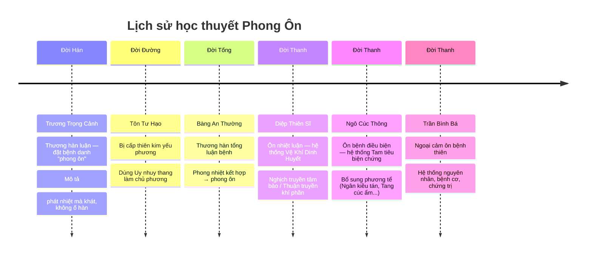
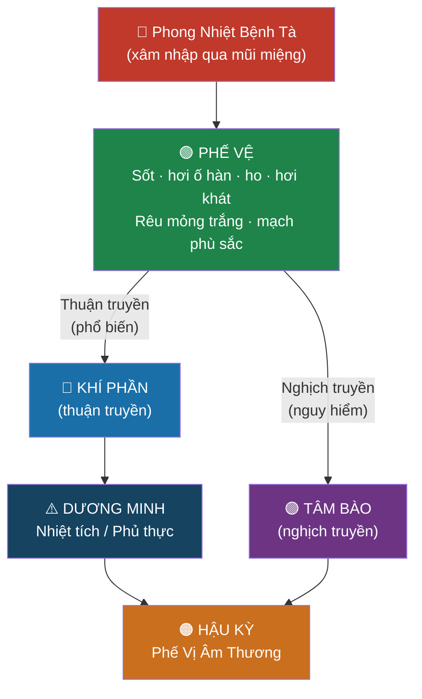
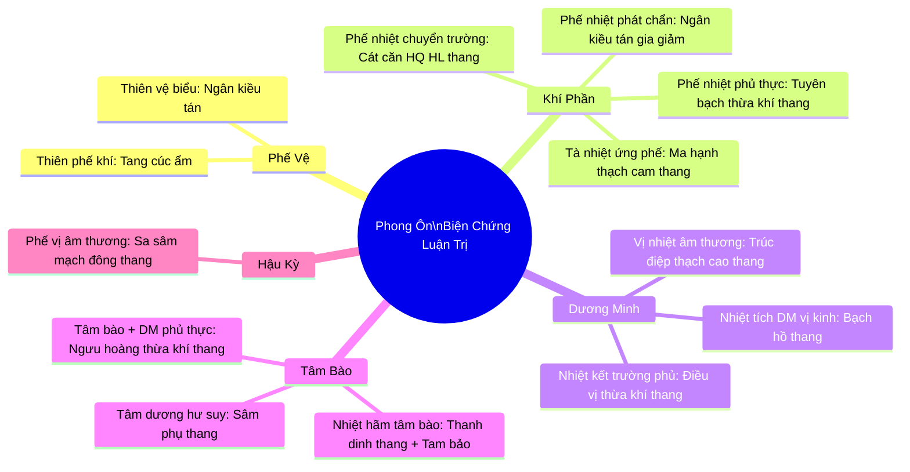

# PHONG ÔN — BÀI GIẢNG CHUYÊN SÂU

> [!abstract] Tóm lược nhanh
> **Phong Ôn** = ngoại cảm nhiệt bệnh cấp tính do **phong nhiệt bệnh tà**.
> Sơ khởi đặc trưng: **phế vệ biểu nhiệt chứng** (sốt + hơi ố phong + ho + miệng hơi khát + mạch phù sắc).
> Trung tâm bệnh biến: **tạng Phế**.
> Hậu kỳ: **phế vị âm thương**.
> Tây y: viêm phổi đại thùy, viêm phổi virus, cúm, viêm hô hấp trên.

---

## 1. KHÁI NIỆM

**Phong ôn** là bệnh ngoại cảm nhiệt bệnh cấp tính do cảm thụ **phong nhiệt bệnh tà** gây ra, với biểu hiện đặc trưng sơ khởi là **phế vệ biểu nhiệt chứng**.

- Phát sinh bốn mùa, nhiều nhất: **mùa xuân** và **mùa đông**
- Phát sinh vào mùa đông → gọi là **Đông ôn**
- Cảm tà → lập tức bệnh (tân cảm ôn bệnh, ≠ phục tà)

### Triệu chứng sơ khởi điển hình

| Triệu chứng | Ý nghĩa |
|---|---|
| Sốt | Vệ khí bị uất, chính tà cự đấu |
| Hơi ố phong hàn | Vệ khí uất không đóng mở được |
| Ho | Phế mất tuyên thông |
| Miệng **hơi** khát | Phong nhiệt thương tân nhẹ (sơ khởi) |
| Rêu mỏng trắng | Biểu nhiệt còn nông |
| Lưỡi đỏ hai rìa + chót | Phong nhiệt xâm biểu |
| Mạch phù sắc | Tà ở biểu, nhiệt tà |

---

## 2. LỊCH SỬ HÌNH THÀNH

> [!quote] Câu kinh điển — Diệp Thiên Sĩ
> *"Ôn tà thượng thụ, thủ tiên phạm phế, nghịch truyền tâm bào"*
> → Ôn tà xâm nhập từ trên xuống, Phế bị phạm trước, nghịch truyền thì vào Tâm bào.

---

## 3. NGUYÊN NHÂN & CƠ CHẾ SINH BỆNH

### 3.1 Nguyên nhân

**Phong nhiệt bệnh tà** — dương tà, tính thăng tán sơ tiết:
- Xâm nhập qua **đường mũi miệng**
- Điều kiện: cơ thể vệ ngoại bất cố, sinh hoạt nóng lạnh thất thường
- Mùa xuân: dương khí thăng phát, phong + ôn kết hợp
- Mùa đông phản thường (ấm): phong nhiệt tà hình thành

### 3.2 Cơ chế sinh bệnh — sơ đồ truyền biến

### 3.3 Giải thích cơ chế từng giai đoạn

| Giai đoạn | Cơ chế YHCT | Biểu hiện |
|---|---|---|
| **Phế Vệ** | Vệ khí bị uất → phế mất tuyên thông | Sốt + ố hàn + ho |
| **Khí Phần — Phế** | Tà nhiệt ứng phế, phế khí bất tuyên | Sốt cao + ho suyễn + đàm vàng |
| **Khí Phần — Dương Minh** | Lý nhiệt kháng thịnh | Tứ đại chứng |
| **Nghịch truyền — Tâm Bào** | Tà nhiệt bít tắc khiếu cơ | Thần hôn + hôn mê |
| **Hậu Kỳ** | Tà nhiệt thoái nhưng tân dịch chưa phục | Ho khan + miệng khô |

> [!important] Cơ chế nghịch truyền
> Diệp Thiên Sĩ: Phế Vệ không trị → hoặc trị nhầm → hoặc tâm khí vốn hư
> → tà nhiệt nội hãm → **nghịch truyền tâm bào** → thần chí dị thường bắt buộc xuất hiện

---

## 4. CHẨN ĐOÁN XÁC ĐỊNH

> [!tip] Ba tiêu chí chẩn đoán

**Tiêu chí 1 — Mùa:** Bệnh xảy ra mùa đông hoặc xuân → nghĩ đến phong ôn

**Tiêu chí 2 — Lâm sàng sơ khởi:**
- Sốt + ố phong + ho + miệng hơi khát
- Lưỡi đỏ đầu lưỡi và hai rìa
- Mạch phù sắc

**Tiêu chí 3 — Diễn tiến:**
- Từ phế vệ biểu nhiệt → tà nhiệt ứng phế (khí phần) → hậu kỳ phế vị âm thương
- Hoặc: nghịch truyền → sốt + thần chí dị thường

**Cận lâm sàng hỗ trợ:**

| Xét nghiệm | Kết quả | Ý nghĩa |
|---|---|---|
| Bạch cầu | Tăng cao + trung tính ↑ | Vi khuẩn |
| Bạch cầu | Bình thường / hơi thấp | Virus |
| X quang ngực | Bóng mờ thùy / đám mờ | Viêm phổi |

---

## 5. CHẨN ĐOÁN PHÂN BIỆT

### Bảng so sánh 5 bệnh

| Tiêu chí | **Phong Ôn ★** | Xuân Ôn | Cảm Mạo Phong Nhiệt | Ma Chẩn (Sởi) | Phế Ung |
|---|---|---|---|---|---|
| **Cơ chế** | Tân cảm phong nhiệt tà | Phục tà nội phát | Phong nhiệt nhẹ, nông | Virus sởi + phế vệ | Phong nhiệt → huyết nhiệt ứng tụ |
| **Mùa** | Xuân, đông | Mùa xuân | Bốn mùa | Đông xuân | Quanh năm |
| **Sơ khởi bệnh vị** | Phế vệ (biểu nhiệt) | Khí phần / dinh phần | Phế vệ (nhẹ hơn) | Phế vệ (có kèm mắt) | Phế vệ → nhanh vào phế |
| **Dấu đặc trưng** | Mạch phù sắc, lưỡi đỏ 2 rìa | Sốt cao ngay, phiền khát, có thể hôn mê | Nghẹt mũi, đau họng, nhẹ | **Mắt đỏ, sợ ánh sáng**, ban sau 2–3 ngày | **Hàn chiến, đàm mủ tanh hôi** |
| **Hậu kỳ** | Phế vị âm thương | Can thận âm thương | Tự khỏi vài ngày | Phục hồi hoàn toàn | Phế ung mạn tính |
| **Tây y** | Viêm phổi, cúm, URTI | Viêm não, viêm màng não | Cảm thông thường | Bệnh sởi | Áp xe phổi |

> [!warning] Phân biệt quan trọng: Phong ôn ≠ Xuân ôn
> - **Phong ôn**: tân cảm → sơ khởi **phế vệ** (sốt + ố phong + ho)
> - **Xuân ôn**: phục tà → sơ khởi **lý nhiệt** (sốt cao, phiền khát, có thể hôn mê ngay)
> - Hậu kỳ: phong ôn → phế vị âm; xuân ôn → **can thận âm** thương

> [!note] Phân biệt quan trọng: Phong ôn ≠ Phế ung
> Sau **1 tuần** sốt không lui hoặc lui rồi lại sốt cao → nghĩ đến Phế ung chuyển biến
> Phế ung đặc trưng: **tuần 2** khạc mủ máu đàm tanh hôi + X quang bóng mờ / có nước

---

## 6. BIỆN CHỨNG LUẬN TRỊ

### Tổng quan 5 giai đoạn + phương thuốc

---

### 6.1 Tà Tập Phế Vệ

> [!example] Chứng hầu — Phế Vệ
> Sốt · ố phong hàn · không mồ hôi · đau đầu · ho · miệng **hơi** khát
> Lưỡi đỏ hai rìa và chót · Mạch **phù sắc**

**Bệnh cơ:** Phong nhiệt phạm phế vệ → vệ khí uất → phế mất tuyên thông

**Trị pháp:** Tân lương giải biểu, tuyên phế tiết nhiệt

#### Ngân kiều tán *(thiên vệ biểu)*

| Vị thuốc | Vai trò |
|---|---|
| Kim ngân hoa + Liên kiều | Tân lương giải biểu chính |
| Kinh giới tuệ + Đạm đậu xỉ | Tân ôn tăng sức tán biểu |
| Ngưu bàng tử + Kiết cánh | Tuyên phế lợi hầu |
| Bạc hà | Sơ phong tán nhiệt |
| Trúc điệp + Lô căn | Thanh nhiệt sinh tân |
| Sinh cam thảo | Điều hòa |

> Ngô Cúc Thông: Tân lương bình tể — dùng khi sốt + ố hàn + không mồ hôi

**Gia giảm:**
- Ố hàn đã giải → bỏ Kinh giới, Đậu xỉ
- Miệng khát nhiều → gia Thiên hoa phấn, Thạch học
- Ho nhiều → gia Hạnh nhân, Xuyên bối, Qua lâu bì
- Sưng cổ đau họng → gia Mã bột, Huyền sâm
- Tỳ nục (chảy máu mũi) → bỏ Kinh giới; gia Bạch mao căn

#### Tang cúc ẩm *(thiên phế khí thất tuyên)*

| Vị thuốc | Vai trò |
|---|---|
| Hạnh nhân + Khổ kiết cánh | Tuyên giáng phế khí |
| Cúc hoa + Liên kiều + Bạc hà | Tân lương sơ phong |
| Lô căn + Trúc điệp | Thanh nhiệt sinh tân |
| Sinh cam thảo | Điều hòa |

> Dùng khi **chủ yếu ho**, triệu chứng biểu nhẹ hơn

> [!tip] So sánh Ngân kiều tán vs Tang cúc ẩm
> | | Ngân kiều tán | Tang cúc ẩm |
> |---|---|---|
> | Sức giải biểu | Mạnh (có Kinh giới, Đậu xỉ) | Yếu hơn |
> | Chỉ định chính | Sốt ố hàn không mồ hôi | **Ho là chính**, biểu nhẹ |
> | Liều lượng | Lớn hơn | Nhỏ, tân lương thuần |

---

### 6.2 Tà Nhập Khí Phần

#### 6.2.1 Tà Nhiệt Ứng Phế

> [!example] Chứng hầu
> Sốt · ra mồ hôi · phiền khát · **ho suyễn** · đàm vàng đặc / có máu / màu rỉ sắt
> Ngực đau tức · Lưỡi đỏ rêu vàng · Mạch **hoạt sắc**

**Trị pháp:** Thanh nhiệt tuyên phế bình suyễn

**Phương: Ma hạnh thạch cam thang**

| Vị thuốc | Tính vị | Vai trò |
|---|---|---|
| Ma hoàng | Tân ôn | Tuyên phế bình suyễn |
| Thạch cao | Tân hàn | Thanh tả phế nhiệt |
| Hạnh nhân | Khổ ôn | Giáng phế khí, bình suyễn |
| Cam thảo chích | Cam bình | Sinh tân + điều hòa |

> [!important] Tỷ lệ then chốt
> **Thạch cao : Ma hoàng = 5–10 : 1**
> Thạch cao nhiều → chế Ma hoàng không phát hãn; Ma hoàng chuyển hướng tuyên phế bình suyễn
> Điều chỉnh tỷ lệ theo mức độ phế khí uất / tà nhiệt nặng nhẹ

---

#### 6.2.2 Phế Nhiệt Phủ Thực *(Phế–Trường đồng bệnh)*

> [!example] Chứng hầu
> Triều nhiệt · táo bón · đàm dãi ứng thịnh · **suyễn thúc**
> Rêu vàng nề / vàng hoạt · Mạch bộ thốn tay phải **thực đại**

**Bệnh cơ:** Đàm nhiệt trở phế + đại trường nhiệt kết → phế trường hỗ kết
**Trị pháp:** Tuyên phế hóa đàm, tiết nhiệt công hạ

**Phương: Tuyên bạch thừa khí thang**

| Vị thuốc | Vai trò |
|---|---|
| Sinh thạch cao | Thanh phế vị nhiệt |
| Hạnh nhân + Qua lâu bì | Tuyên giáng phế khí, hóa đàm |
| Sinh đại hoàng | Công hạ phủ thực (thông trường) |

> [!quote] Ngô Cúc Thông
> *"Dĩ Hạnh nhân, Thạch cao tuyên phế khí chi lý; dĩ Đại hoàng trực trường vị chi kết — thử tạng phủ hợp trị dã"*
> → Tuyên phế + thông phủ = **tạng phủ hợp trị pháp**

---

#### 6.2.3 Phế Nhiệt Chuyển Trường

> [!example] Chứng hầu
> Sốt · ho · miệng khát · **tiêu phân lỏng vàng nóng hôi** · hậu môn nóng rát · bụng đau
> Rêu vàng · mạch sắc

**Bệnh cơ:** Tà nhiệt tại phế vị hạ dịch đại trường → bức tân dịch → tiêu lỏng (≠ phủ thực)

> [!note] Phân biệt: Phế nhiệt chuyển trường ≠ Nhiệt kết bàng lưu
> | | Phế nhiệt chuyển trường | Nhiệt kết bàng lưu |
> |---|---|---|
> | Tiêu | Phân **lỏng vàng** nóng hôi | **Nước loãng** rất hôi (quanh phân khô) |
> | Bụng ấn | Không cứng đau | **Ấn đau cứng** (phân khô kết) |
> | Cơ chế | Nhiệt di đại trường, chưa nội kết | Phân khô nội kết, nước chảy bên cạnh |

**Trị pháp:** Khổ hàn thanh nhiệt chỉ lợi
**Phương: Cát căn hoàng cầm hoàng liên thang** (Cát căn + Hoàng cầm + Hoàng liên + Cam thảo chích)

---

#### 6.2.4 Phế Nhiệt Phát Chẩn

> [!example] Chứng hầu
> Sốt · ho · tức ngực · **da nổi ban chẩn đỏ nhuận** (nốt nhỏ thưa, ấn lặn tạm thời)
> Rêu mỏng trắng · Chất lưỡi đỏ · Mạch sắc

**Bệnh cơ:** Tà nhiệt từ phế khí phân lan đến dinh lạc → xuyên nhập huyết lạc → phát chẩn bên ngoài
**Trị pháp:** Tuyên phế tiết nhiệt, lương dinh thấu chẩn

**Phương: Ngân kiều tán gia giảm**
*(Bỏ Đậu xỉ + thêm Sinh địa, Đơn bì, Đại thanh diệp, Huyền sâm)*

| Thêm/bỏ | Lý do |
|---|---|
| Bỏ Đậu xỉ | Tà không tại biểu → không cần giải biểu |
| Gia Sinh địa + Đơn bì | Lương dinh huyết |
| Gia Đại thanh diệp + Huyền sâm | Giải nhiệt độc |

---

### 6.3 Tà Nhập Dương Minh

#### 6.3.1 Nhiệt Tích Dương Minh Vị Kinh

> [!example] **Tứ Đại Chứng** — Dương Minh
> **Tráng nhiệt · Ố nhiệt · Ra mồ hôi nhiều · Khát thích uống nước lạnh**
> Rêu vàng khô · Mạch phù hồng / hoạt sắc

**Bệnh cơ:** Vô hình nhiệt tà bao phủ dày đặc tại vị kinh → lý nhiệt kháng thịnh
**Trị pháp:** Thanh nhiệt bảo tân

**Phương: Bạch hồ thang**

| Vị thuốc | Vai trò |
|---|---|
| Sinh thạch cao | Tân hàn, thanh tả vị nhiệt (quân) |
| Tri mẫu | Khổ hàn, thanh nhiệt tư âm (thần) |
| Sinh cam thảo + Bạch cánh mễ | Bảo hộ vị khí, sinh tân |

> [!warning] **Tứ Cấm** Bạch hồ thang — Ngô Cúc Thông
> 1. Mạch phù huyền mà **tế** → cấm dùng
> 2. Mạch **trầm** → cấm dùng
> 3. **Không khát** → cấm dùng
> 4. **Không ra mồ hôi** → cấm dùng
>
> Nguyên tắc: biểu chứng chưa giải → thận trọng; lý nhiệt chưa thịnh → cấm

---

#### 6.3.2 Nhiệt Kết Trường Phủ

> [!example] Chứng hầu
> Nhật bộ **triều nhiệt** · chiêm ngữ · đại tiện bí kết / nhiệt kết bàng lưu
> Bụng trướng cứng đau · Rêu vàng khô → xám đen nứt · Mạch trầm hữu lực

**Trị pháp:** Nhuận kiên công hạ tiết nhiệt
**Phương: Điều vị thừa khí thang**

| Vị thuốc | Vai trò |
|---|---|
| Đại hoàng (rửa rượu) | Khổ hàn công hạ tiết nhiệt |
| Mang tiêu (sắc sau) | Hàm hàn nhuận kiên nhuận táo |
| Cam thảo chích | Hoãn giải sức công phá → thuốc lưu lại chậm |

> Trong tam thừa khí thang → **công hạ chậm nhất** = hoãn hạ nhiệt kết pháp

---

#### 6.3.3 Vị Nhiệt Âm Thương

> [!example] Chứng hầu
> Sốt cao · tự hạn · **mặt đỏ ngáy to** · hôn mê · thân nặng khó xoay
> Rêu vàng táo · Mạch sắc

**Trị pháp:** Tiết nhiệt cứu tân
**Phương: Trúc điệp thạch cao thang** (Thạch cao + Trúc điệp + Mạch đông + Bán hạ + Nhân sâm + Cam thảo + Cánh mễ)

---

### 6.4 Nhiệt Nhập Tâm Bào

#### 6.4.1 Nhiệt Hãm Tâm Bào

> [!example] Chứng hầu
> **Thần hôn · chiêm ngữ · hôn mê bất ngữ** · sốt cao
> Tứ chi quyết lãnh · lưỡi run · màu lưỡi **tươi bóng** · mạch tế sắc

**Bệnh cơ:** Tà nhiệt bít tắc khiếu cơ → nhiễu loạn thần minh

> [!important] Quy tắc: Nhiệt thâm quyết diệp thâm
> *"Nhiệt thâm quyết diệp thâm, nhiệt vi quyết diệp vi"*
> Nhiệt bế càng nặng → tứ chi lạnh càng nhiều (≠ dương hư quyết)

**Trị pháp:** Thanh tâm lương dinh, tiết nhiệt khai khiếu

**Phương: Thanh dinh thang + Tam bảo**

**Thanh dinh thang:** Sừng trâu · Huyền sâm tâm · Liên tử tâm · Trúc điệp quyền tâm · Liên kiều tâm · Mạch đông

**"Tam Bảo" — So sánh 3 viên:**

| Viên | Sở trường | Dùng khi |
|---|---|---|
| **An cung ngưu hoàng hoàn** | **Thanh nhiệt + giải độc** mạnh nhất | Nhiệt độc tích thịnh, sốt cao hôn mê |
| **Tử tuyết đơn** | **Chỉ kinh tức phong** + thông tiện | Có co giật, táo bón kèm theo |
| **Chí bảo đơn** | **Phương hương tịch uế** mạnh nhất | Đàm trọc bế tắc khiếu |

---

#### 6.4.2 Nhiệt Nhập Tâm Bào Kiêm Dương Minh Phủ Thực

> [!example] Chứng hầu
> Sốt · thần hôn · lưỡi run nói lắp · chi lạnh · **ấn đau cứng vùng bụng**
> Lưỡi đỏ thâm · rêu vàng khô · mạch sắc trầm thực

**Trị pháp:** Thanh tâm khai khiếu + công hạ phủ thực
**Phương: Ngưu hoàng thừa khí thang**
*(An cung ngưu hoàng 2 hoàn pha nước + bột Đại hoàng 9g)*

---

#### 6.4.3 Tâm Dương Hư Suy *(Chính hư tà thực — nguy kịch)*

> [!example] Chứng hầu — dấu hiệu nguy kịch
> **Sốt hạ rất nhanh** (đột ngột) · mồ hôi ra liên tục đầm dề
> Hư phiền thao nhiễu · thở ngắn gấp
> Sắc mặt nhợt nhạt · **tứ chi quyết lạnh** · mạch vi tế muốn tuyệt

**Bệnh cơ:** Chính khí hư thoát → khí thoát dương vong
**Trị pháp:** Ích khí hồi dương, liễm âm cố thoát

**Phương: Sâm phụ thang + thuốc tiêm Sinh mạch**

| Vị thuốc | Vai trò |
|---|---|
| Nhân sâm (sắc riêng) | Đại bổ nguyên khí |
| Phụ tử | Ôn tráng chân dương |

> Mồ hôi đầm dề → gia Mẫu lệ + Long cốt (chỉ hạn cố thoát)

---

### 6.5 Hậu Kỳ — Phế Vị Âm Thương

> [!example] Chứng hầu
> Sốt thấp / không sốt · **ho khan** / đàm ít dính · miệng lưỡi khô táo khát
> Lưỡi khô đỏ ít rêu · mạch tế

**Trị pháp:** Tư dưỡng phế vị âm tân, thanh dịch dư tà
**Phương: Sa sâm mạch đông thang**

| Vị thuốc | Vai trò |
|---|---|
| Sa sâm + Mạch đông | Dưỡng phế vị âm |
| Ngọc trúc + Thiên hoa phấn | Sinh tân dưỡng dịch |
| Đông tang diệp | Thanh dư nhiệt phế kinh |
| Sinh biển đậu + Sinh cam thảo | Kiện tỳ hòa vị |

**Gia giảm:**
- Phế nhiệt vẫn thịnh → gia Tri mẫu, Địa cốt bì
- Vị âm tổn thương rõ → gia Thạch học, Lô căn
- Ho nhiều → gia Hạnh nhân, Bối mẫu
- Ăn kém → gia Cốc mạch nha, Thần khúc

---

## 7. BẢNG TỔNG HỢP PHƯƠNG THUỐC

| Giai đoạn | Thể bệnh | Phương thuốc | Trị pháp |
|---|---|---|---|
| **Phế Vệ** | Thiên vệ biểu | Ngân kiều tán | Tân lương giải biểu |
| **Phế Vệ** | Thiên phế khí | Tang cúc ẩm | Tân lương tuyên phế |
| **Khí — Phế** | Tà nhiệt ứng phế | Ma hạnh thạch cam thang | Thanh nhiệt tuyên phế bình suyễn |
| **Khí — Phế+Trường** | Phế nhiệt phủ thực | Tuyên bạch thừa khí thang | Tuyên phế hóa đàm + tiết nhiệt công hạ |
| **Khí — Phế→Trường** | Phế nhiệt chuyển trường | Cát căn HQ HL thang | Khổ hàn thanh nhiệt chỉ lợi |
| **Khí — Phế** | Phế nhiệt phát chẩn | Ngân kiều tán gia giảm | Lương dinh thấu chẩn |
| **Dương Minh** | Nhiệt tích vị kinh | Bạch hồ thang | Thanh nhiệt bảo tân |
| **Dương Minh** | Nhiệt kết trường phủ | Điều vị thừa khí thang | Nhuận kiên công hạ tiết nhiệt |
| **Dương Minh** | Vị nhiệt âm thương | Trúc điệp thạch cao thang | Tiết nhiệt cứu tân |
| **Tâm Bào** | Nhiệt hãm tâm bào | Thanh dinh thang + Tam Bảo | Thanh tâm lương dinh, khai khiếu |
| **Tâm Bào+DM** | Tâm bào + phủ thực | Ngưu hoàng thừa khí thang | Khai khiếu + công hạ |
| **Tâm Bào** | Tâm dương hư suy | Sâm phụ thang + Sinh mạch | Hồi dương ích khí cố thoát |
| **Hậu Kỳ** | Phế vị âm thương | Sa sâm mạch đông thang | Tư dưỡng phế vị âm tân |

---

## 8. DỰ PHÒNG & ĐIỀU HỘ

### 8.1 Tăng cường chính khí
- Giữ ấm, phòng nhiễm ngoại tà
- Duy trì không khí thông sạch
- Không quá độ lao lực

### 8.2 Thuốc dự phòng
- Hun giấm ăn trong phòng (hoặc Thương truyệt, Ngải diệp, Hùng hoàng)
- Mùa dịch: **Bản lam căn**, **Kim ngân hoa** sắc uống phòng bệnh

### 8.3 Hộ lý
- Nghỉ ngơi, không nằm nơi gió lùa
- Uống nhiều nước sôi; sốt cao → thức ăn lỏng
- Hồi phục: hạn chế thức ăn dầu mỡ
- Hôn mê: giữ sạch đường thở; theo dõi dấu hiệu sinh tồn

---

## 9. TÂY Y TƯƠNG ĐỐI CHIẾU

| YHCT | Tây y tương đương | Tiêu chuẩn |
|---|---|---|
| Phong Ôn toàn bộ | Viêm phổi cộng đồng (CAP) | IDSA/ATS 2019 |
| Phế Vệ giai đoạn | URTI / Cúm giai đoạn đầu | ICD-10: J06, J10–J11 |
| Tà nhiệt ứng phế | Viêm phổi thùy / Phế quản phế viêm | ICD-10: J18 |
| Phế nhiệt phủ thực | Viêm phổi + tắc ruột phối hợp | Lâm sàng |
| Nhiệt hãm tâm bào | Viêm phổi biến chứng → sepsis / viêm não | ICD-10: A41, G04 |
| Tâm dương hư suy | Sốc nhiễm trùng | ICD-10: R57.2 |
| Hậu kỳ phế vị âm thương | Hội chứng hậu nhiễm (post-infectious) | Lâm sàng |

---

## 10. ĐIỂM THEN CHỐT CẦN NHỚ

> [!summary] Key Learning Points
> 1. **Sơ khởi đặc trưng**: Phế Vệ (sốt + hơi ố phong + ho + miệng **hơi** khát + mạch phù sắc + lưỡi đỏ 2 rìa)
> 2. **Thuận truyền**: Phế Vệ → Khí Phần → Dương Minh (phổ biến, bệnh tiến triển bình thường)
> 3. **Nghịch truyền**: Phế Vệ → Tâm Bào (nguy hiểm, bắt buộc có thần chí dị thường)
> 4. **Nhiệt thâm quyết diệp thâm**: Tâm bào nhiệt bế càng nặng → tứ chi càng lạnh (≠ dương hư)
> 5. **Tam Bảo**: An cung (thanh nhiệt) | Tử tuyết (chỉ kinh) | Chí bảo (tịch uế)
> 6. **Thạch cao : Ma hoàng = 5–10 : 1** trong Ma hạnh thạch cam thang
> 7. **Hậu kỳ**: phế vị âm thương → Sa sâm mạch đông thang (≠ xuân ôn: can thận âm)
> 8. **Tứ cấm Bạch hồ thang**: không khát / không mồ hôi / mạch trầm / mạch tế → cấm dùng

---

## Liên kết

- [[Xuân Ôn]]
- [[Vệ Khí Dinh Huyết Biện Chứng]]
- [[Ngân Kiều Tán]]
- [[Bạch Hồ Thang]]
- [[Ôn Bệnh Đại Cương]]
- [[Viêm Phổi Cộng Đồng — Tây Y]]

---

*Nguồn: Giáo trình Ôn Bệnh — TS.BS. Lê Minh Hoàng; BS. CKII. Lê Thị Ngoan | KB chunk: phong-on-001, phong-on-002*
