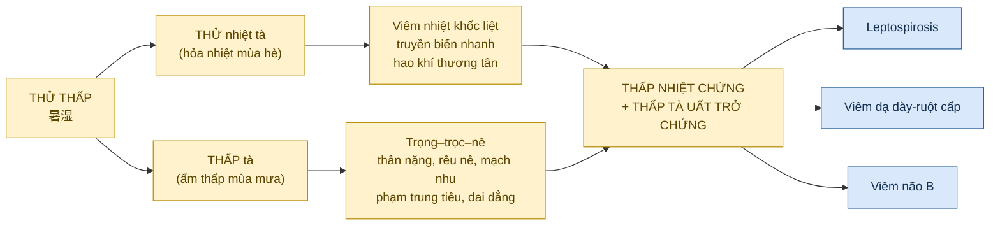
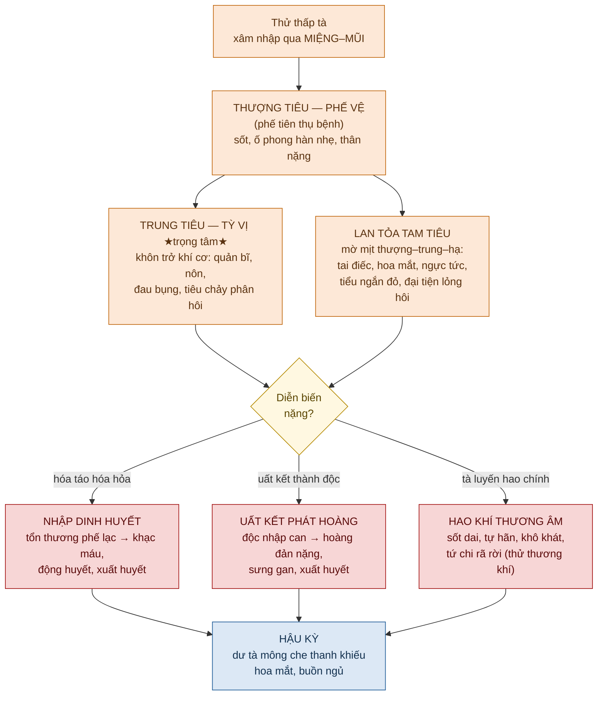
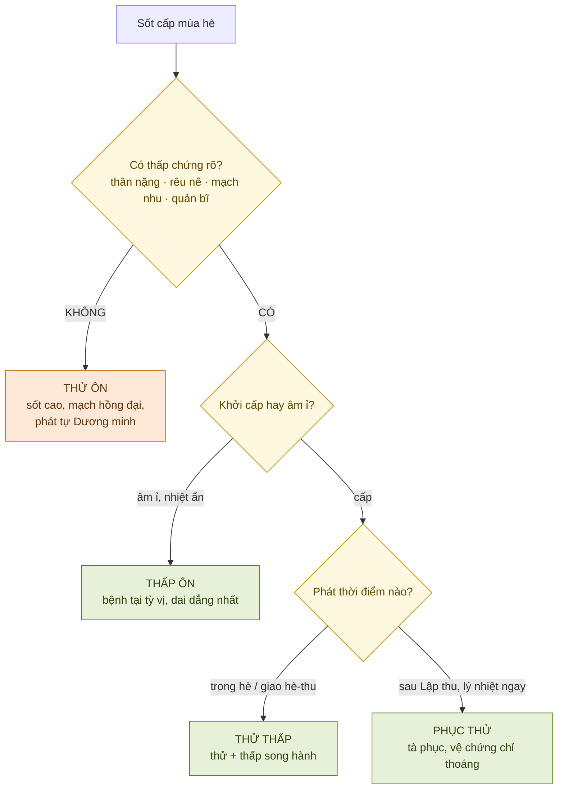
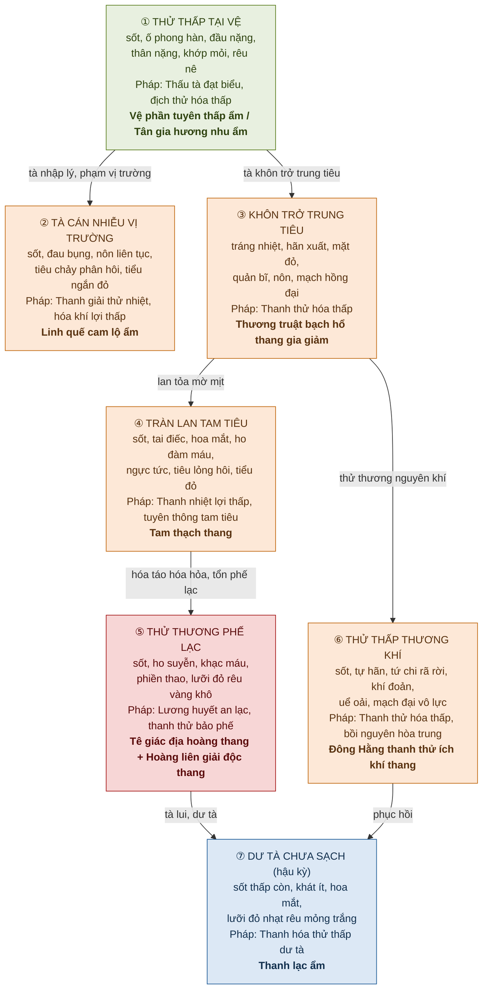

# THỬ THẤP (暑湿) — Bài Giảng Chuyên Sâu

> [!info] Định vị nguồn
> KB `on_benh_dai_cuong` có **chương biện chứng lâm sàng ĐẦY ĐỦ cho Thử Thấp** (Bài 6 — file `thu-thap_001.md`): khái niệm, lịch sử học thuật, nguyên nhân cơ chế, chẩn đoán, chẩn đoán phân biệt và **7 thể biện chứng luận trị** kèm cổ phương. Đây là một trong số ít bệnh ôn được KB chép nguyên vẹn phần biện chứng.
> → Các đoạn ngoài KB (đối chiếu Tây y chi tiết, châm cứu, bằng chứng hiện đại) được đánh dấu 🔸 **[Kiến thức nền — ngoài KB]**.

---

## ⚡ TL;DR — Nắm trong 60 giây

- **Thử thấp = ngoại cảm nhiệt bệnh cấp tính mùa hè do _thử thấp bệnh tà_** (thử nhiệt **KÈM** thấp tà). Biểu hiện = **thấp nhiệt chứng + thấp tà uất trở chứng**.
- **Dấu ấn kép:** vừa mang tính **thử** (viêm nhiệt khốc liệt, truyền biến nhanh, hao khí thương tân) vừa mang tính **thấp** (trọng – trọc – nê: thân nặng, rêu nê, mạch nhu, dễ phạm trung tiêu, dai dẳng khó khỏi).
- **Phân biệt cốt lõi:** Thử ôn = thử nhiệt **thuần**; Thử thấp = thử nhiệt **+ thấp**; Thấp ôn = thấp nhiệt khởi từ từ; Phục thử = thử thấp **phục tàng**, sau Lập thu mới phát.
- **Pháp trị xương sống:** **THANH THỬ TIẾT NHIỆT** (vị trí đầu tiên) **+ TUYÊN HÓA THẤP TÀ** — không được trị thử mà bỏ thấp (Dụ Gia Ngôn: *"trị trúng thử mà không kiêng trị thấp là quá dở"*).
- **Tây y tương ứng:** viêm hô hấp trên mùa hè, viêm dạ dày-ruột cấp, **bệnh xoắn khuẩn (Leptospirosis)**, viêm não Nhật Bản B.
- **7 thể KB:** ① Tại vệ ② Tà cán nhiễu vị trường ③ Khôn trở trung tiêu ④ Tràn lan tam tiêu ⑤ Thương phế lạc ⑥ Thương khí ⑦ Dư tà chưa sạch.

---

## BƯỚC 1 — Định nghĩa & Phạm vi

### 1.1. Định nghĩa YHCT

> **Theo KB (Bài 6 — Khái niệm):**
> *"Thử thấp là do cảm thụ thử thấp bệnh tà gây ra một dạng ngoại cảm nhiệt bệnh cấp tính với biểu hiện rõ nhất là **thấp nhiệt chứng kèm thêm thấp tà uất trở chứng**. Trên lâm sàng ngoài những biểu hiện thấp nhiệt ra còn có hung bĩ, thân thể nặng nề, rêu lưỡi nê, mạch nhu... Thử thấp đa số phát trong mùa hè hoặc giao thời hè thu."*

**Diễn giải:** Thử thấp (暑湿) là **ngoại cảm nhiệt bệnh cấp tính** phát mùa hè/giao hè-thu, do mùa hè khí hậu **viêm nhiệt + mưa nhiều ẩm thấp** khiến thấp khí và thử nhiệt kết hợp thành **thử thấp bệnh tà**. Bệnh mang đồng thời hai bản chất:
- **Tính thử (hỏa nhiệt):** viêm nhiệt khốc liệt, truyền biến nhanh, hao khí thương tân.
- **Tính thấp (trọng – trọc):** nặng nề, nhớp dơ, dễ phạm trung tiêu, lan tỏa tam tiêu, bệnh trình dai dẳng.

### 1.2. Mạch nguồn học thuật (theo KB)

KB chép lại tiến trình nhận thức về thử thấp qua các đời — nắm để hiểu vì sao "trị thử phải kiêm trị thấp":

| Y gia / Tác phẩm | Đóng góp về thử thấp |
|---|---|
| **Trần Vô Trạch** — *Tam nhân phương* | Lần đầu nêu thử **kết hợp phong thấp** thành bệnh "thử thấp phong ôn"; chủ trương **Phục linh bạch truật thang** |
| **Trương Nguyên Tố** — *Y học khải nguyên* | Hè-thu thuộc **thái âm thấp thổ** → phát thử đa số kèm thấp → trị bằng **thẩm tiết, Ngũ linh tán** |
| **Lý Đông Hằng** — *Tỳ vị luận* | Mô tả chi tiết thử hợp thấp gây bệnh; trị thanh táo bằng **Thanh thử ích khí thang** |
| **Vương Luân** — *Minh y tạp trước* | Trị thử tốt nhất = **thanh tâm, lợi tiểu tiện** |
| **Lý Đình** — *Y học nhập môn* | Mùa hè ăn lạnh nhiều → trị nên **lợi thấp + tiêu đạo** (Hương nhu tán, Hoàng liên giải độc thang...) |
| **Dụ Gia Ngôn** — *Y môn pháp luật* | 4 quy luật chữa thử; nhấn: ***"trị trúng thử mà không kiêng trị thấp là quá dở"*** |
| **Diệp Thiên Sĩ** | *"Thử tất kiêm thấp"*; *"Thử thấp thương khí, phế tiên thụ bệnh"* |
| **Tào Bình Chương** — *Thử bệnh chứng trị yếu lược* | Chia thử thấp **13 chứng**, hệ thống hóa nhân–chứng–mạch–trị |

### 1.3. Định nghĩa Tây y (đối chiếu)

> **Theo KB:** *"Căn cứ vào mùa phát bệnh thử thấp và biểu hiện lâm sàng thì tương đương một số bệnh tây y: viêm hô hấp trên (mùa hè), viêm tiêu hóa cấp, bệnh xoắn khuẩn móc câu (Leptospirosis), viêm não B."*

| Bệnh cảnh thử thấp | Tương ứng Tây y | ICD-10 (tham khảo 🔸) |
|---|---|---|
| Sốt + thân nặng + tiêu hóa rối loạn nhẹ mùa hè | **Viêm hô hấp trên mùa hè / nhiễm virus mùa hè** | J06.x |
| Sốt + đau bụng + nôn + tiêu chảy phân hôi | **Viêm dạ dày-ruột cấp** (acute gastroenteritis) | A09 |
| Sốt + đau cơ bắp chân + mắt đỏ + vàng da + xuất huyết | **Bệnh xoắn khuẩn (Leptospirosis)** ⭐ điển hình | A27.x |
| Cao nhiệt + hôn mê + co giật mùa hè | **Viêm não Nhật Bản B** | A83.0 |

> [!tip] Vì sao Leptospirosis là "khuôn mặt Tây y" rõ nhất của thử thấp?
> KB mô tả "tam chứng" bệnh xoắn khuẩn trùng khít bệnh cảnh thử thấp nặng: **hàn nhiệt + đau mỏi toàn thân + mệt mỏi uể oải**, kèm **mắt đỏ, đau chân, ấn đau cơ bắp chân, sưng hạch lâm ba**, và xét nghiệm **bạch cầu ↑, trung tính ↑, máu lắng ↑, protein/hồng cầu niệu, urê máu ↑, men gan bất thường**. Đây là bộ ba kinh điển *fever – myalgia (calf) – conjunctival suffusion* của Leptospirosis. Dịch tễ "heo và chuột đồng mang mầm, ô nhiễm nguồn nước" (mục 7 KB) cũng đúng y bệnh học xoắn khuẩn.

### 1.4. Bản đồ định nghĩa

---

## BƯỚC 2 — Cơ chế Sinh lý / Bệnh lý

### 2.1. YHCT — Hình thành & đặc tính gây bệnh

> **Theo KB (mục 2):** *"Mùa hè khí hậu viêm nhiệt mà mưa nhiều ẩm thấp, thấp khí và thử nhiệt kết hợp hình thành thử thấp bệnh tà... thử tà viêm nhiệt khốc liệt, truyền biến nhanh; thấp tà trọng (nặng), trọc (dơ) dễ phạm trung tiêu, lan tỏa tam tiêu, thể bệnh dai dẳng."*

**Ngoại nhân (tà khí):**
- **Thử nhiệt** = hỏa nhiệt chi tà → bốc lên, thiêu đốt, hao khí thương tân.
- **Thấp** = âm ngưng trọng trọc chi tà → dính trệ, hướng xuống, cản khí cơ.
- Hai tà tương kết → bệnh biến **dai dẳng khó khỏi**, lại **dễ hóa nhiệt hóa táo, thương lạc, uất kết phát hoàng**.

**Nội nhân (chính khí):**
> **Theo KB:** *"Chính khí suy nhược, đặc biệt tỳ vị hư nhược, nguyên khí bất túc là nguyên nhân nội tại."*

Mùa hè thử thấp thịnh → tỳ vị vận hóa chậm trễ + ăn uống không điều độ → **tỳ vị càng hư** → dễ cảm thử thấp. Trích Tào Bình Chương: *"nguyên khí mạnh, tam tiêu tinh khí xung túc thì kháng được tà; nguyên khí hư thì tà không chạy thoát đi đâu"*.

**Yếu tố thúc đẩy thử thấp kiêm hàn:** mùa hè nóng → tìm chỗ mát, uống lạnh quá nhiều, gặp mưa gió → hàn tà xâm phạm → sơ khởi có **thử thấp kiêm hàn chứng**.

### 2.2. Vị trí khởi bệnh & đường truyền biến

> **Theo KB (trích Diệp Thiên Sĩ):** *"Thử thấp thương khí, phế tiên thụ bệnh, chư khí giai tỳ"* — thử thấp xâm nhập **qua miệng mũi → phạm phế đầu tiên** (thượng tiêu), rồi *"hoặc úng trệ phế lạc, hoặc lan tỏa tam tiêu, hoặc tà xâm phạm vị trường — đặc biệt đa số khôn trở trung tiêu"*.

Đặc điểm truyền biến **khác hẳn ôn bệnh tuần tự Vệ→Khí→Dinh→Huyết**: thử thấp lan tỏa **mờ mịt tam tiêu**, trọng tâm ở **trung tiêu (tỳ vị)**, và có thể:
- **Hóa táo hóa hỏa** → nhập dinh huyết phần → **nội hãm huyết phần tổn thương phế lạc → khạc máu**.
- **Uất kết phát hoàng** (thử thấp → can kinh → hoàng đản).
- **Hao khí thương âm** kéo dài → sốt không lui, tự hãn, miệng khô khát, lưỡi đỏ.
- **Hồi phục:** dư tà mông che thanh khiếu → hoa mắt, buồn ngủ, khó chịu.

### 2.3. Tây y — Sinh lý bệnh đối chiếu

🔸 **[Kiến thức nền — ngoài KB]**

| YHCT | Diễn giải sinh lý bệnh Tây y |
|---|---|
| Thử nhiệt viêm nhiệt | Phản ứng sốt + viêm hệ thống do nhiễm trùng/nhiễm độc |
| Thấp khôn trở trung tiêu | Rối loạn tiêu hóa: viêm dạ dày-ruột, buồn nôn, tiêu chảy, chướng bụng |
| Hao khí thương tân (nôn, tả, hãn) | Mất nước – mất điện giải, giảm thể tích tuần hoàn |
| Uất kết phát hoàng | Tổn thương gan-mật (Lepto: vàng da do tổn thương tế bào gan + tan máu) |
| Tổn thương phế lạc → khạc máu | Xuất huyết phổi (Lepto thể nặng — Weil), viêm phổi xuất huyết |
| Thử thấp mông che thanh khiếu | Bệnh não do nhiễm độc / viêm màng não-não, rối loạn ý thức nhẹ |

---

## BƯỚC 3 — Biểu hiện Lâm sàng

### 3.1. Tứ chẩn đặc trưng

| Chẩn | Biểu hiện thử thấp điển hình |
|---|---|
| **Vọng** | Mặt/mắt đỏ; **lưỡi đỏ – rêu trắng nê hoặc vàng nê** (dấu ấn thấp); nặng → lưỡi đỏ thẫm. Da: có thể vàng (hoàng đản), ban xuất huyết |
| **Văn** | Hơi thở thô gấp; nôn ói; (nặng) chiêm ngữ |
| **Vấn** | **Hàn nhiệt, đau mình** (sơ khởi) → sốt cao, tâm phiền, **miệng khát nhưng không nhiều** (đặc thù thấp), thân nặng, ngực bụng bĩ muộn, tiểu ngắn đỏ, đại tiện lỏng hôi. Hỏi **mùa + tiếp xúc nước/bùn/chuột** |
| **Thiết** | **Mạch nhu** (mềm — dấu ấn thấp) / nhu sác / hoạt sác; **thân thể nặng nề**, các khớp đau mỏi, ấn đau cơ bắp chân |

> [!note] Hai dấu ấn THẤP để không nhầm với thử ôn thuần
> ① **Miệng khát mà không muốn uống nhiều** (thấp ngăn tân không thiếu thực sự).
> ② **Mạch nhu + rêu nê + thân nặng**. Thử ôn thuần thì khát dữ, mạch hồng đại, rêu vàng khô.

### 3.2. Triệu chứng cơ năng vs thực thể

**Cơ năng (chủ quan):** thân nặng mỏi, đau mình đau khớp, ngực bụng đầy tức, buồn nôn, tâm phiền, khát ít, hoa mắt chóng mặt.

**Thực thể (khách quan):** sốt, đổ mồ hôi không thông sướng, nôn, tiêu chảy phân hôi, vàng da (nếu hoàng đản), xuất huyết (máu cam, khạc máu, tiểu máu), ấn đau cơ bắp chân, sưng hạch, gan to.

---

## BƯỚC 4 — Chẩn đoán

### 4.1. Chẩn đoán xác định (theo KB)

1. **Phát vào mùa hè** thử thấp thịnh.
2. Bệnh nhân **có/không sẵn hư nhược tỳ vị**; tiền sử **lao quyện quá độ, dầm mưa gió, thích ăn uống lạnh** hỗ trợ chẩn đoán.
3. **Khởi bệnh cấp** — sơ khởi **hàn nhiệt, đau mình** là chủ yếu; nhập khí phần → **sốt, tâm phiền, tiểu đỏ** (thử nhiệt nội thịnh).
4. Trong quá trình bệnh đa số có **hoàng đản, xuất huyết**, kèm đầy cứng bụng, rêu lưỡi nê.
5. **Bệnh xoắn khuẩn:** tam chứng **hàn nhiệt – đau mỏi toàn thân – mệt mỏi uể oải** + mắt đỏ, đau chân, ấn đau bắp chân, sưng hạch; **XN:** BC↑, trung tính↑, máu lắng↑, protein/HC niệu, urê↑, men gan bất thường.

### 4.2. Biện chứng (Bát cương + Vệ-Khí-Dinh-Huyết)

- **Bát cương:** Biểu→Lý; **Nhiệt** (kèm Thấp); Thực (giai đoạn đầu) → có thể chuyển Hư (thương khí tân).
- **VKDH/Tam tiêu:** khởi tại **vệ** (thoáng) → trọng tâm **khí phần trung tiêu/tam tiêu** → có thể nghịch truyền **dinh-huyết** khi hóa táo hóa hỏa.

### 4.3. Chẩn đoán phân biệt — 4 ôn bệnh mùa hè

> **Theo KB (mục 4):** nguyên văn so sánh thử thấp ↔ thử ôn ↔ thấp ôn ↔ phục thử.

| Tiêu chí | **Thử thấp** ⭐ | **Thử ôn** | **Thấp ôn** | **Phục thử** |
|---|---|---|---|---|
| Tà khí | **Thử + thấp** (cảm tức phát) | Thử nhiệt **thuần** | Thấp nhiệt | Thử thấp **phục tàng** |
| Mùa | Hè / giao hè-thu | Hè (cảm tức phát) | Trường hạ (cuối hè-thu) | **Sau Lập thu** mới phát |
| Khởi bệnh | **Cấp** | **Cấp, bùng nổ** | **Từ từ, âm ỉ** | Phát là **lý nhiệt ngay** |
| Nhiệt | Thử nhiệt + thân nặng | **Sốt cao nổi bật**, phiền khát, mạch hồng đại | Nhiệt **ẩn trong thấp**, lúc đầu không rõ | Cao nhiệt, tâm phiền, lưỡi đỏ |
| Thấp chứng | **Rõ:** thân nặng, rêu nê, mạch nhu, quản bĩ | **Không / không rõ** | **Rất rõ**, bệnh tại tỳ vị | Có thấp uất kèm |
| Vệ biểu | Có hàn nhiệt đau mình | Thoáng qua | Vệ chứng kéo dài hơn | Vệ chứng **chỉ thoáng** |
| Bệnh trình | **Dai dẳng** | Cấp, ngắn nhưng nặng | **Dài, dai dẳng nhất** | Dài, dai dẳng |

> [!warning] Bẫy lâm sàng (KB nhấn mạnh)
> *"Khi thử thấp **hóa táo hóa hỏa** thì biểu hiện lâm sàng lại **rất giống thử ôn**."* Một bộ phận bệnh nhân thử thấp hãm dinh động huyết sẽ "giống thử ôn / thấp ôn / phục thử ở giai đoạn dinh phần" → **phải truy tiền sử có giai đoạn thấp chứng** (thân nặng, rêu nê) để không bỏ sót gốc thấp.

---

## BƯỚC 5 — Điều trị Tích hợp (Biện chứng luận trị 7 thể)

### 5.1. Nguyên tắc tổng quát (theo KB)

> **Theo KB (Tóm tắt):** *"Trong điều trị nên đặt **thanh thử tiết nhiệt ở vị trí đầu tiên** đồng thời kèm thêm **tuyên hóa thấp tà**."*

| Bệnh cảnh | Pháp trị (KB) |
|---|---|
| Tà át phế vệ + hàn thấp | Thấu + thanh; nếu kèm hàn thì **ôn tán** |
| Tà trở thiếu dương | Thanh tiết thiếu dương, **phân tiêu thấp nhiệt** |
| Thử thấp trung trở | **Thanh thử hóa thấp** |
| Lan tràn trung tiêu (tam tiêu thất tư) | **Thông tam tiêu, trợ vận hòa trung** |
| Thử thương nguyên khí | **Thanh thử hóa thấp, ích khí hòa trung** |
| Hóa táo, tổn phế lạc, xuất huyết | **Thanh thử lương huyết an lạc** |
| Giai đoạn sau | **Thanh dư tà, điều khí cơ, hòa tỳ vị** |

### 5.2. Sơ đồ 7 thể biện chứng

### 5.3. Chi tiết từng thể (theo KB)

#### ① Thử thấp tại vệ
- **Triệu chứng:** Sốt, hơi ố phong hàn, đầu đau căng nặng, thân nặng, khớp đau mỏi, ít/không mồ hôi, quản bĩ, **miệng không khát**, lưỡi đỏ rêu trắng nê / vàng nê, **mạch phù hoạt sác / nhu sác**. *Kèm hàn thấp:* ố hàn, hàn chiến, thân co ro, ngực bụng bĩ muộn, nôn, mạch phù huyền.
- **Pháp:** Thấu tà đạt biểu, địch thử hóa thấp.
- **Phương:**
  - **Vệ phần tuyên thấp ẩm** (Hương nhu, Thanh hao, Hoạt thạch, Phục linh, Thông thảo, Hạnh nhân, Hà diệp tươi, Đông qua bì, Trúc diệp) → thử nhiệt nhẹ, thiên cam đạm thẩm thấp.
  - **Tân gia hương nhu ẩm** (Hương nhu, Hậu phác, Ngân hoa, Liên kiều, Biển đậu hoa) — Ngô Cúc Thông gọi **"tân ôn phục tân lương pháp"** → hợp khi **hàn tà ngoại thúc + thử thấp nội uất**.
- **Lưu ý KB:** thấy **hãn xuất nhiệt thoát thì ngưng ngay Hương nhu** (thử dễ hao khí, hương nhu phát tán nhiều càng hao). Đau đầu nhiều + Mạn kinh tử; sốt cao + Thanh hao, Đại thanh diệp; đau họng + Thanh quả; tiểu vàng đỏ + Trúc diệp, Lô căn, Hoạt thạch.

#### ② Tà cán nhiễu vị trường
- **Triệu chứng:** Sốt, đau bụng, tâm phiền thao nhiễu, **miệng khát thích uống**, nôn liên tục, **đại tiện lỏng phân hôi thối, thế cấp**, tiểu ngắn đỏ, lưỡi đỏ rêu nê, mạch nhu sác.
- **Cơ chế:** thử thấp trực tiếp xâm phạm trường vị → thăng giáng thất tư, thanh bất thăng trọc bất giáng. *(So với thấp nhiệt thổ tà: tính chất giống, nhưng thể này **cấp bách hơn, sốt cao hơn, nặng hơn**; do nôn tả nhiều rất dễ thương âm hóa táo nhập dinh huyết.)*
- **Pháp:** Thanh giải thử nhiệt, hóa khí lợi thấp.
- **Phương: Linh quế cam lộ ẩm** (= Lục nhất tán + Ngũ linh tán + Thạch cao + Hàn thủy thạch). Nôn nhiều + Sinh khương, Trúc nhự; tiểu ngắn đỏ + Xa tiền thảo; cân mạch co thắt + Mộc qua, Bạch thược.

#### ③ Thử thấp khôn trở trung tiêu
- **Triệu chứng:** **Tráng nhiệt, hãn xuất, mặt đỏ, sợ nóng**, hơi thở thô gấp, chi thể mỏi nhừ, tâm phiền, miệng khát, tiểu không thông, quản bĩ, nôn, **lưỡi đỏ thẫm rêu vàng nê, mạch hồng đại**.
- **Cơ chế:** thử nhiệt nội tích Dương minh (lý nhiệt chưng bức) + thấp tà trung trở. *Đây là thể "thử nhiệt thiên thịnh" — gần thử ôn nhất, nhưng vẫn còn dấu thấp (rêu vàng nê, chi thể nhừ).*
- **Pháp:** Thanh thử hóa thấp.
- **Phương: Thương truật bạch hổ thang gia giảm** (Thương truật, sinh Thạch cao, Tri mẫu, Bạch đậu khấu, Hoạt thạch, Thảo quả nhân, Hà diệp, Trúc diệp tâm). Nhiệt cực + Chi tử, Ngân hoa, Liên kiều; **động phong gáy cứng + Bạch cương tằm, Thiền thoái, Cúc hoa, Địa long** (lương can tức phong); xuất huyết + Sinh địa, Đơn bì, Thiến thảo căn, Bạch mao căn.

#### ④ Thử thấp tràn lan tam tiêu
- **Triệu chứng:** Sốt, mặt đỏ, **tai điếc**, hoa mắt chóng mặt, ho đàm lẫn máu, **miệng không khát lắm**, ngực tức, bụng chướng, lợm giọng nôn, đại tiện lỏng hôi, tiểu ngắn đỏ, lưỡi đỏ thẫm rêu vàng nê, **mạch hoạt sác**.
- **Cơ chế:** tà nhập lý lan tỏa mờ mịt tam tiêu — **thử nhiệt nặng, thấp tà nhẹ**, tà tại khí phần khắp thượng-trung-hạ. *(KB phân biệt: tai điếc thử thấp do **thấp nhiệt uất chưng thanh khiếu** — KHÁC điếc thiếu dương do đờm nhiệt thượng xung, vốn kèm hàn nhiệt vãng lai + miệng đắng + mạch huyền.)*
- **Pháp:** Thanh nhiệt lợi thấp, tuyên thông tam tiêu.
- **Phương: Tam thạch thang** (Hoạt thạch, sinh Thạch cao, Hàn thủy thạch, Hạnh nhân, Trúc nhự, Ngân hoa, Kim trấp, Bạch thông thảo).

#### ⑤ Thử thương phế lạc
- **Triệu chứng:** Sốt, phiền khát, **ho khí suyễn, khạc máu / đàm lẫn máu**, phiền thao, suyễn thúc, lưỡi đỏ rêu vàng khô, mạch tế sác.
- **Cơ chế:** thử nhiệt **hóa táo hóa hỏa nội hãm huyết phần, tổn thương phế lạc** → huyết tràn. *(Thể nguy hiểm — KB: bệnh tình thường rất nguy, cần nằm yên tĩnh tuyệt đối.)*
- **Pháp:** Lương huyết an lạc, thanh thử bảo phế.
- **Phương: Tê giác địa hoàng thang hợp Hoàng liên giải độc thang gia giảm** — Thủy ngưu giác, Sinh địa, Đơn bì, Xích thược (lương huyết) + Hoàng liên, Hoàng bá, Hoàng cầm, Ngân hoa (thanh thử bảo phế) + Ngẫu tiết, Bạch cập, Mao căn, Chi tử sao (chỉ huyết).
- ⚠ **Thủy ngưu giác thay tê giác** (CITES & quy định dược liệu).

#### ⑥ Thử thấp thương khí
- **Triệu chứng:** Sốt, **tự hãn**, tâm phiền, khát, ngực tức, khí đoản, **tứ chi rã rời, tinh thần uể oải mệt mỏi**, tiểu ngắn đỏ, đại tiện lỏng, rêu nê, **mạch đại vô lực / nhu hoạt đới sắc**.
- **Cơ chế:** thử nhiệt trở trệ khí cơ, tổn thương trung khí, hao nguyên khí + thương tân.
- **Pháp:** Thanh thử hóa thấp, bồi nguyên hòa trung.
- **Phương: Đông Hằng thanh thử ích khí thang** (Hoàng kỳ, Đảng sâm, Thương/Bạch truật, Thăng ma, Cát căn, Trạch tả, Hoàng bá, Mạch đông, Ngũ vị tử, Đương quy, Thanh bì, Quất bì, Lục khúc, Chích cam thảo).

> [!important] Hai bài "Thanh thử ích khí thang" — đừng nhầm
> | | **Lý Đông Hằng** (thể này ⑥) | **Vương Mạnh Anh** |
> |---|---|---|
> | Dùng cho | **Thử THẤP** thương khí (có thấp, tỳ hư) | **Thử ÔN** thương tân khí (nhiệt nặng, âm thương) |
> | Thiên về | **Kiện tỳ táo thấp + ích khí** | Thanh nhiệt + dưỡng âm sinh tân |
> | Vị tiêu biểu | Hoàng kỳ, Thương/Bạch truật, Thăng ma, Cát căn | Tây dương sâm, Thạch hộc, Mạch môn |
> KB Thử Thấp (5.6) dùng **bài Lý Đông Hằng**. Đối chiếu [[Thử Ôn — Bài Giảng Chuyên Sâu]] dùng bài Vương Mạnh Anh.

#### ⑦ Thử thấp dư tà chưa sạch (hậu kỳ)
- **Triệu chứng:** Thử thấp đã giảm nhưng **sốt thấp còn**, miệng khát không nhiều, hoa mắt chóng mặt, lưỡi đỏ nhạt rêu mỏng trắng.
- **Cơ chế:** dư tà mỏng che thanh khiếu, tân dịch chưa hồi phục.
- **Pháp:** Thanh hóa thử thấp dư tà.
- **Phương: Thanh lạc ẩm** (Rìa lá sen tươi, Ty qua bì, Ngân hoa tươi, Trúc diệp tâm tươi, Tây qua y, Biển đậu hoa tươi). Tiểu ít vàng rêu nê + Hạnh nhân, Ý dĩ, Hoạt thạch.

### 5.4. Điều trị triệu chứng (theo KB mục 6)

| Biến chứng | Xử trí YHCT (KB) |
|---|---|
| **Xuất huyết** (máu cam, tiểu/tiện máu, khạc máu) | Thanh nhiệt tả hỏa + lương huyết chỉ huyết, gia **Tam thất / Vân Nam bạch dược**. **Khí tùy huyết thoát → Sinh mạch ẩm, Độc sâm thang**. Khạc máu (phế) rất nguy → **nằm yên tuyệt đối, phối Đông-Tây cấp cứu** |
| **Hoàng đản** | Thử thấp uất kết thành độc, nhập can → thanh can, sơ can, chỉ huyết, bổ huyết |
| **Đau cơ** (đặc biệt chi dưới) | Gia **Phòng kỷ, Tần giao, Khương hoàng** + **châm Thừa sơn, Phong long** |

### 5.5. Châm cứu hỗ trợ
🔸 **[Kiến thức nền — KB on_benh thuần lý luận, không có huyệt trừ Thừa sơn/Phong long ở mục đau cơ]**
- **Thanh thử hóa thấp / hòa trung:** Hợp cốc, Khúc trì (tả nhiệt); Trung quản, Túc tam lý, Âm lăng tuyền (kiện tỳ hóa thấp); Nội quan (chỉ nôn).
- **Tiêu chảy:** Thiên khu, Túc tam lý, Âm lăng tuyền.
- **Đau cơ bắp chân:** **Thừa sơn, Phong long** (KB), thêm Dương lăng tuyền.
- **Cấp cứu hôn mê/co giật:** Nhân trung, Thập tuyên chích máu, Thái xung, Phong trì.

### 5.6. Tây y — phác đồ song hành
🔸 **[Kiến thức nền — KB nhắc "phối hợp Đông-Tây tích cực cấp cứu"]**
- **Leptospirosis:** **kháng sinh sớm** (Penicillin G / Doxycycline; nặng → Ceftriaxone), bù dịch-điện giải, hỗ trợ gan-thận (lọc máu nếu suy thận), xử trí xuất huyết phổi. **Kháng sinh là điều trị căn nguyên — không trì hoãn vì YHCT.**
- **Viêm dạ dày-ruột cấp:** bù nước-điện giải (ORS/dịch truyền) là cốt lõi.
- **Viêm não Nhật Bản:** nâng đỡ, chống phù não, chống co giật; dự phòng **vaccin VNNB**.

### 5.7. Tương tác Đông–Tây cần lưu ý
🔸 **[Kiến thức nền — xem [[duoc-hoc-tich-hop]]]**
- Bài **lương huyết chứa Đơn bì/Xích thược/Đương quy** (hoạt huyết) → thận trọng khi có **xuất huyết phổi/rối loạn đông máu** (Lepto thể Weil) hoặc đang chống đông.
- **Thạch cao/Hàn thủy thạch liều cao** + bù dịch → theo dõi **Ca²⁺/điện giải**.
- **Cam thảo** kéo dài/liều cao → giữ Na, mất K, tăng HA — bất lợi khi đang rối loạn điện giải do nôn-tả.
- **Hoàng liên/Hoàng bá/Hoàng cầm** (berberin) liều cao kéo dài → theo dõi tiêu hóa, tránh ở phụ nữ có thai.

---

## BƯỚC 6 — Bằng chứng Khoa học

🔸 **[Kiến thức nền — ngoài KB; mức bằng chứng ghi thận trọng]**

| Can thiệp | Bối cảnh | Mức BC (tự đánh giá) |
|---|---|---|
| Kháng sinh sớm trong Leptospirosis | Chuẩn điều trị (WHO) | **A** |
| Bù dịch-điện giải trong viêm dạ dày-ruột cấp | Chuẩn nhi/nội khoa | **A** |
| Vaccin viêm não Nhật Bản | Dự phòng dịch | **A** |
| Sinh mạch tán/Sâm mạch trong sốc/khí thoát | RCT/meta hỗ trợ huyết động, dị chất | **C–B** |
| Cổ phương thanh nhiệt lợi thấp (Tam thạch thang, Bạch hổ gia thương truật...) | Chủ yếu tiền lâm sàng + RCT nhỏ | **C** |

> [!caution] Cảnh báo trung thực
> Bằng chứng cho cổ phương thử thấp phần lớn là **tiền lâm sàng hoặc RCT chất lượng thấp/heterogeneous**. **Không dùng YHCT thay thế kháng sinh trong Leptospirosis, thay thế bù dịch trong tiêu chảy mất nước, hay thay cấp cứu trong viêm não** — YHCT là **bổ trợ**. (Nguyên tắc *safety first*, xem [[feedback-citation-rigor]].)

---

## BƯỚC 7 — Điểm Cần Nhớ & Câu Hỏi Phản Biện

### 7.1. Key points (5)

1. **Thử thấp = thử nhiệt + thấp** (thấp nhiệt chứng + thấp tà uất trở). Phân biệt với thử ôn (thử thuần), thấp ôn (khởi từ từ), phục thử (phục tàng sau Lập thu) — **dấu thấp = thân nặng, rêu nê, mạch nhu, khát ít** (KB mục 4).
2. **Pháp trị bất di bất dịch: thanh thử tiết nhiệt (đầu tiên) + tuyên hóa thấp** — *"trị thử mà không kiêng trị thấp là quá dở"* (Dụ Gia Ngôn).
3. **Trọng tâm bệnh ở trung tiêu (tỳ vị)**, lan tỏa tam tiêu; thử thấp **dễ hóa táo hóa hỏa → xuất huyết, phát hoàng, nhập dinh huyết** — đây là các thể nguy hiểm (⑤ thương phế lạc).
4. **7 thể KB:** ①vệ → ②vị trường / ③trung tiêu → ④tam tiêu → ⑤phế lạc (huyết) / ⑥thương khí → ⑦dư tà. Nhớ cặp **Đông Hằng thanh thử ích khí thang (thử thấp ⑥)** ≠ **Vương Mạnh Anh (thử ôn)**.
5. **Leptospirosis là khuôn mặt Tây y điển hình** (tam chứng + đau bắp chân + vàng da + dịch tễ chuột/heo/nước) → cấp cứu phải **kháng sinh sớm + phối Đông-Tây**.

### 7.2. Câu hỏi phản biện (tự kiểm tra)

> [!question] Q1
> Bệnh nhân mùa hè sốt cao, tráng nhiệt, hãn xuất, mặt đỏ, mạch hồng đại — **rất giống thử ôn**. Dấu hiệu nào trong tứ chẩn giúp bạn nhận ra đây thực chất là **thử thấp khôn trở trung tiêu (thể ③)** chứ không phải thử ôn thuần, và điều đó đổi bài thuốc thế nào (Thương truật bạch hổ thang vs Bạch hổ thang)?

> [!question] Q2
> Vì sao cùng dùng tên "Thanh thử ích khí thang" mà bài **Lý Đông Hằng** (thử thấp) lại nặng Hoàng kỳ–Thương/Bạch truật–Thăng ma–Cát căn, còn bài **Vương Mạnh Anh** (thử ôn) lại nặng Tây dương sâm–Thạch hộc–Mạch môn? Liên hệ với sự có/không có **thấp tà** trong hai bệnh.

---

## 🔗 Liên kết

- [[Thử Ôn — Bài Giảng Chuyên Sâu]] — bệnh "anh em" cùng mùa, thử nhiệt **thuần** (không thấp)
- [[Phong Ôn — Bài Giảng Chuyên Sâu]] — đối chiếu khởi phát phế vệ
- [[Xuân Ôn — Bài Giảng Chuyên Sâu]] — phục tà ôn nhiệt
- [[duoc-hoc-tich-hop]] · [[feedback-citation-rigor]]

> [!quote] Trích dẫn kim chỉ nam
> *"Trị trúng thử mà không kiêng trị thấp là quá dở"* — Dụ Gia Ngôn, *Y môn pháp luật*.
> *"Thử thấp thương khí, phế tiên thụ bệnh, chư khí giai tỳ"* — Diệp Thiên Sĩ, *Lâm chứng chỉ nam y án*.

---
*Nguồn KB: `kb/on_benh_dai_cuong/02_benh-lam-sang/thu-thap_001.md` (toàn bài). Các phần 🔸 là kiến thức nền cổ điển/Tây y ngoài KB. Mục đích giáo dục — áp dụng lâm sàng cần cá thể hóa.*
