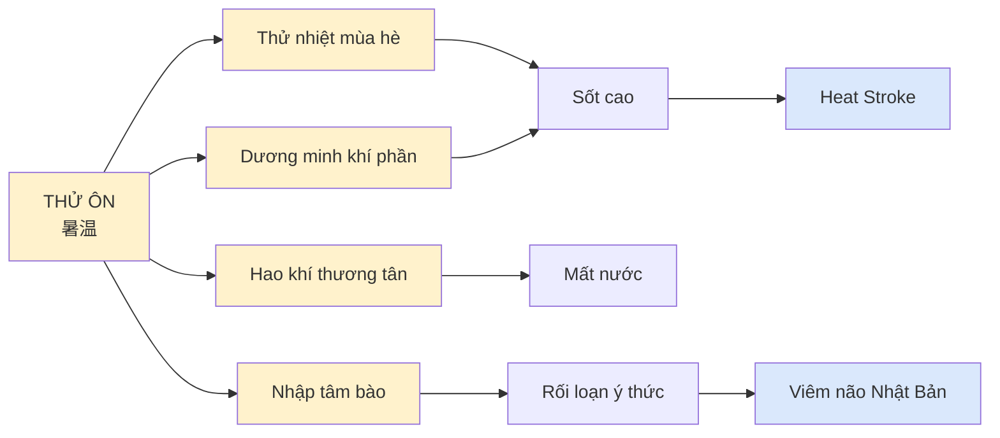
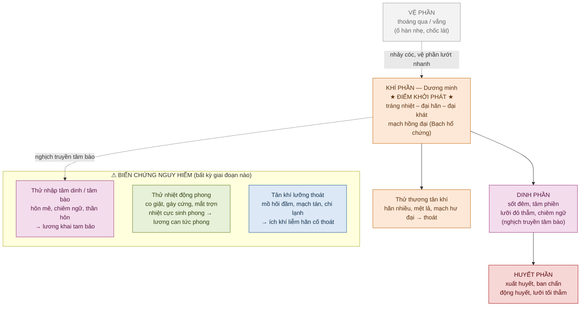
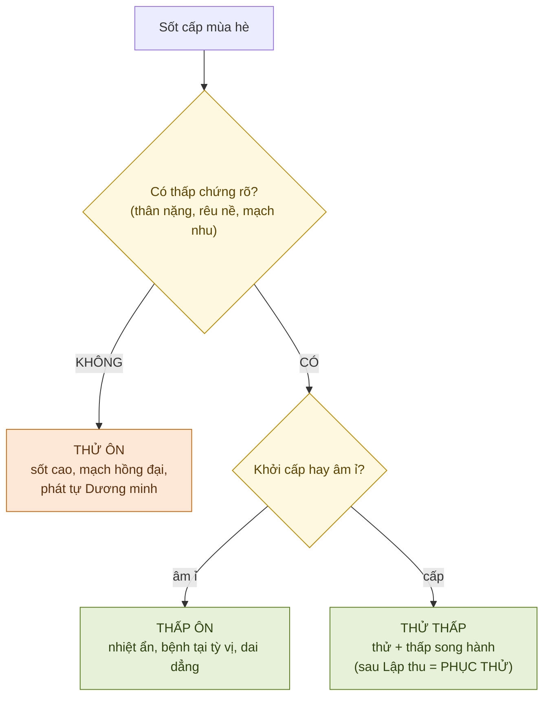
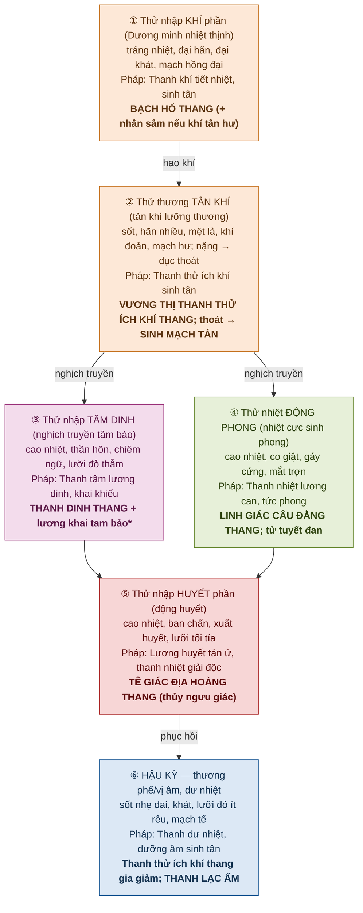

# THỬ ÔN (暑温) — Bài Giảng Chuyên Sâu

> [!info] Định vị nguồn
> KB `on_benh_dai_cuong` **định nghĩa khái niệm thử ôn** (Bài 2 — "Thử nhiệt bệnh tà gây bệnh gọi là thử ôn") và **so sánh thử ôn ↔ thử thấp ↔ thấp ôn ↔ phục thử** (Bài 6 — Thử Thấp, mục 4 Chẩn đoán phân biệt). KB **KHÔNG có chương biện chứng lâm sàng riêng cho thử ôn** (chỉ chi tiết Thử Thấp).
> → Phần biện chứng các thể trong bài này được **bổ sung từ kiến thức nền cổ điển** (Ngô Cúc Thông *Ôn bệnh điều biện*, Vương Mạnh Anh, Diệp Thiên Sĩ). Các đoạn bổ sung được đánh dấu 🔸 **[Kiến thức nền — ngoài KB]**.

---

## ⚡ TL;DR — Nắm trong 60 giây

- **Thử ôn = ôn bệnh cấp tính mùa hè do _thử nhiệt bệnh tà thuần_ (hỏa nhiệt mùa hè, KHÔNG kèm thấp rõ).** Cảm tà tức phát.
- **Dấu ấn:** *"Hạ thử phát tự Dương minh"* (Diệp Thiên Sĩ) — bệnh **bỏ qua/lướt nhanh vệ phần, vào thẳng khí phần Dương minh**. Khác hẳn phong ôn (khởi từ phế vệ).
- **Bộ ba đặc tính:** ① tổn thương cực nhanh phạm Dương minh; ② **hao khí thương tân** dữ dội (thử bức tân tiết, khí tùy tân thoát); ③ **dễ trực trúng tâm bào → bế khiếu động phong** (thử là hỏa, tâm là hỏa tạng).
- **Tứ đại chứng khởi phát** (Bạch hổ thang chứng): **sốt cao (tráng nhiệt) – đại hãn – đại khát – mạch hồng đại**.
- **Tây y tương ứng:** sốc nhiệt/say nắng nặng (heat stroke), **viêm não Nhật Bản (viêm não B)** mùa hè, nhiễm khuẩn huyết/sốt cao cấp mùa hè.
- **Pháp trị xương sống:** Thanh thử tiết nhiệt + Ích khí sinh tân (cùng lúc — vì thử luôn hao khí thương tân).

---

## BƯỚC 1 — Định nghĩa & Phạm vi

### 1.1. Định nghĩa YHCT

> **Theo KB (Bài 2 — Nguyên nhân & phát bệnh):**
> *"Thử nhiệt bệnh tà là khí hỏa nhiệt mùa hè hóa sinh, là một loại ôn tà gây bệnh phát vào mùa hè... **Thử nhiệt bệnh tà gây bệnh gọi là thử ôn**."*
> *"Thử và ôn là một loại bệnh tà. Xuất hiện trước hè gọi là ôn bệnh, sau hè lập thu xuất hiện gọi là thử bệnh. Và **thử bệnh chỉ có ngoại cảm, không có nội sinh** — đây là điểm đặc biệt trong lục dâm."*

**Diễn giải:** Thử ôn (暑温) là một loại **ngoại cảm nhiệt bệnh cấp tính** phát vào mùa hè (từ Hạ chí đến Lập thu), do cảm thụ **thử nhiệt bệnh tà thuần** — tức hỏa nhiệt mùa hè ở dạng kháng thịnh, **không kèm thấp tà rõ rệt**. Đặc trưng lâm sàng là khởi phát đột ngột với **dương minh khí phần nhiệt thịnh** ngay từ đầu.

> [!note] Phân biệt thuật ngữ then chốt (cực dễ nhầm)
> - **Thử nhiệt tà thuần** → gây **THỬ ÔN** (đề nhiệt) — bài này.
> - **Thử nhiệt + thấp** = thử thấp bệnh tà → gây **THỬ THẤP** (cảm tức phát) và **PHỤC THỬ** (tà phục, sau Lập thu mới phát).
> KB ghi 2 trường phái: Vương Mạnh Anh ("thử thuần dương vô âm, vốn không có thấp, chỉ dễ kiêm thêm thấp") vs Ngô Cúc Thông ("nhiệt + thấp hợp thành thử"). Lâm sàng dung hòa: **thử CÓ thể kèm thấp, CÓ thể không** — không kèm thấp thì là thử nhiệt thuần → thử ôn.

### 1.2. Định nghĩa Tây y (đối chiếu)

🔸 **[Kiến thức nền — ngoài KB; KB thuần YHCT lý luận, không có ICD]**

Căn cứ **mùa phát + bệnh cảnh nhiệt cấp kịch liệt + thần kinh trung ương**, thử ôn cổ điển tương ứng nhóm bệnh Tây y:

| Bệnh cảnh thử ôn | Tương ứng Tây y | ICD-10 (tham khảo) |
|---|---|---|
| Tráng nhiệt – đại hãn – đại khát, không rối loạn ý thức sớm | **Say nắng / sốc nhiệt** (heat stroke, classic & exertional) | T67.0 |
| Cao nhiệt + hôn mê + co giật mùa hè (trẻ em) | **Viêm não Nhật Bản B** (Japanese encephalitis) | A83.0 |
| Cao nhiệt cấp + nhiễm độc toàn thân mùa hè | Nhiễm khuẩn huyết, sốt cấp do nhiễm trùng | A41.x |

> Đây là **ánh xạ hội chứng**, không phải tương đương 1-1. Một ca viêm não B có thể đi qua "thử ôn" rồi "thử nhập tâm dinh/động phong"; còn say nắng đơn thuần thường dừng ở "thử thương khí tân".

### 1.3. Điểm tương đồng & khác biệt căn bản

---

## BƯỚC 2 — Cơ chế Sinh lý / Bệnh lý

### 2.1. YHCT — Đặc tính gây bệnh của thử nhiệt tà (4 đặc điểm cốt lõi)

> **Theo KB (Bài 2):** *"Đặc điểm gây bệnh chủ yếu của Thử nhiệt bệnh tà"* — trích nguyên 4 điểm:

| # | Đặc điểm (KB) | Cơ chế | Hệ quả lâm sàng |
|---|---|---|---|
| ① | **Tổn thương cực nhanh, phạm kinh Dương minh** | *"Nóng như lò lửa, tổn thương nhanh nhất"* — không theo thứ tự biểu→lý, vào thẳng Dương minh khí phần | *"Hạ thử phát tự Dương minh"*: tráng nhiệt, đại hãn, mặt đỏ, tâm phiền, đại khát, mạch hồng đại |
| ② | **Thử tính mãnh liệt, hao khí thương tân** | Hỏa nhiệt thiêu đốt → bức tân dịch tiết ra (đại hãn) → *"khí tùy tân tiết"* | Khát, răng khô, uể oải, mạch hư; nặng → **tân khí lưỡng thoát** (truỵ mạch) |
| ③ | **Dễ trực trúng tâm bào, bế khiếu động phong** | *"Thử là hỏa tà, tâm là hỏa tạng, tà dễ nhập"* (Vương Mạnh Anh) | Thân nhiệt + **thần mê (hôn mê) + co giật** — xuất hiện sớm, đột ngột |
| ④ | **Dễ kèm thấp tà, uất trở khí phần** | Mùa hè "nhiệt từ trời ép xuống, thấp từ đất bốc lên" | Nếu kèm thấp rõ → chuyển thành bệnh cảnh **thử thấp** (xem [[Thử Thấp]]) |

> [!tip] "Phát tự Dương minh" — vì sao đây là chìa khóa phân biệt?
> Đa số ôn bệnh đi tuần tự **Vệ → Khí → Dinh → Huyết**. Thử ôn thì **nhảy cóc**: vệ phần thoáng qua hoặc vắng mặt, **khởi phát ngay tại khí phần Dương minh nhiệt thịnh**. Lâm sàng: bệnh nhân không có giai đoạn "ố hàn nhẹ" kéo dài, mà sốt cao bùng phát ngay. Điều này định hướng **dùng Bạch hổ thang sớm**, không phí thời gian ở pháp giải biểu.

### 2.2. Cơ chế truyền biến (Vệ–Khí–Dinh–Huyết trong thử ôn)

🔸 **[Khung biện chứng từ KB Bài 3; diễn tiến thử ôn cụ thể bổ sung từ kiến thức nền]**

### 2.3. Tây y — Sinh lý bệnh đối chiếu

🔸 **[Kiến thức nền — ngoài KB]**

- **Sốc nhiệt:** rối loạn trung tâm điều nhiệt vùng dưới đồi → thân nhiệt >40°C → tổn thương tế bào trực tiếp + đáp ứng viêm hệ thống (SIRS) → suy đa tạng. "Đại hãn rồi vô hãn" ↔ giai đoạn mất bù khi tuyến mồ hôi kiệt = ứng với **thử thương tân khí → thoát**.
- **Viêm não Nhật Bản:** virus hướng thần kinh → viêm nhu mô não → phù não, co giật, hôn mê ↔ **thử nhập tâm dinh + động phong**.
- **Mất nước ưu trương + mất điện giải** do đổ mồ hôi nhiều ↔ **hao khí thương tân** (khí = chức năng tuần hoàn/trương lực mạch; tân = thể tích dịch).

| YHCT | Diễn giải sinh lý bệnh Tây y |
|---|---|
| Thử bức tân tiết (đại hãn) | Đổ mồ hôi ồ ạt → mất dịch nhược/ưu trương |
| Khí tùy tân thoát | Giảm thể tích tuần hoàn → tụt HA, truỵ mạch |
| Thử trực trúng tâm bào | Phù não / viêm não → rối loạn ý thức |
| Nhiệt cực sinh phong | Sốt cao co giật / co giật do viêm não |

---

## BƯỚC 3 — Biểu hiện Lâm sàng

### 3.1. Tứ chẩn (theo khung KB Bài 4 — Chẩn đoán ôn bệnh)

| Chẩn | Biểu hiện thử ôn điển hình |
|---|---|
| **Vọng** | Mặt đỏ, mắt đỏ; lưỡi đỏ rêu vàng khô (khí phần) → lưỡi đỏ thẫm (dinh) → lưỡi tối tía, ban chẩn (huyết). Nặng: thần mê, co giật, mắt trợn ngược |
| **Văn** | Hơi thở thô, tiếng nói to (thực nhiệt) → nói nhảm/chiêm ngữ (nhiệt nhiễu tâm thần); nặng → thần hôn không nói |
| **Vấn** | **Tráng nhiệt (sốt cao liên tục), đại khát thích uống lạnh, đại hãn**, tâm phiền, đau đầu; tiểu ngắn đỏ. Hỏi mùa + tiếp xúc nắng nóng |
| **Thiết** | **Mạch hồng đại (khí phần)** → tế sác (thương âm) → tế sác/tán vô lực (thoát). Bụng: thường không đầy cứng (khác phủ thực) |

### 3.2. Triệu chứng cơ năng vs thực thể

**Cơ năng (chủ quan):** rất khát, bứt rứt phiền nhiệt, choáng váng, mệt lả rã rời, đau đầu.

**Thực thể (khách quan):** sốt cao ≥39–40°C, da nóng đỏ, đổ mồ hôi nhiều (giai đoạn sớm) → da khô nóng/vô hãn (giai đoạn mất bù), nhịp tim nhanh, rối loạn ý thức, co giật, dấu màng não (nếu viêm não).

---

## BƯỚC 4 — Chẩn đoán

### 4.1. Chẩn đoán xác định (YHCT)

🔸 **[Tổng hợp từ KB + nền]**
1. **Phát vào mùa hè** (Hạ chí → Lập thu), thử nhiệt thịnh.
2. **Khởi bệnh cấp, sốt cao bùng phát**, biểu hiện **khí phần Dương minh nhiệt thịnh ngay từ đầu** (vệ phần thoáng qua).
3. Bộ tứ: **tráng nhiệt – đại hãn – đại khát – mạch hồng đại**.
4. **Hao khí thương tân nổi bật**; dễ kèm thần chí (hôn mê) và động phong (co giật).

### 4.2. Biện chứng (Bát cương + Vệ-Khí-Dinh-Huyết)

- **Bát cương:** Lý – Nhiệt – Thực (giai đoạn đầu) → chuyển Hư (thương khí tân) → Lý-Nhiệt-Huyết (huyết phần).
- **VKDH:** thường khởi tại **Khí phần**, dễ nghịch truyền **Dinh/Huyết**, biến chứng **tâm bào + động phong**.

### 4.3. Chẩn đoán phân biệt — bảng so sánh 4 ôn bệnh mùa hè

> **Theo KB (Bài 6 — Thử Thấp, mục 4):** nguyên văn so sánh thử ôn ↔ thử thấp ↔ thấp ôn ↔ phục thử.

| Tiêu chí | **Thử ôn** | **Thử thấp** | **Thấp ôn** | **Phục thử** |
|---|---|---|---|---|
| Tà khí | Thử nhiệt thuần | Thử + thấp (cảm tức phát) | Thấp nhiệt | Thử thấp **phục tàng** |
| Mùa | Hè (cảm tức phát) | Hè / giao hè-thu | Trường hạ (cuối hè-thu) | **Sau Lập thu** mới phát |
| Khởi bệnh | **Cấp, bùng nổ** | Cấp | **Từ từ, âm ỉ** | Phát là **lý nhiệt ngay** |
| Nhiệt | **Sốt cao nổi bật**, phiền khát, mạch hồng đại | Có thử nhiệt + thân nặng, ngực tức | Nhiệt **không rõ** lúc đầu (nhiệt ẩn trong thấp) | Cao nhiệt, tâm phiền, lưỡi đỏ |
| Thấp chứng | **Không / không rõ** | **Rõ:** thân nặng, rêu nề, mạch nhu, quản bĩ | **Rất rõ**, bệnh tại tỳ vị | Có thấp uất kèm |
| Vệ biểu | Thoáng qua | Có hàn nhiệt đau mình | Có vệ chứng kéo dài hơn | Vệ chứng **chỉ thoáng** |
| Bệnh trình | Cấp, có thể ngắn nhưng nặng | Dai dẳng | **Dài, dai dẳng nhất** | Dài, dai dẳng |
| Tổn TKTW | **Sớm & mạnh** (động phong, hôn mê) | Có thể (khi hóa táo hóa hỏa) | Muộn | Có khi vào dinh |

> [!warning] Bẫy lâm sàng (KB nhấn mạnh)
> *"Khi thử thấp **hóa táo hóa hỏa** thì biểu hiện lâm sàng lại **rất giống thử ôn**."* → Khi gặp bệnh cảnh "giống thử ôn" cuối mùa, phải truy hồi tiền sử có giai đoạn thấp chứng (thân nặng, rêu nề) trước đó không, để không bỏ sót gốc thấp.

---

## BƯỚC 5 — Điều trị Tích hợp

### 5.1. Nguyên tắc YHCT

> **Theo KB (Bài 6):** *"Trong điều trị nên đặt **thanh thử tiết nhiệt** ở vị trí đầu tiên... thử nhiệt rất dễ tổn thương khí... nên phối **ích khí sinh tân**."*

**Pháp trị cốt lõi: THANH THỬ TIẾT NHIỆT + ÍCH KHÍ SINH TÂN** (phải song hành — đặc thù của thử so với các nhiệt tà khác).

### 5.2. Biện chứng luận trị các thể & bài thuốc

🔸 **[Các thể & cổ phương từ kiến thức nền — Ngô Cúc Thông *Ôn bệnh điều biện*, Vương Mạnh Anh; KB không có chương biện chứng thử ôn riêng]**

> [!note] Chú thích sơ đồ
> - `*` **Lương khai tam bảo** = An cung ngưu hoàng hoàn / Tử tuyết đan / Chí bảo đan — khai khiếu tỉnh thần.
> - ⚠ Tê giác, xạ hương, ngưu hoàng: dùng **vị thay thế hợp pháp** (thủy ngưu giác, nhân tạo) — CITES & quy định dược liệu.
> - **Xuyên suốt mọi giai đoạn:** THANH THỬ + ÍCH KHÍ SINH TÂN (vì thử luôn hao khí thương tân).

> [!example] Bài thuốc trụ cột — tóm tắt thành phần
> - **Bạch hổ thang:** Thạch cao, Tri mẫu, Cam thảo, Ngạnh mễ. (+ Nhân sâm = Bạch hổ gia nhân sâm thang khi đã hao khí tân.)
> - **Vương thị Thanh thử ích khí thang** (Vương Mạnh Anh): Tây dương sâm, Thạch hộc, Mạch môn, Hoàng liên, Trúc diệp, Hà ngạnh, Tri mẫu, Cam thảo, Ngạnh mễ, Tây qua thúy y. → *Phân biệt với* **Đông Hằng Thanh thử ích khí thang** (Lý Đông Hằng — trong KB Thử Thấp thể thương khí, thiên về kiện tỳ táo thấp ích khí; dùng cho thử **thấp**, không phải thử ôn thuần).
> - **Sinh mạch tán:** Nhân sâm, Mạch môn, Ngũ vị tử — cứu tân khí dục thoát.
> - **Thanh dinh thang:** Tê giác (thủy ngưu giác), Sinh địa, Huyền sâm, Trúc diệp tâm, Mạch môn, Đan sâm, Hoàng liên, Ngân hoa, Liên kiều.
> - **Tê giác địa hoàng thang:** Tê giác (thủy ngưu giác), Sinh địa, Đơn bì, Xích thược.

> [!important] Hai bài "Thanh thử ích khí thang" — đừng nhầm
> | | **Vương Mạnh Anh** | **Lý Đông Hằng** |
> |---|---|---|
> | Dùng cho | **Thử ôn** thương tân khí (nhiệt nặng, âm thương) | **Thử thấp** thương khí (có thấp, tỳ hư) |
> | Thiên về | Thanh nhiệt + dưỡng âm sinh tân | Kiện tỳ táo thấp + ích khí |
> | Vị tiêu biểu | Tây dương sâm, Thạch hộc, Mạch môn | Hoàng kỳ, Thương/Bạch truật, Thăng ma, Cát căn |
> KB (file Thử Thấp 5.6) dùng **bài Lý Đông Hằng**. Thử ôn thuần dùng **bài Vương Mạnh Anh**.

### 5.3. Châm cứu hỗ trợ

🔸 **[Kiến thức nền — KB on_benh thuần lý luận, không có huyệt]**
- Thanh thử tả nhiệt: **Đại chuỳ, Khúc trì, Hợp cốc, Nội đình** (tả).
- Khai khiếu cấp cứu (hôn mê/say nắng): **Nhân trung, Thập tuyên (chích nặn máu), Thiếu thương, Uỷ trung**.
- Tức phong (co giật): **Thái xung, Dương lăng tuyền, Phong trì**.
- Cứu cố thoát (truỵ mạch): **Quan nguyên, Khí hải, Thần khuyết (cứu cách muối)**.

### 5.4. Tây y — phác đồ song hành (KB nhắc "phối hợp Đông Tây cấp cứu")

🔸 **[Kiến thức nền]**
- **Sốc nhiệt:** hạ nhiệt nhanh (chườm mát, làm mát bay hơi, mục tiêu <39°C trong 30 phút), bù dịch tinh thể, theo dõi điện giải, chống suy tạng. **Đây là cấp cứu nội khoa — không trì hoãn vì YHCT.**
- **Viêm não Nhật Bản:** điều trị nâng đỡ, chống phù não (mannitol), chống co giật (benzodiazepin/phenytoin), hồi sức hô hấp. Dự phòng: **vaccin viêm não Nhật Bản**.

### 5.5. Tương tác Đông–Tây cần lưu ý

🔸 **[Kiến thức nền — xem [[duoc-hoc-tich-hop]]]**
- **Thạch cao (Bạch hổ thang) liều cao** + bù dịch tích cực → theo dõi **Ca²⁺/điện giải**.
- Bài lương huyết chứa **Đan sâm/Xích thược** (hoạt huyết) → thận trọng nếu có rối loạn đông máu/đang chống đông.
- Cam thảo (trong nhiều bài) dùng kéo dài/liều cao → **giữ Na, mất K, tăng HA** — bất lợi ở bệnh nhân sốc nhiệt đang rối loạn điện giải.

---

## BƯỚC 6 — Bằng chứng Khoa học

🔸 **[Kiến thức nền — không nằm trong KB; mức bằng chứng ghi thận trọng]**

| Can thiệp | Bối cảnh | Mức BC (tự đánh giá) |
|---|---|---|
| Hạ nhiệt nhanh trong sốc nhiệt | Chuẩn cấp cứu quốc tế | **A** |
| Vaccin viêm não Nhật Bản | Dự phòng dịch | **A** |
| Bạch hổ thang / thành phần thanh nhiệt | Hạ sốt, kháng viêm — chủ yếu tiền lâm sàng + RCT nhỏ | **C–B** |
| Sinh mạch tán (chế phẩm Sâm mạch) trong sốc | Một số RCT/meta hỗ trợ huyết động, chất lượng không đồng nhất | **C–B** |
| An cung ngưu hoàng hoàn trong hôn mê/đột quỵ nhiệt | Nghiên cứu chủ yếu ở TQ, dị chất | **C** |

> [!caution] Cảnh báo trung thực
> Phần lớn bằng chứng cho cổ phương thử ôn là **tiền lâm sàng hoặc RCT chất lượng thấp/heterogeneous**. **Không dùng YHCT thay thế cấp cứu hạ nhiệt + hồi sức** trong sốc nhiệt/viêm não — YHCT chỉ là **bổ trợ**. (Tuân nguyên tắc *safety first*, xem [[feedback-citation-rigor]].)

---

## BƯỚC 7 — Điểm Cần Nhớ & Câu Hỏi Phản Biện

### 7.1. Key points (5)

1. **Thử ôn = thử nhiệt tà THUẦN** (không thấp rõ); kèm thấp thì là thử thấp/phục thử — đây là ranh giới chẩn đoán cốt lõi (KB Bài 2 & Bài 6).
2. **"Phát tự Dương minh"** — khởi phát thẳng ở khí phần với bộ tứ **tráng nhiệt – đại hãn – đại khát – mạch hồng đại** → dùng **Bạch hổ thang** sớm, không sa đà giải biểu.
3. **Hao khí thương tân là đặc thù** → mọi giai đoạn đều phối **ích khí sinh tân**; phân biệt **Thanh thử ích khí thang Vương Mạnh Anh (thử ôn)** vs **Lý Đông Hằng (thử thấp)**.
4. **Dễ trực trúng tâm bào + động phong** → cảnh giác hôn mê/co giật sớm; sẵn sàng "lương khai tam bảo" + tức phong + cấp cứu Tây y.
5. **Thử thấp hóa táo hóa hỏa "rất giống thử ôn"** (KB) — luôn truy tiền sử thấp chứng để không bỏ sót gốc thấp.

### 7.2. Câu hỏi phản biện (tự kiểm tra)

> [!question] Q1
> Một bệnh nhân tháng 8 (sau Lập thu) sốt cao, tâm phiền, lưỡi đỏ, vệ chứng chỉ thoáng qua, bệnh trình dai dẳng. Đây là **thử ôn hay phục thử**? Dựa vào tiêu chí nào của KB để phân định, và điều đó đổi hướng điều trị thế nào?

> [!question] Q2
> Vì sao trong thử ôn phải phối **ích khí sinh tân ngay từ giai đoạn khí phần**, trong khi ở phong ôn khí phần (vd phế nhiệt phủ thực) lại không nhấn mạnh điều này? Liên hệ với đặc tính "khí tùy tân tiết" của thử tà.

---

## 🔗 Liên kết

- [[Phong Ôn — Bài Giảng Chuyên Sâu]] — đối chiếu "phát tự phế vệ" vs "phát tự Dương minh"
- [[Xuân Ôn — Bài Giảng Chuyên Sâu]] — phục tà ôn nhiệt, cũng dễ nghịch truyền tâm bào
- [[Thử Thấp]] — bệnh "anh em" cùng mùa, có thấp tà (KB có chương đầy đủ)
- [[duoc-hoc-tich-hop]] · [[feedback-citation-rigor]]

> [!quote] Trích dẫn kim chỉ nam (Diệp Thiên Sĩ)
> *"Hạ thử phát tự Dương minh"* — Mùa hè thử bệnh khởi phát ngay từ kinh Dương minh.
> *"Thử thị hỏa tà, tâm vi hỏa tạng, tà dị nhập chi"* (Vương Mạnh Anh) — Thử là hỏa tà, tâm là hỏa tạng, nên tà dễ nhập tâm.

---
*Nguồn KB: `kb/on_benh_dai_cuong/01_ly-thuyet/bai-02-nguyen-nhan-phat-benh_001.md`, `02_benh-lam-sang/thu-thap_001.md` (mục 4). Các phần 🔸 là kiến thức nền cổ điển ngoài KB. Mục đích giáo dục — áp dụng lâm sàng cần cá thể hóa.*
