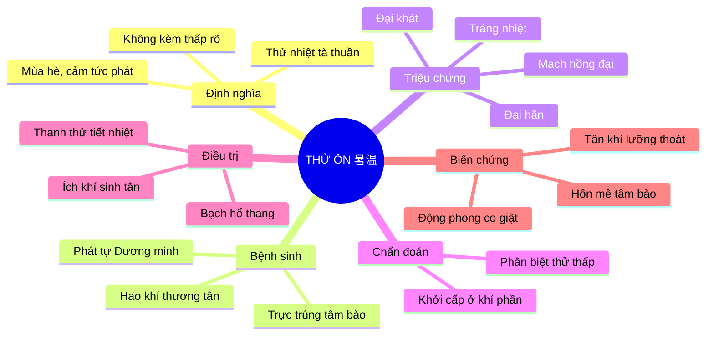
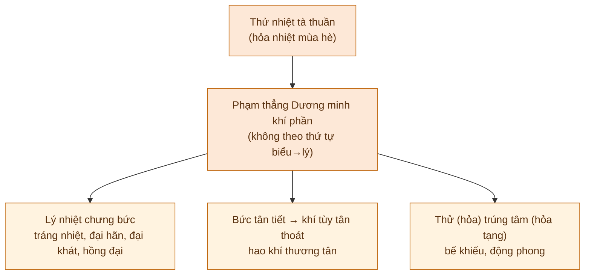
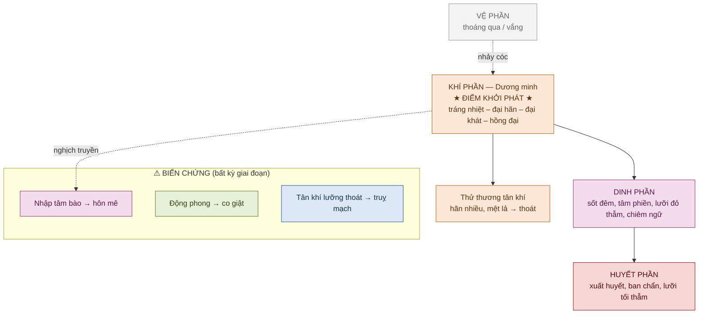
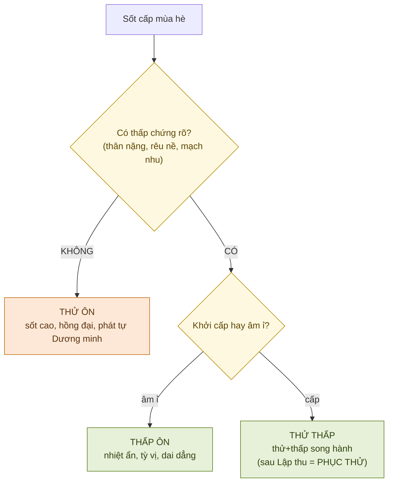
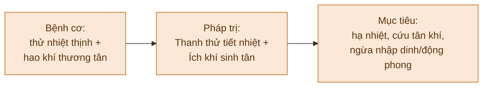
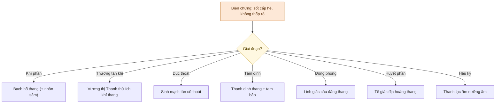

# THỬ ÔN (暑温)

> [!info] Định vị nguồn
> KB `on_benh_dai_cuong` **định nghĩa khái niệm thử ôn** (Bài 2) + **so sánh thử ôn ↔ thử thấp ↔ thấp ôn ↔ phục thử** (Bài 6 — Thử Thấp, mục 4). KB **KHÔNG có chương biện chứng lâm sàng riêng cho thử ôn** (chỉ chi tiết Thử Thấp). Phần biện chứng các thể được **bổ sung từ kiến thức nền cổ điển**, đánh dấu 🔸 **[ngoài KB]**.

## 🎯 ONE-MINUTE REVIEW

---

## ⚡ HIGH-YIELD FACTS

* **Thử ôn = thử nhiệt tà THUẦN** (không thấp rõ). Kèm thấp → thử thấp / phục thử.
* *"Hạ thử phát tự Dương minh"* — khởi phát thẳng ở **khí phần**, bỏ qua/lướt vệ phần → dùng **Bạch hổ thang sớm**.
* **Tứ đại chứng:** tráng nhiệt – đại hãn – đại khát – mạch hồng đại (Bạch hổ chứng).
* **Hao khí thương tân là đặc thù** → mọi giai đoạn phối **ích khí sinh tân** (khí tùy tân thoát → truỵ mạch).
* **Dễ trực trúng tâm bào + động phong** (thử là hỏa, tâm là hỏa tạng) → hôn mê, co giật sớm.
* **Tây y:** sốc nhiệt/say nắng (T67.0), viêm não Nhật Bản B (A83.0), nhiễm khuẩn huyết hè.

---

# 1. ĐỊNH NGHĨA

## 1.1 Định nghĩa YHCT

> **Theo KB (Bài 2):** *"Thử nhiệt bệnh tà là khí hỏa nhiệt mùa hè hóa sinh, là một loại ôn tà gây bệnh phát vào mùa hè... **Thử nhiệt bệnh tà gây bệnh gọi là thử ôn**."*
> *"Thử và ôn là một loại bệnh tà. Xuất hiện trước hè gọi là ôn bệnh, sau hè lập thu xuất hiện gọi là thử bệnh. Và **thử bệnh chỉ có ngoại cảm, không có nội sinh**."*

Thử ôn (暑温) là **ngoại cảm nhiệt bệnh cấp tính** phát vào mùa hè (Hạ chí → Lập thu), do cảm thụ **thử nhiệt bệnh tà thuần** (hỏa nhiệt mùa hè kháng thịnh, **không kèm thấp tà rõ**). Đặc trưng: khởi phát đột ngột với **dương minh khí phần nhiệt thịnh** ngay từ đầu.

## 1.2 Định nghĩa hiện đại

🔸 **[Kiến thức nền — KB thuần YHCT, không có ICD]**

Ánh xạ hội chứng (không phải tương đương 1-1):

| Bệnh cảnh thử ôn | Tương ứng Tây y | ICD-10 |
|---|---|---|
| Tráng nhiệt – đại hãn – đại khát, ý thức còn | **Say nắng / sốc nhiệt** (heat stroke) | T67.0 |
| Cao nhiệt + hôn mê + co giật hè (trẻ em) | **Viêm não Nhật Bản B** | A83.0 |
| Cao nhiệt cấp + nhiễm độc toàn thân hè | Nhiễm khuẩn huyết, sốt cấp nhiễm trùng | A41.x |

## 1.3 Ý nghĩa lâm sàng

- Là **cấp cứu nội khoa** khi biểu hiện sốc nhiệt/viêm não — YHCT bổ trợ, **không thay** hạ nhiệt + hồi sức.
- Phân định thử ôn ↔ thử thấp quyết định pháp trị: thuần thanh thử ích khí (thử ôn) vs thanh thử **kèm hóa thấp** (thử thấp).
- "Phát tự Dương minh" → không sa đà giải biểu, dùng thanh khí (Bạch hổ) sớm.

---

# 2. CƠ CHẾ BỆNH SINH

## 2.1 Nguyên nhân

> **Theo KB (Bài 2):** đặc tính thử nhiệt tà — *"thử là dương tà, có tính viêm nhiệt"*, *"thăng tán, dễ thương tân hao khí"*, *"thử là hỏa tà, tâm là hỏa tạng, tà dễ nhập"*.

- **Ngoại tà:** thử nhiệt bệnh tà (hỏa nhiệt mùa hè) — kháng thịnh hơn nhiệt tà mùa khác.
- **Chính khí:** tỳ vị hư, tân khí bất túc, lao lực dưới nắng → dễ cảm.
- **Đường xâm nhập:** miệng mũi / cơ biểu, gây bệnh nhanh.

## 2.2 Cơ chế phát bệnh

## 2.3 Cơ chế truyền biến

🔸 **[Khung VKDH từ KB Bài 3; diễn tiến thử ôn cụ thể bổ sung nền]**

## 2.4 Điểm mấu chốt

> [!important]
> **"Phát tự Dương minh" + "hao khí thương tân"** là hai dấu ấn không thể thiếu. Khác với phong ôn (khởi phế vệ), thử ôn vào thẳng khí phần và **luôn** hao khí thương tân → pháp trị bắt buộc phối **ích khí sinh tân ngay từ giai đoạn khí phần**.

---

# 3. TRIỆU CHỨNG LÂM SÀNG

## 3.1 Chủ chứng

* Tráng nhiệt (sốt cao liên tục, ≥39–40°C)
* Đại hãn (mồ hôi nhiều)
* Đại khát, thích uống lạnh
* Tâm phiền, mặt đỏ, mắt đỏ
* Mạch hồng đại

## 3.2 Thứ chứng

* Đau đầu, choáng váng
* Mệt lả rã rời, khí đoản (khi hao khí)
* Tiểu ngắn đỏ
* Răng khô, lưỡi đỏ rêu vàng khô
* Nặng: thần hôn, co giật, ban chẩn xuất huyết

## 3.3 Tứ chẩn

| Chẩn | Nội dung |
| ----- | -------- |
| Vọng | Mặt đỏ, mắt đỏ; lưỡi đỏ rêu vàng khô → đỏ thẫm (dinh) → tối tía, ban chẩn (huyết); nặng: thần mê, co giật |
| Văn | Hơi thở thô, tiếng to (thực nhiệt) → nói nhảm/chiêm ngữ → thần hôn không nói |
| Vấn | Tráng nhiệt, đại khát uống lạnh, đại hãn, tâm phiền, đau đầu; mùa hè + tiếp xúc nắng nóng |
| Thiết | Mạch hồng đại → tế sác (thương âm) → tán vô lực (thoát); bụng thường không đầy cứng |

## 3.4 Dấu hiệu nguy hiểm

> [!warning] Red flags — chuyển cấp cứu ngay
> - **Rối loạn ý thức** (li bì, hôn mê, chiêm ngữ) → nhập tâm bào / viêm não.
> - **Co giật, gáy cứng, mắt trợn** → động phong.
> - **Mồ hôi đầm rồi vô hãn, mạch tán, chi lạnh, tụt HA** → tân khí lưỡng thoát (truỵ mạch).
> - **Xuất huyết, ban chẩn** → động huyết, huyết phần.
> - Thân nhiệt >40°C kéo dài → sốc nhiệt — **hạ nhiệt khẩn cấp**.

---

# 4. CHẨN ĐOÁN

## 4.1 Chẩn đoán xác định

Checklist:

* [ ] Phát vào **mùa hè** (Hạ chí → Lập thu), thử nhiệt thịnh
* [ ] **Khởi cấp**, sốt cao bùng phát ở **khí phần Dương minh** ngay từ đầu (vệ phần thoáng qua)
* [ ] Bộ tứ: **tráng nhiệt – đại hãn – đại khát – mạch hồng đại**
* [ ] **Hao khí thương tân** nổi bật; **không** có thấp chứng rõ (thân nặng, rêu nề, mạch nhu)
* [ ] Có/không kèm thần chí (hôn mê) + động phong (co giật)

## 4.2 Biện chứng

| Thể bệnh | Đặc điểm |
| -------- | -------- |
| Thử nhập khí phần (Dương minh) | Tráng nhiệt, đại hãn, đại khát, hồng đại |
| Thử thương tân khí | Sốt + hãn nhiều, mệt lả, khí đoản, mạch hư |
| Thử nhập tâm dinh | Cao nhiệt, thần hôn, chiêm ngữ, lưỡi đỏ thẫm |
| Thử nhiệt động phong | Cao nhiệt, co giật, gáy cứng, mắt trợn |
| Thử nhập huyết phần | Ban chẩn, xuất huyết, lưỡi tối tía |
| Hậu kỳ thương âm | Sốt nhẹ dai, khát, lưỡi đỏ ít rêu, mạch tế |

## 4.3 Chẩn đoán phân biệt

### Bảng so sánh

> **Theo KB (Bài 6 — Thử Thấp, mục 4):**

| Bệnh | Giống | Khác |
| ---- | ----- | ---- |
| **Thử thấp** | Phát hè, có thử nhiệt | Có **thấp rõ**: thân nặng, rêu nề, mạch nhu, quản bĩ |
| **Thấp ôn** | Ngoại cảm nhiệt | Khởi **âm ỉ**, nhiệt ẩn, bệnh tại tỳ vị, dai dẳng nhất |
| **Phục thử** | Có thử thấp | Phát **sau Lập thu** (tà phục), phát là lý nhiệt ngay, vệ chứng chỉ thoáng |
| **Phong ôn** | Ôn nhiệt cấp | Khởi **phế vệ** (mùa đông xuân), không "phát tự Dương minh" |

> [!warning] Bẫy KB nhấn mạnh
> *"Khi thử thấp **hóa táo hóa hỏa** thì biểu hiện lâm sàng **rất giống thử ôn**."* → Luôn truy tiền sử thấp chứng để không bỏ sót gốc thấp.

---

# 5. ĐIỀU TRỊ

## 5.1 Nguyên tắc điều trị

## 5.2 Biện chứng luận trị

🔸 **[Cổ phương từ kiến thức nền; KB không có chương biện chứng thử ôn riêng]**

| Thể | Chủ chứng | Bệnh cơ | Pháp trị | Phương thuốc |
| --- | --------- | ------- | -------- | ------------ |
| ① Khí phần | Tráng nhiệt, đại hãn, đại khát, hồng đại | Dương minh nhiệt thịnh | Thanh khí tiết nhiệt, sinh tân | **Bạch hổ thang** (+ nhân sâm nếu khí tân hư) |
| ② Thương tân khí | Sốt, hãn nhiều, mệt lả, khí đoản, mạch hư | Thử hao khí thương tân | Thanh thử ích khí sinh tân | **Vương thị Thanh thử ích khí thang**; thoát → **Sinh mạch tán** |
| ③ Nhập tâm dinh | Cao nhiệt, thần hôn, chiêm ngữ, lưỡi đỏ thẫm | Nghịch truyền tâm bào | Thanh tâm lương dinh, khai khiếu | **Thanh dinh thang** + lương khai tam bảo* |
| ④ Động phong | Cao nhiệt, co giật, gáy cứng | Nhiệt cực sinh phong | Thanh nhiệt lương can, tức phong | **Linh giác câu đằng thang**; tử tuyết đan |
| ⑤ Nhập huyết | Ban chẩn, xuất huyết, lưỡi tối tía | Nhiệt độc động huyết | Lương huyết tán ứ, giải độc | **Tê giác địa hoàng thang** (thủy ngưu giác) |
| ⑥ Hậu kỳ | Sốt nhẹ dai, khát, lưỡi đỏ ít rêu | Thương phế/vị âm, dư nhiệt | Thanh dư nhiệt, dưỡng âm sinh tân | Thanh thử ích khí thang gia giảm; **Thanh lạc ẩm** |

> `*` Lương khai tam bảo = An cung ngưu hoàng hoàn / Tử tuyết đan / Chí bảo đan.
> ⚠ Tê giác, xạ hương, ngưu hoàng: dùng **vị thay thế hợp pháp** (thủy ngưu giác, nhân tạo) — CITES.

> [!important] Hai bài "Thanh thử ích khí thang" — đừng nhầm
> | | **Vương Mạnh Anh** | **Lý Đông Hằng** |
> |---|---|---|
> | Dùng cho | **Thử ôn** thương tân khí (nhiệt nặng, âm thương) | **Thử thấp** thương khí (có thấp, tỳ hư) |
> | Thiên về | Thanh nhiệt + dưỡng âm sinh tân | Kiện tỳ táo thấp + ích khí |
> | Vị tiêu biểu | Tây dương sâm, Thạch hộc, Mạch môn | Hoàng kỳ, Thương/Bạch truật, Thăng ma, Cát căn |
> KB (file Thử Thấp 5.6) dùng **bài Lý Đông Hằng**. Thử ôn thuần dùng **bài Vương Mạnh Anh**.

## 5.3 Thuật toán điều trị

## 5.4 Châm cứu

🔸 **[Kiến thức nền — KB on_benh không có huyệt]**

| Mục tiêu | Huyệt |
| -------- | ----- |
| Thanh thử tả nhiệt | Đại chuỳ, Khúc trì, Hợp cốc, Nội đình (tả) |
| Khai khiếu cấp cứu | Nhân trung, Thập tuyên (chích máu), Thiếu thương, Uỷ trung |
| Tức phong (co giật) | Thái xung, Dương lăng tuyền, Phong trì |
| Cố thoát (truỵ mạch) | Quan nguyên, Khí hải, Thần khuyết (cứu cách muối) |

## 5.5 Tây y phối hợp

🔸 **[Kiến thức nền — KB nhắc "phối hợp Đông Tây cấp cứu"]**

| Tình huống | Xử trí |
| ---------- | ------ |
| Sốc nhiệt | Hạ nhiệt nhanh (làm mát bay hơi, mục tiêu <39°C/30 phút), bù dịch tinh thể, theo dõi điện giải, chống suy tạng |
| Viêm não Nhật Bản | Nâng đỡ, chống phù não (mannitol), chống co giật (benzodiazepin/phenytoin), hồi sức hô hấp; **dự phòng: vaccin VNNB** |
| Tân khí lưỡng thoát | Hồi sức dịch, vận mạch, monitor huyết động |

## 5.6 Tương tác Đông Tây y

🔸 **[Xem [[duoc-hoc-tich-hop]]]**

| Dược liệu | Thuốc Tây | Lưu ý |
| --------- | --------- | ----- |
| Thạch cao liều cao (Bạch hổ) | Bù dịch/điện giải | Theo dõi **Ca²⁺**, điện giải |
| Đan sâm, Xích thược (lương huyết) | Chống đông / RL đông máu | Tăng nguy cơ chảy máu — thận trọng |
| Cam thảo (nhiều bài) | — | Liều cao/kéo dài: **giữ Na, mất K, tăng HA** — bất lợi khi đang RL điện giải |

---

# 6. BẰNG CHỨNG KHOA HỌC

🔸 **[Mức bằng chứng tự đánh giá — phần lớn cổ phương là tiền lâm sàng/RCT nhỏ]**

| Can thiệp | Bằng chứng | Mức độ |
| --------- | ---------- | ------ |
| Hạ nhiệt nhanh trong sốc nhiệt | Chuẩn cấp cứu quốc tế | **A** |
| Vaccin viêm não Nhật Bản | Dự phòng dịch | **A** |
| Bạch hổ thang / thành phần thanh nhiệt | Hạ sốt, kháng viêm — tiền lâm sàng + RCT nhỏ | **C–B** |
| Sinh mạch tán (Sâm mạch) trong sốc | RCT/meta hỗ trợ huyết động, chất lượng không đồng nhất | **C–B** |
| An cung ngưu hoàng hoàn trong hôn mê nhiệt | Nghiên cứu chủ yếu TQ, dị chất | **C** |

> [!caution]
> **Không dùng YHCT thay thế cấp cứu hạ nhiệt + hồi sức** trong sốc nhiệt/viêm não — YHCT chỉ bổ trợ. (Safety first — [[feedback-citation-rigor]].)

---

# 7. TÌNH HUỐNG LÂM SÀNG

🔸 **[Case minh họa giáo dục — không phải bệnh án thực]**

## Case 1

### Bệnh cảnh

Nam 19 tuổi, tập quân sự giữa trưa tháng 6. Đột ngột sốt cao 40°C, mặt đỏ, mồ hôi đầm đìa, khát dữ dội đòi uống nước lạnh, tâm phiền, đau đầu. Lưỡi đỏ rêu vàng khô, mạch hồng đại. Chưa rối loạn ý thức.

### Biện chứng

Mùa hè, lao lực dưới nắng → cảm thử nhiệt tà thuần. **Phát tự Dương minh khí phần**: tráng nhiệt – đại hãn – đại khát – hồng đại = **thử nhập khí phần (Dương minh nhiệt thịnh)**. Bắt đầu hao tân (khát dữ).

### Điều trị

Pháp: **Thanh khí tiết nhiệt, sinh tân**. Bài **Bạch hổ thang gia nhân sâm** (đã đại hãn hao tân khí). **Song hành cấp cứu Tây y:** hạ nhiệt làm mát, bù dịch — đây là sốc nhiệt, không trì hoãn.

---

## Case 2

### Bệnh cảnh

Bé trai 6 tuổi, tháng 7. Sốt cao 3 ngày, hôm nay **li bì → co giật toàn thân**, gáy cứng, mắt trợn ngược, nói nhảm. Lưỡi đỏ thẫm, mạch tế sác.

### Biện chứng

Thử nhiệt **nghịch truyền tâm dinh + nhiệt cực sinh phong**: thần hôn chiêm ngữ (tâm bào) + co giật gáy cứng (động phong). Đã vào dinh phần (lưỡi đỏ thẫm).

### Điều trị

Pháp: **Thanh tâm lương dinh, khai khiếu + tức phong**. Bài **Thanh dinh thang** + **An cung ngưu hoàng hoàn** (khai khiếu) + **Linh giác câu đằng thang** (tức phong). **Cấp cứu Tây y:** nghi viêm não Nhật Bản — chống phù não, chống co giật, hồi sức; chọc dịch não tủy chẩn đoán.

---

# 8. ĐIỂM THI THƯỜNG HỎI

## 5 điểm phải nhớ

1. Thử ôn = thử nhiệt tà **thuần** (không thấp); kèm thấp → thử thấp/phục thử.
2. *"Hạ thử phát tự Dương minh"* — khởi ở khí phần, Bạch hổ thang sớm.
3. **Hao khí thương tân** → ích khí sinh tân mọi giai đoạn.
4. Dễ **trực trúng tâm bào + động phong** → cảnh giác hôn mê/co giật sớm.
5. Bộ tứ Bạch hổ chứng: **tráng nhiệt – đại hãn – đại khát – mạch hồng đại**.

## Bẫy dễ nhầm

> [!tip]
> - **Thử ôn vs thử thấp:** có/không thấp chứng (thân nặng, rêu nề, mạch nhu). Thử thấp hóa táo hóa hỏa → giống thử ôn.
> - **2 bài Thanh thử ích khí thang:** Vương Mạnh Anh (thử ôn, dưỡng âm) ≠ Lý Đông Hằng (thử thấp, kiện tỳ — bài trong KB).
> - **Thử ôn vs phục thử:** cùng cảnh nhiệt nhưng phục thử phát **sau Lập thu** (tà phục), bệnh trình dài.

---

# 9. AI RETRIEVAL SUMMARY

## Definition

Thử ôn (暑温, summer-heat warm disease) is an acute externally-contracted febrile warm disease occurring in summer, caused by pure summer-heat pathogen (thử nhiệt tà, without obvious dampness). Onset directly at the Qi level (Yangming).

## Key Symptoms

High fever (tráng nhiệt), profuse sweating (đại hãn), intense thirst (đại khát), surging large pulse (mạch hồng đại), red face/eyes, irritability. Severe: coma, convulsions, petechiae.

## Pathogenesis

"Summer-heat arises from Yangming" — bypasses Wei level, directly Qi-Yangming heat. Damages qi and fluids (sweat depletes fluids, qi follows fluids out). As fire, easily invades Pericardium (Heart=fire organ) → coma + wind stirring (convulsions).

## Diagnosis

Summer onset; acute high fever at Qi-Yangming from start; the four cardinal signs; marked qi-fluid damage; NO clear dampness signs. Differentiate from thử thấp, thấp ôn, phục thử, phong ôn.

## Treatment

Core principle: Clear summer-heat + Boost qi & generate fluids (concurrently). Stage-based: Qi → Bai Hu Tang; qi-fluid damage → Wang's Qing Shu Yi Qi Tang / Sheng Mai San; Ying-Pericardium → Qing Ying Tang + orifice-opening pills; wind → Ling Jiao Gou Teng Tang; Blood → Xi Jiao Di Huang Tang.

## Formula

Bạch hổ thang (Shi Gao, Zhi Mu, Gan Cao, Jing Mi); Vương thị Thanh thử ích khí thang; Sinh mạch tán; Thanh dinh thang; Tê giác địa hoàng thang.

## Red Flags

Altered consciousness, convulsions/neck rigidity, profuse-then-absent sweating with thready/scattered pulse and cold limbs (collapse), bleeding/petechiae, temperature >40°C. Emergency cooling + resuscitation required.

---

# 10. TÀI LIỆU THAM KHẢO

1. Giáo trình Ôn Bệnh — ĐH Y Dược Cần Thơ 2024 (TS.BS Lê Minh Hoàng; BS.CKII Lê Thị Ngoan). KB `on_benh_dai_cuong`: `01_ly-thuyet/bai-02-nguyen-nhan-phat-benh_001.md`; `02_benh-lam-sang/thu-thap_001.md` (mục 4 — chẩn đoán phân biệt).
2. Ngô Cúc Thông (Wu Jutong). *Ôn bệnh điều biện* (温病条辨) — biện chứng tam tiêu, các thể thử ôn & cổ phương. 🔸 [nền]
3. Vương Mạnh Anh (Wang Mengying). *Ôn nhiệt kinh vĩ* — thử ôn, Thanh thử ích khí thang. 🔸 [nền]
4. Diệp Thiên Sĩ (Ye Tianshi). *Ôn nhiệt luận* — "Hạ thử phát tự Dương minh"; biện chứng vệ-khí-dinh-huyết. 🔸 [nền]

---
*Liên kết: [[Thử Ôn — Bài Giảng Chuyên Sâu]] (bản giảng 7 bước) · [[Phong Ôn — Bài Giảng Chuyên Sâu]] · [[Xuân Ôn — Bài Giảng Chuyên Sâu]] · [[Thử Thấp]]. Mục đích giáo dục — áp dụng lâm sàng cần cá thể hóa.*
