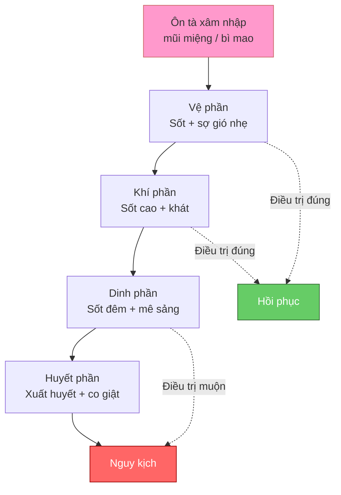
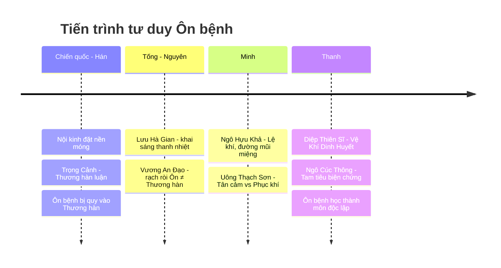
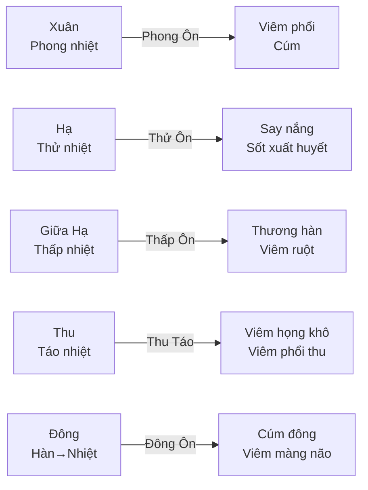
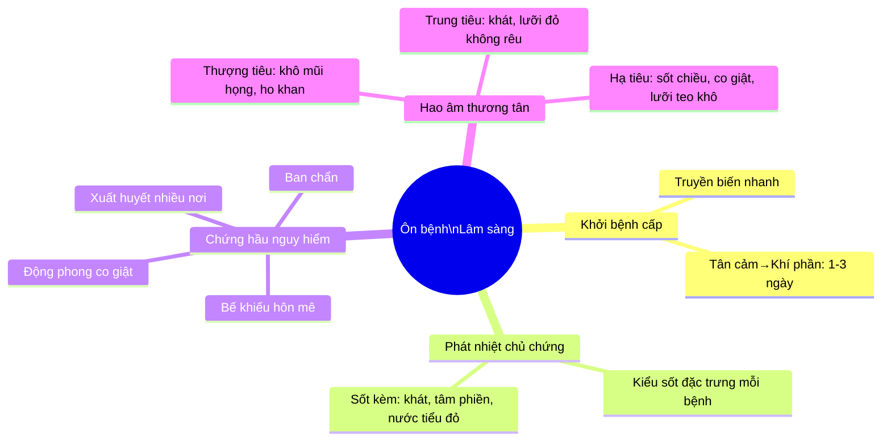

import { Aside, Tabs, TabItem } from '@astrojs/starlight/components';
import MedicalNote from '~/components/MedicalNote.astro';
import KeyPoints from '~/components/KeyPoints.astro';
import RedFlags from '~/components/RedFlags.astro';
import AlgorithmBox from '~/components/AlgorithmBox.astro';
import CompareTable from '~/components/CompareTable.astro';
import ClinicalPearl from '~/components/ClinicalPearl.astro';

## Mục tiêu bài giảng

Sau bài này người học **hiểu được** (không chỉ thuộc):

- Ôn bệnh là gì — và **tại sao** nó không phải Thương hàn, không phải nội thương
- Logic hình thành 2 hệ biện chứng: Vệ-Khí-Dinh-Huyết và Tam tiêu
- 4 tính chất bệnh học — đọc được ý nghĩa lâm sàng, không chỉ liệt kê
- Phân loại Ôn bệnh theo 3 trục: tính chất / phát bệnh / vị trí

<MedicalNote title="Góc nhìn giảng viên">
**Điều cần nắm đầu bài:** Ôn bệnh không phải là một bệnh cụ thể — đây là **hệ thống tư duy** để tiếp cận toàn bộ nhiệt bệnh cấp tính. Hiểu đại cương = hiểu được cái khung để treo mọi bệnh lâm sàng sau này.
</MedicalNote>

---

## Bức tranh tổng thể

<MedicalNote>
Song song với Vệ-Khí-Dinh-Huyết, Ngô Cúc Thông dùng **Tam tiêu**: Thượng tiêu (phế-tâm) → Trung tiêu (tỳ-vị) → Hạ tiêu (can-thận). Hai hệ bổ sung cho nhau, không mâu thuẫn.
</MedicalNote>

---

## 1. Ôn bệnh là gì — Định nghĩa cốt lõi

**Ôn bệnh = ngoại cảm nhiệt bệnh cấp tính, do ôn tà gây ra, phát nhiệt là chủ chứng, dễ hóa táo thương âm.**

Hai vế quan trọng:
1. **Nguyên nhân:** ôn tà (phong nhiệt, thử nhiệt, thấp nhiệt, táo nhiệt, ôn độc...)
2. **Cơ chế:** nhiệt thiên thịnh → hao tổn tân dịch và phần âm

<ClinicalPearl>
**Pearl #1 — Loại trừ trước:** Không phải mọi sốt đều là Ôn bệnh. Sốt do nội thương (hư lao, ôn uất nội nhiệt) **không** phải Ôn bệnh. Ôn bệnh là **ngoại cảm** — tà từ bên ngoài vào.
</ClinicalPearl>

### Ôn bệnh ≠ Ôn dịch

| | Ôn bệnh | Ôn dịch |
| :-- | :-- | :-- |
| Phạm vi | Từng người lẻ tẻ | Nhiều người cùng lúc, thành dịch |
| Tính truyền nhiễm | Đa số có, một số không | Rất mạnh |
| Ví dụ YHHĐ | Viêm phổi thùy, say nắng | Cúm đại dịch, tả, dịch hạch |

---

## 2. Lịch sử — Tại sao cần biết?

> Không phải để thuộc tên sách, mà để hiểu **tại sao** tư duy Ôn bệnh khác Thương hàn.

<ClinicalPearl>
**Pearl #2 — Bước ngoặt Lưu Hà Gian:** Trước ông, ngoại cảm nhiệt bệnh đều dùng Thương hàn pháp → phát hãn tân ôn. Ông chứng minh: **lục khí đều có thể hóa hỏa** → cần thanh nhiệt, không phải tân ôn phát tán. Câu nói hậu thế: "Thương hàn tôn Trọng Cảnh, Nhiệt bệnh sùng Hà Gian".
</ClinicalPearl>

---

## 3. Bốn tính chất bệnh học — Đọc theo lâm sàng

### 3.1. Tính truyền nhiễm & Tính lưu hành

<CompareTable>

| Tính chất | Ý nghĩa lâm sàng | Lưu ý |
| :-- | :-- | :-- |
| Truyền nhiễm | Tà có thể lan từ người sang người | Không phải mọi Ôn bệnh đều truyền (say nắng không truyền) |
| Lưu hành | Cùng một vùng, cùng một mùa, nhiều người cùng triệu chứng | → Khi thấy cụm bệnh giống nhau: nghĩ ngay Ôn dịch |

</CompareTable>

### 3.2. Tính thời tiết — Mùa nào bệnh nấy

### 3.3. Tính khu vực & Tính giai đoạn

<ClinicalPearl>
**Pearl #3 — Tính giai đoạn là cốt lõi biện chứng:** Vệ → Khí → Dinh → Huyết không chỉ là sơ đồ lý thuyết. Đây là bản đồ tiên lượng: bệnh đang ở tầng nào, sẽ diễn biến về đâu, và can thiệp ở đâu là hiệu quả nhất.
</ClinicalPearl>

---

## 4. Hai hệ biện chứng — Logic song song

<Tabs>
  <TabItem label="Vệ-Khí-Dinh-Huyết (Diệp Thiên Sĩ)">

**Nhìn theo chiều sâu — từ ngoài vào trong:**

| Tầng | Vị trí | Triệu chứng chủ | Pháp điều trị |
| :-- | :-- | :-- | :-- |
| **Vệ** | Bì mao, phế | Sốt + sợ gió nhẹ, không có mồ hôi, ho | Tân lương giải biểu |
| **Khí** | Phế, vị, đại tràng | Sốt cao, không sợ lạnh, khát, mồ hôi nhiều | Thanh khí tiết nhiệt |
| **Dinh** | Tâm, tâm bào | Sốt đêm > ngày, mê sảng, lưỡi đỏ thẫm | Thanh dinh thấu nhiệt |
| **Huyết** | Can, thận, tâm | Xuất huyết, co giật, hôn mê | Lương huyết tán huyết |

  </TabItem>
  <TabItem label="Tam tiêu (Ngô Cúc Thông)">

**Nhìn theo chiều tạng phủ — từ trên xuống dưới:**

| Tiêu | Tạng phủ | Bệnh chủ yếu | Đặc điểm |
| :-- | :-- | :-- | :-- |
| **Thượng tiêu** | Phế, tâm | Phong Ôn, tâm bào bế | Bệnh nhẹ → nặng nhanh |
| **Trung tiêu** | Tỳ, vị | Thấp Ôn, Thử Thấp | Dai dẳng, khó khỏi |
| **Hạ tiêu** | Can, thận | Xuân Ôn giai đoạn muộn | Âm hư, thoát chứng |

  </TabItem>
  <TabItem label="Quan hệ 2 hệ">

**Không mâu thuẫn — bổ sung nhau:**

- **Vệ-Khí-Dinh-Huyết:** mô tả **mức độ tổn thương** và **chiều sâu** của bệnh
- **Tam tiêu:** mô tả **vị trí tạng phủ** và **xu hướng lan** của bệnh

Trong thực tế lâm sàng: dùng cả hai để mô tả đầy đủ. Ví dụ: "Tà ở khí phần, tại trung tiêu Dương minh, vị nhiệt cực thịnh".

  </TabItem>
</Tabs>

---

## 5. Phân loại — 3 trục cần nhớ

### Trục 1: Tính chất (quan trọng nhất cho điều trị)

<CompareTable>

| | Ôn nhiệt | Thấp nhiệt |
| :-- | :-- | :-- |
| Đặc điểm | Thuần nhiệt, không thấp | Nhiệt + thấp kết hợp |
| Khởi bệnh | Cấp, nhanh | Chậm, từ từ |
| Sốt | Rõ, cao | Ban đầu không rõ |
| Hao âm | Nhiều, nhanh | Có nhưng chậm; có thể thương dương |
| Bệnh trình | Ngắn | Dài, dai dẳng |
| Trị pháp | Thanh nhiệt khứ tà | Thanh nhiệt + hóa thấp |
| Ví dụ | Phong Ôn, Xuân Ôn, Thử Ôn, Ngược Tật | Thấp Ôn, Thử Thấp, Hoắc Loạn |

</CompareTable>

### Trục 2: Kiểu phát bệnh

| | Tân cảm | Phục khí (Phục tà) |
| :-- | :-- | :-- |
| Cơ chế | Cảm tà → phát ngay | Tà phục tàng → sau mới phát |
| Biểu hiện ban đầu | Biểu chứng rõ | Lý nhiệt ngay từ đầu, ít biểu |
| Ví dụ | Phong Ôn, Thu Táo | Xuân Ôn, Phục Thử |

### Trục 3: Vị trí tạng phủ chủ yếu

| Tạng phủ | Bệnh |
| :-- | :-- |
| Phế hệ (Thượng tiêu) | Phong Ôn, Thu Táo, Đại Đầu Ôn, Lạn Hầu Sa |
| Tỳ-Vị hệ (Trung tiêu) | Thấp Ôn, Thử Thấp |
| Không quy một tạng | Xuân Ôn, Phục Thử, Ngược Tật |

---

## 6. Phân biệt Ôn bệnh vs Thương hàn

<CompareTable>

| Tiêu chí | Ôn bệnh | Thương hàn |
| :-- | :-- | :-- |
| Nguyên nhân | Ôn tà (dương) | Hàn tà (âm) |
| Tính chất nhiệt | **Nhiệt từ trong ra** (lý nhiệt) | Hàn tà vào → uất nhiệt sau |
| Ban đầu | Sốt + khát + không sợ lạnh hoặc sợ ít | Sợ lạnh nhiều + sốt sau + không khát |
| Mạch | Phù sắc / phù sác | Phù khẩn / phù hoãn |
| Lưỡi | Đỏ, rêu vàng hoặc ít rêu | Nhợt, rêu trắng |
| Phương pháp | **Cấm** phát hãn tân ôn | Phát hãn tân ôn là chủ |
| Xu hướng | Hao âm, hao tân dịch | Thương dương, thương khí |

</CompareTable>

<RedFlags>
**Bẫy lâm sàng — sai lầm hay gặp:**
- Thấy bệnh nhân sốt + có biểu chứng → dùng Ma hoàng thang phát hãn → **nguy hiểm** nếu là Ôn bệnh
- Mang An Thường đã cảnh báo: "Phong Ôn, Thấp Ôn nếu dùng phát hãn Thương hàn thì **thập tử vô nhất sinh**"
- Cách phân biệt nhanh: **Khát ngay từ đầu** = Ôn bệnh; **không khát, sợ lạnh nhiều** = Thương hàn
</RedFlags>

---

## 7. Bốn đặc điểm lâm sàng

---

## 3 câu hỏi kích thích tư duy

<MedicalNote title="Tự kiểm sau bài">
1. **Tại sao** Ôn bệnh **cấm** dùng phát hãn tân ôn dù bệnh nhân có biểu chứng? Giải thích theo cơ chế nhiệt lý truyền ra ngoài.

2. **Phân biệt:** Một bệnh nhân sốt 39°C, khát, mồ hôi nhiều, không sợ lạnh. Người khác sốt 39°C, không khát, sợ lạnh, không mồ hôi. Mỗi người thuộc phạm trù gì? Pháp điều trị khác nhau thế nào?

3. **Nếu** bệnh nhân Ôn nhiệt tầng Khí phần mà đột ngột xuất hiện mê sảng, lưỡi đỏ thẫm — điều gì vừa xảy ra? Tại sao nguy hiểm và cần xử trí ngay gì?
</MedicalNote>

---

<KeyPoints>
- Ôn bệnh = ngoại cảm nhiệt bệnh do **ôn tà**, phát nhiệt là chủ chứng, dễ **hao âm thương tân**
- Hai hệ biện chứng: **Vệ-Khí-Dinh-Huyết** (chiều sâu tổn thương) và **Tam tiêu** (vị trí tạng phủ) — bổ sung nhau
- Phân loại theo 3 trục: ôn nhiệt/thấp nhiệt · tân cảm/phục khí · vị trí tạng phủ
- Phân biệt với Thương hàn: **khát ngay từ đầu + không sợ lạnh** = Ôn bệnh → **cấm** phát hãn tân ôn
- Tính giai đoạn (Vệ→Khí→Dinh→Huyết) là bản đồ tiên lượng và điều trị
</KeyPoints>
