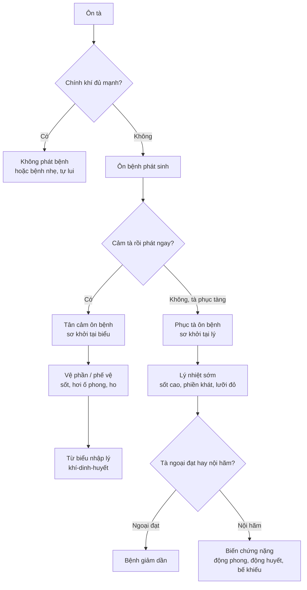
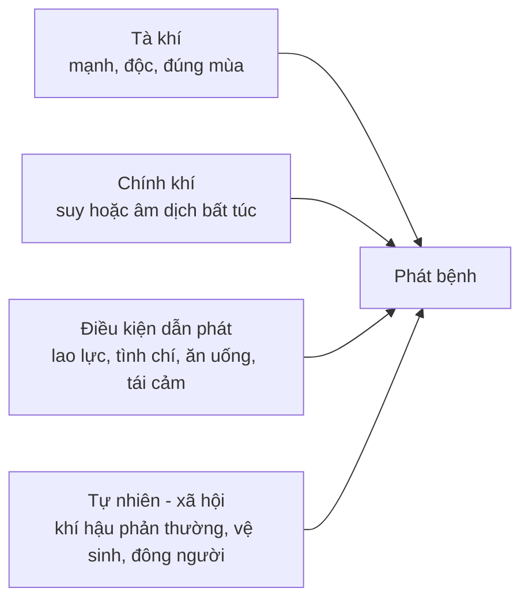
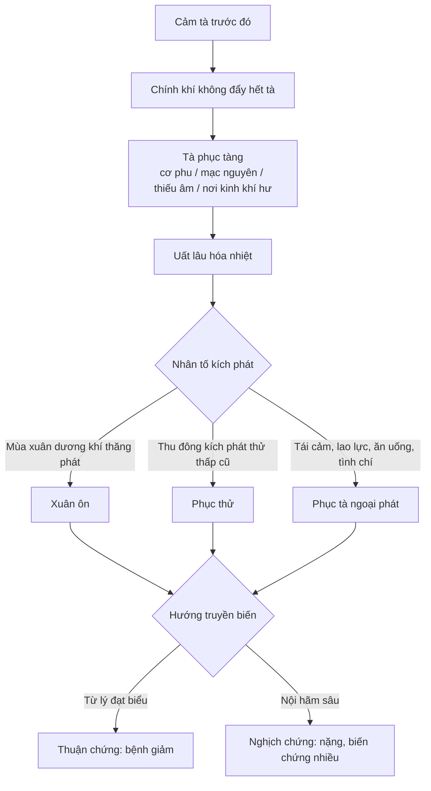
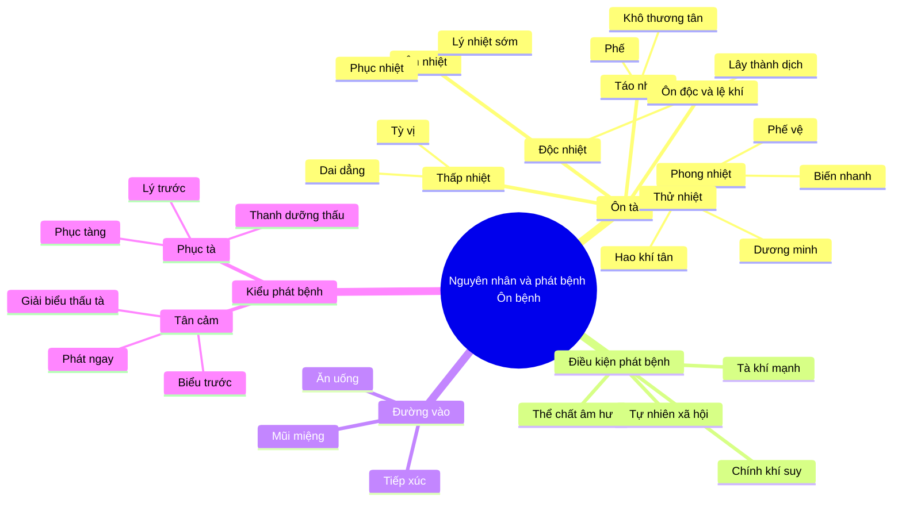

import { Tabs, TabItem } from '@astrojs/starlight/components';
import MedicalNote from '~/components/MedicalNote.astro';
import KeyPoints from '~/components/KeyPoints.astro';
import RedFlags from '~/components/RedFlags.astro';
import AlgorithmBox from '~/components/AlgorithmBox.astro';
import CompareTable from '~/components/CompareTable.astro';
import ClinicalPearl from '~/components/ClinicalPearl.astro';
import SourceNote from '~/components/SourceNote.astro';

## Mục tiêu bài giảng

Sau bài này người học **hiểu được**:

- Vì sao Ôn bệnh không chỉ là "bệnh sốt", mà là kết quả của **ôn tà + chính khí + thời điểm phát bệnh**
- Cách dùng tư duy **thẩm chứng cầu nhân**: nhìn chứng để suy nguyên nhân, rồi từ nguyên nhân chọn pháp
- Bảy nhóm ôn tà thường gặp và "đường đi" lâm sàng của từng nhóm
- Hai kiểu phát bệnh quan trọng nhất: **tân cảm** và **phục tà**
- Khi nào cần nghĩ đến ôn độc / lệ khí và ưu tiên phòng dịch, cách ly, thanh nhiệt giải độc

<MedicalNote title="Góc nhìn giảng viên">
Điều cần nắm đầu bài: **nguyên nhân của Ôn bệnh không đứng một mình**. Cùng một ôn tà, người chính khí vững có thể không bệnh; người âm hư, tỳ vị yếu, lao lực hoặc tái cảm thời tà có thể bệnh nặng, phát nhanh, vào sâu.
</MedicalNote>

---

## Bức tranh tổng thể

<ClinicalPearl>
**Pearl #1:** Trong Ôn bệnh, câu hỏi đầu tiên không phải "tên bệnh là gì?" mà là: **tà vào kiểu nào, đang ở đâu, và chính khí có đẩy tà ra được không?**
</ClinicalPearl>

---

## 1. Ôn tà là gì?

**Ôn tà** là nhân tố gây Ôn bệnh, có tính ôn nhiệt rõ, xâm nhập từ bên ngoài, thường qua **mũi miệng** hoặc **da lông**, làm rối loạn vệ-khí-dinh-huyết và các tạng phủ thuộc tam tiêu.

Năm đặc tính chung cần nhớ:

- **Tính ôn nhiệt:** phát nhiệt là trục triệu chứng chính, dễ hao tân dịch và thương âm
- **Tính ngoại cảm:** tà từ ngoài vào, khác với nội thương gây sốt
- **Tính mùa:** xuân phong nhiệt, hạ thử nhiệt, trường hạ thấp nhiệt, thu táo nhiệt
- **Tính chuyển hóa:** hàn uất có thể hóa nhiệt, nhiệt chưng thấp động, nhiệt đốt dịch thành táo
- **Tính chọn vị trí:** phong nhiệt thường phạm phế trước; thử nhiệt dễ vào dương minh; thấp nhiệt khốn tỳ vị

<MedicalNote title="Thẩm chứng cầu nhân">
Trong học Ôn bệnh, nhiều khi ta không "nhìn thấy" tác nhân ban đầu. Vì vậy phải **từ chứng mà cầu nhân**: sốt cao khát nhiều, mồ hôi nhiều, mạch hồng đại gợi thử nhiệt; sốt dai dẳng, nặng đầu, tức ngực, rêu nê gợi thấp nhiệt; ho khan, mũi họng khô, ít đàm gợi táo nhiệt.
</MedicalNote>

---

## 2. Lục khí, lục dâm và ôn tà

Lục khí là phong, hàn, thử, thấp, táo, hỏa trong trạng thái sinh lý của tự nhiên. Khi khí hậu **thái quá, bất cập, trái mùa, biến đổi đột ngột**, hoặc cơ thể không thích ứng được, lục khí trở thành **lục dâm**.

Trong phạm vi Ôn bệnh, các lục dâm có tính nhiệt hoặc hóa nhiệt được gọi chung là ôn tà.

<CompareTable>

| Trục nhìn | Ý nghĩa | Ví dụ lâm sàng |
| :-- | :-- | :-- |
| Khí hậu bình thường | Lục khí nuôi dưỡng sinh trưởng | Mùa xuân có gió, mùa thu hanh khô vừa phải |
| Khí hậu phản thường | Lục khí thành lục dâm | Đông ấm bất thường gây đông ôn; thu đáng mát lại nóng |
| Cơ thể không thích ứng | Khí bình thường vẫn thành tà với người yếu | Người tỳ hư gặp ẩm thấp dễ phát thấp ôn |
| Tà hóa nhiệt | Trở thành ôn tà | Phong nhiệt, thử nhiệt, thấp nhiệt, táo nhiệt, ôn nhiệt |

</CompareTable>

<ClinicalPearl>
**Pearl #2:** Đừng học "phong, thử, thấp, táo" như danh sách từ vựng. Hãy học như **mẫu hình bệnh học**: phong = nhanh và lên trên; thử = nóng mạnh và hao khí tân; thấp = nặng, dính, dai dẳng; táo = khô và thương phế.
</ClinicalPearl>

---

## 3. Bản đồ bảy nhóm ôn tà

### 3.1. Nhìn nhanh theo mùa, vị trí, diễn tiến

<CompareTable>

| Ôn tà | Mùa / bối cảnh | Vị trí hay bị trước | Đặc điểm nhận diện | Bệnh danh thường gặp |
| :-- | :-- | :-- | :-- | :-- |
| Phong nhiệt | Đông-xuân, khí ấm nhiều gió | Phế vệ, thượng tiêu | Phát nhanh, ho, đau họng, hơi khát, dễ nghịch truyền | Phong ôn, đông ôn |
| Thử nhiệt | Mùa hè nóng gắt | Dương minh khí phần, tâm bào | Sốt cao, mồ hôi nhiều, khát, hao khí tân, dễ bế khiếu động phong | Thử ôn |
| Thử thấp | Hè ẩm, nóng kèm thấp | Tỳ vị, tam tiêu | Nóng + nặng nề, tức ngực, nôn, tiêu lỏng, dai dẳng hơn thử nhiệt đơn thuần | Thử thấp, phục thử |
| Thấp nhiệt | Trường hạ, môi trường ẩm | Tỳ vị trung tiêu | Bệnh chậm, rêu nê, nặng đầu mình, tức ngực, bệnh trình dài | Thấp ôn |
| Táo nhiệt | Đầu thu, cuối hè khô nóng | Phế | Ho khan, ít đàm, mũi họng khô, đại tiện táo | Thu táo |
| Ôn nhiệt | Xuân, phục nhiệt phát ra | Lý, khí/dinh/huyết | Sơ khởi đã lý nhiệt: sốt cao, phiền khát, lưỡi đỏ; dễ thương âm | Xuân ôn |
| Ôn độc / lệ khí | Dịch bệnh, độc tà, lây mạnh | Tùy độc tà, thường mũi miệng | Phát cấp, nặng, lây lan; có sưng đau, ban chẩn, hầu họng, bế khiếu | Đại đầu ôn, lạn hầu sa, ôn dịch |

</CompareTable>

### 3.2. Đọc từng nhóm theo cơ chế

<Tabs>
  <TabItem label="Phong nhiệt">

Phong nhiệt đa số vào bằng mũi miệng, **trước phạm phế** vì phế ở thượng tiêu, chủ bì mao, thông với khí trời. Ban đầu thường là phế vệ biểu chứng: sốt, hơi ố phong hàn, đau đầu, ít mồ hôi, ho, miệng hơi khát, rêu mỏng, mạch phù sác.

Điểm nguy hiểm là phong chủ biến hóa, nhiệt hóa nhanh. Nếu chính khí không giữ được hoặc trị sai, tà có thể **nghịch truyền tâm bào**.

  </TabItem>
  <TabItem label="Thử nhiệt">

Thử nhiệt là hỏa nhiệt mùa hè, tính mạnh và nhanh. Nó có thể không đi đủ trình tự biểu-lý mà **phạm thẳng dương minh khí phần**: tráng nhiệt, mồ hôi nhiều, mặt đỏ, chóng mặt, tâm phiền, khát nhiều, mạch hồng đại.

Vì thử nhiệt thăng tán, mồ hôi ra nhiều nên vừa **thương tân** vừa **hao khí**. Nặng có thể khí tùy tân thoát, hoặc trực trúng tâm bào gây thần mê, co giật.

  </TabItem>
  <TabItem label="Thấp nhiệt">

Thấp là âm tà, nặng, trọc, dính, dễ bế khí cơ; nhiệt là dương tà. Hai thứ kết lại tạo bệnh cảnh "bán âm bán dương": không giải nhanh bằng phát hãn, cũng không chỉ thanh nhiệt là xong.

Do thấp cùng khí với tỳ thổ, thấp nhiệt dễ khốn tỳ vị: thân nặng, đầu nặng, tức ngực, đầy bụng, nôn, tiêu lỏng, rêu nê. Bệnh thường **dai dẳng và tái phát**.

  </TabItem>
  <TabItem label="Táo nhiệt">

Táo nhiệt chủ yếu phạm phế vì phế thích nhuận, ghét khô, lại khai khiếu ở mũi. Khi táo nhiệt vào phế, phế mất tuyên giáng: ho khan, ít đàm hoặc đàm dính khó khạc, mũi họng khô, da môi khô, đại tiện táo.

Nếu táo nhiệt kháng thịnh có thể tòng hỏa hóa: đau họng, mắt đỏ, ù tai, sưng nướu răng.

  </TabItem>
  <TabItem label="Ôn độc / lệ khí">

Ôn độc là lục dâm uẩn tích không giải mà thành độc, có thuộc tính ôn nhiệt, dễ gây sưng nóng đỏ đau, ban chẩn, hầu họng hoặc tổn thương tạng phủ. Lệ khí là tà có **tính lây nhiễm rất mạnh**, có thể thành dịch.

Khi gặp nhiều người cùng bệnh, phát cấp, nặng, có yếu tố lây lan, phải chuyển tư duy từ "một ca bệnh" sang **phòng trị dịch bệnh**: phát hiện, cách ly, phòng lây và xử trí độc nhiệt.

  </TabItem>
</Tabs>

---

## 4. Cơ chế phát bệnh: tà khí phải gặp điều kiện

Ôn tà xâm nhập không đồng nghĩa chắc chắn phát bệnh. Bài 2 nhấn mạnh phát bệnh là kết quả của **tà chính tương tranh**.

### 4.1. Nhân tố thể chất

Chính khí khỏe, tạng phủ điều hòa thì ôn tà khó xâm nhập. Chính khí bất túc, âm dịch kém, tỳ vị yếu, thận khí hư hoặc sau lao lực thì tà dễ vào sâu, dễ phục tàng, dễ phát nặng.

Các yếu tố làm giảm khả năng kháng tà:

- **Thất tình:** khí cơ rối loạn, tâm thần và tạng phủ bị ảnh hưởng
- **Lao dật:** quá lao lực hao khí huyết; quá nhàn dật làm khí cơ trì trệ
- **Ẩm thực:** đói no thất thường, ăn uống bất khiết, nhiều cay nóng hoặc sống lạnh làm tỳ vị suy yếu
- **Phòng sự bất tiết / bệnh nền:** làm chính khí suy, tà dễ phục

### 4.2. Nhân tố tự nhiên và xã hội

Khí hậu phản thường, nóng lạnh đột ngột, môi trường ô nhiễm, ăn uống mất vệ sinh, công tác phòng dịch không tốt, mật độ sống cao đều có thể làm ôn tà dễ phát và dễ lưu hành.

<RedFlags>
- Nhiều người cùng khu vực cùng sốt, ho, tiêu chảy, ban chẩn hoặc hầu họng sưng đau: nghĩ **lệ khí / ôn dịch**
- Bệnh phát rất cấp, độc nhiệt mạnh, rối loạn thần chí, co giật, xuất huyết: không xem như ngoại cảm nhẹ
- Người âm hư, già yếu, sau lao lực hoặc bệnh mạn: dễ **phục tà phát từ lý**, ít biểu chứng nhưng nặng
</RedFlags>

---

## 5. Đường xâm nhập của tà khí

<CompareTable>

| Đường vào | Nhóm bệnh hay gặp | Gợi ý lâm sàng |
| :-- | :-- | :-- |
| Không khí, mũi miệng | Phong ôn, thu táo, ôn dịch đường hô hấp | Ho, đau họng, mũi họng khô, sốt, lây theo cụm |
| Ăn uống | Thấp ôn, hoắc loạn, thử thấp, bệnh tiêu hóa truyền nhiễm | Nôn, tiêu chảy, bụng đầy, rêu nê, sốt kéo dài |
| Tiếp xúc / côn trùng | Ôn độc, lệ khí, bệnh phát chẩn | Ban chẩn, sưng đau cục bộ, sốt cấp, yếu tố dịch tễ |

</CompareTable>

<ClinicalPearl>
**Pearl #3:** Đường xâm nhập giúp dự đoán **tạng phủ sơ khởi**. Mũi miệng thường kéo phế-vị vào đầu bài; ăn uống kéo tỳ-vị; tiếp xúc độc tà dễ cho dấu hiệu tại da, hầu họng, huyết lạc.
</ClinicalPearl>

---

## 6. Tân cảm và phục tà: điểm rẽ quan trọng nhất

### 6.1. So sánh trực tiếp

<CompareTable>

| Tiêu chí | Tân cảm ôn bệnh | Phục tà ôn bệnh |
| :-- | :-- | :-- |
| Kiểu phát bệnh | Cảm tà rồi phát bệnh ngay | Cảm tà nhưng không phát ngay, tà phục tàng chờ cơ hội |
| Bệnh danh thường gặp | Phong ôn, thu táo, thử ôn, đại đầu ôn, lạn hầu sa | Xuân ôn, phục thử |
| Vị trí sơ khởi | Thường tại biểu, phế vệ | Thường tại lý, khí phần hoặc dinh huyết |
| Chứng đầu tiên | Sốt, hơi ố phong, ho, đau đầu, biểu chứng rõ | Sốt cao, phiền táo, khát, tiểu đỏ, lưỡi đỏ; có thể không biểu chứng |
| Xu hướng | Từ biểu vào lý, từ nông đến sâu | Từ lý đạt biểu thì thuận; nội hãm sâu là nghịch |
| Bệnh trình | Thường ngắn hơn, nhẹ hơn nếu xử trí đúng | Thường nặng, dài, nhiều biến chứng |
| Pháp sơ khởi | Giải biểu thấu tà, tân lương | Thanh tiết lý nhiệt, phối dưỡng âm và thấu tà |

</CompareTable>

### 6.2. Decision point lâm sàng

<AlgorithmBox>
1. **Hỏi khởi phát:** sau tiếp xúc tà khí có bệnh ngay không, hay có khoảng phục tàng rồi mới phát?
2. **Nhìn tầng bệnh đầu tiên:** biểu chứng phế vệ rõ → nghi tân cảm; lý nhiệt mạnh ngay → nghi phục tà.
3. **Đọc lưỡi và khát:** lưỡi đỏ, rêu vàng, khát nhiều, tiểu đỏ ngay từ đầu → lý nhiệt đã thịnh.
4. **Tìm yếu tố dẫn phát:** xuân ấm lên, tái cảm ngoại tà, lao lực, ăn uống thất điều, tình chí bất toại → có thể kích phát phục tà.
5. **Chọn pháp:** tân cảm sơ khởi cần thấu tà ra ngoài; phục tà sơ khởi lấy thanh lý nhiệt làm chính, không phát hãn mạnh.
</AlgorithmBox>

<RedFlags>
Sai lầm lớn nhất là thấy sốt có chút biểu chứng rồi phát hãn như Thương hàn. Nếu thực chất là phục tà có lý nhiệt thịnh, phát hãn mạnh có thể hao tân thương âm, làm tà nhiệt nội hãm nhanh hơn.
</RedFlags>

---

## 7. Phục tà: tại sao bệnh nặng hơn?

Phục tà không phải chỉ là "bệnh đến muộn". Nó là tình huống tà đã có thời gian uất lại, hóa nhiệt, nương chỗ chính khí hư mà ẩn phục. Khi gặp thời cơ, tà phát ra từ lý nên người bệnh có thể vào bài bằng lý nhiệt rõ.

Nguyên tắc điều trị được bài nguồn tóm bằng ba chữ: **thanh, dưỡng, thấu**.

- **Thanh:** thanh tiết lý nhiệt là trục chính
- **Dưỡng:** dưỡng âm để chính khí có nền đẩy tà
- **Thấu:** dẫn tà ngoại đạt, tránh tà bị giữ sâu trong lý

---

## 8. Đối chiếu YHHĐ để dễ học

<MedicalNote title="Đối chiếu khái niệm">
Đối chiếu này giúp học cơ chế, không dùng để đồng nhất máy móc. Một bệnh YHHĐ có thể biểu hiện nhiều mô hình YHCT khác nhau tùy mùa, cơ địa, giai đoạn và chứng hậu.
</MedicalNote>

<CompareTable>

| Khái niệm YHCT | Cách hiểu gần với YHHĐ | Điểm cần giữ theo YHCT |
| :-- | :-- | :-- |
| Ôn tà | Tác nhân nhiễm trùng, độc tố, nhiệt môi trường, yếu tố vật lý/hóa học | Không chỉ là vi sinh vật; còn là mô hình phản ứng nhiệt và thương âm |
| Lệ khí | Tác nhân gây dịch, lây lan mạnh | Cần nhìn cộng đồng, đường lây, phòng dịch |
| Thử nhiệt | Say nóng, bệnh do nhiệt, nhiễm trùng mùa hè có mất nước | Hao khí tân, nguy cơ bế khiếu động phong |
| Thấp nhiệt | Nhiễm trùng tiêu hóa, sốt kéo dài có rối loạn tiêu hóa, môi trường ẩm | Tỳ vị bị khốn, khí cơ bế, bệnh dai dẳng |
| Tân cảm | Bệnh cấp sau phơi nhiễm mới | Sơ khởi thường từ biểu vào lý |
| Phục tà | Tái hoạt / tiềm phục / cơ địa nền khiến bệnh bùng lên muộn | Sơ khởi tại lý, chú ý âm hư và chính khí |

</CompareTable>

---

## Sơ đồ tổng hợp cuối bài

---

## 3 câu hỏi kích thích tư duy

<MedicalNote title="Tự kiểm sau bài">
1. Một bệnh nhân sốt cao, khát nhiều, mồ hôi nhiều, mặt đỏ sau khi làm việc ngoài nắng mùa hè. Vì sao không nên xem đây chỉ là "phong nhiệt biểu chứng"?

2. Hai bệnh nhân cùng sốt mùa xuân: người A ho, đau họng, hơi ố phong; người B sốt cao, phiền táo, khát, tiểu đỏ, lưỡi đỏ ngay từ đầu. Hãy phân biệt tân cảm và phục tà.

3. Khi một lớp học có nhiều người cùng sốt, đau họng, ban chẩn trong vài ngày, tư duy xử trí thay đổi thế nào so với một ca Ôn bệnh lẻ tẻ?
</MedicalNote>

---

<KeyPoints>
- Ôn bệnh phát sinh khi **ôn tà thắng chính khí**; không chỉ phụ thuộc tác nhân, mà còn phụ thuộc cơ địa và hoàn cảnh.
- Ôn tà có các nhóm chính: **phong nhiệt, thử nhiệt, thử thấp, thấp nhiệt, táo nhiệt, ôn nhiệt, ôn độc/lệ khí**.
- Tư duy cốt lõi là **thẩm chứng cầu nhân → thẩm nhân luận trị**: từ chứng suy tà, từ tà chọn pháp.
- **Tân cảm** thường phát ngay, sơ khởi tại biểu, trị sơ khởi thiên về giải biểu thấu tà.
- **Phục tà** phát từ lý, thường nặng và dài hơn; sơ khởi lấy **thanh tiết lý nhiệt**, phối dưỡng âm và thấu tà.
- Gặp tính lây mạnh, phát cấp, nhiều người cùng mắc phải nghĩ **lệ khí / ôn dịch**, không chỉ xử trí như ca đơn lẻ.
</KeyPoints>

<SourceNote>

- Nguồn KB DeepTutor: `on_benh_dai_cuong`
- Chunk đã dùng: `bai-02-nguyen-nhan-phat-benh_001.md`, `_002.md`, `_003.md`
- Trang này là bản bài giảng chuyên sâu, cấu trúc lại từ nguồn để học theo luồng lâm sàng.

</SourceNote>
