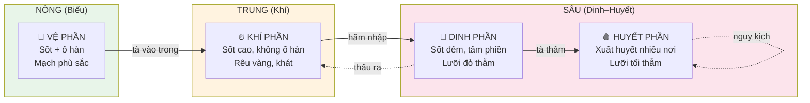
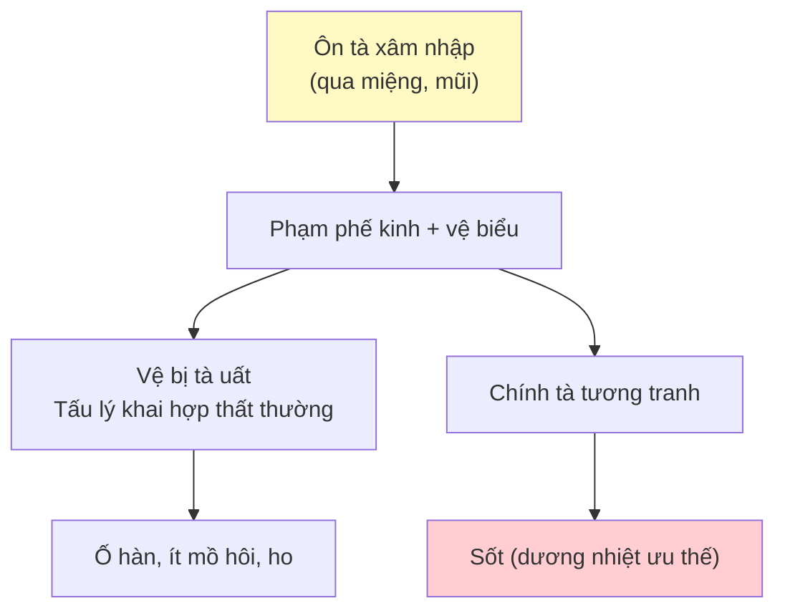
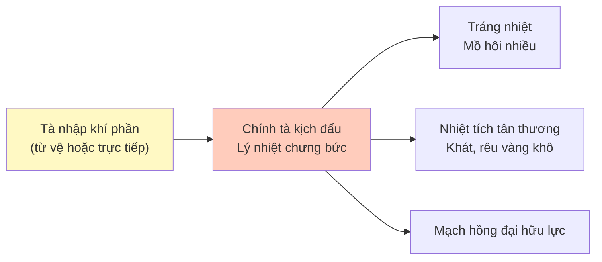
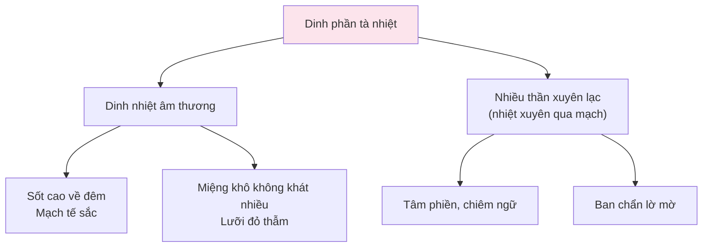
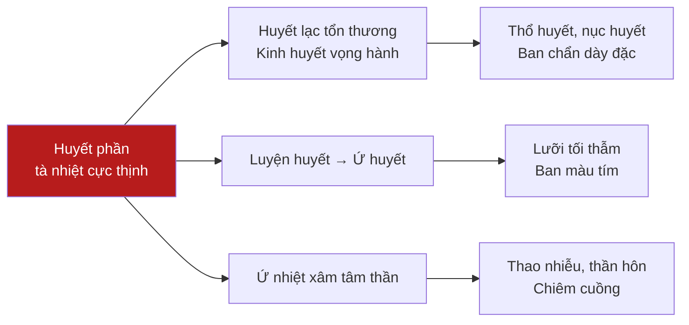
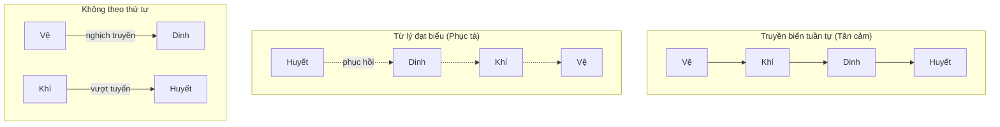

import { Aside, Tabs, TabItem } from '@astrojs/starlight/components';
import MedicalNote from '~/components/MedicalNote.astro';
import KeyPoints from '~/components/KeyPoints.astro';
import RedFlags from '~/components/RedFlags.astro';
import AlgorithmBox from '~/components/AlgorithmBox.astro';
import CompareTable from '~/components/CompareTable.astro';
import ClinicalPearl from '~/components/ClinicalPearl.astro';
import EvidenceBox from '~/components/EvidenceBox.astro';

## Mục tiêu bài giảng

Sau khi học xong, người học có thể:

1. Giải thích cơ sở lý luận của Vệ–Khí–Dinh–Huyết biện chứng (Diệp Thiên Sĩ)
2. Nhận diện 4 hội chứng Vệ/Khí/Dinh/Huyết qua **triệu chứng biện chứng yếu điểm**
3. Hiểu sơ đồ truyền biến và ứng dụng lâm sàng
4. Phân biệt Tam tiêu biện chứng (Ngô Cúc Thông) với Vệ–Khí–Dinh–Huyết

---

## Bức tranh tổng thể

<MedicalNote title="Nguồn gốc lý luận">
**Diệp Thiên Sĩ** (đời Thanh) sáng lập Vệ–Khí–Dinh–Huyết biện chứng. **Ngô Cúc Thông** phát triển Tam tiêu biện chứng. Hai hệ thống bổ sung cho nhau, không mâu thuẫn.
</MedicalNote>

---

## 1. Vệ Phần Chứng

### 1.1 Sinh lý cơ sở

Vệ khí phân bố tại **cơ biểu** — tầng ngoài nhất. Chức năng: bảo vệ cơ biểu, kháng tà, khống chế tấu lý đóng mở, điều tiết thân nhiệt.

### 1.2 Bệnh cơ

### 1.3 Triệu chứng & Biện chứng yếu điểm

<CompareTable
  headers={["Triệu chứng", "Cơ chế", "Ý nghĩa"]}
  rows={[
    ["Sốt + **hơi ố phong hàn**", "Tà uất vệ biểu, dương nhiệt ưu thế → ố hàn nhẹ, ngắn", "Phân biệt với Thương hàn (ố hàn nặng)"],
    ["**Miệng hơi khát**", "Ôn tà có thuộc tính dương nhiệt → tổn thương tân dịch nhẹ", "Phân biệt Ôn tà (khát) vs Hàn tà (không khát)"],
    ["Ho", "Phế khí thất tuyên", "Ôn tà phạm phế"],
    ["Rêu mỏng trắng, lưỡi đỏ hai rìa và chót", "Nhiệt nhẹ chưa vào sâu", "Giai đoạn sớm"],
    ["Mạch phù sắc", "Phù = tà tại biểu; Sắc = có nhiệt", ""]
  ]}
/>

<ClinicalPearl>
**Biện chứng yếu điểm**: Sốt + **hơi** ố phong hàn + miệng **hơi** khát. Chữ "hơi" quan trọng — phân biệt Vệ phần Ôn bệnh với Thương hàn (ố hàn nặng, không khát) và Khí phần (không ố hàn, khát nhiều).
</ClinicalPearl>

---

## 2. Khí Phần Chứng

### 2.1 Phạm vi rộng

Khí phần bao gồm nhiều vị trí: phế, vị, tỳ, trường, đờm, mạc nguyên, hung cách. Thể điển hình nhất: **nhiệt thịnh dương minh**.

### 2.2 Bệnh cơ — Nhiệt thịnh Dương minh

### 2.3 Bảng so sánh thể lâm sàng

<Tabs>
  <TabItem label="Nhiệt thịnh Dương minh">
    **Triệu chứng**: Tráng nhiệt · không ố hàn · ố nhiệt · mồ hôi nhiều · khát thích uống lạnh · rêu vàng khô · mạch hồng đại
    
    **Biện chứng yếu điểm**: Sốt cao + không ố hàn + khát + rêu vàng
  </TabItem>
  <TabItem label="Thấp nhiệt khí phần">
    **Triệu chứng**: Sốt (thân nhiệt bất dương nếu thấp nặng) · bụng đầy tức · rêu **nề** dơ · ít mồ hôi
    
    **Biện chứng yếu điểm**: Sốt + bụng đầy tức + **rêu nề** (dấu hiệu đặc trưng thấp nhiệt)
  </TabItem>
</Tabs>

<ClinicalPearl>
**Phân biệt thấp nhiệt**: Rêu nề (dày, dính, không khô) = thấp. Rêu khô vàng = nhiệt thuần. Thấp nhiệt: rêu vàng nề — thấp và nhiệt cùng có mặt.
</ClinicalPearl>

---

## 3. Dinh Phần Chứng

### 3.1 Bệnh cơ

Dinh phần sâu hơn — **tổn hại thực thể** chiếm ưu thế (không chỉ rối loạn chức năng như Vệ–Khí).

### 3.2 Biện chứng yếu điểm

<EvidenceBox title="Dấu hiệu đặc trưng Dinh phần — Diệp Thiên Sĩ">
"Kỳ nhiệt truyền dinh, thiết sắc tất giáng" — khi nhiệt truyền vào dinh, màu lưỡi nhất định chuyển sang **đỏ thẫm**.

→ **Lưỡi đỏ thẫm** là tiêu chí quan trọng nhất để phán đoán tà nhập dinh.
</EvidenceBox>

| Biện chứng yếu điểm | Vì sao quan trọng |
|---|---|
| Sốt cao **về đêm** | Phân biệt với Vệ phần (sốt + ố hàn) và Khí phần (sốt cao ban ngày) |
| Tâm phiền, **chiêm ngữ** | Dinh nhiệt bốc lên xâm phạm tâm thần |
| **Lưỡi đỏ thẫm** | Dấu hiệu đặc trưng nhất — cần nhớ |

---

## 4. Huyết Phần Chứng

### 4.1 Đặc điểm

Giai đoạn cuối, cực nặng. Bệnh cơ: **động huyết + hao huyết + ứ nhiệt nội trở**.

<RedFlags title="Dấu hiệu huyết phần — cấp cứu ngay">
- **Xuất huyết nhiều nơi cùng lúc**: thổ huyết + nục huyết + tiện huyết + ban chẩn dày
- **Lưỡi tối thẫm** (đen tím)
- Thần hôn, chiêm cuồng
- Đây là trạng thái nguy kịch — tiên lượng xấu nếu không can thiệp kịp thời
</RedFlags>

### 4.2 Phân biệt Dinh vs Huyết

<CompareTable
  headers={["Tiêu chí", "Dinh phần", "Huyết phần"]}
  rows={[
    ["Xuất huyết", "Chỉ ban chẩn lờ mờ (nhiệt xuyên lạc)", "Nhiều nơi, nhiều khiếu, cấp tính"],
    ["Màu lưỡi", "Đỏ thẫm", "Tối thẫm (đen tím)"],
    ["Thần chí", "Tâm phiền, chiêm ngữ nhẹ", "Thần hôn, chiêm cuồng nặng"],
    ["Mức độ", "Nặng vừa", "Nguy kịch"]
  ]}
/>

---

## 5. Truyền Biến Vệ–Khí–Dinh–Huyết

**Nhân tố ảnh hưởng truyền biến**:
- Tính chất bệnh tà (Phong nhiệt: dễ nghịch truyền; Thấp nhiệt: chậm, thấm dần)
- Lượng tà cảm thụ (nặng → truyền nhanh)
- Thể chất (âm hư: tà dễ vào sâu)
- Điều trị kịp thời/sai lầm

---

## 6. Tam Tiêu Biện Chứng

<MedicalNote title="Ngô Cúc Thông và Tam tiêu">
Ngô Cúc Thông hệ thống hóa: **Thượng tiêu** = giai đoạn đầu (phế, tâm bào) · **Trung tiêu** = giai đoạn giữa (tỳ vị) · **Hạ tiêu** = giai đoạn sau (can thận âm).
</MedicalNote>

<CompareTable
  headers={["Tam tiêu", "Tạng phủ", "Giai đoạn bệnh", "Đặc điểm"]}
  rows={[
    ["Thượng tiêu", "Phế, Tâm bào", "Sớm", "Biểu nhiệt hoặc nhiệt hãm tâm bào"],
    ["Trung tiêu", "Tỳ, Vị, Trường", "Giữa", "Dương minh thực nhiệt hoặc thấp nhiệt"],
    ["Hạ tiêu", "Can, Thận âm", "Cuối", "Âm hư phong động, hư nhiệt"]
  ]}
/>

**Truyền biến Tam tiêu**: Thượng → Trung → Hạ (nặng dần, âm tổn dần)

---

## Câu hỏi tư duy lâm sàng

1. **Bệnh nhân sốt 39°C, hơi ố lạnh, ho khan, lưỡi đỏ rìa, mạch phù sắc.** Thuộc hội chứng nào? Tại sao "hơi ố lạnh" chứ không phải "ố lạnh nặng"?

2. **Bệnh nhân sốt cao về đêm, tâm phiền, miệng khô ít khát, lưỡi đỏ thẫm không rêu.** Tà đang ở phần nào? Có nguy cơ truyền đến huyết phần khi nào?

3. **Tại sao cùng là "xuất huyết" nhưng ban chẩn ở Dinh phần khác với xuất huyết ở Huyết phần?** Giải thích theo cơ chế bệnh lý.

---

<KeyPoints title="Điểm cốt lõi cần nhớ">
- **Vệ phần**: Sốt + **hơi** ố hàn + **hơi** khát → tà mới vào, còn nông
- **Khí phần**: Sốt cao + **không** ố hàn + khát nhiều + rêu vàng → tà ở lý, chính tà kịch đấu
- **Dinh phần**: Sốt **về đêm** + tâm phiền chiêm ngữ + **lưỡi đỏ thẫm** → tổn thương thực thể
- **Huyết phần**: Xuất huyết **nhiều nơi** + **lưỡi tối thẫm** + thần hôn → nguy kịch
- Rêu nề = thấp; Rêu khô = nhiệt; Rêu vàng nề = thấp nhiệt
- Dinh–Huyết: **từ lý đạt biểu** là tốt (tà lui); **tiếp tục vào sâu** là xấu
</KeyPoints>
