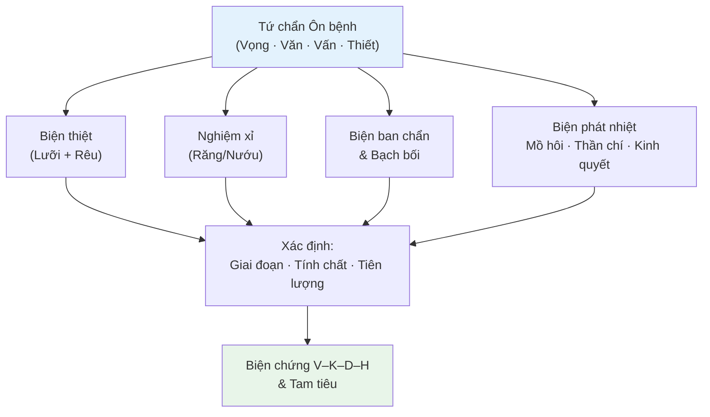
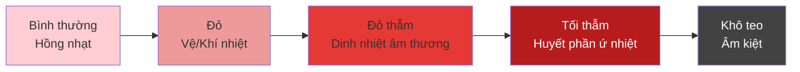
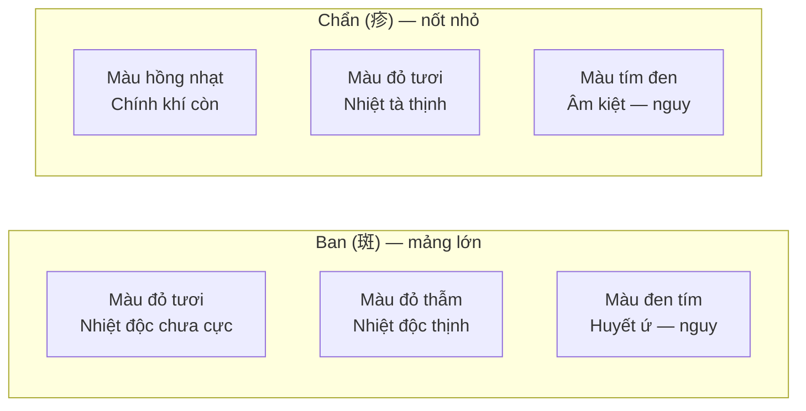
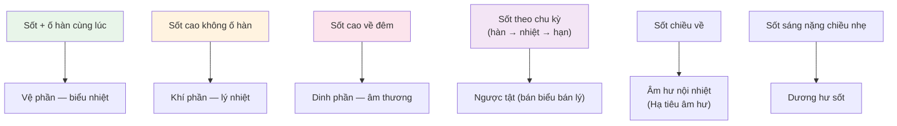
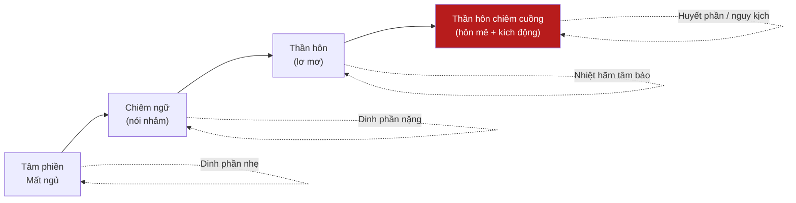

import { Aside, Tabs, TabItem } from '@astrojs/starlight/components';
import MedicalNote from '~/components/MedicalNote.astro';
import KeyPoints from '~/components/KeyPoints.astro';
import RedFlags from '~/components/RedFlags.astro';
import AlgorithmBox from '~/components/AlgorithmBox.astro';
import CompareTable from '~/components/CompareTable.astro';
import ClinicalPearl from '~/components/ClinicalPearl.astro';
import EvidenceBox from '~/components/EvidenceBox.astro';

## Mục tiêu bài giảng

1. Hiểu tại sao Ôn bệnh có phương pháp chẩn đoán **đặc thù** bên cạnh tứ chẩn thông thường
2. Ứng dụng **biện lưỡi** (chất lưỡi + rêu lưỡi) để xác định giai đoạn bệnh
3. Phân tích **ban chẩn, bạch bối** — ý nghĩa lâm sàng
4. Đọc kiểu sốt, mồ hôi, thần chí để biện chứng nhanh

---

## Bức tranh tổng thể



<MedicalNote title="Tại sao Ôn bệnh có chẩn đoán đặc thù?">
Biểu hiện lâm sàng Ôn bệnh có **tính đặc thù** — lưỡi thay đổi rất điển hình theo giai đoạn, ban chẩn xuất hiện ở một số thể bệnh, kiểu sốt và mồ hôi phản ánh vị trí tà chính. Chẩn đoán chính xác → điều trị chính xác.
</MedicalNote>

---

## 1. Biện Lưỡi (Thiệt Chẩn)

Biện lưỡi là **quan trọng nhất** trong chẩn đoán Ôn bệnh. Gồm 2 phần: **chất lưỡi** (bản chất) và **rêu lưỡi** (tình trạng khí tà).

### 1.1 Chất lưỡi — theo giai đoạn



<CompareTable
  headers={["Chất lưỡi", "Ý nghĩa", "Giai đoạn"]}
  rows={[
    ["Hồng nhạt", "Bình thường", "Trước bệnh"],
    ["Đỏ (hai rìa và chót)", "Tà tại vệ, nhiệt nhẹ", "Vệ phần"],
    ["Đỏ + rêu vàng", "Lý nhiệt tích thịnh", "Khí phần"],
    ["Đỏ thẫm, ít/không rêu", "Dinh nhiệt âm thương", "Dinh phần"],
    ["Tối thẫm (đen tím)", "Ứ nhiệt huyết phần", "Huyết phần"],
    ["Đỏ khô, teo nhỏ", "Âm kiệt, tiên lượng xấu", "Cuối bệnh"]
  ]}
/>

### 1.2 Rêu lưỡi — phản ánh tà khí

<Tabs>
  <TabItem label="Rêu mỏng trắng">
    **Ý nghĩa**: Tà tại biểu, bệnh nhẹ, giai đoạn đầu
    
    **Lâm sàng**: Vệ phần chứng — Phong nhiệt, Phong Ôn giai đoạn sớm
  </TabItem>
  <TabItem label="Rêu vàng">
    **Ý nghĩa**: Lý nhiệt, nhiệt hóa
    
    **Lâm sàng**: Khí phần chứng — nhiệt càng nặng rêu càng vàng sậm
  </TabItem>
  <TabItem label="Rêu nề (dày dính)">
    **Ý nghĩa**: Thấp tà nội trở
    
    **Lâm sàng**: Thấp nhiệt chứng — rêu nề trắng (thấp nặng) → vàng nề (nhiệt nặng dần)
  </TabItem>
  <TabItem label="Rêu cháy khô/đen">
    **Ý nghĩa**: Nhiệt cực thịnh, tân dịch kiệt
    
    **Lâm sàng**: Dương minh phủ thực, âm dịch khuy tổn nghiêm trọng
  </TabItem>
</Tabs>

<ClinicalPearl>
**Quy tắc biện rêu**: Màu (trắng→vàng = nhiệt tăng) + Độ ẩm (nhuận→khô = tân dịch giảm) + Độ dày (mỏng→nề = thấp) + Độ bám (bong = chính khí hư).
</ClinicalPearl>

---

## 2. Nghiệm Xỉ (Xem Răng và Nướu)

<MedicalNote title="Đặc thù Ôn bệnh">
Biện răng là đặc điểm riêng của Ôn bệnh học — phản ánh thận âm và vị âm tình trạng.
</MedicalNote>

| Biểu hiện răng/nướu | Ý nghĩa |
|---|---|
| Răng khô, có cặn | Vị nhiệt tổn thương tân dịch |
| Răng khô như xương khô | Thận âm kiệt (tiên lượng xấu) |
| Nướu chảy máu | Vị nhiệt bức huyết vọng hành |
| Răng long ra | Âm kiệt cực độ |

---

## 3. Biện Ban Chẩn và Bạch Bối

### 3.1 Ban chẩn (斑疹)



<CompareTable
  headers={["Đặc điểm ban chẩn", "Ý nghĩa lâm sàng"]}
  rows={[
    ["Mọc ra nhanh, rõ ràng", "Tà có cơ hội thoát ra — tốt"],
    ["Mọc ra rồi lặn ngay", "Chính khí không đẩy được tà — xấu"],
    ["Không mọc ra (kẹt lại)", "Tà hãm vào sâu — nguy hiểm"],
    ["Màu đỏ tươi đều", "Nhiệt độc còn quản lý được"],
    ["Màu tối thẫm, dày đặc", "Huyết phần ứ nhiệt — cấp cứu"]
  ]}
/>

### 3.2 Bạch bối (白㿔) — phỏng nước trắng

Bạch bối là phỏng nhỏ trắng trong trên da — đặc trưng của **thấp nhiệt** bệnh tà.

| Loại bạch bối | Ý nghĩa |
|---|---|
| Bạch bối sáng trong | Thấp nhiệt còn ở khí phần, chính khí còn |
| Bạch bối đục, teo | Thấp độc kháng thịnh, chính khí suy |
| Chỉ có bạch bối không có ban chẩn | Thấp nhiệt thuần — không vào huyết |

---

## 4. Biện Kiểu Sốt



---

## 5. Biện Mồ Hôi

<CompareTable
  headers={["Kiểu mồ hôi", "Cơ chế", "Ý nghĩa"]}
  rows={[
    ["Không/ít mồ hôi + sốt + ố hàn", "Vệ bị uất, tấu lý bế", "Vệ phần — cần giải biểu"],
    ["Mồ hôi nhiều + sốt cao + khát", "Lý nhiệt bức tân ngoại tiết", "Khí phần dương minh — cần thanh lý"],
    ["Mồ hôi nhiều đột ngột + chi lạnh", "Dương khí thoát (vong dương)", "Nguy kịch — cần cấp cứu"],
    ["Ra mồ hôi nhưng sốt không giảm", "Tà không theo hạn giải, âm tổn", "Cần xem xét thêm"],
    ["Mồ hôi đầm khi chu kỳ ngược phát", "Chính tà tương tranh xong, tà lui tạm", "Ngược tật đặc trưng"]
  ]}
/>

---

## 6. Biện Thần Chí và Kinh Quyết

### 6.1 Các mức độ rối loạn thần chí



### 6.2 Kinh quyết (co giật)

| Nguyên nhân kinh quyết | Cơ chế | Đặc điểm |
|---|---|---|
| Nhiệt thịnh động phong | Khí phần/Huyết phần nhiệt cực | Sốt cao + co giật |
| Âm hư phong động | Hạ tiêu can thận âm kiệt | Sốt không cao, co giật nhẹ, tay chân run |
| Đàm mê tâm khiếu | Đàm nhiệt nội trở | Kèm mê hoặc |

<RedFlags title="Kinh quyết + Thần hôn — cấp cứu">
- **Nhiệt hãm tâm bào**: sốt cao + thần hôn + không chiêm ngữ = tà vào thẳng tâm bào → khai khiếu gấp
- **Nội phong**: sốt cao + co giật cứng người = cần lương can tức phong ngay
- Đây là biến chứng nguy hiểm nhất của Ôn bệnh
</RedFlags>

---

## Thuật toán chẩn đoán nhanh

<AlgorithmBox title="Biện chứng nhanh Ôn bệnh">
```
BƯỚC 1 — Xem lưỡi ngay:
  Đỏ rìa + rêu trắng → Vệ phần
  Đỏ + rêu vàng khô → Khí phần
  Đỏ thẫm + ít rêu → Dinh phần
  Tối thẫm → Huyết phần

BƯỚC 2 — Hỏi kiểu sốt:
  Sốt + ố hàn → Vệ
  Sốt cao, không ố hàn → Khí
  Sốt đêm > ngày → Dinh
  Sốt chu kỳ → Ngược tật

BƯỚC 3 — Kiểm tra nguy hiểm:
  Ban chẩn đen tím → Huyết phần nguy
  Xuất huyết nhiều nơi → Huyết phần
  Thần hôn → Nhiệt hãm tâm bào
  Co giật → Nhiệt thịnh động phong

BƯỚC 4 — Xem mồ hôi:
  Không hạn + ố hàn → giải biểu
  Hạn nhiều + sốt cao → thanh lý
  Hạn đột ngột + chi lạnh → CẤP CỨU vong dương
```
</AlgorithmBox>

---

## Câu hỏi tư duy lâm sàng

1. **Bệnh nhân Ôn bệnh có lưỡi đỏ thẫm, rêu vàng nề dày.** Đây là tà ở phần nào? Tại sao có cả dấu hiệu dinh phần (lưỡi đỏ thẫm) lẫn thấp nhiệt (rêu nề)?

2. **Ban chẩn mọc ra nhanh, màu đỏ tươi, rồi tự lặn sau 1 ngày** — phân tích tiên lượng. Khác gì với ban chẩn "kẹt" không mọc ra được?

3. **Bệnh nhân sốt cao 40°C, mồ hôi đột ngột ra đầm đìa, tay chân lạnh ngắt.** Chẩn đoán gì? Xử trí ngay như thế nào theo YHCT?

---

<KeyPoints title="Điểm cốt lõi cần nhớ">
- **Lưỡi là vua** trong chẩn đoán Ôn bệnh: đỏ rìa → đỏ → đỏ thẫm → tối thẫm = bệnh nặng dần
- **Rêu nề** = thấp; **rêu khô vàng** = nhiệt; **không rêu** = âm thương
- **Ban chẩn mọc ra** = tốt (tà có lối thoát); **không mọc/đen tím** = nguy
- **Bạch bối** = đặc trưng thấp nhiệt khí phần
- Mồ hôi đột ngột + chi lạnh = VỐI DƯƠNG — ưu tiên hồi dương cứu nghịch
- Thần hôn + sốt cao = nhiệt hãm tâm bào → khai khiếu + thanh dinh ngay
</KeyPoints>
