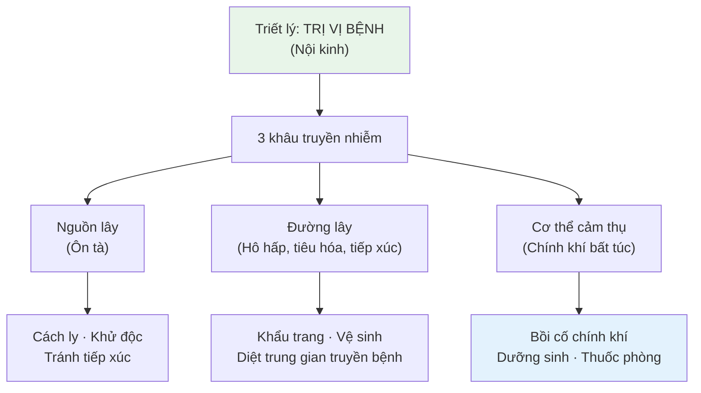
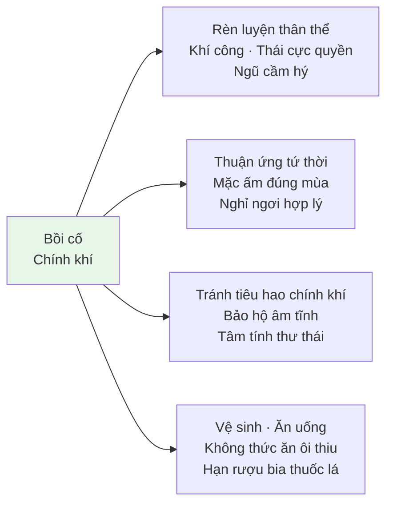

import { Aside, Tabs, TabItem } from '@astrojs/starlight/components';
import MedicalNote from '~/components/MedicalNote.astro';
import KeyPoints from '~/components/KeyPoints.astro';
import RedFlags from '~/components/RedFlags.astro';
import AlgorithmBox from '~/components/AlgorithmBox.astro';
import CompareTable from '~/components/CompareTable.astro';
import ClinicalPearl from '~/components/ClinicalPearl.astro';
import EvidenceBox from '~/components/EvidenceBox.astro';

## Mục tiêu bài giảng

1. Hiểu triết lý "Trị vị bệnh" — phòng bệnh trước khi bệnh phát
2. Nắm 3 trụ cột phòng bệnh Ôn theo YHCT
3. Biết các thuốc thường dùng dự phòng từng loại Ôn bệnh

---

## Bức tranh tổng thể



<EvidenceBox title="Nội kinh — Tư vấn phòng bệnh 2000 năm trước">
"Thánh nhân trị khi chưa có bệnh... Phàm sau khi bệnh đã thành rồi mới dùng thuốc... cũng ví như khi khát mới đào giếng, khi chiến đấu mới đúc binh khí thì chẳng muộn lắm ru!"

→ Đây là tư tưởng phòng bệnh sớm nhất trong y văn YHCT.
</EvidenceBox>

---

## 1. Bồi Cố Chính Khí

"Tà chi sở tấu, kỳ khí tất suy" — **chính khí mạnh thì tà không thể xâm nhập**.

### 1.1 Bốn phương pháp chính



<Tabs>
  <TabItem label="Rèn luyện thân thể">
    **Lựa chọn theo thể trạng và tuổi tác:**
    - **Thái cực quyền**: dưỡng sinh toàn diện, phổ biến nhất — khí huyết lưu thông, thần kinh điều hòa
    - **Khí công, Bát đoạn cẩm, Ngũ cầm hý**: luyện khí + luyện thần
    - Người cao tuổi: đi bộ chậm, dưỡng sinh nhẹ nhàng
    
    *Nguyên lý*: Vận động đúng mức → tăng cường vệ khí → tà khó xâm nhập
  </TabItem>
  <TabItem label="Bảo hộ âm tĩnh">
    Ngô Cúc Thông: "Bất tàng tinh" không chỉ là phòng lao quá độ — bao gồm **mọi sự tiêu hao tinh khí**: stress kéo dài, thức khuya, lo âu, giận dữ, làm việc quá sức.
    
    **Thực hành**: lao động + nghỉ ngơi cân bằng · tâm tính thư thái · không lo âu thái quá
  </TabItem>
  <TabItem label="Ăn uống theo mùa">
    Ứng dụng Ngũ hành vào ăn uống:
    - **Xuân** (Can): ít chua, thêm ngọt
    - **Hạ** (Tâm): thêm cay, tránh mặn và đắng
    - **Thu** (Phế): bớt cay, thêm chua
    - **Đông** (Thận): thêm đắng, tránh mặn
    
    Không ăn thức ăn ôi, tránh rượu bia, chiên xào nhiều dầu mỡ
  </TabItem>
</Tabs>

---

## 2. Kịp Thời Chặn Trị, Không Chế Lây Lan

Ba nguyên tắc y tế công cộng YHCT:

<CompareTable
  headers={["Nguyên tắc", "Biện pháp YHCT", "Tương đương hiện đại"]}
  rows={[
    ["Sớm phát hiện", "Nhận biết sớm triệu chứng ôn tà đặc trưng", "Giám sát dịch tễ"],
    ["Sớm cách ly", "Tránh tiếp xúc, mang khẩu trang (từ đời Nguyên)", "Cách ly y tế"],
    ["Sớm chặn trị", "Tiêu độc phòng ốc, không tụ tập đông người", "Kiểm soát nguồn lây"],
    ["Ngăn đường lây", "Diệt ruồi, muỗi, chuột · Vệ sinh thực phẩm", "Phòng chống vector"],
    ["Tăng miễn dịch", "Thuốc phòng ngừa (bài thuốc)", "Vaccination"]
  ]}
/>

<MedicalNote title="Lịch sử phòng dịch YHCT">
- **Đời Hán**: nhà vệ sinh công cộng, không khạc nhổ bừa bãi
- **Đời Nguyên**: khẩu trang đầu tiên (vải bịt miệng mũi khi tiếp xúc bệnh nhân)
- Khuyến khích đào giếng + uống nước nấu sôi
- Nhận biết đường lây: hô hấp, tiêu hóa, tiếp xúc, côn trùng trung gian
</MedicalNote>

---

## 3. Thuốc Dự Phòng Theo Loại Bệnh

<AlgorithmBox title="Bài thuốc dự phòng YHCT">
```
Phòng CÚM (Thời hành cảm mạo):
  Ngân hoa + Liên kiều + Dã cúc hoa + An thụ diệp + Quán chúng

Phòng VIÊM NÃO (Thử ôn):
  Đại thanh diệp + Bản lam căn + Ngưu cân thảo
  Hoặc: Tỏi + Ngân hoa + Liên kiều + Thiên lý quang

Phòng VIÊM GAN:
  Nhân trần + Nỗi đạo căn (rễ cỏ xước)

Phòng KIẾT LỊ:
  Mã xỉ hiện (rau sam) + Tỏi + Dấm ăn

Phòng THƯƠNG HÀN:
  Hoàng liên + Hoàng bá

Phòng SỞI:
  Tử thảo + Ty qua tử + Quán chúng
```
</AlgorithmBox>

<ClinicalPearl>
**Ngân hoa + Liên kiều** là cặp đôi nền tảng phòng nhiều bệnh Ôn nhiệt. Ngân hoa thanh nhiệt giải độc, Liên kiều tán kết tiêu viêm — hai vị có phổ kháng khuẩn rộng trong YHCT.
</ClinicalPearl>

---

## So sánh: Dự phòng YHCT vs Y học hiện đại

<CompareTable
  headers={["Khía cạnh", "YHCT", "Y học hiện đại"]}
  rows={[
    ["Triết lý cốt lõi", "Trị vị bệnh — tăng chính khí", "Phòng ngừa dịch tễ — kiểm soát 3 khâu"],
    ["Nâng miễn dịch", "Dưỡng sinh, khí công, thuốc bổ chính khí", "Vaccine, dinh dưỡng"],
    ["Phòng đường lây", "Vệ sinh, khẩu trang, diệt côn trùng", "Giống nhau"],
    ["Phòng đặc hiệu", "Bài thuốc phòng ngừa từng bệnh", "Vaccine đặc hiệu"],
    ["Ưu điểm YHCT", "Toàn diện (tâm–thể), rẻ, ít tác dụng phụ", ""],
    ["Hạn chế YHCT", "Chưa có bằng chứng RCT mạnh như vaccine", ""]
  ]}
/>

---

## Câu hỏi tư duy lâm sàng

1. **Tại sao "bảo hộ âm tĩnh" lại là biện pháp phòng Ôn bệnh?** Giải thích theo cơ chế chính khí–tà khí.

2. **Một bệnh nhân có âm hư thể trạng** (lưỡi đỏ, ít rêu, hay khát) — họ cần chú ý gì thêm so với người bình thường khi phòng ngừa Ôn bệnh?

3. **So sánh khẩu trang đời Nguyên và khẩu trang hiện đại** — cơ chế phòng bệnh khác nhau như thế nào? Điểm chung là gì?

---

<KeyPoints title="Điểm cốt lõi cần nhớ">
- **Trị vị bệnh** = phòng bệnh trước khi phát — triết lý 2000 năm của YHCT
- **3 khâu truyền nhiễm**: nguồn lây · đường lây · cơ thể cảm thụ → can thiệp cả 3
- **Chính khí mạnh** → tà không thể xâm nhập (hoặc bệnh nhẹ)
- Dưỡng sinh: vận động + nghỉ ngơi + tâm tĩnh + ăn đúng mùa
- Ngân hoa + Liên kiều = nền tảng phòng nhiều Ôn nhiệt bệnh
- Vệ sinh môi trường + cá nhân = điểm giao thoa quan trọng YHCT–YHHĐ
</KeyPoints>
