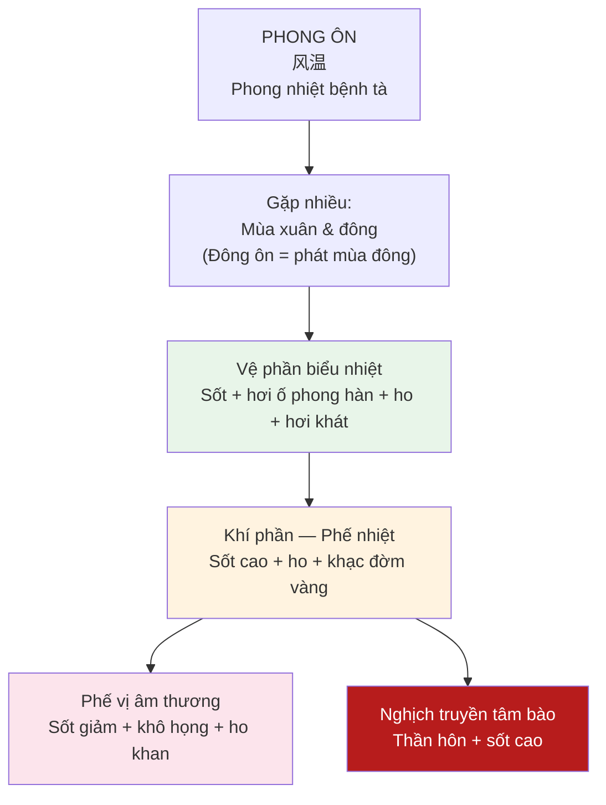
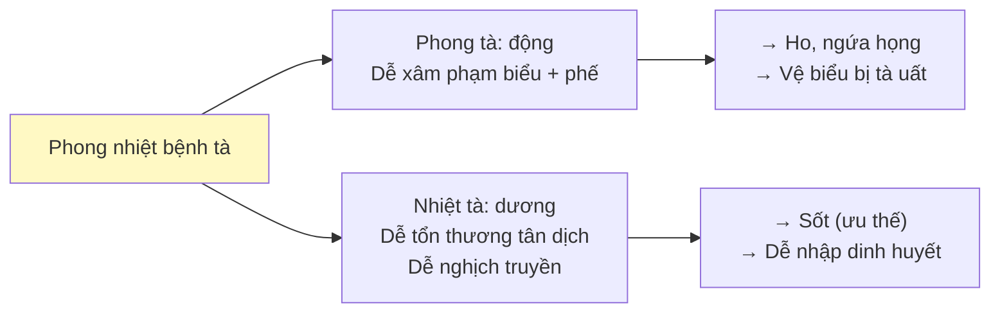
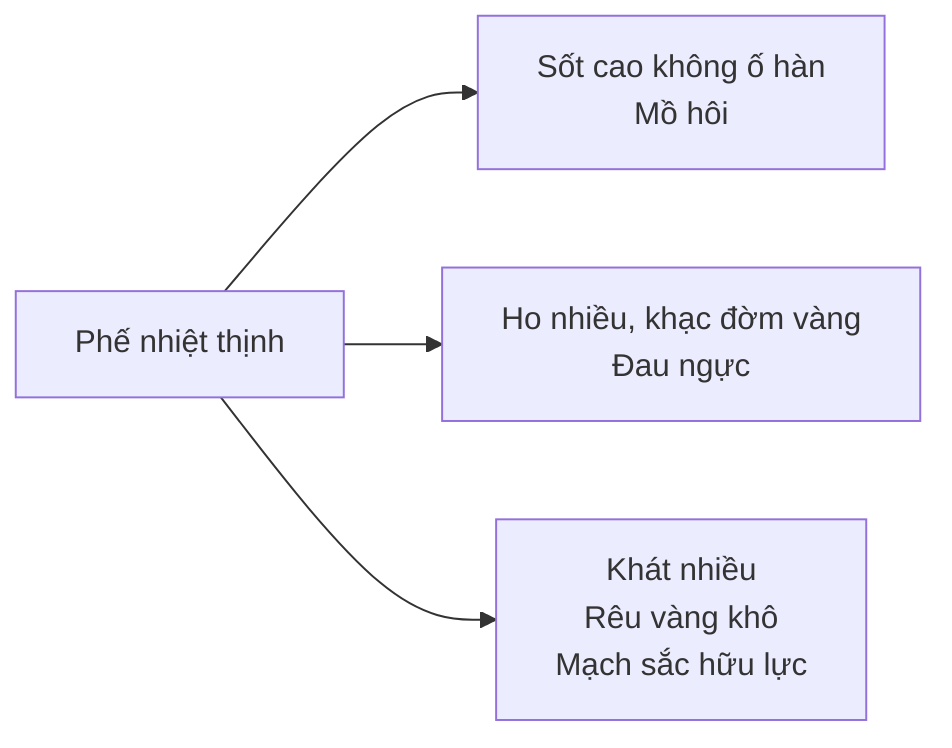
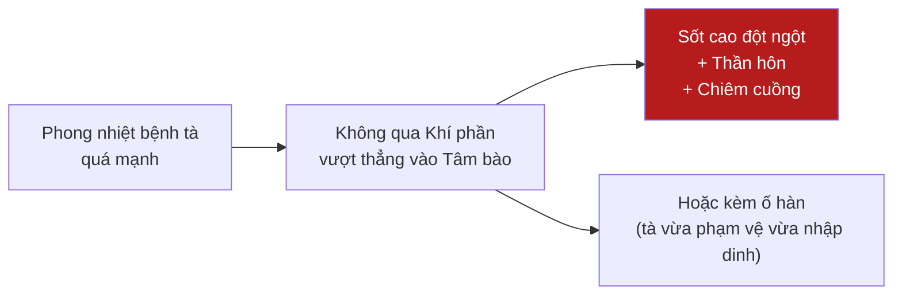

import { Aside, Tabs, TabItem } from '@astrojs/starlight/components';
import MedicalNote from '~/components/MedicalNote.astro';
import KeyPoints from '~/components/KeyPoints.astro';
import RedFlags from '~/components/RedFlags.astro';
import AlgorithmBox from '~/components/AlgorithmBox.astro';
import CompareTable from '~/components/CompareTable.astro';
import ClinicalPearl from '~/components/ClinicalPearl.astro';
import EvidenceBox from '~/components/EvidenceBox.astro';

## Mục tiêu bài giảng

1. Định nghĩa và nhận diện Phong Ôn qua triệu chứng đặc trưng
2. Phân tích diễn tiến theo giai đoạn: Vệ → Khí → Âm thương
3. Chẩn đoán phân biệt với Thương hàn và Xuân Ôn
4. Nguyên tắc điều trị theo từng giai đoạn

---

## Bức tranh tổng thể



<MedicalNote title="Tương đương Y học hiện đại">
Phong Ôn tương đương: **Viêm phổi cộng đồng**, **Cúm** (Influenza), **Viêm phế quản cấp tính do virus** — các bệnh đường hô hấp cấp tính có nhiệt tà.
</MedicalNote>

---

## 1. Khái Niệm và Bệnh Tà

**Phong Ôn** = do **phong nhiệt bệnh tà** gây ra, ngoại cảm nhiệt bệnh cấp tính, đặc trưng bởi:
- Khởi bệnh: **phế vệ biểu nhiệt chứng**
- Phát bệnh: ngay sau khi cảm tà (tân cảm — khác với phục tà Xuân Ôn)
- Mùa: xuân và đông (phát mùa đông gọi là Đông Ôn)

### Đặc điểm phong nhiệt bệnh tà



---

## 2. Diễn Tiến Lâm Sàng Theo Giai Đoạn

### 2.1 Giai đoạn 1: Vệ phần biểu nhiệt

| Triệu chứng | Cơ chế |
|---|---|
| Sốt (chủ yếu) + hơi ố phong hàn | Nhiệt ưu thế, phong hàn bị che lấp |
| Ho | Phế khí thất tuyên |
| Miệng hơi khát | Nhiệt tà tổn thương tân dịch nhẹ |
| Rêu mỏng trắng hoặc hơi vàng | Tà còn nông |
| Mạch phù sắc | Phù = biểu; Sắc = nhiệt |

<ClinicalPearl>
**Phân biệt Phong Ôn vs Phong Hàn**: Phong Ôn — sốt nặng, ố hàn nhẹ, có khát, mạch sắc. Phong Hàn — ố hàn nặng, sốt nhẹ, không khát, không đổ mồ hôi, mạch khẩn. Tóm: **sốt > ố hàn + có khát = Phong Ôn**.
</ClinicalPearl>

### 2.2 Giai đoạn 2: Khí phần — Phế nhiệt thịnh

Tà từ vệ nhập khí, tập trung ở phế:



**Biến thể lâm sàng khí phần**:

<Tabs>
  <TabItem label="Phế nhiệt thịnh">
    Sốt cao · mồ hôi · ho · khạc đờm vàng · rêu vàng
    
    **Trị**: Ma hạnh thạch cam thang — thanh tuyên phế nhiệt
  </TabItem>
  <TabItem label="Đờm nhiệt trở phế">
    Sốt · ho nhiều đờm đặc · ngực tức · khó thở · rêu vàng nề
    
    **Trị**: Thanh khí hóa đờm thang gia vị
  </TabItem>
  <TabItem label="Nhiệt kết Dương minh">
    Sốt cao · táo bón · bụng đầy · rêu vàng cháy · mạch trầm thực
    
    **Trị**: Điều vị thừa khí thang
  </TabItem>
</Tabs>

### 2.3 Giai đoạn 3: Phế vị âm thương (hồi phục)

Sau giai đoạn cấp, nhiệt dần lui nhưng **âm dịch chưa phục hồi**:

| Triệu chứng | Ý nghĩa |
|---|---|
| Sốt nhẹ hoặc không sốt | Tà nhiệt dần lui |
| Khô họng, ho khan không đờm | Phế âm hư |
| Miệng khô, khát nhẹ | Vị âm hư |
| Lưỡi đỏ nhạt, ít rêu | Âm dịch chưa phục |
| Mạch tế sắc | Âm hư |

**Trị**: Sa sâm mạch đông thang — dưỡng âm sinh tân

### 2.4 Biến chứng nguy hiểm: Nghịch truyền Tâm bào



<RedFlags title="Nghịch truyền Tâm bào — nhận diện sớm">
- Sốt cao → đột ngột thần hôn, không chiêm ngữ
- Hoặc từ biểu chứng → chuyển ngay sang hôn mê
- **Khác** với Dinh phần thông thường (tâm phiền → chiêm ngữ → thần hôn dần dần)
- Xử trí: Thanh dinh thang + An cung ngưu hoàng hoàn (khai khiếu)
</RedFlags>

---

## 3. Chẩn Đoán Phân Biệt

<CompareTable
  headers={["Tiêu chí", "Phong Ôn", "Thương Hàn", "Xuân Ôn"]}
  rows={[
    ["Bệnh tà", "Phong nhiệt (dương)", "Phong hàn (âm)", "Phong nhiệt phục lý"],
    ["Khởi bệnh", "Tân cảm, biểu nhiệt ngay", "Tân cảm, biểu hàn", "Phục tà, lý nhiệt ngay"],
    ["Sốt vs ố hàn", "Sốt > ố hàn", "Ố hàn > sốt", "Sốt + không ố hàn (lý nhiệt)"],
    ["Khát", "Có (hơi khát)", "Không", "Khát nhiều ngay từ đầu"],
    ["Lưỡi", "Đỏ rìa, rêu trắng→vàng", "Rêu trắng ướt", "Đỏ thẫm, rêu vàng ngay"],
    ["Mạch", "Phù sắc", "Phù khẩn", "Huyền sắc hoặc hoạt sắc"],
    ["Tương đương", "Cúm, viêm phổi cộng đồng", "Cảm lạnh thông thường", "Viêm màng não, nhiễm trùng huyết"]
  ]}
/>

---

## 4. Nguyên Tắc Điều Trị

<AlgorithmBox title="Điều trị Phong Ôn theo giai đoạn">
```
VỆ PHẦN:
  → Tân lương giải biểu
  → Ngân kiều tán (phong nhiệt) / Tang cúc ẩm (ho nhiều)

KHÍ PHẦN — PHẾ NHIỆT:
  → Thanh tuyên phế nhiệt
  → Ma hạnh thạch cam thang

KHÍ PHẦN — PHỦ THỰC:
  → Thông phủ tiết nhiệt
  → Điều vị thừa khí thang

NGHỊCH TRUYỀN TÂM BÀO:
  → Thanh dinh khai khiếu
  → Thanh dinh thang + An cung ngưu hoàng hoàn

ÂM THƯƠNG HỒI PHỤC:
  → Dưỡng âm sinh tân
  → Sa sâm mạch đông thang
```
</AlgorithmBox>

<ClinicalPearl>
**Nguyên tắc vàng**: Phong Ôn **tuyệt đối không dùng thuốc ôn tán** (Quế chi thang, Ma hoàng thang) dù có ố hàn. Vì tà là nhiệt — ôn tán sẽ làm tà truyền vào sâu, gây biến chứng nặng.
</ClinicalPearl>

---

## Câu hỏi tư duy lâm sàng

1. **Bệnh nhân sốt 38.5°C, ố lạnh nhẹ, ho khan, miệng hơi khát, rêu trắng mỏng, mạch phù sắc.** Chẩn đoán và điều trị theo YHCT? Tại sao không dùng Quế chi thang?

2. **Trong Phong Ôn, tại sao "nghịch truyền tâm bào" nguy hiểm hơn "thuận truyền khí phần"?** So sánh cơ chế và tốc độ diễn tiến.

3. **Bệnh nhân sau 1 tuần Phong Ôn: sốt giảm, ho khan còn, miệng khô, lưỡi đỏ ít rêu.** Đây là giai đoạn nào? Điều trị tiếp theo?

---

<KeyPoints title="Điểm cốt lõi cần nhớ">
- **Phong nhiệt bệnh tà** → phạm phế kinh + vệ biểu → Phong Ôn
- Khởi bệnh: **Sốt > ố hàn** + ho + hơi khát (khác Thương hàn: ố hàn > sốt)
- Diễn tiến: Vệ → Khí (phế nhiệt) → Âm thương (hồi phục)
- Biến chứng nguy: **Nghịch truyền Tâm bào** — nhảy qua khí phần vào thẳng tâm bào
- **KHÔNG dùng ôn tán** dù bệnh nhân có ố lạnh
- Tương đương YHHĐ: cúm, viêm phổi cộng đồng, viêm phế quản cấp
</KeyPoints>
