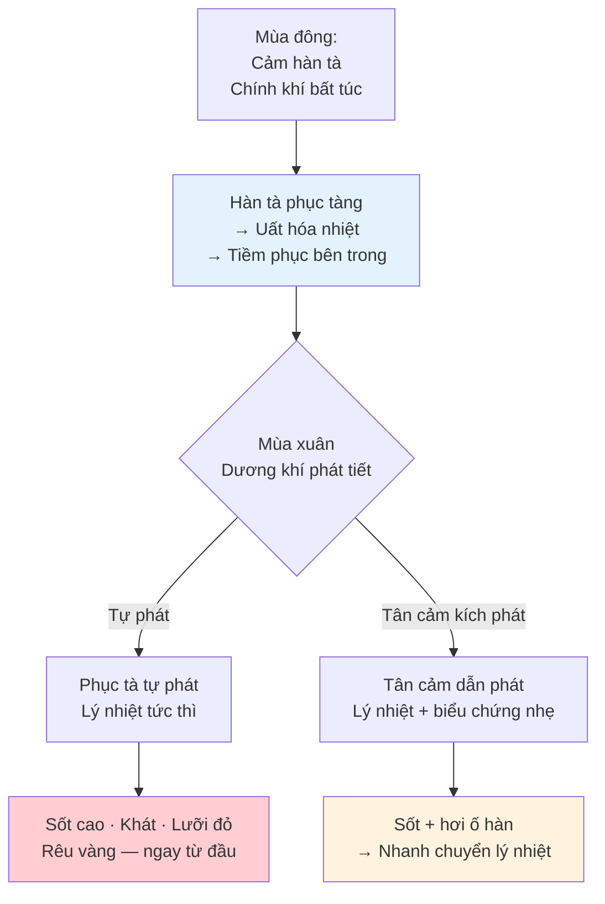
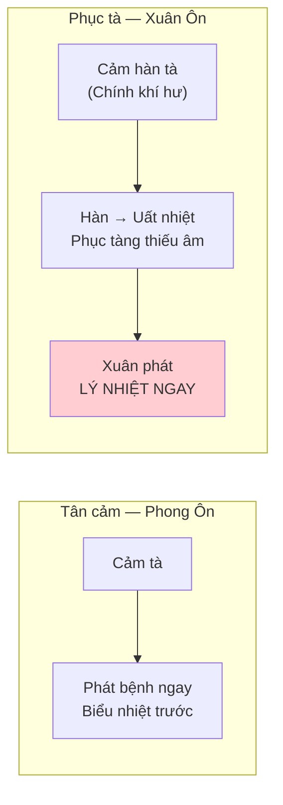
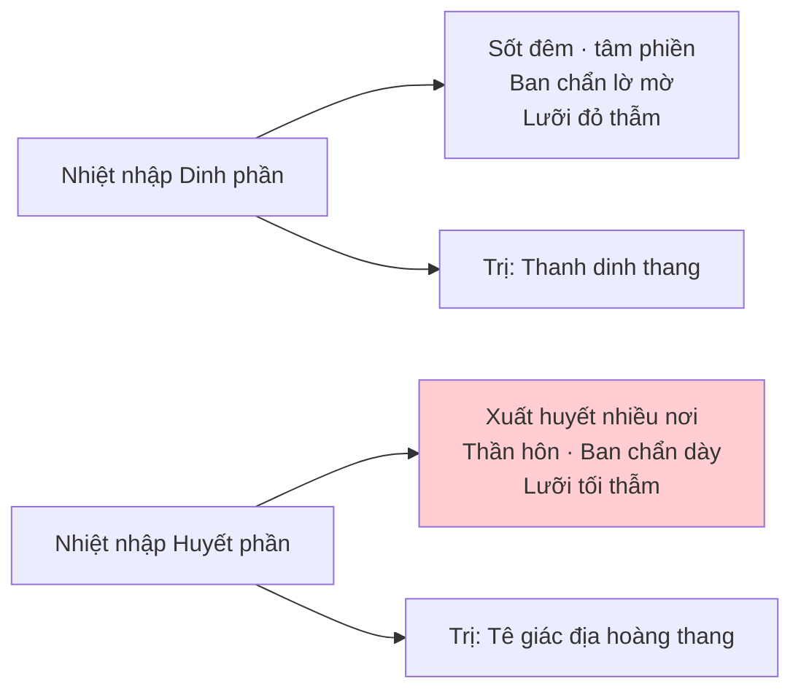

import { Aside, Tabs, TabItem } from '@astrojs/starlight/components';
import MedicalNote from '~/components/MedicalNote.astro';
import KeyPoints from '~/components/KeyPoints.astro';
import RedFlags from '~/components/RedFlags.astro';
import AlgorithmBox from '~/components/AlgorithmBox.astro';
import CompareTable from '~/components/CompareTable.astro';
import ClinicalPearl from '~/components/ClinicalPearl.astro';
import EvidenceBox from '~/components/EvidenceBox.astro';

## Mục tiêu bài giảng

1. Hiểu cơ chế phục tà — tại sao Xuân Ôn **khởi phát với lý nhiệt** (khác Phong Ôn)
2. Phân biệt hai thể: phục tà tự phát vs tân cảm dẫn phát
3. Nhận diện các hội chứng chính và biến chứng nguy hiểm
4. Nắm nguyên tắc điều trị: thanh lý nhiệt là chủ

---

## Bức tranh tổng thể

<MedicalNote title="Tương đương Y học hiện đại">
Xuân Ôn tương đương: **Dịch viêm màng não (viêm màng não tủy cầu)**, **Viêm não Nhật Bản**, **Nhiễm trùng huyết cấp**, **Dịch cúm nặng** — các bệnh nhiễm khuẩn cấp tính nặng phát vào mùa xuân.
</MedicalNote>

---

## 1. Cơ Chế Phục Tà — Điểm Khác Biệt Cốt Lõi

<EvidenceBox title="Nội kinh — Cơ sở lý luận Xuân Ôn">
"Đông thương ư hàn, xuân tất ôn bệnh" — Mùa đông cảm hàn tà chưa phát, đến mùa xuân tất nhiên là ôn bệnh.
</EvidenceBox>

**Hậu quả**: Xuân Ôn **không có giai đoạn vệ phần** (hoặc rất ngắn) → Bệnh nhân đến khám đã ở khí phần hoặc dinh phần → **Bệnh nặng hơn Phong Ôn ngay từ đầu**.

---

## 2. Hai Thể Khởi Phát

<CompareTable
  headers={["Thể", "Triệu chứng khởi phát", "Cơ chế"]}
  rows={[
    ["Phục tà tự phát", "Đột nhiên sốt cao · khát · tâm phiền · lưỡi đỏ rêu vàng ngay", "Phục nhiệt tự bùng phát khi dương khí mùa xuân phát tiết"],
    ["Tân cảm dẫn phát", "Sốt + hơi ố hàn + đau đầu (ngắn) → nhanh chuyển lý nhiệt", "Tân cảm mùa xuân kích phát phục nhiệt bên trong"]
  ]}
/>

---

## 3. Các Hội Chứng Chính

### 3.1 Khí phần uất nhiệt

<Tabs>
  <TabItem label="Nhiệt uất Đởm phủ">
    **Triệu chứng**: Sốt cao · miệng đắng · khát · nôn khan · tâm phiền · ngực sườn khó chịu · rêu vàng · mạch huyền sắc
    
    **Trị**: Hoàng cầm thang gia Đậu xỉ, Huyền sâm — khổ hàn thanh nhiệt + tuyên uất
  </TabItem>
  <TabItem label="Nhiệt chước Hung cách">
    **Triệu chứng**: Sốt (không cao) · bực bội đứng ngồi không yên · buồn nôn · lưỡi đỏ rêu hơi vàng
    
    **Trị**: Chi tử xỉ thang — thanh tuyên uất nhiệt hung cách
  </TabItem>
  <TabItem label="Lý nhiệt tích thịnh">
    **Triệu chứng**: Sốt liên tục · phiền thao bất an · môi khô họng táo · khát · táo bón · rêu vàng · mạch hoạt sắc
    
    **Trị**: Lương cách tán — thanh tiết hung cách tà nhiệt
  </TabItem>
</Tabs>

### 3.2 Biểu hàn lý nhiệt (Thể tân cảm dẫn phát)

**Triệu chứng**: Sốt + ố hàn + đầu gáy cứng đau + bụng trướng + táo bón + rêu vàng táo

**Cơ chế**: Vệ biểu bị hàn vây + phục nhiệt bên trong → biểu hàn lý nhiệt đồng thời

**Trị**: Sơ giải biểu hàn + thanh nhiệt thông phủ — Tăng tổn song giải tán

### 3.3 Dương minh tích nhiệt

<CompareTable
  headers={["Hội chứng", "Triệu chứng đặc trưng", "Phương trị"]}
  rows={[
    ["Nhiệt tích tân thương", "Sốt cao · mồ hôi · mặt đỏ · khát uống lạnh · rêu vàng khô · mạch hồng đại", "Bạch hổ thang gia Huyền sâm, Mạch đông"],
    ["Nhiệt thịnh động phong", "Sốt cao · phiền thao · co giật · cổ gáy cứng · lưỡi đỏ rêu vàng", "Linh giác câu đẳng thang gia vị"],
    ["Nhiệt kết Trường phủ", "Sốt · bụng đầy · táo bón · rêu cháy khô · mạch trầm tế", "Tăng dịch thừa khí thang"]
  ]}
/>

### 3.4 Nhiệt thiêu Dinh–Huyết

---

## 4. Biến Chứng Nguy Hiểm

<RedFlags title="Xuân Ôn — 3 biến chứng nguy kịch">
**1. Bạo phát** (một số thể viêm màng não): Sơ khởi đã xuất hiện ngay ban chẩn + thần hôn + kinh quyết → Không có giai đoạn nhẹ → Tử vong nhanh nếu không cấp cứu

**2. Nhiệt thịnh động phong**: Sốt cao + co giật cứng người + cổ gáy cứng đơ = viêm màng não tủy → Lương can tức phong cấp

**3. Tà hãm chính suy**: Nhiệt độc nội hãm + khí âm hao kiệt + vong dương hư thoát → Phò chính cố thoát cấp
</RedFlags>

---

## 5. Phân Biệt Xuân Ôn vs Phong Ôn

<CompareTable
  headers={["Tiêu chí", "Xuân Ôn", "Phong Ôn"]}
  rows={[
    ["Cơ chế", "Phục tà (hàn uất hóa nhiệt từ mùa đông)", "Tân cảm phong nhiệt"],
    ["Khởi bệnh", "Lý nhiệt ngay (không có giai đoạn vệ phần)", "Biểu nhiệt trước (vệ phần)"],
    ["Sốt", "Sốt cao + không ố hàn ngay (hoặc ố hàn rất ngắn)", "Sốt + hơi ố hàn"],
    ["Khát", "Khát nhiều ngay từ đầu", "Hơi khát"],
    ["Lưỡi", "Đỏ thẫm, rêu vàng ngay", "Đỏ rìa, rêu mỏng trắng→vàng"],
    ["Mức độ nặng", "Nặng hơn, biến hóa nhanh", "Nhẹ hơn, diễn tiến tuần tự"],
    ["Tương đương", "Viêm não, viêm màng não, nhiễm trùng huyết", "Viêm phổi, cúm"]
  ]}
/>

---

## Câu hỏi tư duy lâm sàng

1. **Tại sao Xuân Ôn và Phong Ôn đều phát vào mùa xuân nhưng Xuân Ôn nặng hơn?** Giải thích theo cơ chế phục tà vs tân cảm.

2. **Bệnh nhân đột nhiên sốt 40°C, đau đầu dữ dội, cổ gáy cứng, buồn nôn, lưỡi đỏ thẫm rêu vàng.** Chẩn đoán? Xử trí ưu tiên?

3. **Trong Xuân Ôn "tân cảm dẫn phát", bệnh nhân có cả biểu hàn (ố hàn, đau đầu) lẫn lý nhiệt (táo bón, rêu vàng).** Tại sao không dùng ôn tán để giải biểu hàn?

---

<KeyPoints title="Điểm cốt lõi cần nhớ">
- **Phục tà** = hàn uất hóa nhiệt phục tàng → Xuân phát → **lý nhiệt ngay từ đầu** (không có vệ phần)
- Khác Phong Ôn: Xuân Ôn bệnh nặng hơn, không có giai đoạn nhẹ ban đầu
- Hai thể: **Phục tà tự phát** (lý nhiệt thuần) và **Tân cảm dẫn phát** (biểu hàn + lý nhiệt)
- Biến chứng nguy: nhiệt thịnh động phong · bạo phát · tà hãm chính suy
- Điều trị chủ yếu: **thanh tiết lý nhiệt** + cố hộ âm dịch (đừng quên âm đã tổn từ đầu)
- Không dùng ôn tán kể cả khi có biểu hàn (sẽ làm tà vào sâu hơn)
</KeyPoints>
