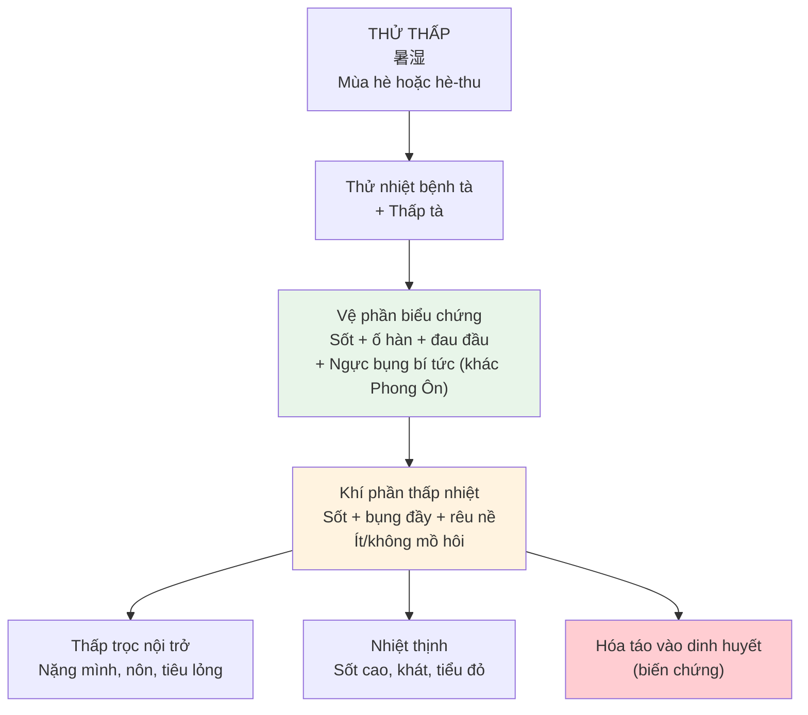
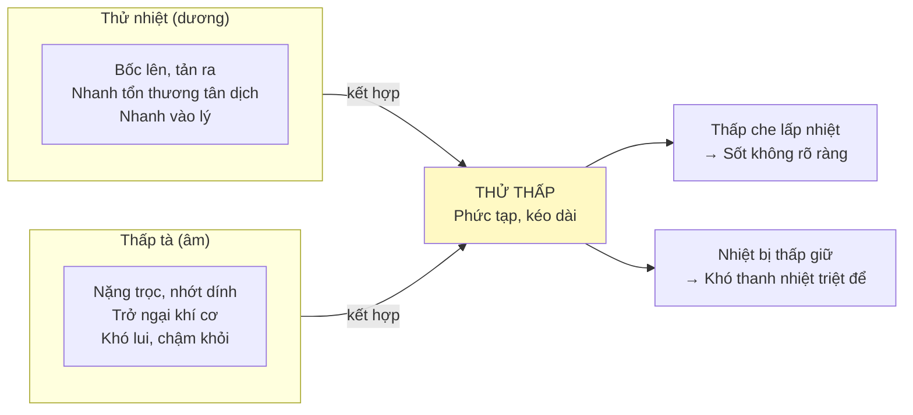
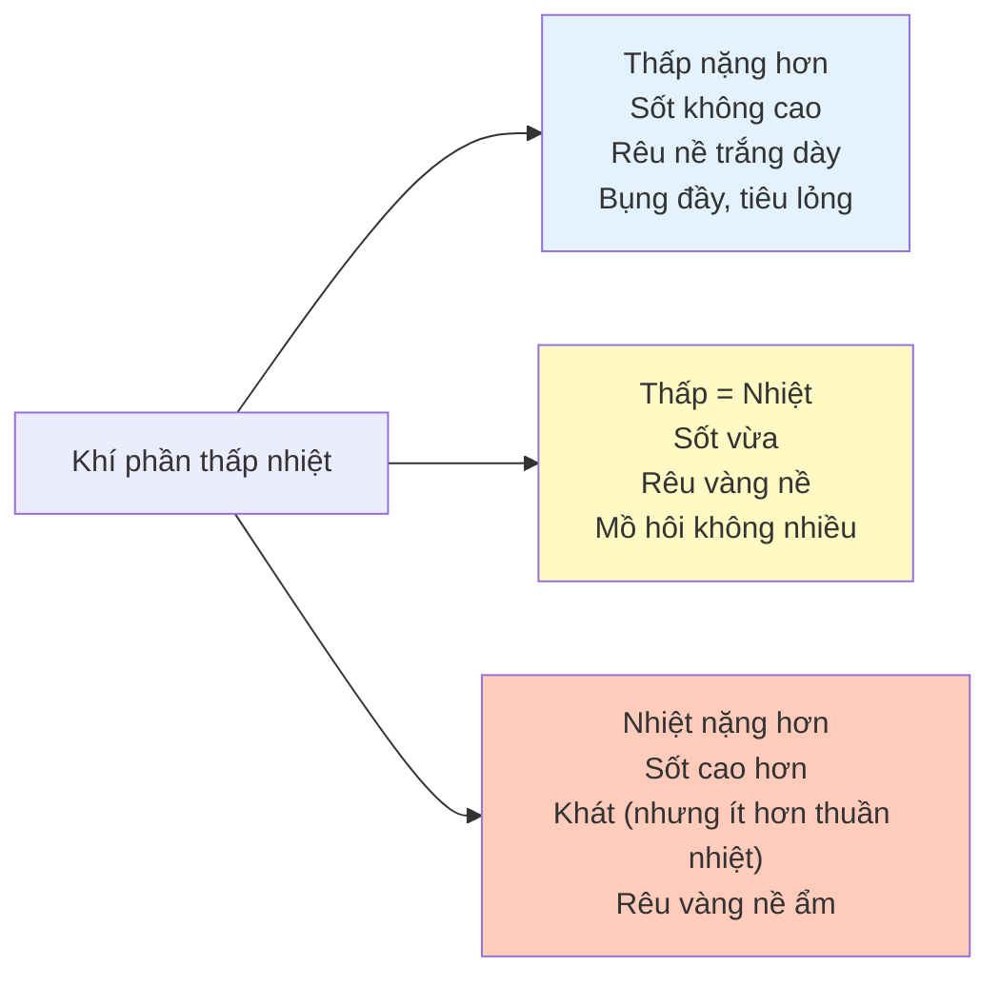
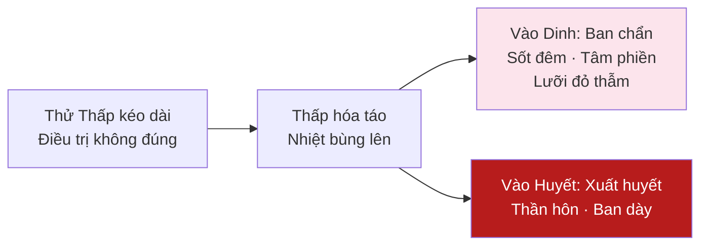
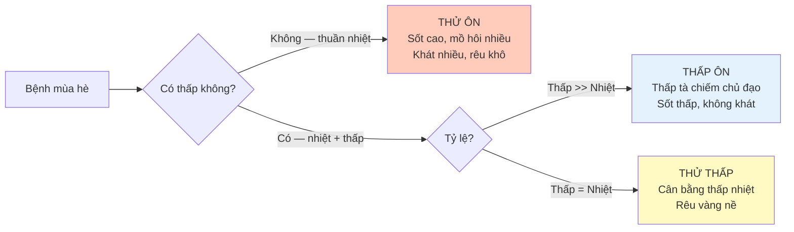

import { Aside, Tabs, TabItem } from '@astrojs/starlight/components';
import MedicalNote from '~/components/MedicalNote.astro';
import KeyPoints from '~/components/KeyPoints.astro';
import RedFlags from '~/components/RedFlags.astro';
import AlgorithmBox from '~/components/AlgorithmBox.astro';
import CompareTable from '~/components/CompareTable.astro';
import ClinicalPearl from '~/components/ClinicalPearl.astro';
import EvidenceBox from '~/components/EvidenceBox.astro';

## Mục tiêu bài giảng

1. Hiểu bản chất "thử + thấp" — tại sao hai tà kết hợp gây bệnh phức tạp hơn
2. Phân biệt Thử Thấp với Thử Ôn (thuần nhiệt) và Thấp Ôn (thuần thấp)
3. Nhận diện các hội chứng theo giai đoạn: vệ phần → khí phần (thấp nhiệt) → biến chứng
4. Nắm nguyên tắc điều trị: thanh thử + hóa thấp (không thể thiếu một trong hai)

---

## Bức tranh tổng thể



<MedicalNote title="Tương đương Y học hiện đại">
Thử Thấp tương đương: **Say nắng** (Heat stroke), **Say nóng + mất nước** (Heat exhaustion), **Viêm dạ dày ruột mùa hè**, **Nhiễm khuẩn tiêu hóa mùa hè** — bệnh mùa hè kết hợp nhiệt và độ ẩm cao.
</MedicalNote>

---

## 1. Bản Chất Thử Thấp — "Hai Tà Phối Hợp"



<ClinicalPearl>
**Nghịch lý Thử Thấp**: Thấp che lấp nhiệt → thân nhiệt không cao như Thử Ôn thuần nhiệt, nhưng bệnh lại kéo dài hơn và khó điều trị hơn vì **thấp và nhiệt cần hai phương pháp trị khác nhau** (thanh nhiệt làm hại thấp, táo thấp làm hại tân dịch).
</ClinicalPearl>

---

## 2. Giai Đoạn Khởi Phát — Vệ Phần

| Triệu chứng | Cơ chế | Phân biệt với Phong Ôn |
|---|---|---|
| Sốt + hơi ố hàn | Vệ biểu bị tà uất | Giống Phong Ôn |
| **Đau đầu, thân nặng nề** | Thấp tà uất trở kinh lạc | Đặc trưng có thấp |
| **Ngực bụng bí tức, muốn nôn** | Thấp trở trung tiêu | Không có ở Phong Ôn |
| **Rêu trắng nề** | Thấp nội trở | Phong Ôn: rêu mỏng trắng |
| Mạch nhu hoặc phù nhu | Có thấp | Phong Ôn: mạch phù sắc |

---

## 3. Giai Đoạn Khí Phần — Thấp Nhiệt

Giai đoạn chính của Thử Thấp. Thấp và nhiệt tranh nhau — **mức độ thấp/nhiệt thiên thịnh** quyết định biểu hiện lâm sàng:



### Biểu hiện lâm sàng điển hình

<CompareTable
  headers={["Triệu chứng", "Thử Thấp", "Thử Ôn (thuần nhiệt)","Thấp Ôn (thuần thấp)"]}
  rows={[
    ["Sốt", "Trung bình, ít mồ hôi", "Cao, mồ hôi nhiều", "Thấp, thân nhiệt bất dương"],
    ["Khát", "Khát nhưng uống ít", "Khát nhiều, uống lạnh", "Miệng không khát"],
    ["Bụng", "Đầy tức vừa", "Ít", "Đầy tức rõ, buồn nôn"],
    ["Rêu lưỡi", "Vàng nề (ẩm)", "Vàng khô", "Trắng hoặc vàng nề dày"],
    ["Mạch", "Nhu sắc hoặc hoạt", "Hồng đại hoặc hoạt sắc", "Nhu hoãn"],
    ["Thân thể", "Nặng nề vừa", "Không nặng", "Rất nặng nề, uể oải"]
  ]}
/>

---

## 4. Biến Chứng Quan Trọng

### 4.1 Thử Thấp hóa táo → Vào dinh huyết

Thấp tà theo thời gian có thể hóa táo hóa hỏa, nhiệt bùng lên vào dinh huyết:



### 4.2 Khí âm lưỡng hư (giai đoạn hồi phục)

Sau Thử Thấp cấp: **cả khí lẫn âm đều suy** → Khác với Phong Ôn chỉ âm thương.

| Triệu chứng | Ý nghĩa |
|---|---|
| Mệt mỏi, lười nói | Khí hư |
| Miệng khô, khát nhẹ | Âm thương |
| Chán ăn, bụng đầy nhẹ | Tỳ vị chưa phục |
| Lưỡi đỏ nhạt, ít rêu | Khí âm lưỡng hư |

**Trị**: Ích khí dưỡng âm — Sa sâm gia vị + Đảng sâm, Hoàng kỳ

<RedFlags title="Thử Thấp — Dấu hiệu nguy hiểm">
- Sốt đột ngột tăng cao + xuất hiện ban chẩn = thấp hóa táo vào huyết
- Thần hôn + sốt cao = tà nhập tâm bào
- Mồ hôi đột ngột ra nhiều + chi lạnh = vong dương do thử tổn khí âm
- Nôn tiêu chảy dữ dội + mất nước = cần bù dịch gấp
</RedFlags>

---

## 5. Nguyên Tắc Điều Trị

<AlgorithmBox title="Điều trị Thử Thấp — Nguyên tắc song song">
```
NGUYÊN TẮC CỐT LÕI:
  Thanh thử + Hóa thấp — không thể thiếu một

VỆ PHẦN:
  → Thanh thử hóa thấp giải biểu
  → Tân gia Hương nhu ẩm

KHÍ PHẦN — THẤP TRỌNG:
  → Táo thấp hóa trọc
  → Tam nhân thang, Hoắc phác hạ linh thang

KHÍ PHẦN — NHIỆT TRỌNG:
  → Thanh thử tiết nhiệt + hóa thấp
  → Bạch hổ gia Thương truật thang

KHÍ PHẦN — THẤP NHIỆT CÂN BẰNG:
  → Thanh nhiệt lợi thấp
  → Cam lộ tiêu độc đan

VÀO DINH HUYẾT:
  → Thanh dinh lương huyết
  → Thanh dinh thang / Tê giác địa hoàng thang

HỒI PHỤC:
  → Ích khí dưỡng âm
  → Sa sâm mạch đông thang gia Đảng sâm, Hoàng kỳ
```
</AlgorithmBox>

<ClinicalPearl>
**Bạch hổ gia Thương truật**: Bạch hổ thang (thanh nhiệt khí phần) + Thương truật (táo thấp) = điều trị Thử Thấp nhiệt trọng hiệu quả. Đây là công thức cổ điển kết hợp hai hướng điều trị không thể thiếu.
</ClinicalPearl>

---

## 6. Phân Biệt Thử Thấp, Thử Ôn, Thấp Ôn



---

## Câu hỏi tư duy lâm sàng

1. **Tại sao Thử Thấp khó điều trị hơn Thử Ôn thuần nhiệt?** Giải thích theo tính chất hai tà và mâu thuẫn trong trị liệu.

2. **Bệnh nhân mùa hè: sốt 38°C (không cao), ngực bụng đầy tức, buồn nôn, thân nặng nề, rêu vàng nề, mạch nhu sắc.** Chẩn đoán? Tại sao không dùng Bạch hổ thang?

3. **Bệnh nhân Thử Thấp đang điều trị ngày 5, đột nhiên xuất hiện ban chẩn và sốt tăng vọt.** Giải thích cơ chế? Điều chỉnh điều trị như thế nào?

---

<KeyPoints title="Điểm cốt lõi cần nhớ">
- **Thử + Thấp** = hai tà kết hợp → phức tạp hơn, kéo dài hơn thuần nhiệt
- Dấu hiệu đặc trưng có thấp: **thân nặng nề + bụng đầy + rêu nề + ít mồ hôi**
- **Không phải nhiệt cao = bệnh nhẹ** — thấp che nhiệt, sốt thấp nhưng bệnh có thể nặng
- Điều trị: **Thanh thử + Hóa thấp đồng thời** — thiếu một là không đủ
- Kinh điển: Bạch hổ gia Thương truật thang (nhiệt trọng), Tam nhân thang (thấp trọng)
- Tương đương YHHĐ: say nắng, say nóng, tiêu chảy mùa hè, bệnh nhiễm khuẩn mùa hè ẩm
</KeyPoints>
