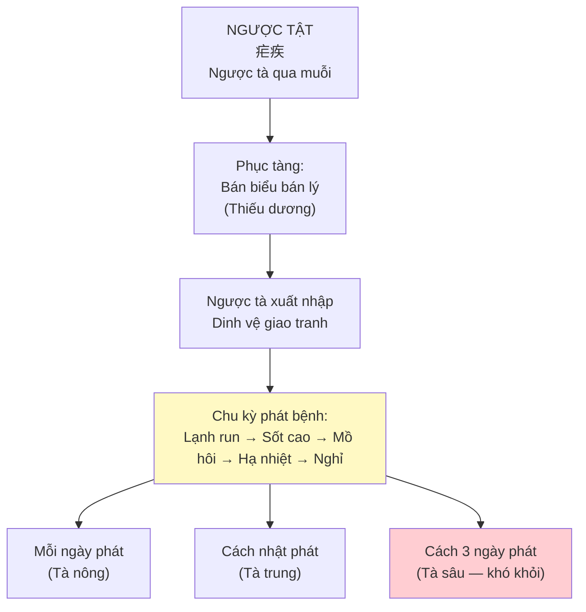
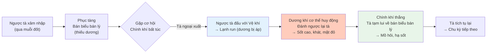
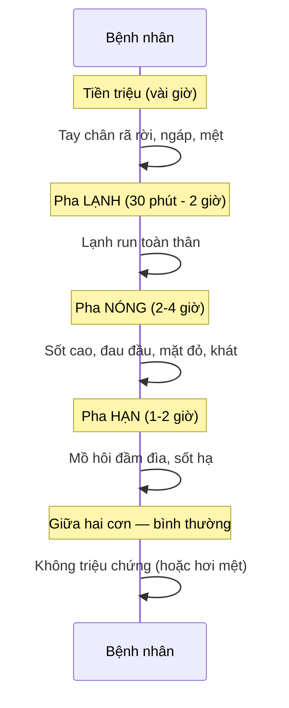
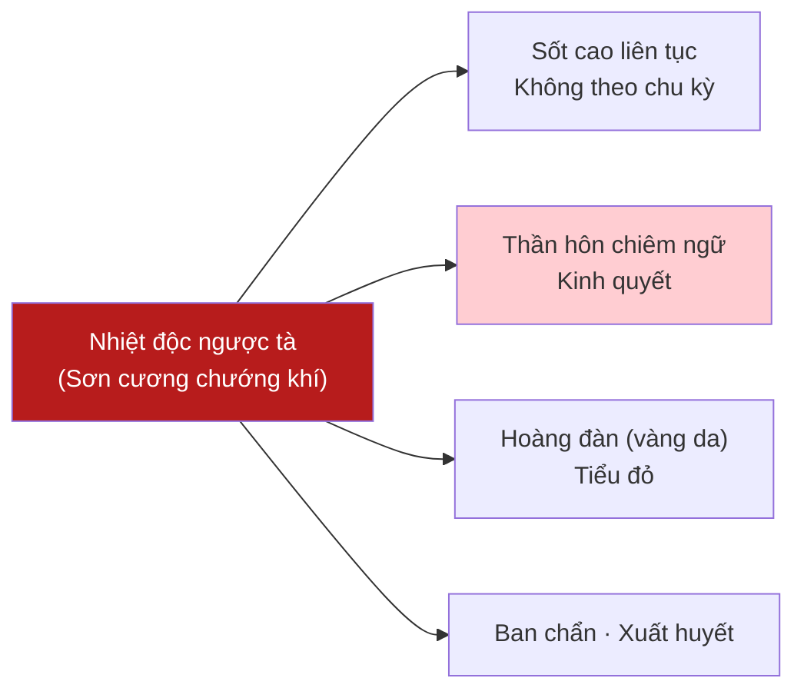

import { Aside, Tabs, TabItem } from '@astrojs/starlight/components';
import MedicalNote from '~/components/MedicalNote.astro';
import KeyPoints from '~/components/KeyPoints.astro';
import RedFlags from '~/components/RedFlags.astro';
import AlgorithmBox from '~/components/AlgorithmBox.astro';
import CompareTable from '~/components/CompareTable.astro';
import ClinicalPearl from '~/components/ClinicalPearl.astro';
import EvidenceBox from '~/components/EvidenceBox.astro';

## Mục tiêu bài giảng

1. Hiểu cơ chế "ngược tà phục bán biểu bán lý" tạo ra chu kỳ hàn–nhiệt đặc trưng
2. Phân biệt 6 thể lâm sàng Ngược Tật
3. Nhận diện biến chứng nặng: Chứng Ngược (Nhiệt chương, Lãn chương)
4. Hiểu nguyên tắc điều trị: khứ tà tiết ngược + phò chính

---

## Bức tranh tổng thể



<MedicalNote title="Tương đương Y học hiện đại">
Ngược Tật = **Sốt rét (Malaria)** — do ký sinh trùng Plasmodium truyền qua muỗi Anopheles. Đây là một trong số ít bệnh YHCT có tương đương chính xác 1:1 với YHHĐ, cả hai cùng nhận ra đặc điểm **chu kỳ hàn–nhiệt**.
</MedicalNote>

---

## 1. Cơ Chế Sinh Bệnh — Tại Sao Có Chu Kỳ?



<ClinicalPearl>
**"Vệ khí tương ly, cố bệnh đặc hựu"** (Tố vấn) — Vệ khí và tà khí phân ly thì bệnh tạm nghỉ; tụ hội lại thì bệnh tái phát. Đây giải thích hoàn toàn cơ chế chu kỳ của Ngược Tật.
</ClinicalPearl>

---

## 2. Triệu Chứng Điển Hình — Chính Ngược

Thể cơ bản nhất: **Chính Ngược** (tà phục thiếu dương, không thiên hàn thiên nhiệt)



**Lưỡi**: đỏ, rêu mỏng trắng (hàn vừa) hoặc mỏng vàng (nhiệt nặng) · **Mạch**: huyền (đặc trưng ngược tật)

---

## 3. Phân Biệt 6 Thể Lâm Sàng

<CompareTable
  headers={["Thể", "Đặc điểm nổi bật", "Cơ chế", "Phương trị chính"]}
  rows={[
    ["Chính Ngược", "Hàn và nhiệt cân bằng, chu kỳ đều", "Tà phục thiếu dương", "Tiểu sài hồ thang gia Thường sơn, Bình lang"],
    ["Ôn Ngược", "Nhiệt >> Hàn (hoặc chỉ nhiệt)", "Thể dương thịnh, thử nhiệt nội uẩn", "Bạch hổ gia Quế chi thang"],
    ["Thử Ngược", "Hàn nhẹ nhiệt nặng + thấp", "Thử nhiệt kèm thấp", "Hào cầm thanh đởm thang gia vị"],
    ["Thấp Ngược", "Sốt không cao + thân nặng + bụng đầy", "Thấp nhiệt nội uẩn", "Hậu phác Thảo quả thang"],
    ["Hàn Ngược", "Hàn >> Nhiệt (hoặc chỉ hàn)", "Thể dương hư, hàn tà kiêm cảm", "Sài hồ quế khương thang"],
    ["Chứng Ngược (Nhiệt chương)", "Sốt cao liên tục, thần hôn, nguy", "Sơn cương nhiệt độc ngược tà", "Thanh chương thang (xem phần 4)"]
  ]}
/>

---

## 4. Biến Chứng Nguy Hiểm — Chứng Ngược

Chứng Ngược = **Ngược tật thể ác tính** (Sốt rét ác tính), do ngược tà nhiệt độc mạnh phát tại vùng rừng núi.

### 4.1 Nhiệt Chương (Thể nhiệt độc)



<RedFlags title="Nhiệt Chương — Cấp cứu ngay">
- **Sốt cao liên tục** (không có giữa hai cơn bình thường)
- Thần hôn + kinh quyết = nhiệt độc hãm tâm bào
- Vàng da + tiểu đỏ = nhiệt độc bức huyết vọng hành
- **Tỷ lệ tử vong cao nhất trong ngược tật** — cần kết hợp YHHĐ (artemisinin/quinine) ngay
</RedFlags>

### 4.2 Lão Ngược và Ngược Mẫu

<Tabs>
  <TabItem label="Lão Ngược">
    **Định nghĩa**: Ngược tật lâu ngày không khỏi, hao thương khí huyết, phát khi mệt nhọc
    
    **Triệu chứng**: Hàn nhiệt lúc phát lúc không · sắc mặt nhợt · uể oải · lách to · lưỡi nhạt bệu · mạch tế nhược
    
    **Trị**: Bổ ích chính khí + khứ tà — Khứ lao thang hợp Hà nhân ẩm
  </TabItem>
  <TabItem label="Ngược Mẫu">
    **Định nghĩa**: Ngược lâu ngày → khí huyết ứ trệ → **u lách** (bĩ khối)
    
    **Triệu chứng**: Hạ sườn trái có khối cứng · đau trướng · sắc mặt u tối · lưỡi có ứ ban · mạch huyền sáp
    
    **Trị**: Dịch đàm tán ứ + tiết ngược tiêu tích — Miết giáp tiễn hoàn gia vị
  </TabItem>
</Tabs>

---

## 5. Thuật Toán Điều Trị

<AlgorithmBox title="Chọn phương dược Ngược Tật">
```
BƯỚC 1 — Xác định thể:
  Hàn = Nhiệt? → Chính Ngược → Tiểu sài hồ thang
  Nhiệt >> Hàn? → Ôn/Thử Ngược → Bạch hổ gia Quế chi / Hào cầm
  Hàn >> Nhiệt? → Hàn Ngược → Sài hồ quế khương thang
  Sốt cao liên tục + thần hôn? → Chứng Ngược → Thanh chương thang + YHHĐ

BƯỚC 2 — Xác định giai đoạn:
  Mới phát, chính khí còn? → Khứ tà tiết ngược là chủ
  Lâu ngày, chính suy? → Phò chính + khứ tà cân bằng
  Hết phát, chỉ còn hư? → Bổ hư là chính

BƯỚC 3 — Thêm ngược tiết (bắt buộc):
  Thường sơn (Thục tất) — tiết ngược mạnh nhất
  Thảo quả, Bình lang — hỗ trợ
  Thanh hao (Artemisia) — tiết ngược + thanh nhiệt

THỜI GIAN UỐNG THUỐC:
  → Uống trước khi phát bệnh 2 tiếng đồng hồ!
```
</AlgorithmBox>

<EvidenceBox title="Thanh Hao — Từ cổ điển đến giải Nobel">
**Nhà Tấn** (Cát Hồng, "Trừ hậu bị cấp phương"): "Thanh hao một nắm, nước hai thăng, vắt nước uống" — trị sốt rét.

**2015**: Giải Nobel Y học trao cho Đồ U U (Trung Quốc) vì phân lập được **Artemisinin** từ Thanh hao — thuốc chống sốt rét hiệu quả nhất hiện nay. Nghiên cứu bắt đầu từ chính ghi chép cổ điển YHCT này.
</EvidenceBox>

---

## 6. Chẩn Đoán Phân Biệt

<CompareTable
  headers={["Bệnh", "Sốt", "Đặc điểm phân biệt"]}
  rows={[
    ["Chính Ngược", "Chu kỳ hàn→nhiệt→hạn, đúng giờ", "Lách to · Giữa cơn bình thường · Mạch huyền"],
    ["Thời hành cảm mạo", "Sốt + ố hàn liên tục", "Phế vệ rõ ràng · Không chu kỳ · Không lách to"],
    ["Thấp Ôn", "Sốt cao, không chu kỳ", "Thân nặng · Rêu nề · Bạch bối · Không lách to"],
    ["Thử Ôn", "Sốt cao liên tục", "Nhiệt rõ · Khát nhiều · Không chu kỳ"],
    ["Phế Lao", "Sốt chiều về (âm hư)", "Ho máu · Gầy · Mạch tế sác · Không chu kỳ"]
  ]}
/>

---

## Câu hỏi tư duy lâm sàng

1. **Tại sao ngược tật cách nhật hoặc cách 3 ngày phát lại khó khỏi hơn mỗi ngày phát?** Giải thích theo cơ chế tà phục nông sâu.

2. **Bệnh nhân ngước tật đang dùng thuốc ngày 3, sốt vẫn theo chu kỳ nhưng thêm vàng da và tiểu đỏ.** Đây là biến chứng gì? Xử trí?

3. **Tại sao cần uống thuốc trị ngược trước khi phát 2 tiếng?** Giải thích theo cơ chế tà chính giao tranh.

---

<KeyPoints title="Điểm cốt lõi cần nhớ">
- **Chu kỳ hàn→nhiệt→hạn** là đặc trưng số 1 của Ngược Tật — không bệnh nào khác giống vậy
- **Ngược tà phục bán biểu bán lý** (thiếu dương) → tà xuất nhập dinh vệ tạo chu kỳ
- Cách phát: mỗi ngày (tà nông) · cách nhật · cách 3 ngày (tà sâu, khó khỏi)
- **Mạch huyền** = đặc trưng ngược tật; huyền khẩn = hàn nặng; huyền sắc = nhiệt nặng
- **Thường sơn + Thanh hao** = cặp đôi tiết ngược cổ điển (Thanh hao → Artemisinin)
- Uống thuốc **trước phát 2 tiếng** — đón đầu khi tà đang tích tụ
- Chứng Ngược (Nhiệt chương) = Sốt rét ác tính → kết hợp YHHĐ ngay
</KeyPoints>
