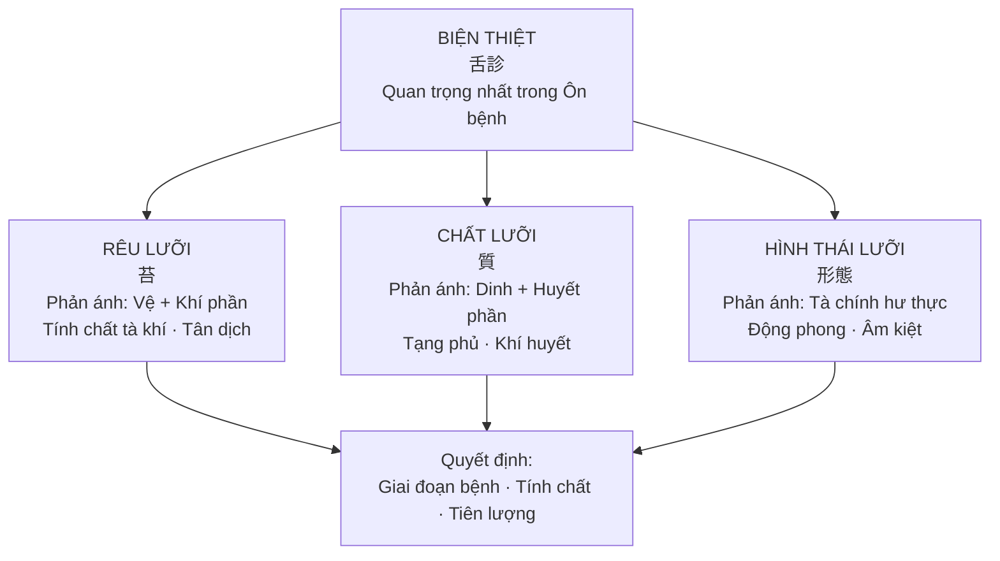
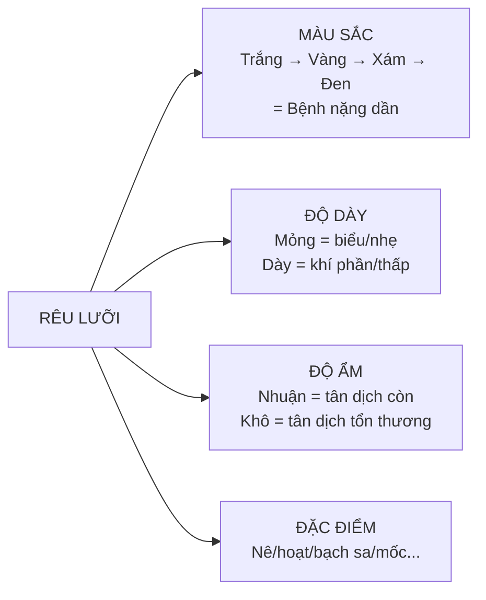
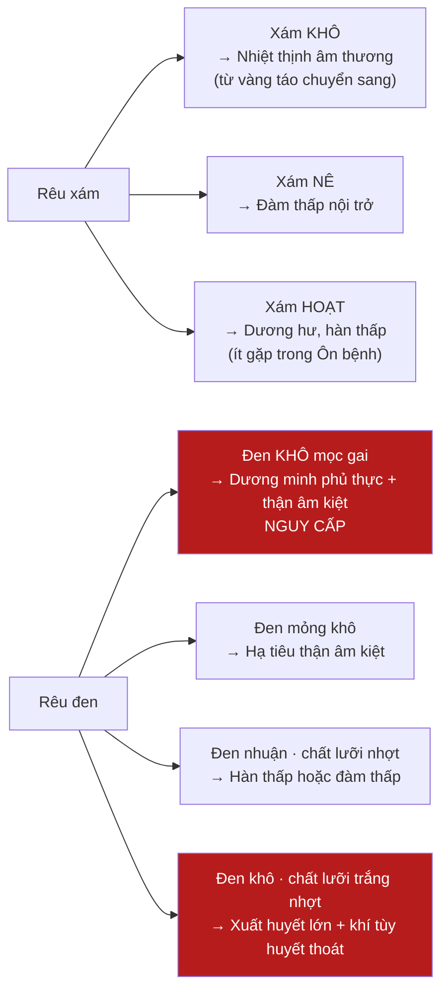

import { Aside, Tabs, TabItem } from '@astrojs/starlight/components';
import MedicalNote from '~/components/MedicalNote.astro';
import KeyPoints from '~/components/KeyPoints.astro';
import RedFlags from '~/components/RedFlags.astro';
import AlgorithmBox from '~/components/AlgorithmBox.astro';
import CompareTable from '~/components/CompareTable.astro';
import ClinicalPearl from '~/components/ClinicalPearl.astro';
import EvidenceBox from '~/components/EvidenceBox.astro';

## Mục tiêu bài giảng

1. Hiểu tại sao biện lưỡi là **trung tâm chẩn đoán** Ôn bệnh (hơn cả mạch)
2. Đọc được **rêu lưỡi** theo 4 trục: màu sắc · độ dày · độ ẩm · đặc điểm đặc biệt
3. Đọc được **chất lưỡi** theo tiến trình Vệ → Khí → Dinh → Huyết
4. Biết **hình thái lưỡi** và ý nghĩa động thái biến hóa
5. Tránh các bẫy chẩn đoán khi rêu và chất lưỡi "mâu thuẫn"

---

## Bức tranh tổng thể



<EvidenceBox title="Câu nói kinh điển">
**"Tập bệnh trọng mạch, Ôn bệnh trọng thiết"**

→ Bệnh thông thường: xem mạch là quan trọng nhất. Ôn bệnh: **xem lưỡi là quan trọng nhất**. Vì lưỡi thay đổi nhanh, nhạy, khách quan hơn mạch trong bệnh nhiệt tính.
</EvidenceBox>

<MedicalNote title="Tại sao lưỡi nhạy trong Ôn bệnh?">
Lưỡi thông với kinh lạc nhiều tạng phủ: Can, Thận, Tỳ, Bàng quang, Tam tiêu. Trong Ôn bệnh: sốt + tổn thương tân dịch + rối loạn tỳ vị → biến hóa rêu lưỡi xảy ra **nhanh và rõ ràng** hơn bất kỳ triệu chứng nào khác.
</MedicalNote>

---

## 1. Rêu Lưỡi — Phản Ánh Vệ Và Khí Phần

Rêu lưỡi hình thành do **vị khí hun chưng**. Quan sát 4 trục:



### 1.1 Rêu Trắng — Bảng Chi Tiết

<CompareTable
  headers={["Loại rêu trắng", "Mô tả", "Cơ chế", "Ý nghĩa lâm sàng"]}
  rows={[
    ["Mỏng trắng, thiếu nhuận · chót và rìa đỏ", "Rêu mỏng, hơi khô, lưỡi đỏ hai bên", "Ôn tà tại vệ phần · phong nhiệt nhẹ", "Phong Ôn giai đoạn đầu — điều trị sớm tiên lượng tốt"],
    ["Mỏng trắng khô · rìa đỏ rõ hơn", "Khô hơn loại trên · đỏ đậm hơn", "Phong nhiệt thịnh hơn · tân dịch bắt đầu tổn thương", "Vệ phần nhưng tà nặng hơn — cần thêm dưỡng âm"],
    ["Dày trắng dính nê (nhuận)", "Rêu dày, nhớt dính, bề mặt nước bọt đặc", "Thấp trọc thiên thịnh · khí phần thấp ôn", "Thấp Ôn: thấp >> nhiệt — cần táo thấp"],
    ["Dày trắng khô táo · chất lưỡi đỏ", "Rêu dày nhưng khô · lưỡi đỏ", "Tỳ thấp chưa hóa + vị tân đã tổn thương", "Mâu thuẫn: vừa có thấp vừa âm thương — phức tạp"],
    ["Trắng nê · chất lưỡi đỏ thẫm", "Rêu nê trắng + lưỡi đỏ thẫm", "Thấp át nhiệt phục · hoặc nhiệt nhập dinh mà thấp chưa hóa", "Khí phần thấp nhiệt + tà bắt đầu vào dinh — theo dõi sát"],
    ["Trắng phấn dày · chất lưỡi tím thẫm", "Như phủ lớp phấn trắng + lưỡi tím", "Uế trọc uất bế mạc nguyên", "ÔN DỊCH — nguy hiểm, bệnh truyền nhiễm nặng"],
    ["Rêu mốc trắng như nấm", "Mốc trắng mọc trên lưỡi, bong dễ", "Uế trọc nội uất · vị khí suy bại", "Thấp ôn kéo dài · vị khí đại tổn — tiên lượng xấu"],
    ["Bạch sa (như cát thô, nứt)", "Dày, khô, nứt, sờ thô ráp", "Nhiệt tà hóa táo đột ngột · tân dịch đại tổn thương", "Nguy hiểm — rêu chưa kịp vàng mà tân đã kiệt"]
  ]}
/>

<ClinicalPearl>
**Quy tắc vàng rêu trắng**: Rêu trắng = tà còn nông/nhẹ. NHƯNG: Rêu trắng **phấn dày + lưỡi tím** = Ôn dịch nguy hiểm. Rêu **mốc trắng** = vị khí suy bại. Hai trường hợp này là **nghịch chứng** dù rêu trắng.
</ClinicalPearl>

### 1.2 Rêu Vàng

<CompareTable
  headers={["Loại rêu vàng", "Mô tả", "Ý nghĩa"]}
  rows={[
    ["Mỏng vàng, nhuận", "Vàng nhạt, còn ẩm", "Tà nhiệt vừa nhập khí phần, tân dịch chưa tổn thương"],
    ["Mỏng vàng, khô", "Vàng nhạt nhưng khô", "Khí phần nhiệt tích, tân dịch đã tổn thương"],
    ["Vàng trắng lẫn lộn, hơi khô", "Vừa có rêu vàng vừa còn chút trắng", "Tà nhập khí phần nhưng biểu tà chưa giải hết"],
    ["Vàng khô táo (không dày)", "Vàng, khô, không nề", "Khí phần nhiệt thịnh, tân dịch tổn thương rõ"],
    ["Vàng khô nứt, mọc gai", "Vàng sậm, khô, có gai nhú lên", "DƯƠNG MINH PHỦ THỰC — cần công hạ ngay"],
    ["Vàng nê (dày dính)", "Vàng + nhớt dính + dày", "Thấp nhiệt lưu luyến khí phần — thấp và nhiệt cân bằng"],
    ["Vàng trọc (đục)", "Vàng + đục + đặc", "Thấp nhiệt hoặc đàm nhiệt tương kết"]
  ]}
/>

<MedicalNote title="Nghiên cứu hiện đại về rêu vàng">
Phết lam rêu vàng có số lượng bạch cầu **cao hơn rõ rệt** so với rêu trắng — phản ánh mức độ viêm nhiễm. Rêu từ trắng → vàng tương quan với tăng bạch cầu trung tính, phù hợp với khái niệm "rêu vàng chủ lý, chủ nhiệt, chủ thực" của cổ nhân.
</MedicalNote>

### 1.3 Rêu Xám và Đen



<RedFlags title="Rêu đen — Không phải luôn luôn là nhiệt">
Rêu đen = bệnh nặng **nhưng** cần phân biệt:
- **Đen khô** = nhiệt cực + âm kiệt (thực nhiệt)
- **Đen nhuận** = đàm thấp hoặc hàn thấp (không phải nhiệt!)
- **Đen khô + chất lưỡi trắng nhợt** = xuất huyết lớn, khí thoát — KHẨN CẤP

Luôn kết hợp màu rêu + độ ẩm + chất lưỡi để chẩn đoán đúng.
</RedFlags>

---

## 2. Chất Lưỡi — Phản Ánh Dinh Và Huyết Phần

Chất lưỡi phản ánh **tình trạng dinh huyết, tạng phủ, tân dịch**. Biến hóa chậm hơn rêu nhưng sâu hơn.

### 2.1 Tiến Trình Chất Lưỡi Theo Giai Đoạn


### 2.2 Chất Lưỡi Đỏ — Chi Tiết

<Tabs>
  <TabItem label="Đỏ vệ phần">
    **Hình thái**: Chỉ đỏ ở **hai rìa và chót lưỡi** — còn phủ rêu
    
    **Cơ chế**: Tà tại vệ, nhiệt còn nông, chưa vào huyết phần
    
    **Ý nghĩa**: Giai đoạn đầu — tiên lượng tốt nếu điều trị sớm
  </TabItem>
  <TabItem label="Đỏ khí phần">
    **Hình thái**: **Toàn lưỡi đỏ** + rêu vàng phủ trên
    
    **Cơ chế**: Tà nhập khí, nhiệt tích thịnh, nhưng chưa vào dinh huyết
    
    **Ý nghĩa**: Cần thanh khí nhiệt mạnh
  </TabItem>
  <TabItem label="Chóp lưỡi đỏ mọc gai">
    **Hình thái**: Chóp lưỡi đỏ thẫm + nhú gai nổi rõ
    
    **Cơ chế**: Tâm hỏa thượng viêm
    
    **Ý nghĩa**: Dấu hiệu sớm cảnh báo tà sắp vào dinh — cần chú ý
  </TabItem>
  <TabItem label="Lưỡi đỏ nứt chữ nhân">
    **Hình thái**: Giữa lưỡi có vết nứt như chữ 人 hoặc các nốt đỏ
    
    **Cơ chế**: Tâm dinh nhiệt cực
    
    **Ý nghĩa**: Tà đã vào sâu dinh phần
  </TabItem>
  <TabItem label="Đỏ bóng, nhìn nhuận sờ khô">
    **Hình thái**: Bề mặt lưỡi bóng nhìn tưởng ướt, sờ thực ra khô
    
    **Cơ chế**: Tà nhiệt lui nhưng tân dịch chưa phục hồi
    
    **Ý nghĩa**: Giai đoạn hồi phục — cần dưỡng âm
  </TabItem>
  <TabItem label="Đỏ nhạt, sắc không tươi">
    **Hình thái**: Nhạt hơn bình thường, không có sắc tươi
    
    **Cơ chế**: Tâm tỳ khí bất túc · khí âm lưỡng hư
    
    **Ý nghĩa**: Cuối bệnh — chính khí hư, tà nhiệt đã lui nhưng khí âm chưa phục
  </TabItem>
</Tabs>

### 2.3 Chất Lưỡi Đỏ Thẫm — Dấu Hiệu Dinh Phần

<EvidenceBox title="Diệp Thiên Sĩ — Tiêu chuẩn vàng">
"Kỳ nhiệt truyền dinh, thiết sắc tất giáng"

→ Khi nhiệt truyền vào dinh phần, màu lưỡi nhất định chuyển sang **đỏ thẫm**. Đây là **tiêu chí quan trọng nhất** để xác định tà nhập dinh.
</EvidenceBox>

<CompareTable
  headers={["Biểu hiện lưỡi đỏ thẫm", "Cơ chế", "Ý nghĩa"]}
  rows={[
    ["Đỏ thẫm sắc tươi, không rêu", "Dinh nhiệt tích thịnh", "Tà hoàn toàn ở dinh — thanh dinh là chính"],
    ["Đỏ thẫm + khô táo", "Dinh nhiệt + tân dịch tổn thương", "Nặng hơn — cần thêm dưỡng âm"],
    ["Đỏ thẫm + nhiều điểm đỏ lớn", "Tâm dinh nhiệt cực", "Rất nặng"],
    ["Đỏ thẫm + rêu vàng trắng xen", "Tà nhập dinh nhưng khí phần chưa sạch", "Vừa thanh khí vừa thanh dinh"],
    ["Đỏ thẫm + rêu nê dính", "Dinh huyết nhiệt + đàm thấp/uế trọc", "Rất dễ xuất hiện thần hôn do đàm trọc bịt tâm bào"],
    ["Đỏ thẫm bóng như gương, không rêu", "Vị âm suy vong", "Nguy kịch — âm kiệt không thể sinh tân"],
    ["Đỏ thẫm khô teo, không tươi", "Thận âm hao kiệt", "Giai đoạn cuối — tiên lượng xấu"]
  ]}
/>

### 2.4 Chất Lưỡi Tím (Tử Thiết) — Huyết Phần

<CompareTable
  headers={["Biểu hiện lưỡi tím", "Cơ chế", "Ý nghĩa"]}
  rows={[
    ["Tím + khô mọc gai (Dương mai thiết)", "Huyết phần nhiệt độc cực thịnh", "Báo trước động huyết hoặc động phong — cấp cứu"],
    ["Tím tối khô (như gan heo)", "Can thận âm kiệt", "Nguy kịch — dự hậu kém"],
    ["Tím ướt, sờ vào thấy ướt", "Ứ huyết bên trong", "Cần hóa ứ — không phải do nhiệt thuần"],
    ["Tím nhạt, hơi xanh", "Âm hàn (ít gặp trong Ôn bệnh)", "Phân biệt với tím do nhiệt"]
  ]}
/>

<ClinicalPearl>
**Phân biệt lưỡi tím**: Tím + **khô** = nhiệt độc/âm kiệt (Ôn bệnh). Tím + **ướt** = ứ huyết hoặc hàn. Không được nhầm hai loại này vì điều trị hoàn toàn ngược nhau.
</ClinicalPearl>

---

## 3. Hình Thái Lưỡi

<CompareTable
  headers={["Hình thái", "Cơ chế", "Ý nghĩa lâm sàng"]}
  rows={[
    ["Lưỡi cương ngạnh (cứng đờ)", "Khí dịch bất túc", "Báo trước động phong kinh quyết — cảnh báo sớm"],
    ["Lưỡi rút ngắn", "Nội phong nhiễu động · đàm trọc nội trở gốc lưỡi", "Phong đàm — nguy"],
    ["Lưỡi cuốn + âm nang co", "Tà vào quyết âm", "Nguy kịch — đã vào tầng sâu nhất"],
    ["Lưỡi teo mềm (không le ra được)", "Can thận âm dịch gần tuyệt", "Tiên lượng rất xấu"],
    ["Lưỡi lệch · run", "Can phong nội động", "Đang có phong nội động"],
    ["Lưỡi to + rêu vàng nê đầy", "Thấp nhiệt độc thượng phạm lưỡi", "Thấp nhiệt nặng"],
    ["Lưỡi to + tím tối", "Độc xâm tâm", "Nguy kịch"]
  ]}
/>

---

## 4. Động Thái Biến Hóa — Đọc Theo Thời Gian

<AlgorithmBox title="Đọc lưỡi theo xu hướng — quan trọng hơn một lần đọc">
```
RÊU BIẾN HÓA:
  Trắng → Vàng → Xám → Đen = Tà từ biểu vào lý, NẶNG DẦN
  Nhuận → Khô = Tân dịch đang mất dần
  Dày → Mỏng = Bệnh tà đang lui (TỐT)
  Rêu đóng đột ngột biến mất → bóng sạch = VỊ TÂN HAO VONG (xấu!)

CHẤT LƯỠI BIẾN HÓA:
  Đỏ thẫm → Hồng nhạt ĐỘT NGỘT = Dương khí bạo thoát (XẤU, không phải hồi phục)
  Không rêu → Rêu dần mọc trở lại = Tà nhiệt phục từ dinh xuất ra khí (TỐT)
  Đỏ thẫm → bóng như gương = Vị âm suy vong

LƯỠI PHỤ ĐỀ:
  Lưỡi có ứ ban → Cảnh giác biến chứng xuất huyết não/tiêu hóa
  Rêu khô → Bù dịch nếu cần
  Rêu nhuận + lưỡi bệu nộn → Cảnh giác bù dịch quá nhiều
```
</AlgorithmBox>

---

## 5. Bẫy Chẩn Đoán — Rêu và Chất Lưỡi Mâu Thuẫn

<MedicalNote title="Khi rêu và chất lưỡi không thống nhất">
Bình thường: Rêu và chất lưỡi cùng phản ánh một tình trạng (lưỡi đỏ + rêu vàng khô = nhiệt nặng, tân thương). Nhưng đôi khi chúng mâu thuẫn:
</MedicalNote>

<CompareTable
  headers={["Biểu hiện mâu thuẫn", "Giải thích", "Xử trí"]}
  rows={[
    ["Chất lưỡi đỏ thẫm + rêu trắng nê hoạt", "Nhiệt đã vào dinh NHƯNG thấp tà vẫn còn ở khí phần chưa hóa", "Vừa thanh dinh vừa hóa thấp — không bỏ qua một bên"],
    ["Chất lưỡi nhợt + rêu vàng khô", "Xuất huyết lớn → khí tùy huyết thoát (chất nhợt) nhưng rêu chưa kịp đổi", "KHẨN CẤP — bổ khí, cầm huyết, không dùng thuốc hàn lương"],
    ["Rêu trắng dày + chất lưỡi đỏ", "Tỳ thấp chưa hóa + vị tân đã tổn thương", "Khó trị — táo thấp cẩn thận không làm tổn thương thêm âm"],
    ["Rêu đen nhuận + chất lưỡi nhợt", "Hàn thấp (không phải nhiệt!)", "Ôn dương hóa thấp — KHÔNG dùng thuốc hàn lương"]
  ]}
/>

---

## 6. Ứng Dụng Lâm Sàng — Đọc Lưỡi Trong Sốt Xuất Huyết

<EvidenceBox title="Nghiên cứu lâm sàng — Sốt xuất huyết">
Quan sát lưỡi giúp phán đoán mức độ nặng nhẹ và biến chứng:

- **Đầu lưỡi + hai rìa đỏ, rêu mỏng trắng/vàng** → Bệnh nhẹ
- **Lưỡi đỏ, rêu vàng nê hoặc trắng nê** → Bệnh nặng vừa
- **Chất lưỡi thẫm, không rêu** → Bệnh rất nặng
- **Lưỡi có ứ ban** → Nguy cơ xuất huyết não/tiêu hóa — kiểm tra đông máu ngay
- **Lưỡi tím toàn bộ + mạch máu lưỡi nổi to, tím đen** → Hôn mê, tụt huyết áp sắp xảy ra
</EvidenceBox>

---

## Câu hỏi tư duy lâm sàng

1. **Bệnh nhân: rêu trắng phấn dày như lớp bột + chất lưỡi tím thẫm.** Chẩn đoán? Tại sao đây nguy hiểm hơn rêu vàng thông thường?

2. **Bệnh nhân ngày 3 sốt cao: rêu vàng dày → ngày 7: đột nhiên lưỡi bóng sạch, không còn rêu.** Đây là tốt hay xấu? Tại sao?

3. **Bệnh nhân lưỡi đỏ thẫm + rêu trắng nê ẩm.** Tại sao "mâu thuẫn"? Điều trị cần phối hợp gì?

---

<KeyPoints title="Điểm cốt lõi cần nhớ">
**Rêu lưỡi** (Vệ + Khí phần):
- Màu: Trắng → Vàng → Xám → Đen = nặng dần
- Độ ẩm: Nhuận → Khô = tân dịch mất dần
- Nê = thấp; Khô nứt gai = phủ thực; Phấn trắng + lưỡi tím = Ôn dịch

**Chất lưỡi** (Dinh + Huyết phần):
- Đỏ rìa → đỏ toàn lưỡi → đỏ thẫm → tím tối → khô teo = Vệ → Khí → Dinh → Huyết → Âm kiệt
- **Lưỡi đỏ thẫm** = marker quan trọng nhất của dinh phần (Diệp Thiên Sĩ)
- Tím khô = nhiệt; Tím ướt = ứ huyết/hàn — **không nhầm!**

**Động thái**: Rêu biến mất đột ngột ≠ tốt → Vị tân hao vong. Chất lưỡi nhợt đột ngột ≠ hồi phục → Dương khí bạo thoát
</KeyPoints>
