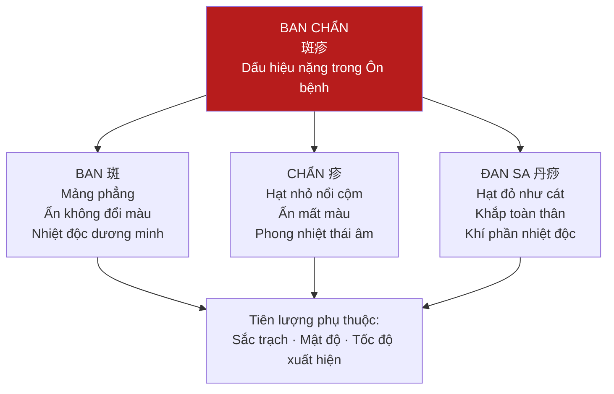
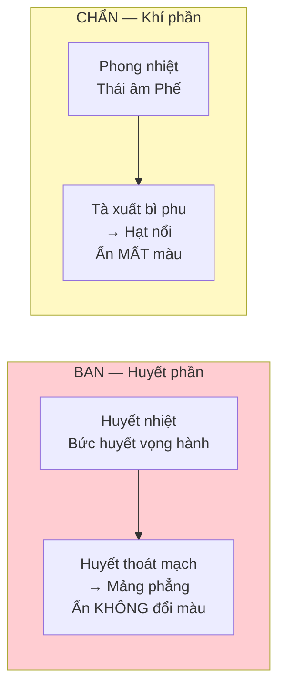
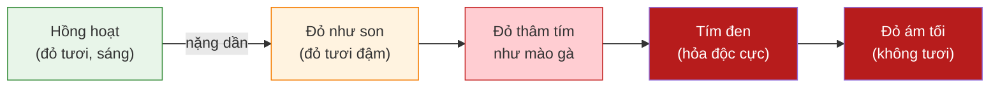

import { Aside, Tabs, TabItem } from '@astrojs/starlight/components';
import MedicalNote from '~/components/MedicalNote.astro';
import KeyPoints from '~/components/KeyPoints.astro';
import RedFlags from '~/components/RedFlags.astro';
import AlgorithmBox from '~/components/AlgorithmBox.astro';
import CompareTable from '~/components/CompareTable.astro';
import ClinicalPearl from '~/components/ClinicalPearl.astro';
import EvidenceBox from '~/components/EvidenceBox.astro';

## Mục tiêu bài giảng

1. Phân biệt chính xác **Ban**, **Chẩn**, **Đan sa** — hình thái + phân bố + cơ chế
2. Đọc **sắc trạch** ban chẩn để tiên lượng bệnh
3. Xác định **thuận chứng** vs **nghịch chứng** — ra quyết định điều trị
4. Nhận biết **Âm ban** — bẫy chẩn đoán nguy hiểm
5. Áp dụng quy tắc Diệp Thiên Sĩ vào lâm sàng

---

## Bức tranh tổng thể



<EvidenceBox title="Diệp Thiên Sĩ — Nguyên tắc vàng">
**"Nghĩ kiến bất nghĩ kiến đa"**

→ "Thấy ít (thưa thớt) là tốt; thấy nhiều (dày đặc) là xấu"

Số lượng ban chẩn phản ánh mức độ nhiệt độc: thưa = tà thoát ra ngoài = thuận; dày = tà chưa thoát = nghịch.
</EvidenceBox>

---

## 1. Phân Biệt Ba Loại — Ban, Chẩn, Đan Sa

<CompareTable
  headers={["Đặc điểm", "Ban (斑)", "Chẩn (疹)", "Đan Sa (丹痧)"]}
  rows={[
    ["Hình thái", "Mảng phẳng, không nổi, sờ không cộm", "Hạt nhỏ nổi lên khỏi mặt da, sờ cộm tay", "Hạt đỏ nhỏ như cát, nổi dày"],
    ["Ấn vào", "Không đổi màu (không bạch hóa)", "Mất màu tạm thời (bạch hóa) rồi đỏ trở lại", "Không đổi màu"],
    ["Vị trí xuất hiện trước", "Ngực bụng (trước)", "Họng → tai → đầu mặt → ngực (từ trên xuống)", "Cổ gáy → toàn thân"],
    ["Cơ chế", "Nhiệt độc bức huyết vọng hành → huyết thoát ngoài mạch", "Phế vị phong nhiệt → tà xuất bì phu", "Khí phần nhiệt độc phát tán ra ngoài"],
    ["Vị trí cơ chế", "Dương minh nhiệt độc (huyết phần)", "Thái âm phong nhiệt (khí phần)", "Khí phần nhiệt độc"],
    ["Mức độ nặng", "Nặng hơn (huyết phần)", "Nhẹ hơn ban (khí phần)", "Trung bình"],
    ["Tương đương YHHĐ", "Xuất huyết dưới da (petechiae/purpura)", "Nốt ban dạng sần (maculopapular rash)", "Ban đỏ dạng sởi hoặc ban đỏ nhiễm liên cầu"]
  ]}
/>



<ClinicalPearl>
**Ấn tay kiểm tra**: Dùng ngón trỏ ấn mạnh vào vị trí ban/chẩn trong 3 giây, thả ra:
- **Vẫn đỏ** = Ban → huyết đã thoát ra ngoài mạch → huyết phần
- **Trắng nhạt rồi đỏ trở lại** = Chẩn → huyết vẫn trong mạch → khí/vệ phần
</ClinicalPearl>

---

## 2. Sắc Trạch — Thước Đo Nhiệt Độc

Màu sắc ban chẩn là **tiên lượng quan trọng nhất**:



<CompareTable
  headers={["Sắc ban chẩn", "Cơ chế", "Tiên lượng", "Hành động"]}
  rows={[
    ["Hồng hoạt (đỏ tươi sáng, ướt)", "Nhiệt độc nhẹ, chính khí còn mạnh", "THUẬN — tốt", "Tiếp tục phác đồ hiện tại"],
    ["Đỏ như son (đỏ tươi đậm, căng bóng)", "Huyết nhiệt gia tăng", "Cảnh giác — cần theo dõi chặt", "Tăng liều lương huyết"],
    ["Đỏ thâm tím như mào gà", "Nhiệt độc nặng, huyết nhiệt ứ trệ", "NGHỊCH — nguy hiểm", "Lương huyết + hóa ứ"],
    ["Tím đen (như mực tàu)", "Hỏa độc cực thịnh — hung hiểm", "NGHỊCH NẶNG — nguy kịch", "Cấp cứu — giải độc mạnh + lương huyết"],
    ["Đỏ ám tối (không tươi, xỉn màu)", "Nguyên khí đã suy kiệt, không đủ sức tống độc ra ngoài", "NGHỊCH — tiên lượng xấu", "Phò chính + giải độc đồng thời"]
  ]}
/>

<MedicalNote title="Màu đỏ ám tối — Bẫy chẩn đoán">
Màu đỏ ám tối (xỉn, không tươi) trông có vẻ nhẹ hơn tím đen nhưng lại **nguy hiểm không kém**. Vì đây không phải do độc nhẹ mà do **chính khí đã suy kiệt** — cơ thể không còn sức để đẩy máu đến nơi ban chẩn → màu nhạt, tối. Cần phò chính gấp.
</MedicalNote>

---

## 3. Thuận Chứng và Nghịch Chứng

<CompareTable
  headers={["Tiêu chí", "Thuận chứng (tốt)", "Nghịch chứng (nguy)"]}
  rows={[
    ["Mật độ", "Thưa thớt", "Dày đặc"],
    ["Sắc trạch", "Hồng hoạt, tươi sáng", "Tím đen, đỏ ám tối"],
    ["Bề mặt", "Nổi đều, sờ mềm", "Cứng nhọn, cộm cứng"],
    ["Xuất hiện", "Từ từ, dần dần", "Đột ngột, đồng loạt"],
    ["Đi kèm", "Thần chí tỉnh táo, nhiệt dần hạ", "Thần hôn, sốt vẫn cao hoặc tăng"],
    ["Sau khi ban mọc", "Sốt giảm dần (tà có đường ra)", "Sốt không giảm hoặc tăng vọt"]
  ]}
/>

<EvidenceBox title="Giải thích sinh lý học YHCT">
**Tại sao "thưa = tốt, dày = xấu"?**

Ban chẩn = nhiệt độc bức ra ngoài da. Thưa → tà đang thoát ra ngoài (cơ thể đang thắng). Dày đặc → tà quá nhiều, không thoát hết được, còn lại bên trong tấn công tạng phủ → nguy hiểm.

Hoặc: dày đặc nhưng không hợp nhất (không thành mảng to) → tà đang thoát, thuận hơn. Dày đặc + hợp nhất thành mảng lớn → huyết nhiệt cực thịnh, tiên lượng xấu.
</EvidenceBox>

---

## 4. Âm Ban — Bẫy Lâm Sàng

<RedFlags title="Âm Ban — Đừng nhầm thuận chứng">
**Âm ban** (陰斑) = ban chẩn do dùng **nhầm thuốc hàn lương** (quá lạnh) khi bệnh chưa đến giai đoạn cần dùng.

**Cơ chế**: Thuốc hàn lương quá sớm → hàn tà bức huyết vọng hành → ban chẩn xuất hiện.

**Đặc điểm phân biệt**:
- Màu nhạt, không tươi
- Bệnh nhân không sốt cao (hoặc sốt giảm nhưng không tốt lên)
- Tay chân lạnh, mạch trầm tế
- Sau khi ngưng thuốc hàn lương / thêm ôn dương → ban tự lui

**Nguy hiểm**: Nếu nhầm là ban do nhiệt độc → tiếp tục dùng thuốc hàn lương → hàn tà càng nặng → nguy kịch.

**Điều trị**: Ôn dương trục hàn (không phải thanh nhiệt lương huyết)
</RedFlags>

<CompareTable
  headers={["", "Ban do Nhiệt độc (dương)", "Âm Ban (do hàn)"]}
  rows={[
    ["Màu sắc", "Đỏ tươi, hồng hoạt, hoặc đỏ tím", "Nhạt, không tươi, hơi xỉn"],
    ["Sốt", "Cao, kéo dài", "Không cao hoặc giảm nhưng bệnh không cải thiện"],
    ["Chi", "Ấm", "Lạnh"],
    ["Mạch", "Sắc, hồng đại", "Trầm tế, nhược"],
    ["Tiền sử", "Bệnh nhiệt tính, chưa dùng thuốc hàn lương nhiều", "Vừa dùng thuốc hàn lương liều cao"],
    ["Điều trị", "Lương huyết giải độc", "Ôn dương — KHÔNG dùng hàn lương thêm"]
  ]}
/>

---

## 5. Theo Dõi Ban Chẩn Theo Thời Gian

<AlgorithmBox title="Đọc ban chẩn theo diễn tiến — quan trọng hơn một lần đọc">
```
NGÀY ĐẦU XUẤT HIỆN:
  Xác định: Ban hay Chẩn hay Đan sa?
  Đánh giá: Sắc trạch ban đầu (hồng hoạt = thuận, tím đen = nghịch)
  Đánh giá: Mật độ (thưa = thuận, dày = nghịch)
  Đánh giá: Thần chí (tỉnh = thuận, hôn mê = nghịch)

THEO DÕI SAU 12-24 GIỜ:
  Sốt hạ sau khi ban mọc? → Thuận (tà có đường ra)
  Sốt không hạ hoặc tăng? → Nghịch (tà chưa thoát hết)
  Ban thưa dần, mờ dần? → Thuận
  Ban dày thêm, sắc sậm hơn? → NGHỊCH — tăng cường điều trị

DẤU HIỆU NGUY HIỂM (can thiệp ngay):
  Ban đột ngột tím đen → Hỏa độc cực thịnh
  Ban mờ đột ngột + thần hôn → Tà hãm vào lý
  Ban đỏ ám tối + chi lạnh + mạch vi → Nguyên khí suy kiệt
```
</AlgorithmBox>

---

## 6. Điều Trị Theo Tình Trạng Ban Chẩn

<Tabs>
  <TabItem label="Ban thưa, hồng hoạt">
    **Chẩn đoán**: Nhiệt độc nhẹ, tà đang thoát ra

    **Điều trị**: Thanh nhiệt giải độc + lương huyết nhẹ

    **Phương**: Ngân kiều tán gia Sinh địa, Đan bì, Chi tử
  </TabItem>
  <TabItem label="Ban dày, đỏ tươi">
    **Chẩn đoán**: Huyết nhiệt thịnh

    **Điều trị**: Lương huyết giải độc mạnh

    **Phương**: Tê giác địa hoàng thang gia Tử thảo, Đại thanh diệp
  </TabItem>
  <TabItem label="Ban tím đen / đỏ ám">
    **Chẩn đoán**: Hỏa độc cực thịnh / Chính khí suy kiệt

    **Điều trị**: Lương huyết giải độc tối đa + phò chính (nếu đỏ ám)

    **Phương**: Tê giác địa hoàng thang + Hóa ban thang + Nhân sâm (nếu chính khí suy)
  </TabItem>
  <TabItem label="Âm ban">
    **Chẩn đoán**: Hàn tà bức huyết (do dùng nhầm thuốc)

    **Điều trị**: Ôn dương trục hàn — TUYỆT ĐỐI không dùng hàn lương thêm

    **Phương**: Tứ nghịch thang gia vị / Phụ tử lý trung thang
  </TabItem>
</Tabs>

---

## 7. Phân Biệt Ban Chẩn Ôn Bệnh với Một Số Bệnh Khác

<CompareTable
  headers={["Bệnh", "Đặc điểm ban", "Điểm phân biệt"]}
  rows={[
    ["Ôn bệnh nhiệt độc", "Ban không nổi, ấn không mất màu", "Sốt cao, nhiệt chứng rõ"],
    ["Sởi (phong chẩn)", "Chẩn nổi, ấn mất màu, từ đầu xuống chân", "Ho nhiều, mắt đỏ, Koplik spots"],
    ["Thủy đậu", "Mụn nước trong, nhiều giai đoạn cùng lúc", "Ngứa nhiều, mụn vỡ đóng vảy"],
    ["Dị ứng thuốc", "Ban nổi, ngứa, đối xứng", "Liên quan đến dùng thuốc, không sốt cao"],
    ["Xuất huyết giảm tiểu cầu", "Ban phẳng, đỏ tím, không ngứa", "Tiểu cầu giảm, không sốt cao thực nhiệt"]
  ]}
/>

---

## Câu hỏi tư duy lâm sàng

1. **Bệnh nhân xuất huyết dengue ngày 5: ban đỏ tím dày đặc, ấn không mất màu, sốt 39°C.** Theo YHCT: đây là loại gì? Tiên lượng? Tại sao Diệp Thiên Sĩ nói "dày = nguy"?

2. **Bệnh nhân sốt cao 3 ngày, được cho uống thuốc hàn lương nhiều. Ngày 4: ban nhạt màu xuất hiện, không sốt cao, chân tay lạnh, mạch trầm tế.** Đây là gì? Xử trí?

3. **So sánh**: Bệnh nhân A có ban thưa, hồng hoạt, sốt giảm sau khi ban mọc. Bệnh nhân B có chẩn dày đặc, đỏ tím, sốt không giảm. Ai thuận chứng, ai nghịch? Tại sao người có BAN (nặng hơn về bệnh lý) lại thuận hơn người có CHẨN?

---

<KeyPoints title="Điểm cốt lõi cần nhớ">
**Ba loại**:
- **Ban**: phẳng, ấn không đổi màu, ngực bụng trước, dương minh nhiệt độc/huyết phần
- **Chẩn**: nổi cộm, ấn mất màu, từ họng→đầu→ngực, thái âm phong nhiệt/khí phần
- **Đan sa**: hạt nhỏ như cát, từ cổ gáy → toàn thân, khí phần nhiệt độc

**Sắc trạch** (từ tốt → xấu): Hồng hoạt → Đỏ như son → Đỏ thâm tím mào gà → **Tím đen** / **Đỏ ám tối** (nguy)

**Diệp Thiên Sĩ**: "Nghĩ kiến bất nghĩ kiến đa" — thưa = thuận; dày đặc = nghịch

**Âm ban**: Do hàn tà / dùng nhầm thuốc hàn lương → màu nhạt + chi lạnh + mạch tế → **KHÔNG** dùng thêm thuốc hàn lương → phải ôn dương

**Tiên lượng tốt**: Ban thưa + hồng hoạt + sốt giảm sau khi ban mọc = tà thoát ra ngoài
</KeyPoints>
