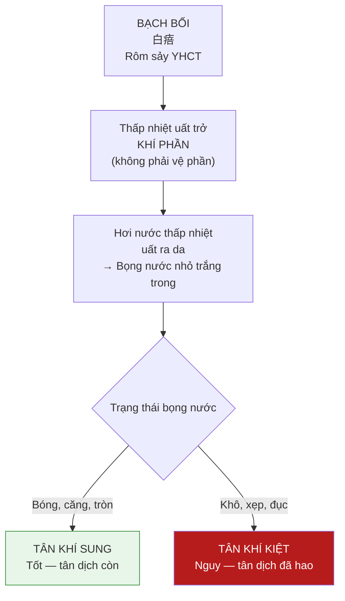
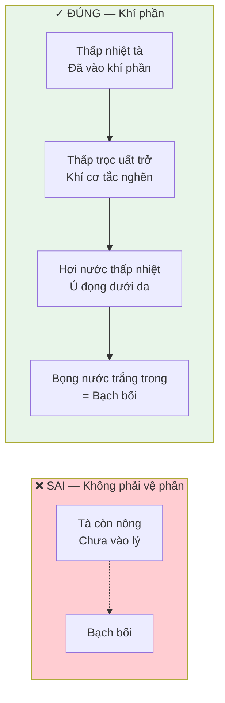
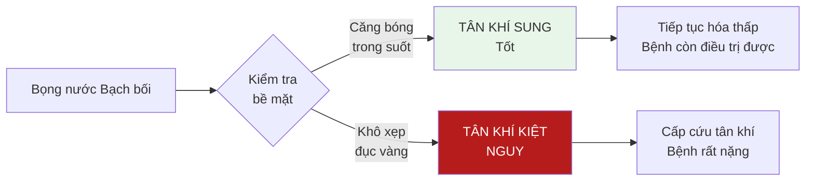

import { Aside, Tabs, TabItem } from '@astrojs/starlight/components';
import MedicalNote from '~/components/MedicalNote.astro';
import KeyPoints from '~/components/KeyPoints.astro';
import RedFlags from '~/components/RedFlags.astro';
import AlgorithmBox from '~/components/AlgorithmBox.astro';
import CompareTable from '~/components/CompareTable.astro';
import ClinicalPearl from '~/components/ClinicalPearl.astro';
import EvidenceBox from '~/components/EvidenceBox.astro';

## Mục tiêu bài giảng

1. Phân biệt Bạch bối với Ban chẩn — hình thái, cơ chế, ý nghĩa khác hoàn toàn
2. Hiểu tại sao Bạch bối thuộc **khí phần** (không phải vệ phần)
3. Sử dụng Bạch bối để **biện tân khí** — đánh giá tình trạng tân dịch
4. Nhận diện khi nào Bạch bối là tốt vs khi nào là dấu hiệu nguy

---

## Bức tranh tổng thể



---

## 1. Định Nghĩa và Đặc Điểm Hình Thái

**Bạch bối** (白㾦) còn gọi là **Tinh** (晶) hay **Rôm sảy trắng** trong dân gian:

| Đặc điểm | Mô tả |
|---|---|
| **Kích thước** | Hạt nhỏ như hạt tấm gạo (millet-sized) |
| **Màu sắc** | Trắng trong như trân châu (pearl-like) |
| **Nội dung** | Dịch trắng trong, trong suốt |
| **Bề mặt da** | Không viêm, không đỏ xung quanh |
| **Vị trí** | Cổ, ngực, bụng — ít khi ở tứ chi |
| **Khi nào xuất hiện** | Thường sau sốt + ra mồ hôi nhiều |

<ClinicalPearl>
**Bạch bối ≠ ban chẩn**:
- **Ban chẩn**: Đỏ, do nhiệt độc bức huyết → huyết phần/dinh phần
- **Bạch bối**: Trắng trong, do thấp nhiệt uất hơi → khí phần

Hai dấu hiệu da này **cùng có thể xuất hiện trong Thấp Ôn, Thử Thấp** nhưng cơ chế và ý nghĩa hoàn toàn khác nhau. Không được đọc chúng bằng cùng một tiêu chí.
</ClinicalPearl>

---

## 2. Cơ Chế — Tại Sao Là Khí Phần, Không Phải Vệ Phần?



<EvidenceBox title="Tại sao phải xác định đúng giai đoạn?">
Nếu nhầm Bạch bối = vệ phần → dùng thuốc giải biểu → sai hoàn toàn. Bạch bối = khí phần thấp nhiệt uất trở → phải **hóa thấp tuyên khí** (không phải giải biểu, không phải lương huyết).

Vệ phần bạch bối không tồn tại. Bạch bối luôn = khí phần đã có thấp nhiệt.
</EvidenceBox>

---

## 3. Biện Tân Khí — Ứng Dụng Lâm Sàng Quan Trọng Nhất

Ý nghĩa lâm sàng quan trọng nhất của Bạch bối không phải là bản thân nó, mà là **trạng thái bọng nước phản ánh tình trạng tân dịch** — gọi là **biện tân khí** (辨津氣):

<CompareTable
  headers={["Loại Bạch bối", "Hình thái", "Tân khí", "Ý nghĩa"]}
  rows={[
    ["Bạch bối bóng căng (晶瑩飽滿)", "Bọng nước căng tròn, bóng như pha lê, dịch trong", "Tân khí SUNG — tân dịch còn đủ", "Thuận chứng — bệnh tuy nặng nhưng nội lực còn, có thể điều trị"],
    ["Bạch bối khô khốc (乾癟)", "Bọng nước xẹp, da nhăn, khô, đục hoặc vàng", "Tân khí KIỆT — tân dịch đã hao kiệt", "Nguy chứng — thường đi kèm thần hôn, mạch tế sác, khô miệng cực độ"],
    ["Bạch bối chưa đủ nhiệt hạ", "Bọng nước nhỏ, chưa căng, dịch ít", "Nhiệt chưa lui, thấp còn tắc", "Trung gian — cần tiếp tục hóa thấp"]
  ]}
/>



<MedicalNote title="Giải thích cơ chế biện tân khí">
Bọng nước Bạch bối được tạo thành từ **tân dịch** bị thấp nhiệt ép ra dưới da. Nếu tân dịch cơ thể còn đầy đủ → bọng nước căng bóng, trong suốt = tân khí sung. Nếu tân dịch đã hao kiệt → không đủ tân dịch để làm căng bọng nước → bọng xẹp, khô, đục = tân khí kiệt.

Đây là cách cơ thể "hiện thị" trực tiếp tình trạng tân dịch ra ngoài da — thông tin lâm sàng quý giá không cần xét nghiệm.
</MedicalNote>

---

## 4. Phân Biệt Bạch Bối vs Ban Chẩn

<CompareTable
  headers={["Tiêu chí", "Bạch Bối", "Ban Chẩn"]}
  rows={[
    ["Hình thái", "Bọng nước nhỏ, trắng trong", "Mảng hoặc hạt đỏ/đỏ tím"],
    ["Màu sắc", "Trắng trong, không đỏ", "Đỏ, hồng, tím — nhiều mức độ"],
    ["Ấn vào", "Xẹp, vỡ nhẹ (bọng nước)", "Không đổi màu (ban) hoặc mất màu (chẩn)"],
    ["Cơ chế", "Thấp nhiệt uất trở khí phần — hơi thoát ra da", "Nhiệt độc bức huyết — huyết thoát hoặc xâm da"],
    ["Giai đoạn", "Khí phần (thấp nhiệt)", "Khí phần nhiệt độc (chẩn) hoặc huyết phần (ban)"],
    ["Tân dịch", "TRỰC TIẾP phản ánh tân khí (biện tân khí)", "Không dùng để biện tân khí"],
    ["Mức độ nguy", "Bản thân ít nguy; trạng thái bọng nước mới quan trọng", "Màu sắc + mật độ quyết định tiên lượng"],
    ["Bệnh hay gặp", "Thấp Ôn, Thử Thấp (thấp nhiệt chiếm ưu thế)", "Xuân Ôn, Ôn bệnh nhiệt độc nặng"]
  ]}
/>

---

## 5. Bệnh Cảnh Lâm Sàng Hay Gặp

Bạch bối thường xuất hiện trong:

<Tabs>
  <TabItem label="Thấp Ôn">
    **Giai đoạn**: Khí phần, thấp nhiệt cân bằng

    **Lâm sàng**: Sốt vừa + bụng đầy + rêu vàng nê + tiêu lỏng + ra mồ hôi vẫn không hạ sốt → bạch bối xuất hiện

    **Ý nghĩa**: Thấp nhiệt uất ra da — thường là dấu hiệu bệnh đang ở khí phần thấp nhiệt. Không phải lúc nào cũng xấu.

    **Điều trị**: Hóa thấp tuyên khí — Tam nhân thang / Cam lộ tiêu độc đan
  </TabItem>
  <TabItem label="Thử Thấp">
    **Giai đoạn**: Mùa hè, thấp + nhiệt kết hợp

    **Lâm sàng**: Sốt + đổ mồ hôi nhiều + bạch bối vùng cổ ngực + khát nhưng uống ít

    **Ý nghĩa**: Hơi thấp nhiệt ra da qua mồ hôi không hoàn toàn. Cần đánh giá trạng thái bọng nước.

    **Điều trị**: Thanh thử hóa thấp — Bạch hổ gia Thương truật / Hương nhu ẩm
  </TabItem>
  <TabItem label="Nhiệt bệnh ra mồ hôi">
    **Giai đoạn**: Sau cao điểm sốt, nhiệt lui dần

    **Lâm sàng**: Sốt hạ + mồ hôi nhiều + bạch bối xuất hiện → cần kiểm tra ngay bọng nước

    **Bóng căng** = tân khí sung, tốt — nhiệt lui tân còn

    **Khô xẹp** = tân khí kiệt — mồ hôi đã kéo tân dịch theo = nguy hiểm

    **Điều trị**: Dưỡng âm sinh tân — Sa sâm mạch đông thang
  </TabItem>
</Tabs>

---

## 6. Thuật Toán Đọc Bạch Bối

<AlgorithmBox title="Khi thấy Bạch bối — quy trình đánh giá">
```
BƯỚC 1 — Xác định đây là Bạch bối:
  Bọng nước nhỏ, trắng trong, không đỏ?
  Vùng cổ-ngực-bụng?
  → Đúng = Bạch bối

BƯỚC 2 — Xác định trạng thái bọng nước (QUAN TRỌNG NHẤT):
  Căng bóng, trong suốt → TÂN KHÍ SUNG → tiên lượng tốt hơn
  Khô, xẹp, đục → TÂN KHÍ KIỆT → NGUY CẤP

BƯỚC 3 — Đánh giá bệnh cảnh đi kèm:
  Bạch bối + tân khí kiệt + thần hôn + mạch vi:
    → Bệnh nguy, cần cấp cứu tân khí + hóa thấp đồng thời
  Bạch bối + tân khí sung + thần chí tỉnh:
    → Bệnh nặng nhưng còn điều trị được

BƯỚC 4 — Xác định bệnh nền:
  Thấp Ôn? → Hóa thấp là chính
  Thử Thấp? → Thanh thử hóa thấp
  Sau sốt cao mồ hôi nhiều? → Dưỡng âm sinh tân
```
</AlgorithmBox>

---

## 7. Điều Trị

<CompareTable
  headers={["Tình trạng", "Điều trị", "Phương dược"]}
  rows={[
    ["Bạch bối + tân khí sung + thấp nhiệt rõ", "Hóa thấp tuyên khí", "Cam lộ tiêu độc đan / Tam nhân thang"],
    ["Bạch bối + thấp trọc chiếm chủ đạo (bụng đầy, rêu trắng nê)", "Táo thấp hóa trọc", "Hậu phác hạ linh thang"],
    ["Bạch bối + tân khí kiệt + khô miệng nhiều", "Dưỡng âm sinh tân cấp + hóa thấp nhẹ", "Sa sâm mạch đông gia Thương truật (liều nhỏ)"],
    ["Bạch bối + thần hôn + mạch tế sác", "Cấp cứu: ích tân + khai khiếu", "Sinh mạch tán + Tử tuyết đan"]
  ]}
/>

<RedFlags title="Bạch bối khô khốc + thần hôn — Cấp cứu">
Tổ hợp: **Bạch bối khô, xẹp + thần hôn + mạch tế sác + khô miệng cực độ** = Tân khí song kiệt + thấp tà còn (nghịch lý: vừa kiệt tân vừa còn thấp).

→ Đây là tình huống điều trị khó nhất: táo thấp sẽ làm kiệt tân thêm, dưỡng âm sẽ nuôi dưỡng thêm thấp tà.

→ Phải dưỡng âm nhẹ (không táo) + hóa thấp nhẹ (không thương tân) + khai khiếu đồng thời.
</RedFlags>

---

## Câu hỏi tư duy lâm sàng

1. **Tại sao Bạch bối là khí phần chứ không phải vệ phần?** Giải thích theo cơ chế thấp nhiệt uất trở.

2. **Bệnh nhân Thấp Ôn ngày 7: sốt vừa, rêu vàng nê, bạch bối vùng ngực căng bóng trong suốt.** Đánh giá: tân khí? Tiên lượng? Điều trị gì tiếp theo?

3. **Bệnh nhân sốt cao 5 ngày, đổ mồ hôi nhiều ngày 6, xuất hiện bạch bối khô xẹp + thần hôn nhẹ + mạch tế sác.** Giải thích cơ chế? Tại sao không thể đơn thuần dùng thuốc táo thấp hoặc đơn thuần dùng thuốc dưỡng âm?

4. **Phân biệt**: Bạch bối bóng căng sau khi sốt lui vs ban chẩn thưa hồng hoạt. **Cùng là "tốt" nhưng cơ chế "tốt" khác nhau như thế nào?**

---

<KeyPoints title="Điểm cốt lõi cần nhớ">
**Định nghĩa**: Bọng nước nhỏ trắng trong như trân châu, vùng cổ-ngực-bụng, dịch trắng trong

**Cơ chế**: Thấp nhiệt uất trở **KHÍ PHẦN** — hơi thoát qua da (không phải vệ phần!)

**Ứng dụng quan trọng nhất — Biện tân khí**:
- **Bóng căng, trong** = Tân khí sung → tốt
- **Khô, xẹp, đục** = Tân khí kiệt → nguy

**Bệnh hay gặp**: Thấp Ôn, Thử Thấp — bệnh có thấp nhiệt khí phần

**Điều trị**: Hóa thấp tuyên khí (Cam lộ tiêu độc đan / Tam nhân thang) — **không** giải biểu, **không** lương huyết đơn thuần

**Không nhầm** với Ban chẩn: Bạch bối = trắng + bọng nước + khí phần; Ban chẩn = đỏ + phẳng/nổi + nhiệt độc huyết phần
</KeyPoints>
