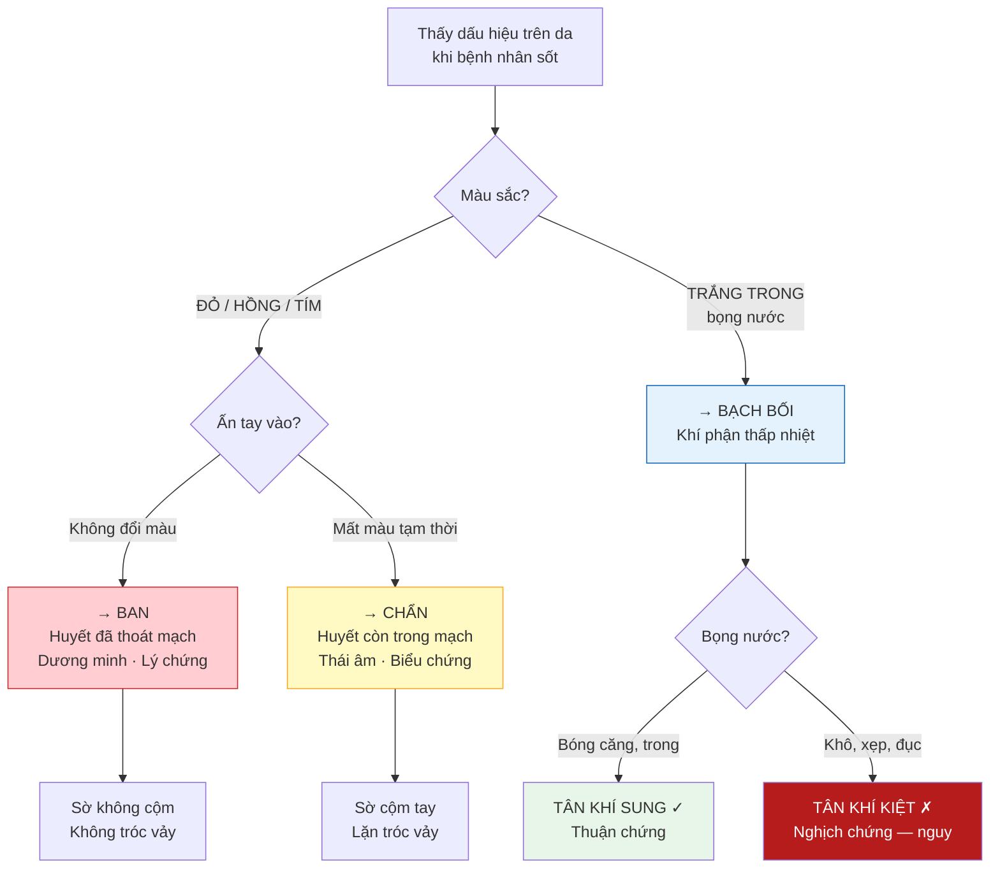
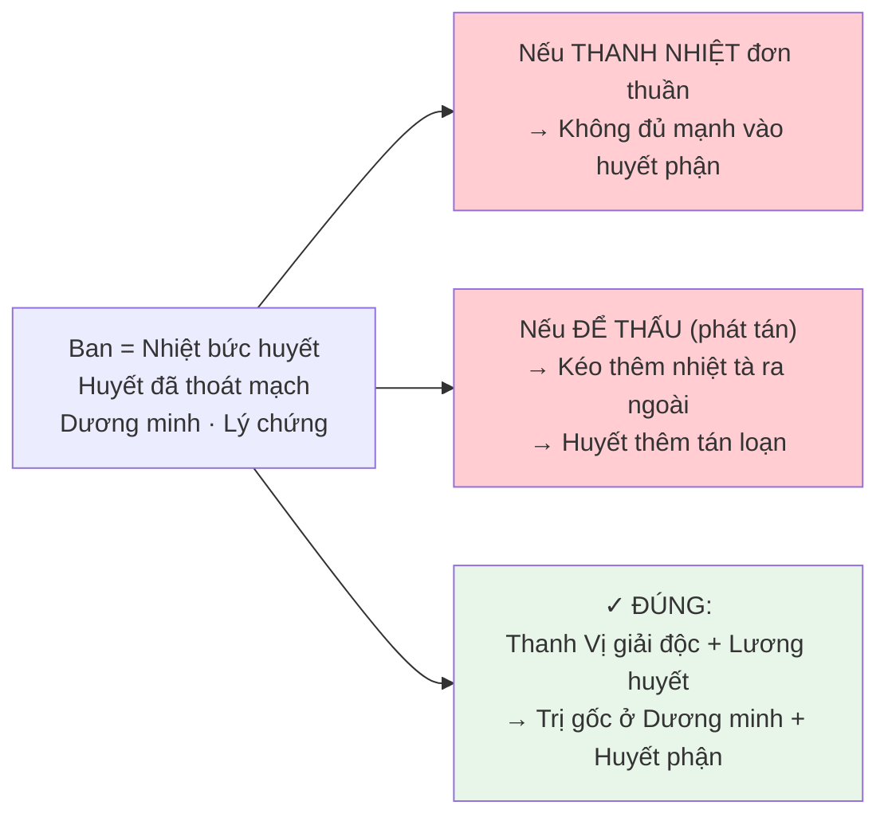
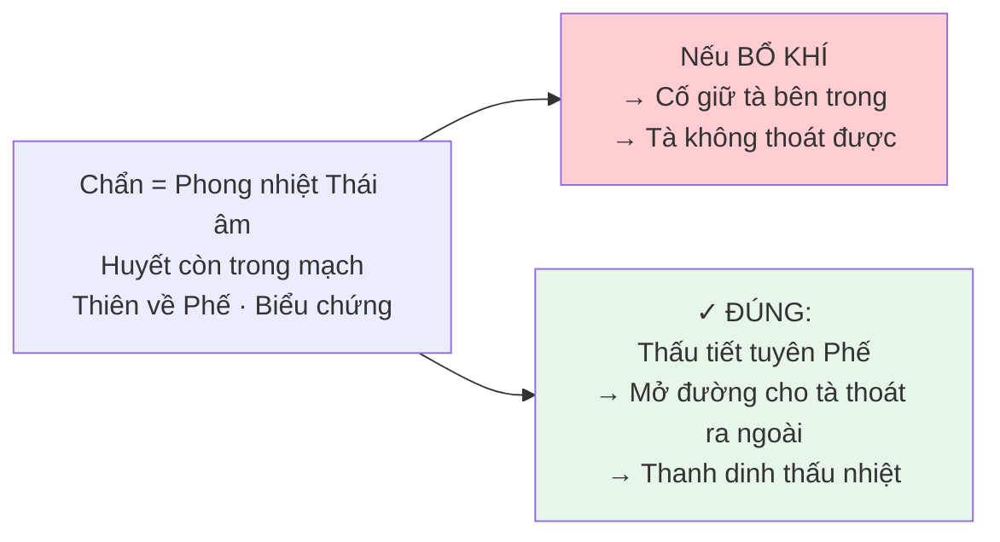
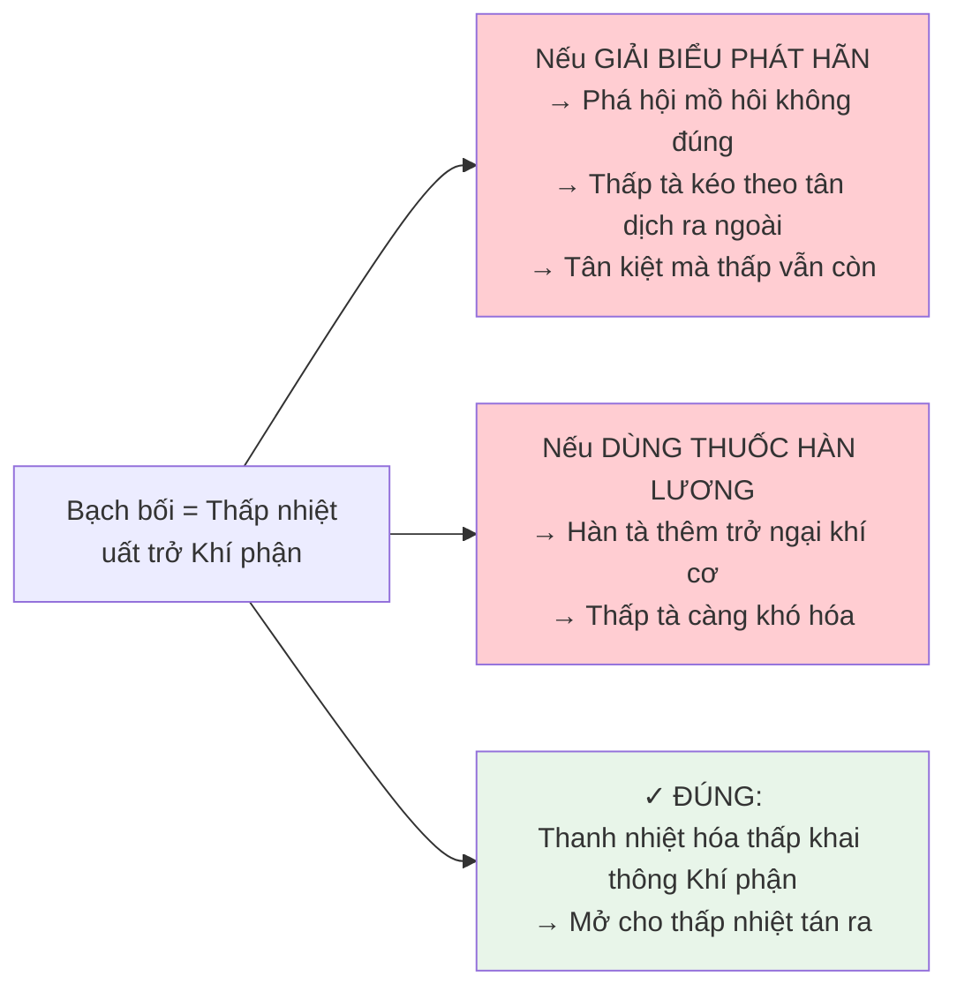

import { Aside, Tabs, TabItem } from '@astrojs/starlight/components';
import MedicalNote from '~/components/MedicalNote.astro';
import KeyPoints from '~/components/KeyPoints.astro';
import RedFlags from '~/components/RedFlags.astro';
import AlgorithmBox from '~/components/AlgorithmBox.astro';
import CompareTable from '~/components/CompareTable.astro';
import ClinicalPearl from '~/components/ClinicalPearl.astro';
import EvidenceBox from '~/components/EvidenceBox.astro';

## Mục tiêu bài giảng

1. Phân biệt **tức thì** Ban, Chẩn, Bạch Bối tại giường bệnh — chỉ bằng mắt và tay
2. Hiểu **nguồn gốc khác nhau** của từng loại (Dương minh / Thái âm / Khí phận thấp nhiệt)
3. Nắm **pháp trị đặc thù** — và những điều **tuyệt đối không làm** cho từng loại
4. Tránh 3 bẫy chẩn đoán hay gặp nhất

---

## Bảng So Sánh Toàn Diện

<CompareTable
  headers={["Tiêu chí", "BAN 斑", "CHẨN 疹", "BẠCH BỐI 白㾦"]}
  rows={[
    [
      "Hình thái",
      "Mảng phẳng, mọc chít chít thành đám\n• Nhìn thấy hình rõ\n• Sờ KHÔNG cộm\n• Khỏi KHÔNG tróc vảy",
      "Hạt nhỏ rải rác như hột mè, hột lúa\n• Sờ CỘM tay\n• Lặn có tróc vảy",
      "Mụn nước nhỏ chứa dịch nhầy trắng trong như thủy tinh\n• Mọc sau sốt vài ngày\n• Bay đi KHÔNG để dấu vết"
    ],
    [
      "Màu sắc",
      "Đỏ, hồng, tím, đen — tùy mức độ nhiệt độc",
      "Đỏ tươi hoặc hồng nhạt",
      "TRẮNG TRONG — không đỏ"
    ],
    [
      "Ấn tay vào",
      "KHÔNG đổi màu\n(huyết đã thoát mạch)",
      "MẤT màu rồi đỏ trở lại\n(huyết còn trong mạch)",
      "Xẹp / vỡ nhẹ\n(bọng nước)"
    ],
    [
      "Vị trí mọc",
      "Ngực · bụng · lưng · đầu mặt",
      "Họng → tai → đầu mặt → ngực\n(từ trên xuống)",
      "Cổ gáy · ngực · bụng\nKHÔNG thấy ở chân tay"
    ],
    [
      "Nguyên nhân YHCT",
      "Nhiệt uất ở Phế vị / từ cơ nhục xuất ra cơ biểu\n→ Thuộc DƯƠNG MINH, thiên về Vị (lý chứng)\n→ Nhiệt bế ở Khí, Dinh hay Huyết phận",
      "Nhiệt uất ở Phế vị / từ Huyết lạc mọc ra cơ biểu\n→ Thuộc THÁI ÂM, thiên về Phế (biểu chứng)\n→ Nhiệt bế Khí, Dinh hay Huyết phận",
      "Tà khí thấp nhiệt ở KHÍ PHẬN\n→ Mất khinh thanh khai tiết → uất lại\n→ Lâu ngày thành Bạch bối\n(Hoặc: Ôn nhiệt kiêm thấp + dùng nhầm thuốc tư âm → mồ hôi ra không ngớt → thấp nhiệt bộc phát)"
    ],
    [
      "Ý nghĩa lâm sàng",
      "Dấu hiệu tà khí thấu ra ngoài\n• Thấy ÍT → tà thấu ra được → THUẬN\n• Thấy NHIỀU → tà nặng quá → NGHỊCH",
      "Dấu hiệu tà khí thấu ra ngoài\n• Thấy ít → thuận\n• Thấy nhiều → nghịch",
      "• Bọng nước BÓNG CĂNG, trong suốt → tân dịch còn (tân khí sung) → THUẬN\n• Bọng nước KHÔ KHÔNG có nước, màu trắng đục → tân dịch khô kiệt, phế khí thoát → NGHỊCH (triệu chứng xấu)"
    ],
    [
      "Pháp trị",
      "• KHÔNG nên thanh nhiệt hay để thấu (làm thấu suốt)\n• NÊN thanh Vị → giải độc lương huyết",
      "• NÊN thấu tiết, KHÔNG nên bổ khí\n• NÊN tuyên Phế đạt là thanh dinh thấu nhiệt",
      "• KHÔNG nên giải biểu phát hãn\n• KHÔNG nên dùng thuốc hàn lương\n• NÊN thanh nhiệt hóa thấp khai thông Khí phận\n• Nếu tân dịch khô kiệt → bổ khí dưỡng âm"
    ]
  ]}
/>

---

## Sơ Đồ Nhận Diện Nhanh — Tại Giường Bệnh



---

## Hiểu Sâu Hơn — Tại Sao Pháp Trị Khác Nhau Hoàn Toàn?

### Ban — "Không nên để thấu, phải thanh vị lương huyết"



### Chẩn — "Nên thấu tiết, tuyên Phế thanh dinh"



<ClinicalPearl>
**Nghịch lý Ban vs Chẩn**:
- Ban nặng hơn (huyết đã thoát mạch) nhưng **không** cần thấu tiết — tà đã vào lý sâu, cần thanh vị lương huyết
- Chẩn nhẹ hơn (huyết còn trong mạch) nhưng **cần** thấu tiết — tà còn ở Thái âm Phế, có thể kéo ra ngoài

→ Không được áp dụng pháp trị của Ban cho Chẩn và ngược lại!
</ClinicalPearl>

### Bạch Bối — "Không phát hãn, không hàn lương, phải hóa thấp khai thông"



<MedicalNote title="Bẫy đặc biệt của Bạch Bối">
**Ôn nhiệt kiêm thấp + dùng nhầm thuốc tư âm → Bạch Bối**

Bệnh nhân Thấp Ôn sốt kéo dài → thầy thuốc lo ngại âm hư → cho thuốc tư âm (Sinh địa, Mạch đông…) → thuốc tư âm làm thấp tà thêm nê trệ, mồ hôi ra không ngớt → thấp nhiệt không thoát được → bọng nước bạch bối xuất hiện nhiều hơn.

→ Không phải bệnh tiến triển, mà là **do điều trị sai**. Ngưng tư âm, quay về hóa thấp.
</MedicalNote>

---

## Ba Bẫy Lâm Sàng Thường Gặp

<RedFlags title="Bẫy 1 — Nhầm Ban với Chẩn do không ấn tay kiểm tra">
Cả hai đều đỏ. Chỉ phân biệt được bằng **ấn tay**:
- Ấn vào → **vẫn đỏ** = Ban → lương huyết giải độc
- Ấn vào → **mất màu** rồi đỏ trở lại = Chẩn → thấu tiết tuyên Phế

Nhầm Ban thành Chẩn → dùng thấu tiết → kéo nhiệt tán loạn huyết → nặng hơn.
</RedFlags>

<RedFlags title="Bẫy 2 — Nhầm Bạch Bối bóng căng là không đáng lo">
Bạch bối bóng căng = tân khí sung = thuận. NHƯNG:
- Bạch bối **dày đặc** + bóng căng = thấp nhiệt tà rất nặng — cần điều trị tích cực dù "thuận"
- Bạch bối **khô xẹp** = tân khí kiệt — nguy, cần cấp cứu bổ khí dưỡng âm ngay

Đừng nhìn thấy "bạch bối = không đỏ = không nguy" mà bỏ qua trạng thái bọng nước.
</RedFlags>

<RedFlags title="Bẫy 3 — Dùng tư âm khi có Bạch Bối do Thấp Ôn">
Thấp Ôn sốt kéo dài → lo âm hư → cho thuốc tư âm → thấp tà nê trệ hơn → bạch bối tăng thêm, mồ hôi không dứt.

Dấu hiệu nhận ra: bạch bối xuất hiện sau khi dùng thuốc tư âm, kèm mồ hôi ra nhiều mà sốt không lui. Xử trí: ngưng tư âm, quay về hóa thấp.
</RedFlags>

---

## Phân Tầng Nặng Nhẹ Khi Khám

<AlgorithmBox title="Khi thấy ban chẩn / bạch bối — quy trình đánh giá 5 bước">
```
BƯỚC 1 — Phân loại (30 giây):
  Trắng trong, bọng nước → BẠCH BỐI
  Đỏ, ấn không mất màu, phẳng → BAN
  Đỏ, ấn mất màu, nổi cộm → CHẨN

BƯỚC 2 — Đánh giá mức độ:
  BAN: màu hồng hoạt → thuận; tím đen / đỏ ám → nghịch
  CHẨN: thưa → thuận; dày đặc → nghịch
  BẠCH BỐI: bóng căng → tân sung; khô xẹp → tân kiệt

BƯỚC 3 — Kiểm tra thần chí:
  Tỉnh táo → tương đối thuận
  Hôn mê / chiêm ngữ → thêm điểm nghịch

BƯỚC 4 — Kết hợp lưỡi:
  Ban + lưỡi tím khô = huyết nhiệt cực thịnh
  Chẩn + lưỡi đỏ thẫm = tà đang vào dinh
  Bạch bối khô + lưỡi đỏ bóng không rêu = tân âm song kiệt — cấp cứu

BƯỚC 5 — Chọn pháp trị:
  Ban → Thanh vị giải độc lương huyết
  Chẩn → Thấu tiết tuyên Phế, thanh dinh thấu nhiệt
  Bạch bối (thấp nhiệt) → Thanh nhiệt hóa thấp khai thông Khí phận
  Bạch bối (tân kiệt) → Bổ khí dưỡng âm + hóa thấp nhẹ
```
</AlgorithmBox>

---

## Ứng Dụng Theo Bệnh Cảnh Cụ Thể

<Tabs>
  <TabItem label="Xuất huyết Dengue">
    **Biểu hiện YHCT**: Ban đỏ tím dày, ấn không mất màu, ngực bụng

    **Phân tích**: Ban → Dương minh nhiệt độc bức huyết, huyết thoát mạch

    **Sắc trạch**: Hồng hoạt = nhẹ; đỏ tím = nặng; tím đen = nguy kịch

    **Pháp trị**: Thanh vị + lương huyết + cầm huyết — Tê giác địa hoàng thang gia giảm

    **Tuyệt đối không**: Phát hãn, thấu tiết (làm tán loạn huyết thêm)
  </TabItem>
  <TabItem label="Sởi (Phong chẩn)">
    **Biểu hiện YHCT**: Chẩn đỏ, nổi cộm, từ đầu mặt → ngực → toàn thân, ấn mất màu

    **Phân tích**: Chẩn → Thái âm phong nhiệt, thiên về Phế, tà đang thoát ra

    **Thuận/Nghịch**: Chẩn mọc đủ, tươi → thuận (tà ra được); chẩn khó mọc, nhạt → nghịch

    **Pháp trị**: Tuyên Phế thấu chẩn — Ngân kiều tán gia Ngưu bàng, Thuyền thoái, Phù bình

    **Tuyệt đối không**: Bổ khí (giữ tà lại), dùng thuốc thu liễm
  </TabItem>
  <TabItem label="Thấp Ôn kéo dài">
    **Biểu hiện YHCT**: Bạch bối vùng ngực bụng, trắng trong, mọc sau sốt

    **Phân tích**: Khí phận thấp nhiệt uất trở → tân dịch bị ép ra da

    **Đánh giá tân khí**: Bóng căng = còn tân; khô xẹp = tân kiệt

    **Pháp trị**: Hóa thấp khai thông — Cam lộ tiêu độc đan / Tam nhân thang

    **Tuyệt đối không**: Phát hãn giải biểu, thuốc hàn lương, thuốc tư âm nê trệ
  </TabItem>
</Tabs>

---

## Câu Hỏi Tư Duy Lâm Sàng

1. **Bệnh nhân sốt 5 ngày, ngực bụng có nhiều nốt đỏ. Ấn vào một nốt → vẫn đỏ. Ấn nốt kia → mất màu rồi đỏ trở lại.** Giải thích: đây là gì? Tại sao cùng đỏ mà có hai phản ứng khác nhau? Pháp trị khác nhau thế nào?

2. **Bệnh nhân Thấp Ôn sốt 10 ngày. Thầy thuốc thấy lưỡi đỏ nhạt → cho Sinh địa, Mạch đông. Ngày 12: bạch bối xuất hiện dày, mồ hôi ra nhiều, sốt vẫn không lui.** Điều gì đã xảy ra? Xử trí?

3. **Tại sao Ban cần "thanh vị" (không phải chỉ lương huyết) mà Chẩn cần "tuyên Phế" (không phải bổ khí)?** Giải thích theo tạng phủ kinh lạc.

4. **So sánh ý nghĩa "thuận/nghịch" của Ban Chẩn vs Bạch Bối**: Tại sao Bạch Bối "nhiều" không nhất thiết là xấu (khác Ban Chẩn)?

---

<KeyPoints title="Bảng nhớ nhanh — 3×5">
|  | **BAN** | **CHẨN** | **BẠCH BỐI** |
|---|---|---|---|
| **Màu** | Đỏ/tím | Đỏ tươi | Trắng trong |
| **Sờ** | Phẳng, không cộm | Nổi cộm | Bọng nước |
| **Ấn** | Không đổi màu | Mất màu | Xẹp/vỡ |
| **Gốc** | Dương minh · Lý · Huyết phận | Thái âm · Phế · Biểu | Khí phận · Thấp nhiệt |
| **Trị** | Thanh vị + Lương huyết | Thấu tiết + Tuyên Phế | Hóa thấp khai thông Khí phận |

**3 điều KHÔNG làm**:
- Ban → **không** để thấu / không phát tán
- Chẩn → **không** bổ khí / không thu liễm
- Bạch bối → **không** phát hãn / không hàn lương / không tư âm nê trệ

**Biện tân khí qua Bạch bối**:
- Bóng căng trong = **Tân khí SUNG** → thuận
- Khô xẹp đục = **Tân khí KIỆT** → nguy
</KeyPoints>
