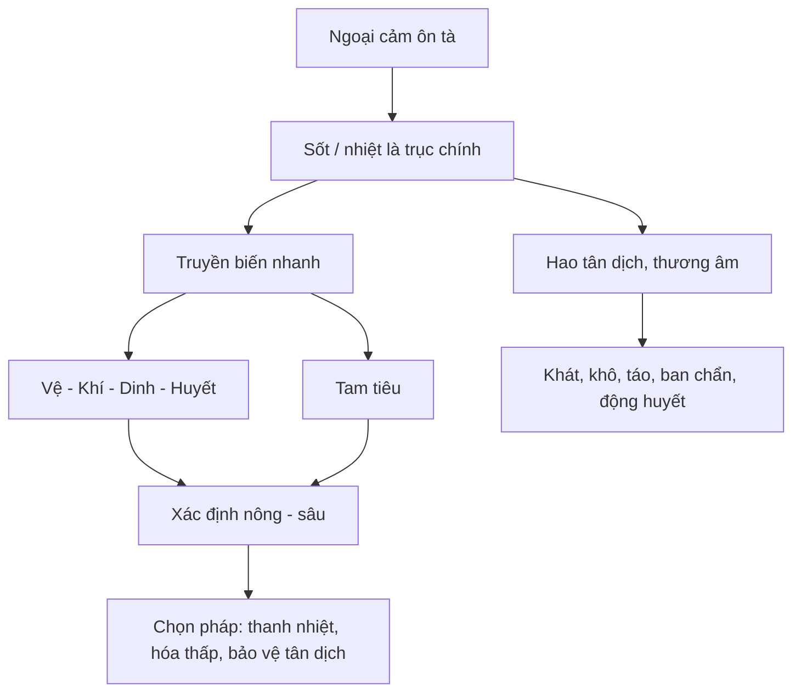

import KeyPoints from '~/components/KeyPoints.astro';
import CompareTable from '~/components/CompareTable.astro';
import ClinicalPearl from '~/components/ClinicalPearl.astro';
import MedicalNote from '~/components/MedicalNote.astro';
import RedFlags from '~/components/RedFlags.astro';
import SelfCheck from '~/components/SelfCheck.astro';
import SourceNote from '~/components/SourceNote.astro';

## Cách dùng trang này

Đọc theo 3 lượt:

1. Nắm **5 ý lõi** ở đầu bài.
2. Dùng **khung 5 câu hỏi** để đọc mọi bệnh Ôn bệnh về sau.
3. Tự kiểm bằng **case mini** và phần **bẫy dễ nhầm**.

<KeyPoints title="20% cốt lõi tạo 80% giá trị">

- **Ôn bệnh = ngoại cảm nhiệt bệnh cấp tính do ôn tà**, lấy sốt/nhiệt làm trục, dễ truyền nhanh và dễ hao tân dịch, thương âm.
- **Ôn tà khác hàn tà**: ôn tà thiên nhiệt, dễ hóa táo, dễ vào sâu; vì vậy không thể dùng máy móc khung phát hãn tân ôn của Thương hàn.
- **Đọc Ôn bệnh bằng bản đồ tầng bệnh**: vệ, khí, dinh, huyết và tam tiêu giúp biết tà còn nông hay đã vào sâu.
- **Phân loại là công cụ ra quyết định**, không phải học thuộc tên bệnh: ôn nhiệt/thấp nhiệt, tân cảm/phục tà, phế vệ/tỳ vị/trung hạ tiêu.
- **Mục tiêu học bài này** là có một bộ lọc để đọc case sốt cấp: tà gì, vào đâu, nhanh hay dai dẳng, đe dọa tân dịch/huyết/thần chí chưa.

</KeyPoints>

## Một câu nắm bài

<MedicalNote title="Câu lõi">

Ôn bệnh học là hệ tư duy giúp đọc các bệnh sốt cấp có tính nhiệt: nhận diện ôn tà, theo dõi đường truyền biến từ nông vào sâu, bảo vệ tân dịch/âm huyết, và chọn phép trị khác với ngoại cảm hàn tà.

</MedicalNote>

## Sơ đồ 80/20

## Mục lục học nhanh

<CompareTable title="Đọc theo giá trị">

| Nếu bạn cần | Đọc phần | Giá trị đem lại |
| --- | --- | --- |
| Nắm bài trong 3 phút | 20% cốt lõi + một câu nắm bài | Biết chương này dùng để làm gì. |
| Áp dụng vào case | Khung 5 câu hỏi | Biến lý thuyết thành thao tác phân tích bệnh sốt. |
| Ôn thi / hỏi nhanh | Bảng phân loại + bẫy dễ nhầm | Tránh nhầm Ôn bệnh, Ôn dịch, Thương hàn, thấp nhiệt. |
| Học sâu | Dòng phát triển + học tiếp | Hiểu vì sao Ôn bệnh học tách khỏi Thương hàn học. |

</CompareTable>

## Khung 5 câu hỏi khi gặp case sốt cấp

<CompareTable title="Framework áp dụng ngay">

| Câu hỏi | Ý nghĩa | Dấu hiệu cần tìm |
| --- | --- | --- |
| 1. Đây có phải ngoại cảm nhiệt bệnh không? | Xác định có nằm trong phạm vi Ôn bệnh. | Sốt, khát, nhiệt rõ, bệnh cấp, bối cảnh mùa/dịch/tà khí. |
| 2. Tà thuộc ôn nhiệt hay thấp nhiệt? | Quyết định bệnh nhanh-khô hay dai dẳng-dính trệ. | Ôn nhiệt: sốt rõ, khát, khô; thấp nhiệt: nặng mình, tức đầy, rêu nhớt, sốt không rõ hoặc dai dẳng. |
| 3. Tân cảm hay phục tà? | Hiểu điểm khởi phát: biểu hay lý. | Tân cảm: biểu nhiệt; phục tà: mới khởi đã lý nhiệt. |
| 4. Bệnh vị ở đâu? | Định hướng vệ khí dinh huyết/tam tiêu. | Phế vệ: ho, họng, mũi; trung tiêu: tỳ vị, thấp; dinh huyết: ban, xuất huyết, thần chí. |
| 5. Có dấu vào sâu chưa? | Nhận nguy cơ nặng và chọn ưu tiên xử trí. | Ban chẩn, động huyết, co giật, mê sảng, bế khiếu, khô táo rõ. |

</CompareTable>

<ClinicalPearl>

Mẫu ghi nhớ một dòng cho mọi bệnh về sau: **Bệnh do ... tà, thuộc ... nhiệt, khởi theo ... cảm, bệnh vị ban đầu ở ..., nguy cơ chính là ...**.

</ClinicalPearl>

## Ranh giới bắt buộc: Ôn bệnh và Thương hàn

Phân biệt Ôn bệnh với Thương hàn không phải là bài phụ. Đây là một phần lõi của đại cương, vì nó quyết định ngay từ đầu: đang gặp **ôn tà thiên nhiệt** hay **hàn tà tại biểu**, nên dùng hướng **tân lương** hay **tân ôn**.

<CompareTable title="Phong ôn và Thương hàn nghĩa hẹp">

| Mặt so sánh | Phong ôn trong Ôn bệnh học | Thương hàn trong Thương hàn luận |
| --- | --- | --- |
| Nguyên nhân | Phong nhiệt bệnh tà, thuộc ôn tà | Phong hàn bệnh tà |
| Đường xâm nhập | Thường từ miệng mũi, trước phạm phế vệ | Từ da lông/cơ biểu, khởi ở biểu hàn |
| Bệnh cơ | Dương tà, biến nhiệt nhanh, dễ hóa táo thương âm | Hàn thúc cơ biểu, vệ dương bị uất, sau đó mới hóa nhiệt nhập lý |
| Khởi đầu | Sốt, hơi sợ gió/lạnh, khát, ho, đầu lưỡi đỏ, mạch phù sác | Sợ lạnh rõ kèm sốt, đau đầu, đau mình, rêu trắng mỏng, mạch phù khẩn |
| Trị ban đầu | Tân lương giải biểu, bảo vệ tân dịch | Tân ôn giải biểu khi còn biểu hàn |

</CompareTable>

<ClinicalPearl>

Nếu người bệnh sốt mà **khát, họng đỏ, ho, đầu lưỡi đỏ, mạch phù sác**, hãy nghĩ ôn tà phạm phế vệ. Nếu **sợ lạnh rõ, đau mình nhiều, không khát, mạch phù khẩn**, hãy nghĩ biểu hàn. Cùng là sốt ngoại cảm nhưng phép trị ban đầu không giống nhau.

</ClinicalPearl>

## Những khái niệm phải chốt

<CompareTable title="Bảng nén kiến thức">

| Khái niệm | Hiểu đơn giản | Vì sao thuộc 20% quan trọng nhất |
| --- | --- | --- |
| Ôn bệnh | Ngoại cảm nhiệt bệnh cấp do ôn tà. | Là cửa vào của toàn bộ môn học. |
| Ôn tà | Tà khí có tính ôn nhiệt. | Giải thích sốt, truyền nhanh, hóa táo, thương âm. |
| Ôn dịch | Ôn bệnh có tính lây lan/lưu hành mạnh, nhiều người mắc. | Nối Ôn bệnh học với dự phòng và bối cảnh cộng đồng. |
| Ôn nhiệt | Nhiệt là chính, bệnh nhanh, dễ khô và thương tân. | Quyết định hướng thanh nhiệt, bảo vệ tân dịch. |
| Thấp nhiệt | Thấp + nhiệt uất kết, bệnh dai dẳng. | Nếu bỏ thấp mà chỉ thanh nhiệt, bệnh dễ kéo dài. |
| Tân cảm | Cảm tà rồi phát ngay, thường còn biểu. | Giúp đọc giai đoạn đầu của phong ôn, thu táo... |
| Phục tà | Tà ẩn phục rồi phát, khởi thiên lý nhiệt. | Giúp đọc xuân ôn, phục thử và các ca mới vào đã nặng. |
| Vệ khí dinh huyết | Bản đồ nông sâu của nhiệt tà. | Là công cụ phân tầng nguy cơ trong Ôn bệnh. |
| Tam tiêu | Bản đồ vị trí bệnh theo thượng, trung, hạ tiêu. | Giúp nối bệnh vị với trị pháp. |

</CompareTable>

## Phân loại không học thuộc máy móc

<CompareTable title="Phân loại dùng để ra quyết định">

| Trục | Nhánh | Khi gặp case, hỏi gì? | Ví dụ |
| --- | --- | --- | --- |
| Tính chất | Ôn nhiệt | Nhiệt có rõ, khô, khát, truyền nhanh không? | Phong ôn, xuân ôn, thử ôn, thu táo. |
| Tính chất | Thấp nhiệt | Có nặng mình, rêu nhớt, tức đầy, bệnh dai dẳng không? | Thấp ôn, thử thấp, phục thử, hoắc loạn. |
| Phát bệnh | Tân cảm | Cảm tà rồi phát ngay, còn biểu nhiệt không? | Phong ôn, thu táo, đại đầu ôn. |
| Phát bệnh | Phục tà | Mới khởi đã lý nhiệt, không rõ biểu không? | Xuân ôn, phục thử. |
| Bệnh vị | Phế vệ | Ho, họng, mũi, sốt, phế vệ bị phạm không? | Phong ôn, thu táo. |
| Bệnh vị | Tỳ vị/trung tiêu | Thấp trọc, tiêu hóa, rêu nhớt nổi bật không? | Thấp ôn, thử thấp. |

</CompareTable>

## Vì sao lịch sử đáng nhớ?

<CompareTable title="Dòng phát triển chỉ cần nhớ phần tạo giá trị">

| Mốc | Giá trị thật sự |
| --- | --- |
| Nội kinh, Nạn kinh, Thương hàn luận | Đặt nền cho ngoại cảm nhiệt bệnh nhưng Ôn bệnh còn chưa tách rõ. |
| Tống - Kim - Nguyên | Nhận ra dùng phép Thương hàn cho mọi bệnh nhiệt là không đủ. |
| Minh | Tân cảm, phục tà, Ôn dịch, lệ khí và đường mũi miệng được nhấn mạnh. |
| Thanh | Ôn bệnh học thành hệ thống: Diệp Thiên Sĩ với vệ khí dinh huyết, Ngô Cúc Thông với tam tiêu, Tiết Sinh Bạch với thấp nhiệt. |

</CompareTable>

Điểm cần rút: lịch sử không phải để nhớ tên người, mà để hiểu **vì sao Ôn bệnh học cần bản đồ riêng cho bệnh nhiệt cấp**.

## Bẫy dễ nhầm

<RedFlags title="Các lỗi làm học sai chương này">

- Nhầm **Ôn bệnh** với mọi bệnh truyền nhiễm hiện đại. Đúng hơn: nhiều bệnh nhiễm cấp có thể thuộc phạm vi Ôn bệnh nếu biểu hiện chứng hậu phù hợp.
- Nhầm **Ôn bệnh** với **Ôn dịch**. Ôn dịch là loại có tính lây lan/lưu hành mạnh.
- Thấy sốt là quy ngay vào Ôn bệnh hoặc dùng chung phép Thương hàn mà không xét hàn/nhiệt, thấp/nhiệt, biểu/lý.
- Nhầm biểu nhiệt của Ôn bệnh với biểu hàn của Thương hàn, dẫn đến phát hãn tân ôn quá mạnh và hao tân dịch.
- Học phân loại như danh sách tên bệnh, không dùng nó để hỏi: bệnh nhanh hay dai, khô hay thấp, nông hay sâu.
- Quên nguy cơ thương âm tân, nên không theo dõi khát, khô, táo, ban, xuất huyết, thần chí.

</RedFlags>

## Case mini để tự áp dụng

<MedicalNote title="Tình huống">

Một người bệnh sốt cấp, khát, ho, hơi sợ lạnh, ít mồ hôi, đầu lưỡi đỏ. Cùng ngày, một người khác sốt dai dẳng, nặng mình, tức ngực bụng, rêu lưỡi nhớt.

</MedicalNote>

<CompareTable title="Cách đọc theo khung 80/20">

| Người bệnh | Đọc nhanh theo Ôn bệnh học | Ý nghĩa |
| --- | --- | --- |
| Sốt cấp, khát, ho, đầu lưỡi đỏ | Thiên phong ôn/phế vệ, ôn nhiệt, tân cảm | Nghĩ biểu nhiệt, phế vệ bị phạm; tránh nhầm biểu hàn thuần túy. |
| Sốt dai dẳng, nặng mình, tức đầy, rêu nhớt | Thiên thấp nhiệt | Không chỉ thanh nhiệt; phải nghĩ thấp bế nhiệt, bệnh dễ kéo dài. |

</CompareTable>

## Liên hệ YHHĐ đúng cách

Nhiều bệnh như cúm, sởi, quai bị, sốt xuất huyết, viêm não, nhiễm trùng huyết, bệnh đường ruột hoặc sốt rét có thể được đọc trong phạm vi Ôn bệnh khi biểu hiện sốt, độc nhiệt, ban chẩn, xuất huyết, rối loạn thần chí hoặc hao tân dịch. Nhưng tên bệnh YHHĐ không thay thế biện chứng YHCT.

<ClinicalPearl title="Cách tích hợp">

YHHĐ giúp xác định bệnh, mức độ nguy hiểm, xét nghiệm và xử trí cấp cứu. Ôn bệnh học giúp đọc chứng hậu: tà gì, ở tầng nào, truyền biến ra sao, và pháp trị YHCT nên ưu tiên gì.

</ClinicalPearl>

## Học tiếp theo thứ tự nào?

<CompareTable title="Lộ trình sau bài này">

| Bước | Học gì | Vì sao |
| --- | --- | --- |
| 1 | Nguyên nhân bệnh và phát bệnh | Hiểu các loại ôn tà và cơ chế xâm nhập. |
| 2 | Biện chứng vệ khí dinh huyết và tam tiêu | Có bản đồ nông sâu để đọc ca nặng. |
| 3 | Chẩn đoán Ôn bệnh | Chuyển lý thuyết thành dấu hiệu lưỡi, mạch, ban, thần chí. |
| 4 | Bệnh cụ thể: phong ôn, xuân ôn, thử thấp... | Dùng framework này để đọc từng bệnh. |

</CompareTable>

## Tự kiểm 80/20

<SelfCheck title="Nếu trả lời được, coi như nắm chương">

1. Ôn bệnh khác ngoại cảm hàn tà ở điểm quyết định nào?
2. Vì sao thấp nhiệt làm bệnh dai dẳng hơn ôn nhiệt?
3. Khi gặp bệnh sốt cấp, 5 câu hỏi nào giúp bạn định hướng theo Ôn bệnh học?
4. Dấu hiệu nào cho thấy nhiệt tà đã có nguy cơ vào sâu hoặc làm tổn thương tân dịch/huyết/thần chí?
5. Tại sao tên bệnh YHHĐ không đủ để quyết định chứng Ôn bệnh?
6. Phân biệt lúc khởi phát giữa biểu hàn Thương hàn và phế vệ Ôn bệnh bằng 3 dấu hiệu.

</SelfCheck>

<SourceNote>

- Nguồn chính: `Raw/on_benh_dai_cuong/01_ly-thuyet/bai-01-dai-cuong-on-benh_001.md`
- Phần phân biệt Ôn bệnh - Thương hàn nằm ở chunk tiếp theo: `Raw/on_benh_dai_cuong/01_ly-thuyet/bai-01-dai-cuong-on-benh_002.md`
- Bản này ưu tiên học nhanh và áp dụng; đọc bản hiểu sâu nếu cần giải thích thêm cơ chế.

</SourceNote>
