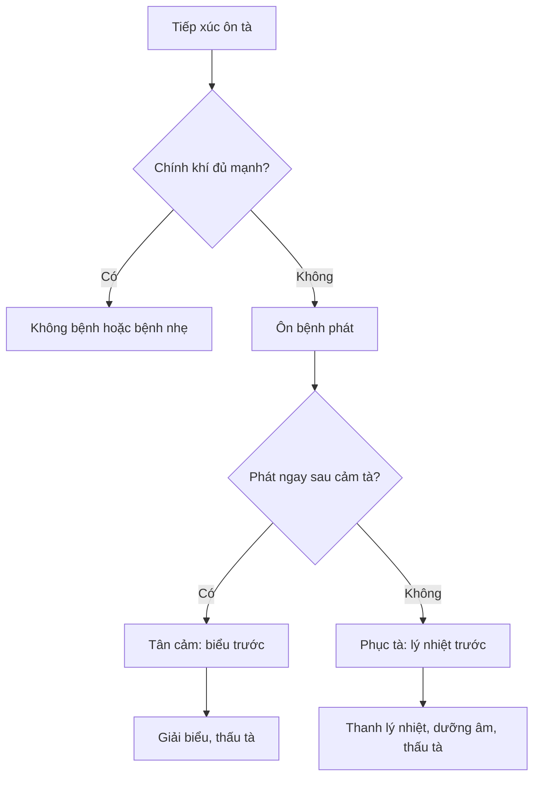

import KeyPoints from '~/components/KeyPoints.astro';
import CompareTable from '~/components/CompareTable.astro';
import MedicalNote from '~/components/MedicalNote.astro';
import RedFlags from '~/components/RedFlags.astro';
import SelfCheck from '~/components/SelfCheck.astro';
import SourceNote from '~/components/SourceNote.astro';

## 20% cốt lõi

<KeyPoints title="Nắm 7 ý này là đọc được phần lớn chương">

- **Ôn tà là nguyên nhân trực tiếp** của Ôn bệnh: có tính ôn nhiệt, từ ngoài vào, thường qua mũi miệng hoặc da lông, làm rối loạn vệ-khí-dinh-huyết và tam tiêu.
- **Có tà chưa chắc phát bệnh**: phát hay không tùy tương quan giữa tà khí và chính khí. Chính khí suy, âm dịch kém, tỳ vị yếu, lao lực hoặc thất tình làm bệnh dễ phát và dễ nặng.
- **Thẩm chứng cầu nhân** là cách học chương này: nhìn biểu hiện để suy loại tà, rồi từ loại tà chọn pháp trị.
- **Ôn tà không chỉ một loại**: phong nhiệt phạm phế vệ; thử nhiệt vào dương minh và hao khí tân; thấp nhiệt khốn tỳ vị; táo nhiệt thương phế; ôn nhiệt phát từ lý; ôn độc/lệ khí gây nặng và lây.
- **Đường vào định hướng tạng phủ đầu tiên**: mũi miệng thường liên quan phế-vị; ăn uống liên quan tỳ-vị; tiếp xúc/độc tà liên quan da, hầu họng, huyết lạc.
- **Tân cảm và phục tà là điểm rẽ lớn nhất**: tân cảm phát ngay, thường từ biểu; phục tà ẩn trước rồi phát, thường từ lý nhiệt.
- **Ý nghĩa lâm sàng**: đừng học nguyên nhân như danh mục. Hãy dùng nó để trả lời: tà gì, vào đâu, vì sao phát, đang biểu hay lý, nên thấu tà hay thanh lý nhiệt.

</KeyPoints>

## Một câu nắm bài

<MedicalNote title="Câu lõi">
Ôn bệnh phát sinh khi **ôn tà gặp điều kiện thuận lợi trong cơ thể và hoàn cảnh**, rồi biểu hiện theo đường vào, loại tà và kiểu phát bệnh tân cảm hay phục tà.
</MedicalNote>

## Sơ đồ quyết định

## Nhận diện nhanh các nhóm ôn tà

<CompareTable title="Từ dấu hiệu suy nguyên nhân">

| Nhóm tà | Dấu hiệu 80/20 | Gợi ý bệnh cơ |
| --- | --- | --- |
| Phong nhiệt | Sốt, hơi ố phong, ho, đau họng, đầu lưỡi đỏ | Phạm phế vệ, truyền nhanh |
| Thử nhiệt | Sốt cao, mồ hôi nhiều, khát, mặt đỏ, mạch hồng đại | Vào dương minh, hao khí tân |
| Thấp nhiệt | Nặng đầu mình, tức ngực, đầy bụng, rêu nê, bệnh dai dẳng | Khốn tỳ vị, bế khí cơ |
| Táo nhiệt | Ho khan, ít đàm, mũi họng khô, đại tiện táo | Thương phế vị âm tân |
| Ôn nhiệt phục tà | Sơ khởi đã sốt cao, phiền khát, tiểu đỏ, lưỡi đỏ | Lý nhiệt tích thịnh |
| Ôn độc / lệ khí | Phát cấp, nặng, lây lan, sưng đau, ban chẩn hoặc hầu họng | Độc nhiệt, có tính dịch |

</CompareTable>

## Bẫy dễ nhầm

<RedFlags>
- Nhầm **tân cảm** với **phục tà** chỉ vì cả hai đều sốt: hãy nhìn bệnh khởi từ biểu hay từ lý.
- Thấy có biểu chứng rồi phát hãn mạnh: nếu nền là phục tà lý nhiệt, cách này dễ hao tân thương âm.
- Học ôn độc/lệ khí như một loại tà cá nhân: phần này phải nghĩ thêm về lây lan, cách ly, phòng dịch.
</RedFlags>

## Tự kiểm

<SelfCheck>
1. Một bệnh nhân sốt cao, khát, lưỡi đỏ ngay từ đầu nhưng không rõ ố phong: vì sao nghi phục tà hơn tân cảm?
2. Vì sao thấp nhiệt làm bệnh dai dẳng hơn phong nhiệt?
3. Khi nhiều người cùng mắc một bệnh sốt cấp giống nhau, khung nguyên nhân phải đổi như thế nào?
</SelfCheck>

<SourceNote>
- Nguồn: `Raw/on_benh_dai_cuong/01_ly-thuyet/bai-02-nguyen-nhan-phat-benh_001.md`, `_002.md`, `_003.md`
</SourceNote>
