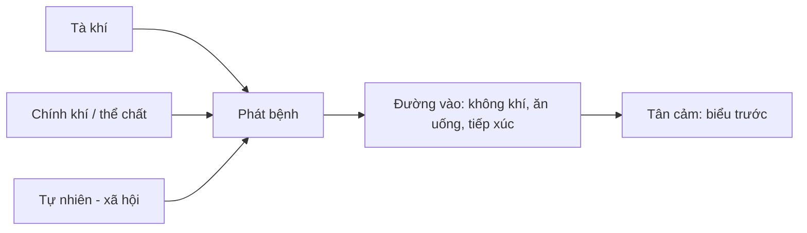

import KeyPoints from '~/components/KeyPoints.astro';
import CompareTable from '~/components/CompareTable.astro';
import MedicalNote from '~/components/MedicalNote.astro';
import RedFlags from '~/components/RedFlags.astro';
import SelfCheck from '~/components/SelfCheck.astro';
import SourceNote from '~/components/SourceNote.astro';

## 20% cốt lõi

<KeyPoints title="Nắm phần này để đọc đúng nhóm ôn tà">

- **Táo nhiệt**: khô + nhiệt, chủ yếu phạm phế, gây ho khan, ít đàm, mũi họng khô, môi da khô, đại tiện táo.
- **Ôn nhiệt bệnh tà**: thường liên quan xuân ôn, bản chất là lý nhiệt nội phục được kích phát, nên bệnh có thể khởi đầu đã ở khí/dinh/huyết.
- **Ôn độc**: ôn tà có độc tính mạnh, dễ công xuyên, uẩn kết, gây sưng nóng đỏ đau, ban chẩn, hầu họng hoặc thần chí.
- **Lệ khí**: tính lây nhiễm mạnh, phát cấp, dễ thành dịch; phải nghĩ đồng thời điều trị cá nhân và kiểm soát lây lan.
- **Cơ chế phát bệnh** không chỉ do tà: thể chất, thất tình, lao dật, ăn uống, khí hậu, môi trường và xã hội đều làm bệnh phát hoặc nặng thêm.
- **Tân cảm ôn bệnh** là cảm tà rồi phát ngay, thường khởi tại biểu và đi từ biểu vào lý.

</KeyPoints>

## Một câu nắm bài

<MedicalNote title="Câu lõi">
Phần này chuyển người học từ “biết tên ôn tà” sang “đọc được kiểu bệnh”: khô thương phế, lý nhiệt phục sẵn, độc nhiệt lây lan, hay tân cảm phát từ biểu.
</MedicalNote>

## Bảng nhận diện nhanh

<CompareTable title="Mỗi nhóm nhớ một trục">

| Nội dung | Trục nhớ | Dấu hiệu / ý nghĩa |
| --- | --- | --- |
| Táo nhiệt | Khô ở phế | Ho khan, ít đàm, mũi họng khô, rêu ít tân dịch |
| Ôn nhiệt | Lý nhiệt nội phục | Sốt cao, phiền khát, tiểu đỏ, lưỡi đỏ, dễ vào dinh huyết |
| Ôn độc | Độc nhiệt uẩn kết | Sưng đau, ban chẩn, hầu họng, có thể bế khiếu động phong |
| Lệ khí | Lây mạnh thành dịch | Nhiều người cùng mắc, phát cấp, bệnh nặng, cần phòng dịch |
| Tân cảm | Phát ngay sau cảm tà | Biểu chứng trước, sau đó từ biểu nhập lý |

</CompareTable>

## Cơ chế phát bệnh theo 3 tầng

## Bẫy dễ nhầm

<RedFlags>
- Không đồng nhất **ôn nhiệt bệnh tà** với toàn bộ **ôn tà**: ôn nhiệt chỉ là một nhóm trong ôn tà.
- Không xem **lệ khí** như phong nhiệt thông thường: khi có cụm ca bệnh, tư duy dịch tễ là bắt buộc.
- Không bỏ qua yếu tố thể chất: cùng một tà nhưng người âm hư, tỳ yếu, lao lực dễ bệnh sâu hơn.
</RedFlags>

## Tự kiểm

<SelfCheck>
1. Ho khan, mũi họng khô, ít đàm sau giai đoạn khô nóng gợi nhóm tà nào?
2. Dấu hiệu nào làm bạn chuyển từ nghĩ “ôn tà thường” sang “lệ khí/ôn dịch”?
3. Tân cảm khác phục tà ở điểm nào ngay từ lúc bệnh mới khởi?
</SelfCheck>

<SourceNote>
- Nguồn: `Raw/on_benh_dai_cuong/01_ly-thuyet/bai-02-nguyen-nhan-phat-benh_002.md`
</SourceNote>
