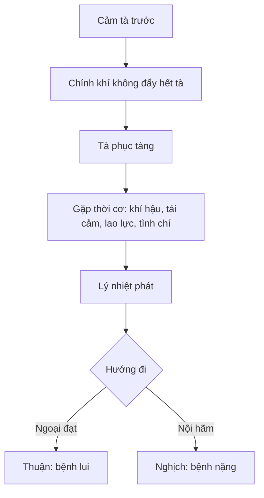

import KeyPoints from '~/components/KeyPoints.astro';
import CompareTable from '~/components/CompareTable.astro';
import MedicalNote from '~/components/MedicalNote.astro';
import RedFlags from '~/components/RedFlags.astro';
import SelfCheck from '~/components/SelfCheck.astro';
import SourceNote from '~/components/SourceNote.astro';

## 20% cốt lõi

<KeyPoints title="Nắm phục tà bằng 6 ý">

- **Phục tà** là tà đã cảm trước đó nhưng không phát ngay, phục tàng trong cơ thể, chờ thời cơ mới phát Ôn bệnh.
- Khi phát, bệnh thường **khởi từ lý**, nên ban đầu đã có sốt cao, phiền táo, khát, tiểu đỏ, lưỡi đỏ; nếu không có tái cảm thì có thể không thấy biểu chứng.
- **Người âm tinh bất túc, chính khí suy** dễ bị phục tà vì không đủ sức đẩy tà ra ngay từ đầu.
- Truyền biến có hai hướng: **từ lý đạt biểu** là thuận, bệnh giảm; **nội hãm sâu hơn** là nghịch, bệnh nặng và nhiều biến chứng.
- Điều trị sơ khởi không lấy phát hãn làm chính mà lấy **thanh tiết lý nhiệt** làm chủ, phối **dưỡng âm** và **thấu tà**.
- Học thuyết tân cảm bổ sung cho phục tà: không phải mọi Ôn bệnh đều do tà phục, nhiều bệnh là cảm tà rồi phát ngay.

</KeyPoints>

## Một câu nắm bài

<MedicalNote title="Câu lõi">
Phục tà là mô hình giải thích những ca Ôn bệnh **vừa khởi đã sâu**, không đi từ biểu rõ ràng, nên phải đọc theo lý nhiệt và chính khí chứ không xử trí như ngoại cảm mới đơn giản.
</MedicalNote>

## So sánh tân cảm và phục tà

<CompareTable title="Điểm rẽ học thuật và lâm sàng">

| Tiêu chí | Tân cảm | Phục tà |
| --- | --- | --- |
| Thời điểm phát | Cảm tà rồi phát ngay | Tà phục tàng, sau mới phát |
| Vị trí sơ khởi | Biểu, phế vệ thường rõ | Lý, khí/dinh/huyết thường rõ |
| Triệu chứng đầu | Sốt, hơi ố phong, ho, đau đầu | Sốt cao, phiền khát, tiểu đỏ, lưỡi đỏ |
| Truyền biến | Từ biểu vào lý | Từ lý đạt biểu hoặc nội hãm |
| Pháp sơ khởi | Giải biểu thấu tà | Thanh lý nhiệt, dưỡng âm, thấu tà |

</CompareTable>

## Sơ đồ phục tà

## Bẫy dễ nhầm

<RedFlags>
- Lấy “có hay không có sốt” để phân biệt là sai; cả hai đều sốt. Hãy nhìn **biểu trước hay lý trước**.
- Phục tà có thể kèm biểu chứng nếu bị tái cảm dẫn phát, nên đừng thấy biểu là loại trừ phục tà.
- Nếu thấu tà không hết, bệnh dễ lui rồi trở lại, biến chứng nhiều và khó khỏi.
</RedFlags>

## Tự kiểm

<SelfCheck>
1. Vì sao phục tà thường nặng và dài hơn tân cảm?
2. Dấu hiệu nào cho thấy phục tà đang “nội hãm” thay vì “ngoại đạt”?
3. Ba chữ “thanh, dưỡng, thấu” tương ứng với vấn đề bệnh cơ nào?
</SelfCheck>

<SourceNote>
- Nguồn: `Raw/on_benh_dai_cuong/01_ly-thuyet/bai-02-nguyen-nhan-phat-benh_003.md`
</SourceNote>
