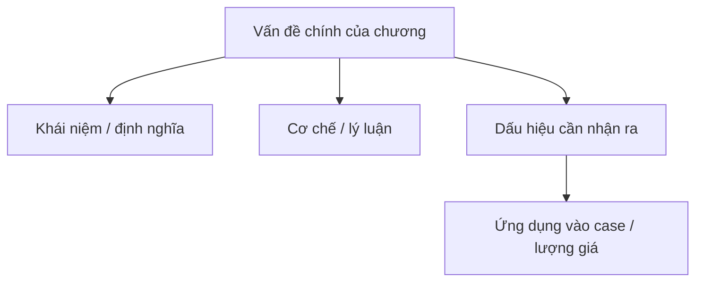

import KeyPoints from '~/components/KeyPoints.astro';
import CompareTable from '~/components/CompareTable.astro';
import ClinicalPearl from '~/components/ClinicalPearl.astro';
import SelfCheck from '~/components/SelfCheck.astro';
import SourceNote from '~/components/SourceNote.astro';

## Nắm nhanh theo 80/20

<KeyPoints title="20% cốt lõi cần nắm">

- 2.4.2. Phục tà ôn bệnh
- 3. NHẬN THỨC CỦA CÁC Y GIA NGÀY TRƯỚC VỀ NGUYÊN NHÂN CỦA ÔN BỆNH VÀ PHÁT BỆNH
- 3.1. Nguyên nhân bệnh
- 3.1.1. Lục dâm hóa hòa
- 3.1.2. Học thuyết tạp khí

</KeyPoints>

## Tóm tắt nhanh

Còn gọi là phục khí ôn bệnh, đơn giản gọi là “phục tà” là chỉ sau khi cảm tà không phát bệnh ngay mà tà khí phục tàng chờ thời cơ mà phát Ôn bệnh.

Sơ khởi biểu hiện chức nhiệt, phiền thao, miệng khát, tiểu đỏ, lưỡi đỏ... một loạt triệu chứng lý nhiệt nội uất.

## Sơ đồ 80/20

## Visual brief

<CompareTable title="Hình nên bổ sung khi biên tập">

| Loại hình | Khi dùng | Gợi ý tạo |
| --- | --- | --- |
| Sơ đồ Mermaid | Luồng cơ chế, phân loại, thuật toán | Dùng trực tiếp trong MDX. |
| SVG tự vẽ | Bảng phân tầng, timeline, bản đồ khái niệm cần kiểm soát chính xác | Tạo file SVG trong `public/assets/<sách>/` rồi nhúng. |
| Ảnh/illustration sinh bởi Codex | Cần minh họa sinh động, không cần độ chính xác giải phẫu tuyệt đối | Sinh ảnh rồi đặt vào `public/assets/<sách>/`, ghi chú là hình minh họa. |
| Hình y khoa từ nguồn | X-quang, mô bệnh học, biểu đồ nghiên cứu | Chỉ dùng khi có quyền/nguồn rõ; ưu tiên trích dẫn. |

</CompareTable>

## Bản đồ chương

<CompareTable title="Cấu trúc chương">

| Cấp | Mục | Cần rút theo 80/20 |
| --- | --- | --- |
| #### | 2.4.2. Phục tà ôn bệnh | Cần rút ý 80/20 |
| ### | 3. NHẬN THỨC CỦA CÁC Y GIA NGÀY TRƯỚC VỀ NGUYÊN NHÂN CỦA ÔN BỆNH VÀ PHÁT BỆNH | Cần rút ý 80/20 |
| #### | 3.1. Nguyên nhân bệnh | Cần rút ý 80/20 |
| #### | 3.1.1. Lục dâm hóa hòa | Cần rút ý 80/20 |
| #### | 3.1.2. Học thuyết tạp khí | Cần rút ý 80/20 |
| #### | 3.2. Phát bệnh | Cần rút ý 80/20 |

</CompareTable>

<ClinicalPearl>

- Khi biên tập, hãy viết lại phần này sao cho người học nắm được lõi chương trong 3-5 phút trước khi đọc bản hiểu sâu.

</ClinicalPearl>

## Tự kiểm

<SelfCheck>

1. 20% ý nào giúp hiểu phần lớn chương này?
2. Điểm nào dễ nhầm nhất khi áp dụng vào case?
3. Nếu phải vẽ một sơ đồ duy nhất cho chương này, sơ đồ đó nên thể hiện quan hệ nào?

</SelfCheck>

<SourceNote>

- Nguồn: `Raw/on_benh_dai_cuong/01_ly-thuyet/bai-02-nguyen-nhan-phat-benh_003.md`
- Gợi ý template: `deep-explanation`

</SourceNote>
