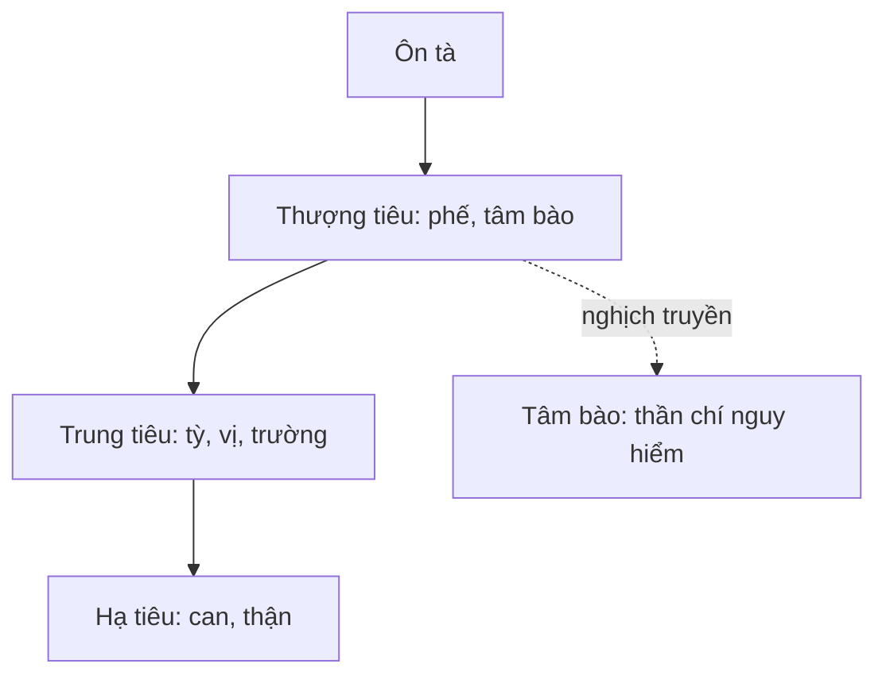

import KeyPoints from '~/components/KeyPoints.astro';
import CompareTable from '~/components/CompareTable.astro';
import MedicalNote from '~/components/MedicalNote.astro';
import RedFlags from '~/components/RedFlags.astro';
import SelfCheck from '~/components/SelfCheck.astro';
import SourceNote from '~/components/SourceNote.astro';

## 20% cốt lõi

<KeyPoints title="Hai bản đồ phải thuộc">

- Ôn bệnh biện chứng chủ yếu bằng hai bản đồ: **vệ-khí-dinh-huyết** và **tam tiêu**.
- Vệ-khí-dinh-huyết mô tả **độ sâu và mức nặng**: vệ còn nông, khí đã thịnh nhiệt, dinh ảnh hưởng tâm thần, huyết có xuất huyết/động phong.
- Tam tiêu mô tả **vị trí tạng phủ và đường lan**: thượng tiêu phế-tâm bào, trung tiêu tỳ-vị/trường, hạ tiêu can-thận.
- Pháp trị đi theo tầng bệnh: vệ thì tân lương giải biểu; khí thì thanh khí; dinh thì thanh dinh thấu nhiệt; huyết thì lương huyết tán huyết.
- Bệnh có thể truyền thuận, nghịch truyền, hoặc nhiều tầng đồng bệnh; vì vậy không học tuyến tính cứng.
- Mục tiêu của biện chứng là biết **tà ở đâu, sâu đến đâu, chính khí còn bao nhiêu**, rồi chọn pháp.

</KeyPoints>

## Một câu nắm bài

<MedicalNote title="Câu lõi">
Biện chứng Ôn bệnh là đặt bệnh nhân lên hai trục: **sâu-nông theo vệ khí dinh huyết** và **vị trí theo tam tiêu**.
</MedicalNote>

## Bảng tầng bệnh

<CompareTable title="Vệ khí dinh huyết">

| Tầng | Dấu hiệu lõi | Ý nghĩa | Pháp chính |
| --- | --- | --- | --- |
| Vệ | Sốt, hơi ố phong, ho, mạch phù sác | Tà còn nông ở phế vệ | Tân lương giải biểu |
| Khí | Sốt cao, khát, mồ hôi, không ố hàn | Lý nhiệt thịnh | Thanh khí tiết nhiệt |
| Dinh | Sốt đêm nặng, tâm phiền, mê sảng nhẹ, lưỡi đỏ thẫm | Nhiệt vào dinh, nhiễu tâm | Thanh dinh thấu nhiệt |
| Huyết | Ban chẩn, xuất huyết, co giật, hôn mê | Nhiệt động huyết, động phong | Lương huyết, tán huyết, tức phong |

</CompareTable>

## Tam tiêu để định vị

## Bẫy dễ nhầm

<RedFlags>
- Không dùng vệ-khí-dinh-huyết thay thế hoàn toàn tam tiêu; hai hệ bổ sung nhau.
- Không nghĩ bệnh luôn đi vệ rồi khí rồi dinh rồi huyết; phong ôn có thể nghịch truyền tâm bào, phục tà có thể phát từ lý.
- Thấy sốt giảm nhưng lưỡi đỏ khô, mạch hư: có thể tà lui nhưng âm dịch đã thương.
</RedFlags>

## Tự kiểm

<SelfCheck>
1. Vì sao sốt cao khát nhiều khác với sốt đêm nặng và mê sảng?
2. Một ca “tà ở khí phần, trung tiêu dương minh” nghĩa là gì?
3. Khi nào phải nghĩ nhiệt đã nhập huyết?
</SelfCheck>

<SourceNote>
- Nguồn: `Raw/on_benh_dai_cuong/01_ly-thuyet/bai-03-bien-chung_001.md`
</SourceNote>
