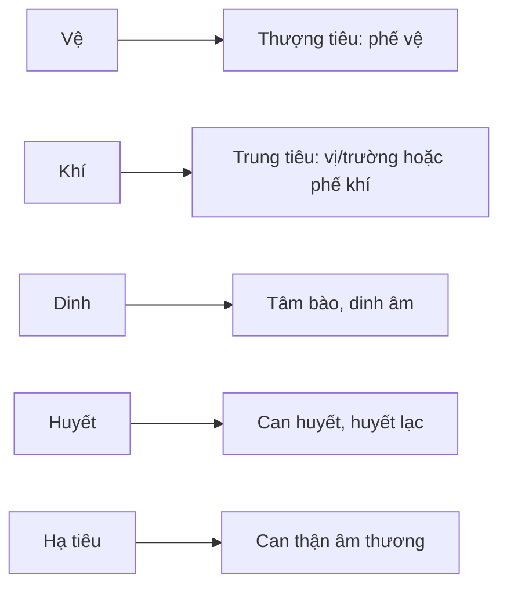

import KeyPoints from '~/components/KeyPoints.astro';
import CompareTable from '~/components/CompareTable.astro';
import MedicalNote from '~/components/MedicalNote.astro';
import SelfCheck from '~/components/SelfCheck.astro';
import SourceNote from '~/components/SourceNote.astro';

## 20% cốt lõi

<KeyPoints title="Cách ghép hai bản đồ">

- **Vệ-khí-dinh-huyết** trả lời: tà nông hay sâu, nhiệt thịnh ở mức nào, đã chạm thần chí/huyết lạc chưa.
- **Tam tiêu** trả lời: bệnh đang ở phế, tâm bào, tỳ vị, trường, can hay thận.
- Thượng tiêu thường liên quan **phế vệ** và **tâm bào**; trung tiêu thường liên quan **khí phần dương minh** hoặc **thấp khốn tỳ**; hạ tiêu thường liên quan **can thận âm thương**.
- Một chẩn đoán tốt nên nói được cả hai: ví dụ “khí phần, trung tiêu dương minh” hoặc “dinh phần, nhiệt nhập tâm bào”.
- Tam tiêu còn giúp hiểu đường truyền: từ thượng xuống trung/hạ, hoặc nghịch truyền vào tâm bào.

</KeyPoints>

## Một câu nắm bài

<MedicalNote title="Câu lõi">
Vệ-khí-dinh-huyết là **chiều sâu**, tam tiêu là **địa chỉ**; phối hợp cả hai mới đọc được bệnh cảnh Ôn bệnh đầy đủ.
</MedicalNote>

## Bảng phối hợp

<CompareTable title="Một câu chẩn đoán nên có 2 phần">

| Câu hỏi | Hệ dùng | Ví dụ trả lời |
| --- | --- | --- |
| Tà đã sâu đến đâu? | Vệ-khí-dinh-huyết | Vệ phần, khí phần, dinh phần, huyết phần |
| Bệnh ở tạng phủ/vùng nào? | Tam tiêu | Phế vệ, dương minh vị-trường, tâm bào, can thận |
| Nguy hiểm chính là gì? | Cả hai | Nghịch truyền tâm bào, nhiệt động huyết, âm hư phong động |
| Pháp trị nên chọn gì? | Cả hai | Thanh khí, thanh dinh, lương huyết, tuyên phế, hóa thấp |

</CompareTable>

## Sơ đồ liên hệ

## Tự kiểm

<SelfCheck>
1. Vì sao nói “dinh phần” chưa đủ nếu không biết có tâm bào hay chưa?
2. “Thấp nhiệt trung tiêu” thường biểu hiện khác “nhiệt thịnh dương minh” thế nào?
3. Một ca co giật cuối bệnh nên nghĩ tầng và tiêu nào?
</SelfCheck>

<SourceNote>
- Nguồn: `Raw/on_benh_dai_cuong/01_ly-thuyet/bai-03-bien-chung_002.md`
</SourceNote>
