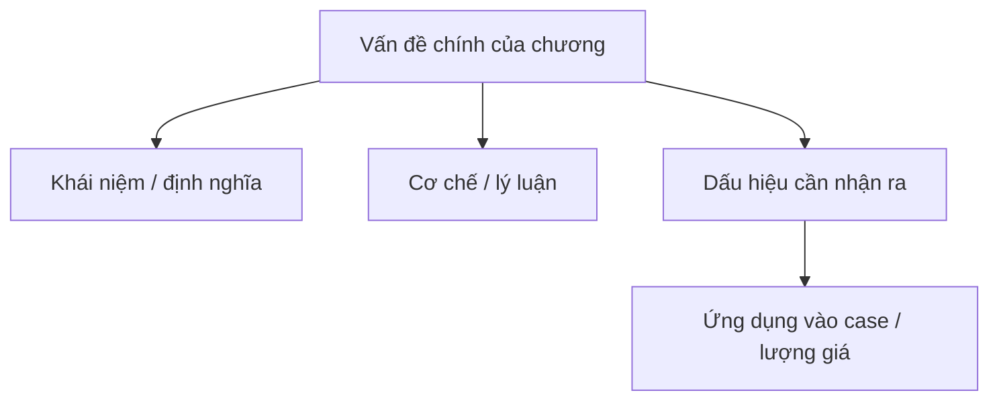

import KeyPoints from '~/components/KeyPoints.astro';
import CompareTable from '~/components/CompareTable.astro';
import ClinicalPearl from '~/components/ClinicalPearl.astro';
import SelfCheck from '~/components/SelfCheck.astro';
import SourceNote from '~/components/SourceNote.astro';

## Nắm nhanh theo 80/20

<KeyPoints title="20% cốt lõi cần nắm">

- BÀI 4. CHẨN ĐOÁN ÔN BỆNH
- 1. KHÁI NIỆM
- 2. CÁC BỘ PHẬN CẦN BIỆN LUẬN TRONG CHẨN ĐOÁN ÔN BỆNH
- 2.1. Biện thiết
- 2.2. Nghiệm xỉ

</KeyPoints>

## Tóm tắt nhanh

Phương pháp chẩn đoán của Ôn bệnh không ngoài vọng vấn vấn thiết, phạm vi của tứ chẩn. Do biểu hiện lâm sàng của ôn bệnh có tính đặc thù cho nên đã hình thành những phương pháp đặc thù như biện thiết, nghiệm xỉ, biện ban chẩn và bạch bối, biện phát nhiệt, mô hôi, thần chí và kinh quyết.

Thuần thực và chính xác vận dụng phương pháp chẩn đoán của ôn bệnh có thể cung cấp các dữ liệu để xác định được nguyên nhân bệnh, tính chất bệnh, vị trí bệnh, tà chính tiêu trưởng, bệnh danh và bệnh chứng.

## Sơ đồ 80/20

## Visual brief

<CompareTable title="Hình nên bổ sung khi biên tập">

| Loại hình | Khi dùng | Gợi ý tạo |
| --- | --- | --- |
| Sơ đồ Mermaid | Luồng cơ chế, phân loại, thuật toán | Dùng trực tiếp trong MDX. |
| SVG tự vẽ | Bảng phân tầng, timeline, bản đồ khái niệm cần kiểm soát chính xác | Tạo file SVG trong `public/assets/<sách>/` rồi nhúng. |
| Ảnh/illustration sinh bởi Codex | Cần minh họa sinh động, không cần độ chính xác giải phẫu tuyệt đối | Sinh ảnh rồi đặt vào `public/assets/<sách>/`, ghi chú là hình minh họa. |
| Hình y khoa từ nguồn | X-quang, mô bệnh học, biểu đồ nghiên cứu | Chỉ dùng khi có quyền/nguồn rõ; ưu tiên trích dẫn. |

</CompareTable>

## Bản đồ chương

<CompareTable title="Cấu trúc chương">

| Cấp | Mục | Cần rút theo 80/20 |
| --- | --- | --- |
| # | BÀI 4. CHẨN ĐOÁN ÔN BỆNH | Cần rút ý 80/20 |
| ## | 1. KHÁI NIỆM | Cần rút ý 80/20 |
| ## | 2. CÁC BỘ PHẬN CẦN BIỆN LUẬN TRONG CHẨN ĐOÁN ÔN BỆNH | Cần rút ý 80/20 |
| ### | 2.1. Biện thiết | Cần rút ý 80/20 |
| #### | 2.2. Nghiệm xỉ | Cần rút ý 80/20 |
| #### | 2.3. Ban chẩn, bạch bối | Cần rút ý 80/20 |

</CompareTable>

<ClinicalPearl>

- Khi biên tập, hãy viết lại phần này sao cho người học nắm được lõi chương trong 3-5 phút trước khi đọc bản hiểu sâu.

</ClinicalPearl>

## Tự kiểm

<SelfCheck>

1. 20% ý nào giúp hiểu phần lớn chương này?
2. Điểm nào dễ nhầm nhất khi áp dụng vào case?
3. Nếu phải vẽ một sơ đồ duy nhất cho chương này, sơ đồ đó nên thể hiện quan hệ nào?

</SelfCheck>

<SourceNote>

- Nguồn: `Raw/on_benh_dai_cuong/01_ly-thuyet/bai-04-chan-doan_001.md`
- Gợi ý template: `deep-explanation`

</SourceNote>
