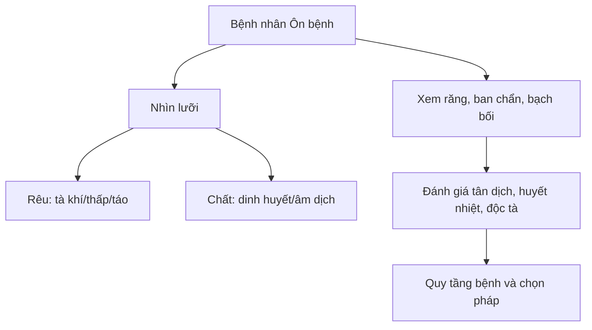

import KeyPoints from '~/components/KeyPoints.astro';
import CompareTable from '~/components/CompareTable.astro';
import MedicalNote from '~/components/MedicalNote.astro';
import RedFlags from '~/components/RedFlags.astro';
import SelfCheck from '~/components/SelfCheck.astro';
import SourceNote from '~/components/SourceNote.astro';

## 20% cốt lõi

<KeyPoints title="Đọc chẩn đoán theo dấu hiệu có giá trị cao">

- Chẩn đoán Ôn bệnh vẫn dùng tứ chẩn, nhưng trọng điểm là **lưỡi, răng, ban chẩn, bạch bối, phát nhiệt, mồ hôi, thần chí, kinh quyết**.
- **Rêu lưỡi** cho biết tà còn ở khí/phủ, thấp hay táo, nhiệt nhẹ hay nặng.
- **Chất lưỡi** cho biết dinh huyết và âm dịch: đỏ, đỏ thẫm, khô, nứt, teo đều có giá trị tiên lượng.
- **Răng và kẽ răng** phản ánh vị nhiệt, thận âm, huyết nhiệt và mức hao tân dịch.
- **Ban chẩn/bạch bối** không chỉ là tổn thương da; chúng cho biết nhiệt độc, huyết phận, thấp nhiệt và khả năng tà được thấu ra ngoài.
- Mục tiêu chẩn đoán là xác định **nguyên nhân, tính chất, vị trí, tà chính tiêu trưởng, bệnh danh và chứng hậu**.

</KeyPoints>

## Một câu nắm bài

<MedicalNote title="Câu lõi">
Trong Ôn bệnh, dấu hiệu bên ngoài là bản đồ của nhiệt tà bên trong: lưỡi đọc khí-dinh-huyết, răng đọc tân dịch, ban chẩn đọc huyết nhiệt và độc tà.
</MedicalNote>

## Bảng đọc nhanh

<CompareTable title="Dấu hiệu nào trả lời câu hỏi nào?">

| Dấu hiệu | Câu hỏi nó trả lời | Ý nghĩa thường gặp |
| --- | --- | --- |
| Rêu trắng mỏng | Tà còn nông? | Vệ phần, biểu còn rõ |
| Rêu vàng khô | Nhiệt đã vào khí/phủ? | Lý nhiệt, tân dịch thương |
| Rêu nê/trọc | Có thấp không? | Thấp nhiệt, khí cơ bị bế |
| Chất lưỡi đỏ thẫm | Đã vào dinh/huyết? | Nhiệt sâu, dễ nhiễu tâm hoặc động huyết |
| Răng khô, kẽ răng bẩn | Tân dịch hao bao nhiêu? | Vị nhiệt, thận âm bị ảnh hưởng |
| Ban chẩn | Huyết nhiệt/độc tà thế nào? | Cần phân biệt thấu thuận hay nội hãm |

</CompareTable>

## Sơ đồ chẩn đoán

## Bẫy dễ nhầm

<RedFlags>
- Chỉ nhìn triệu chứng sốt mà bỏ lưỡi: dễ không biết bệnh còn ở khí hay đã vào dinh huyết.
- Thấy ban chẩn là mừng vì “tà ra ngoài”: phải xem sắc, phân bố, mạch chứng và toàn trạng.
- Rêu lưỡi biến nhanh trong Ôn bệnh; một lần khám không thay thế được theo dõi diễn biến.
</RedFlags>

## Tự kiểm

<SelfCheck>
1. Rêu vàng khô khác rêu vàng nê ở ý nghĩa bệnh cơ nào?
2. Vì sao chất lưỡi đỏ thẫm nguy hiểm hơn rêu vàng đơn thuần?
3. Ban chẩn cần đọc thêm những yếu tố nào ngoài việc “có ban”?
</SelfCheck>

<SourceNote>
- Nguồn: `Raw/on_benh_dai_cuong/01_ly-thuyet/bai-04-chan-doan_001.md`
</SourceNote>
