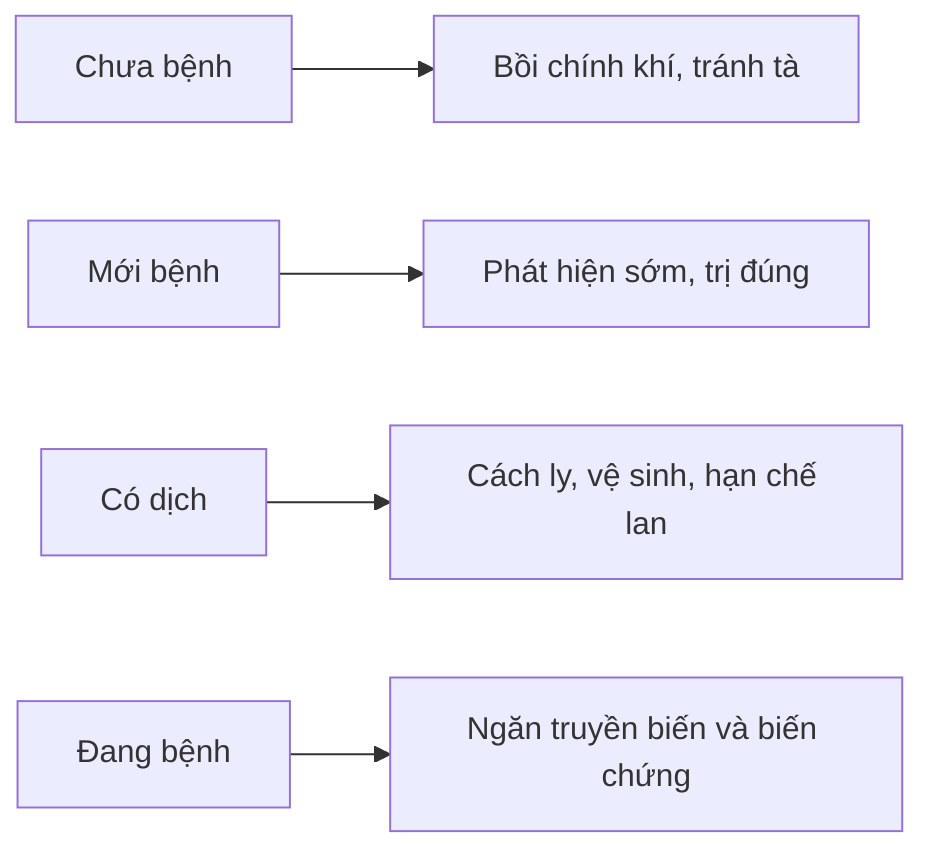

import KeyPoints from '~/components/KeyPoints.astro';
import CompareTable from '~/components/CompareTable.astro';
import MedicalNote from '~/components/MedicalNote.astro';
import SelfCheck from '~/components/SelfCheck.astro';
import SourceNote from '~/components/SourceNote.astro';

## 20% cốt lõi

<KeyPoints title="Dự phòng là xử trí trước khi bệnh sâu">

- Dự phòng Ôn bệnh dựa trên tư tưởng **trị vị bệnh**: chưa bệnh thì phòng, mới bệnh thì chặn, đã bệnh thì ngăn truyền biến.
- Hai hướng lớn: **bồi cố chính khí** và **ngăn tà/lệ khí xâm nhập-lây lan**.
- Bồi chính khí không chỉ dùng thuốc; gồm sinh hoạt điều độ, tránh lao lực, ăn uống vệ sinh, luyện dưỡng sinh, thích ứng mùa khí.
- Chặn lây lan đặc biệt quan trọng với ôn dịch/lệ khí: phát hiện sớm, cách ly, vệ sinh môi trường, hạn chế tụ tập khi dịch.
- Dự phòng phải theo người, mùa, vùng và loại tà: phong nhiệt, thấp nhiệt, thử nhiệt hay lệ khí không giống nhau.

</KeyPoints>

## Một câu nắm bài

<MedicalNote title="Câu lõi">
Dự phòng Ôn bệnh là giữ cho **chính khí không hư** và làm cho **tà khí không có đường vào hoặc không lan được**.
</MedicalNote>

## Khung dự phòng

<CompareTable title="Từ nguyên tắc đến thao tác">

| Mục tiêu | Làm gì | Vì sao |
| --- | --- | --- |
| Bồi chính khí | Ngủ nghỉ, ăn uống, luyện tập, tránh hao tổn | Chính khí mạnh thì tà khó xâm nhập |
| Tránh tà khí | Theo mùa, giữ vệ sinh, tránh môi trường độc/ẩm/nóng | Giảm tiếp xúc ôn tà |
| Chặn lây | Phát hiện sớm, cách ly, vệ sinh môi trường | Lệ khí dễ thành dịch |
| Ngăn truyền biến | Theo dõi dấu hiệu nặng, trị sớm đúng pháp | Không để tà vào sâu |

</CompareTable>

## Sơ đồ phòng bệnh

## Tự kiểm

<SelfCheck>
1. Vì sao dự phòng Ôn bệnh không thể chỉ là “uống thuốc phòng”?
2. Khi có nhiều ca bệnh cùng lúc, ưu tiên dự phòng thay đổi thế nào?
3. “Trị vị bệnh” gồm những tầng nào?
</SelfCheck>

<SourceNote>
- Nguồn: `Raw/on_benh_dai_cuong/01_ly-thuyet/bai-05-du-phong_001.md`
</SourceNote>
