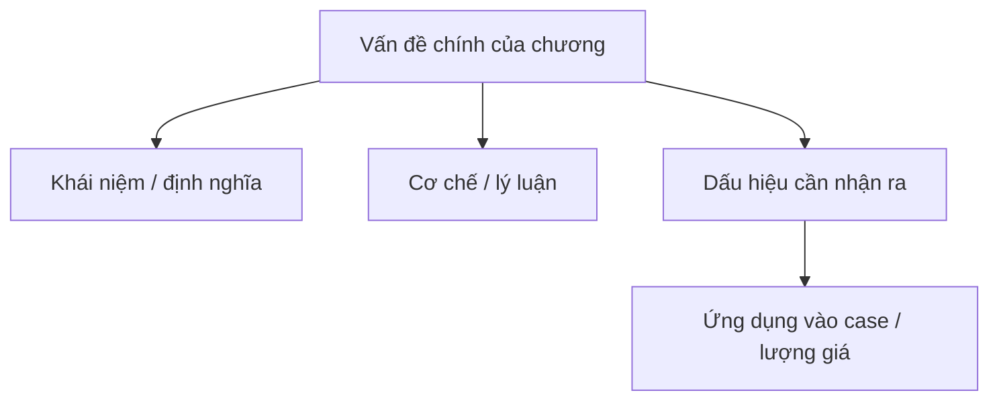

import KeyPoints from '~/components/KeyPoints.astro';
import CompareTable from '~/components/CompareTable.astro';
import ClinicalPearl from '~/components/ClinicalPearl.astro';
import SelfCheck from '~/components/SelfCheck.astro';
import SourceNote from '~/components/SourceNote.astro';

## Nắm nhanh theo 80/20

<KeyPoints title="20% cốt lõi cần nắm">

- NGƯỢC TẬT
- 1. KHÁI NIỆM
- 2. NGUYÊN NHÂN VÀ CƠ CHẾ
- 3. CHẨN ĐOÁN XÁC ĐỊNH
- 4. CHẨN ĐOÁN PHÂN BIỆT

</KeyPoints>

## Tóm tắt nhanh

Ngược tật là một dạng ngoại cảm nhiệt bệnh cấp tính do cảm thụ ngược tà gây ra hàn chiến, tráng nhiệt, đau đầu, hạn xuất đồng thời phát có chu kỳ. Đa số phát bệnh ở mùa hè thu.

Đời nhà Thương trong văn tự giáp cốt có chữ tượng hình là ngược, nói lên hơn ba ngàn năm trước đây đã có bệnh này.

## Sơ đồ 80/20

## Visual brief

<CompareTable title="Hình nên bổ sung khi biên tập">

| Loại hình | Khi dùng | Gợi ý tạo |
| --- | --- | --- |
| Sơ đồ Mermaid | Luồng cơ chế, phân loại, thuật toán | Dùng trực tiếp trong MDX. |
| SVG tự vẽ | Bảng phân tầng, timeline, bản đồ khái niệm cần kiểm soát chính xác | Tạo file SVG trong `public/assets/<sách>/` rồi nhúng. |
| Ảnh/illustration sinh bởi Codex | Cần minh họa sinh động, không cần độ chính xác giải phẫu tuyệt đối | Sinh ảnh rồi đặt vào `public/assets/<sách>/`, ghi chú là hình minh họa. |
| Hình y khoa từ nguồn | X-quang, mô bệnh học, biểu đồ nghiên cứu | Chỉ dùng khi có quyền/nguồn rõ; ưu tiên trích dẫn. |

</CompareTable>

## Bản đồ chương

<CompareTable title="Cấu trúc chương">

| Cấp | Mục | Cần rút theo 80/20 |
| --- | --- | --- |
| # | NGƯỢC TẬT | Cần rút ý 80/20 |
| ## | 1. KHÁI NIỆM | Cần rút ý 80/20 |
| ## | 2. NGUYÊN NHÂN VÀ CƠ CHẾ | Cần rút ý 80/20 |
| ## | 3. CHẨN ĐOÁN XÁC ĐỊNH | Cần rút ý 80/20 |
| ## | 4. CHẨN ĐOÁN PHÂN BIỆT | Cần rút ý 80/20 |
| ### | 4.1. Thời hành cảm mạo | Cần rút ý 80/20 |
| ### | 4.2. Thấp ôn | Cần rút ý 80/20 |
| ### | 4.3. Thử ôn | Cần rút ý 80/20 |
| ### | 4.4. Phế lao | Cần rút ý 80/20 |
| ## | 5. BIỆN CHỨNG LUẬN TRỊ | Cần rút ý 80/20 |

</CompareTable>

<ClinicalPearl>

- Khi biên tập, hãy viết lại phần này sao cho người học nắm được lõi chương trong 3-5 phút trước khi đọc bản hiểu sâu.

</ClinicalPearl>

## Tự kiểm

<SelfCheck>

1. 20% ý nào giúp hiểu phần lớn chương này?
2. Điểm nào dễ nhầm nhất khi áp dụng vào case?
3. Nếu phải vẽ một sơ đồ duy nhất cho chương này, sơ đồ đó nên thể hiện quan hệ nào?

</SelfCheck>

<SourceNote>

- Nguồn: `Raw/on_benh_dai_cuong/02_benh-lam-sang/nguoc-tat_001.md`
- Gợi ý template: `differential-diagnosis`

</SourceNote>
