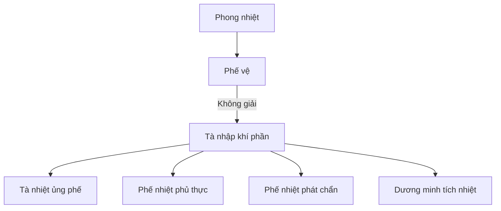

import KeyPoints from '~/components/KeyPoints.astro';
import CompareTable from '~/components/CompareTable.astro';
import MedicalNote from '~/components/MedicalNote.astro';
import RedFlags from '~/components/RedFlags.astro';
import SelfCheck from '~/components/SelfCheck.astro';
import SourceNote from '~/components/SourceNote.astro';

## 20% cốt lõi

<KeyPoints title="Đọc Phong ôn bằng phế vệ">

- Phong ôn là ngoại cảm nhiệt bệnh cấp tính do **phong nhiệt bệnh tà**, sơ khởi đặc trưng là **phế vệ biểu nhiệt**.
- Bệnh thường gặp mùa đông-xuân; mùa đông khí hậu ấm bất thường có thể gọi là đông ôn.
- Bệnh cơ đầu tiên: phong nhiệt từ mũi miệng vào, **trước phạm phế**, làm phế thất tuyên túc.
- Dấu hiệu khởi đầu: sốt, hơi ố phong, đau đầu, ho, khát nhẹ, rêu mỏng, đầu lưỡi đỏ, mạch phù sác.
- Phong ôn có thể truyền vào khí phần: tà nhiệt ủng phế, phế nhiệt phủ thực, phế nhiệt chuyển trường, phát chẩn, dương minh tích nhiệt.
- Phân biệt quan trọng: xuân ôn khởi từ lý nhiệt nặng; cảm mạo phong nhiệt nhẹ và ít truyền biến; ma chẩn có phát ban theo quy luật.

</KeyPoints>

## Một câu nắm bài

<MedicalNote title="Câu lõi">
Phong ôn là bài học về **phong nhiệt phạm phế trước**, rồi hoặc giải ở phế vệ, hoặc truyền nhanh vào khí phần và dương minh.
</MedicalNote>

## Đường truyền chính

## Bảng thể thường gặp

<CompareTable title="Từ thể bệnh sang pháp">

| Thể | Dấu hiệu chính | Pháp trị |
| --- | --- | --- |
| Tà tập phế vệ | Sốt, hơi ố phong, ho, khát nhẹ | Tân lương giải biểu, tuyên phế |
| Tà nhiệt ủng phế | Sốt cao, ho suyễn, đàm vàng | Thanh nhiệt tuyên phế bình suyễn |
| Phế nhiệt phủ thực | Ho suyễn kèm táo kết/đầy | Tuyên phế, tiết nhiệt, công hạ |
| Phế nhiệt phát chẩn | Ban chẩn kèm phế nhiệt | Tuyên phế tiết nhiệt, lương dinh thấu chẩn |
| Dương minh tích nhiệt | Sốt cao, khát, mồ hôi, rêu vàng | Thanh nhiệt bảo tân |

</CompareTable>

## Bẫy dễ nhầm

<RedFlags>
- Phong ôn không phải cảm mạo phong nhiệt nặng hơn một chút; điểm khác là truyền biến nhanh và nguy cơ vào sâu.
- Không dùng phát hãn tân ôn kiểu Thương hàn cho phong ôn.
- Khởi đầu nhẹ ở phế vệ nhưng xuất hiện thần chí bất thường là nghĩ nghịch truyền.
</RedFlags>

## Tự kiểm

<SelfCheck>
1. Vì sao Phong ôn “thủ tiên phạm phế”?
2. Dấu hiệu nào phân biệt Phong ôn với Xuân ôn lúc khởi bệnh?
3. Khi ho suyễn tăng, sốt cao, đàm vàng, bệnh đã chuyển hướng nào?
</SelfCheck>

<SourceNote>
- Nguồn: `Raw/on_benh_dai_cuong/02_benh-lam-sang/phong-on_001.md`
</SourceNote>
