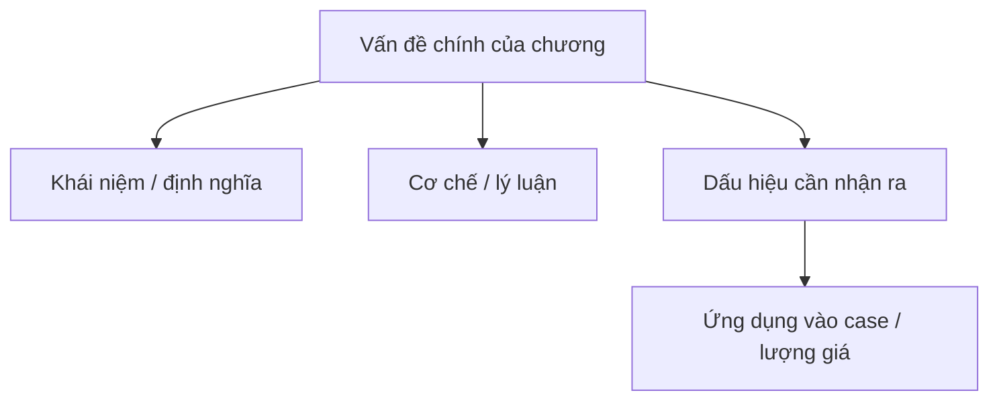

import KeyPoints from '~/components/KeyPoints.astro';
import CompareTable from '~/components/CompareTable.astro';
import ClinicalPearl from '~/components/ClinicalPearl.astro';
import SelfCheck from '~/components/SelfCheck.astro';
import SourceNote from '~/components/SourceNote.astro';

## Nắm nhanh theo 80/20

<KeyPoints title="20% cốt lõi cần nắm">

- 5.4. Nhiệt nhập tâm bào
- 5.5. Điều trị triệu chứng
- 5.5.1. Ho
- 6. DỰ PHÒNG VÀ ĐIỀU HỘ
- 6.1. Tăng cường chính khí

</KeyPoints>

## Tóm tắt nhanh

- Nhiệt độc tích thịnh gia: Kim ngân hoa, Liên kiều, Bân lam căn, Đại thanh diệp... để thanh nhiệt giải độc.

- Nếu thấy phế nhiệt ứng thịnh mà ho suyễn gia: Hạnh nhân, Qua lâu bì, Ngân hoa, Ngự tinh thảo để thanh phế hóa đàm.

## Sơ đồ 80/20

## Visual brief

<CompareTable title="Hình nên bổ sung khi biên tập">

| Loại hình | Khi dùng | Gợi ý tạo |
| --- | --- | --- |
| Sơ đồ Mermaid | Luồng cơ chế, phân loại, thuật toán | Dùng trực tiếp trong MDX. |
| SVG tự vẽ | Bảng phân tầng, timeline, bản đồ khái niệm cần kiểm soát chính xác | Tạo file SVG trong `public/assets/<sách>/` rồi nhúng. |
| Ảnh/illustration sinh bởi Codex | Cần minh họa sinh động, không cần độ chính xác giải phẫu tuyệt đối | Sinh ảnh rồi đặt vào `public/assets/<sách>/`, ghi chú là hình minh họa. |
| Hình y khoa từ nguồn | X-quang, mô bệnh học, biểu đồ nghiên cứu | Chỉ dùng khi có quyền/nguồn rõ; ưu tiên trích dẫn. |

</CompareTable>

## Bản đồ chương

<CompareTable title="Cấu trúc chương">

| Cấp | Mục | Cần rút theo 80/20 |
| --- | --- | --- |
| #### | 5.4. Nhiệt nhập tâm bào | Cần rút ý 80/20 |
| #### | 5.5. Điều trị triệu chứng | Cần rút ý 80/20 |
| #### | 5.5.1. Ho | Cần rút ý 80/20 |
| ### | 6. DỰ PHÒNG VÀ ĐIỀU HỘ | Cần rút ý 80/20 |
| ### | 6.1. Tăng cường chính khí | Cần rút ý 80/20 |
| ### | 6.2. Thuốc dự phòng | Cần rút ý 80/20 |
| ### | 6.3. Hạn chế tụ tập đông trong lúc dịch | Cần rút ý 80/20 |
| ### | 6.4. Môi trường | Cần rút ý 80/20 |
| ### | 6.5. Phát hiện sớm biến chứng | Cần rút ý 80/20 |

</CompareTable>

<ClinicalPearl>

- Khi biên tập, hãy viết lại phần này sao cho người học nắm được lõi chương trong 3-5 phút trước khi đọc bản hiểu sâu.

</ClinicalPearl>

## Tự kiểm

<SelfCheck>

1. 20% ý nào giúp hiểu phần lớn chương này?
2. Điểm nào dễ nhầm nhất khi áp dụng vào case?
3. Nếu phải vẽ một sơ đồ duy nhất cho chương này, sơ đồ đó nên thể hiện quan hệ nào?

</SelfCheck>

<SourceNote>

- Nguồn: `Raw/on_benh_dai_cuong/02_benh-lam-sang/phong-on_002.md`
- Gợi ý template: `symptom-approach`

</SourceNote>
