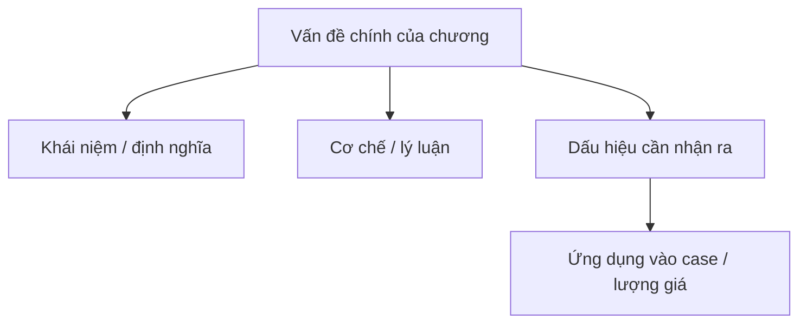

import KeyPoints from '~/components/KeyPoints.astro';
import CompareTable from '~/components/CompareTable.astro';
import ClinicalPearl from '~/components/ClinicalPearl.astro';
import SelfCheck from '~/components/SelfCheck.astro';
import SourceNote from '~/components/SourceNote.astro';

## Nắm nhanh theo 80/20

<KeyPoints title="20% cốt lõi cần nắm">

- XUÂN ÔN
- 1. KHÁI NIỆM
- 2. NGUYÊN NHÂN VÀ CƠ CHẾ SINH BỆNH
- 3. CHẨN ĐOÁN XÁC ĐỊNH
- 3.1. Tính chất

</KeyPoints>

## Tóm tắt nhanh

Xuân ôn là do phong nhiệt bệnh tà nội phục mà phát, là một loại nhiệt bệnh cấp tính với đặc điểm khởi bệnh lập tức xuất hiện lý nhiệt chứng với sốt tâm phiền miệng khát, lưỡi đỏ, rêu vàng.

Biểu hiện lâm sàng thường phát bệnh nhanh cấp, bệnh tình nặng, biến hóa nhanh, một bộ phận người bệnh sau khi cấp cứu thoát hiểm để lại di chứng. Bệnh thường phát vào mùa xuân hoặc giao thời đông xuân và xuân hạ.

## Sơ đồ 80/20

## Visual brief

<CompareTable title="Hình nên bổ sung khi biên tập">

| Loại hình | Khi dùng | Gợi ý tạo |
| --- | --- | --- |
| Sơ đồ Mermaid | Luồng cơ chế, phân loại, thuật toán | Dùng trực tiếp trong MDX. |
| SVG tự vẽ | Bảng phân tầng, timeline, bản đồ khái niệm cần kiểm soát chính xác | Tạo file SVG trong `public/assets/<sách>/` rồi nhúng. |
| Ảnh/illustration sinh bởi Codex | Cần minh họa sinh động, không cần độ chính xác giải phẫu tuyệt đối | Sinh ảnh rồi đặt vào `public/assets/<sách>/`, ghi chú là hình minh họa. |
| Hình y khoa từ nguồn | X-quang, mô bệnh học, biểu đồ nghiên cứu | Chỉ dùng khi có quyền/nguồn rõ; ưu tiên trích dẫn. |

</CompareTable>

## Bản đồ chương

<CompareTable title="Cấu trúc chương">

| Cấp | Mục | Cần rút theo 80/20 |
| --- | --- | --- |
| # | XUÂN ÔN | Cần rút ý 80/20 |
| ## | 1. KHÁI NIỆM | Cần rút ý 80/20 |
| ## | 2. NGUYÊN NHÂN VÀ CƠ CHẾ SINH BỆNH | Cần rút ý 80/20 |
| ## | 3. CHẨN ĐOÁN XÁC ĐỊNH | Cần rút ý 80/20 |
| ### | 3.1. Tính chất | Cần rút ý 80/20 |
| ### | 3.2. Bệnh sơ khởi đã xuất hiện chứng lý nhiệt tích thịnh như: | Cần rút ý 80/20 |
| ### | 3.3. Căn cứ vào đặc điểm phát bệnh, biểu hiện lâm sàng, cảm tà nặng nhẹ và mức độ âm tĩnh khuỷu tổn của người bệnh có thể phân thành | Cần rút ý 80/20 |
| ### | 3.4. Lâm sàng | Cần rút ý 80/20 |
| ## | 4. CHẨN ĐOÁN PHÂN BIỆT | Cần rút ý 80/20 |
| ### | 4.1. Phong ôn | Cần rút ý 80/20 |

</CompareTable>

<ClinicalPearl>

- Khi biên tập, hãy viết lại phần này sao cho người học nắm được lõi chương trong 3-5 phút trước khi đọc bản hiểu sâu.

</ClinicalPearl>

## Tự kiểm

<SelfCheck>

1. 20% ý nào giúp hiểu phần lớn chương này?
2. Điểm nào dễ nhầm nhất khi áp dụng vào case?
3. Nếu phải vẽ một sơ đồ duy nhất cho chương này, sơ đồ đó nên thể hiện quan hệ nào?

</SelfCheck>

<SourceNote>

- Nguồn: `Raw/on_benh_dai_cuong/02_benh-lam-sang/xuan-on_001.md`
- Gợi ý template: `deep-explanation`

</SourceNote>
