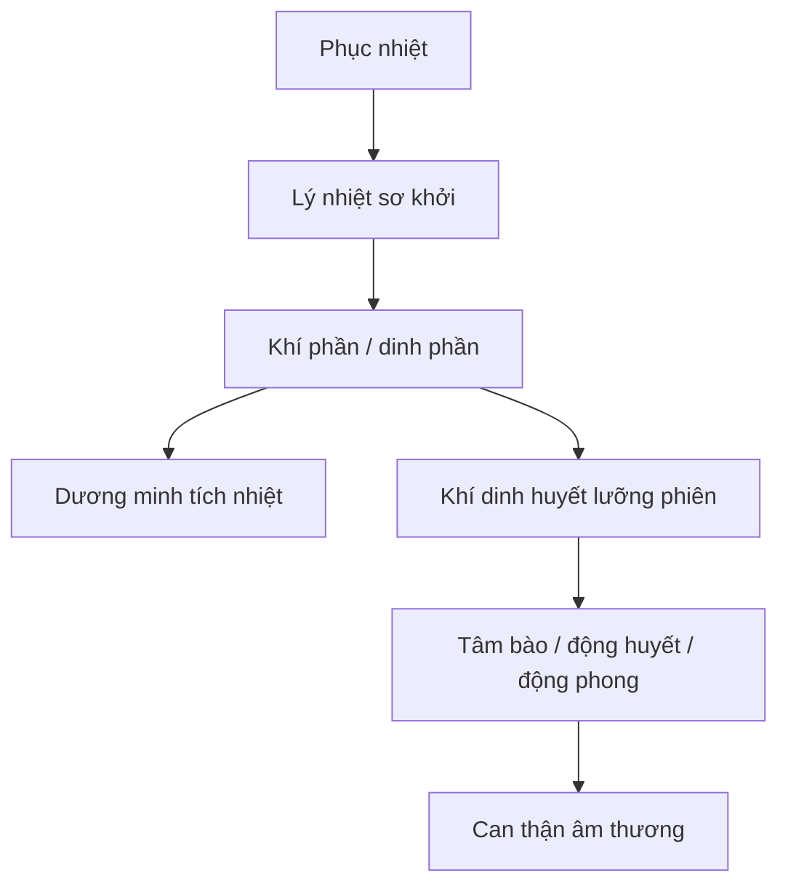

import KeyPoints from '~/components/KeyPoints.astro';
import CompareTable from '~/components/CompareTable.astro';
import MedicalNote from '~/components/MedicalNote.astro';
import RedFlags from '~/components/RedFlags.astro';
import SelfCheck from '~/components/SelfCheck.astro';
import SourceNote from '~/components/SourceNote.astro';

## 20% cốt lõi

<KeyPoints title="Xuân ôn = phục tà phát từ lý">

- Xuân ôn là một dạng **phục khí ôn bệnh**, thường phát mùa xuân hoặc giao thời đông-xuân/xuân-hạ.
- Cơ chế lõi: tà nhiệt phục bên trong, gặp thời cơ thì phát; vì vậy bệnh **khởi đầu đã có lý nhiệt**.
- Dấu hiệu sơ khởi: sốt cao, tâm phiền, miệng khát, tiểu đỏ, lưỡi đỏ, rêu vàng; có thể không có biểu chứng rõ.
- Bệnh thường nặng, biến hóa nhanh, dễ vào khí, dinh, huyết, dễ động phong, động huyết và thương can thận âm về sau.
- Phân biệt với Phong ôn: Phong ôn khởi ở phế vệ; Xuân ôn khởi sâu với lý nhiệt tích thịnh.
- Trị pháp phải theo tầng phát: khí phần/dinh phần, dương minh tích nhiệt, nhiệt phiên khí dinh huyết, tâm bào, chân âm.

</KeyPoints>

## Một câu nắm bài

<MedicalNote title="Câu lõi">
Xuân ôn nguy hiểm vì bệnh nhân có thể vừa khởi bệnh đã ở **lý nhiệt sâu**, không đi qua phế vệ rõ như Phong ôn.
</MedicalNote>

## Sơ đồ truyền biến

## Phân biệt nhanh

<CompareTable title="Xuân ôn và Phong ôn">

| Tiêu chí | Xuân ôn | Phong ôn |
| --- | --- | --- |
| Kiểu phát | Phục tà | Tân cảm |
| Vị trí đầu | Lý, khí/dinh | Phế vệ |
| Khởi bệnh | Sốt cao, phiền khát, lưỡi đỏ | Sốt, ho, hơi ố phong, khát nhẹ |
| Mức nặng | Thường nặng, biến nhanh | Có thể nhẹ nếu giải sớm |
| Hậu kỳ | Dễ can thận âm thương | Thường phế vị âm thương |

</CompareTable>

## Bẫy dễ nhầm

<RedFlags>
- Xuân ôn không phải “phong ôn mùa xuân”; điểm mấu chốt là phục tà phát từ lý.
- Nếu dùng phát hãn mạnh vì thấy có chút biểu chứng, có thể làm âm tân tổn thêm.
- Lý nhiệt sơ khởi kèm thần chí/ban chẩn là dấu hiệu vào sâu, không chờ bệnh “diễn tiến đủ tầng”.
</RedFlags>

## Tự kiểm

<SelfCheck>
1. Vì sao Xuân ôn dễ nặng hơn Phong ôn?
2. Dấu hiệu nào chứng minh bệnh khởi từ lý?
3. Tại sao hậu kỳ Xuân ôn hay nói đến can thận âm thương?
</SelfCheck>

<SourceNote>
- Nguồn: `Raw/on_benh_dai_cuong/02_benh-lam-sang/xuan-on_001.md`
</SourceNote>
