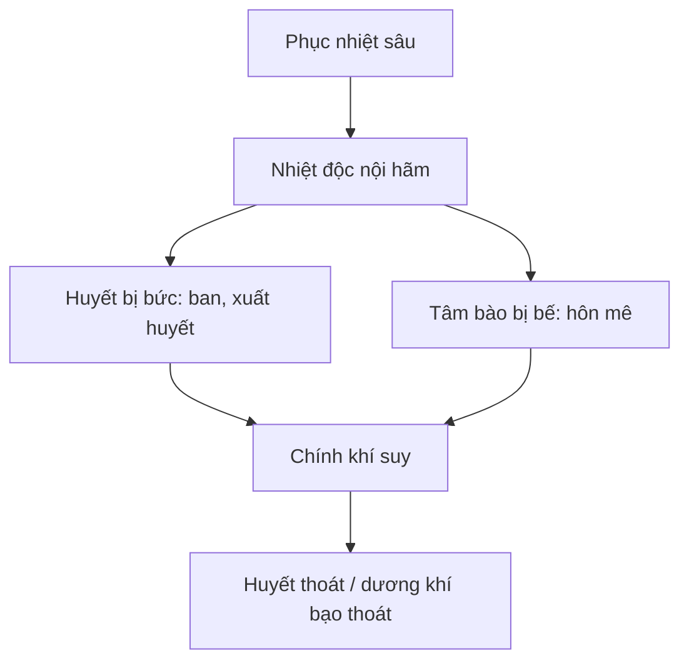

import KeyPoints from '~/components/KeyPoints.astro';
import CompareTable from '~/components/CompareTable.astro';
import MedicalNote from '~/components/MedicalNote.astro';
import RedFlags from '~/components/RedFlags.astro';
import SelfCheck from '~/components/SelfCheck.astro';
import SourceNote from '~/components/SourceNote.astro';

## 20% cốt lõi

<KeyPoints title="Nhận ra pha tối nguy hiểm">

- **Nhiệt bế huyết thoát** là tình huống nhiệt độc nội hãm, huyết bị bức loạn, chính khí suy; biểu hiện ban chẩn dày, sắc mặt nhợt, chi lạnh, mồ hôi lạnh, mạch vi tế.
- **Dương khí bạo thoát** là chính khí suy sụp đột ngột: thở yếu, mồ hôi lạnh, chi quyết, mạch muốn tuyệt.
- Đây là giai đoạn phải nghĩ song song: **khai bế, lương huyết, cứu thoát**, tùy chứng cụ thể.
- Điều trị triệu chứng như đau đầu, nôn, cổ cứng, hôn mê không tách khỏi bệnh cơ nhiệt độc, tâm bào, can phong và âm dịch.
- Dự phòng Xuân ôn vẫn quay về tránh phục tà phát, giữ chính khí, phát hiện sớm lý nhiệt và dấu hiệu vào sâu.

</KeyPoints>

## Một câu nắm bài

<MedicalNote title="Câu lõi">
Nhiệt bế huyết thoát là lúc **tà nhiệt bế ở trong nhưng chính khí thoát ra ngoài**, nên chỉ thanh nhiệt là không đủ.
</MedicalNote>

## Bảng nhận diện nguy cấp

<CompareTable title="Dấu hiệu cần phản ứng ngay">

| Dấu hiệu | Gợi ý bệnh cơ | Ý nghĩa |
| --- | --- | --- |
| Ban chẩn dày, tím tối | Nhiệt độc huyết phận | Huyết bị bức, độc nhiệt sâu |
| Sắc mặt nhợt, chi lạnh | Chính khí suy, dương không đạt | Nguy cơ thoát |
| Mồ hôi lạnh, thở yếu | Dương khí bạo thoát | Cấp cứu |
| Hôn mê | Tâm bào bị bế | Cần khai khiếu |
| Đau đầu, nôn, cổ cứng | Nhiệt động phong/đàm nhiệt | Theo dõi biến chứng thần kinh |

</CompareTable>

## Sơ đồ pha nặng

## Red flags

<RedFlags>
- Ban dày kèm chi lạnh và mạch vi không phải “ban đã mọc ra tốt”, mà là dấu hiệu chính suy tà thịnh.
- Hôn mê, cổ cứng, nôn trong Xuân ôn là dấu hiệu vào sâu, không chờ tự lui.
- Mồ hôi lạnh trong bệnh nhiệt nặng là dấu hiệu thoát, khác mồ hôi do nhiệt bức ở khí phần.
</RedFlags>

## Tự kiểm

<SelfCheck>
1. Vì sao nhiệt bế huyết thoát vừa có dấu hiệu nhiệt độc vừa có dấu hiệu lạnh/suy?
2. Dấu hiệu nào phân biệt mồ hôi do khí phần nhiệt với mồ hôi lạnh do thoát?
3. Trong pha này, vì sao cần nghĩ “cứu thoát” bên cạnh “thanh nhiệt”?
</SelfCheck>

<SourceNote>
- Nguồn: `Raw/on_benh_dai_cuong/02_benh-lam-sang/xuan-on_003.md`
</SourceNote>
