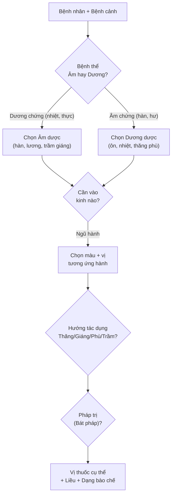
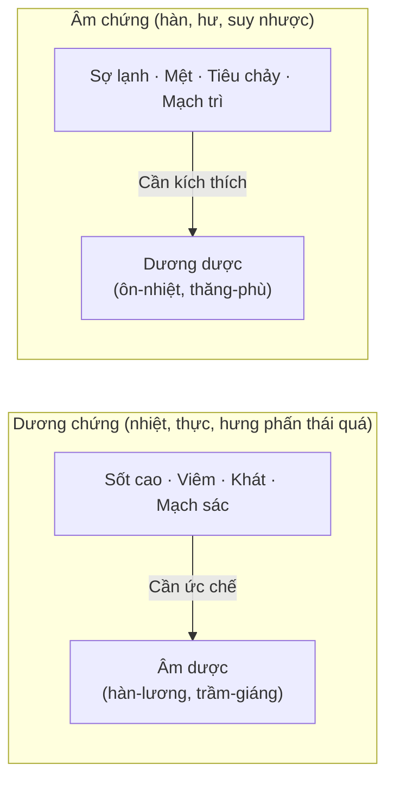
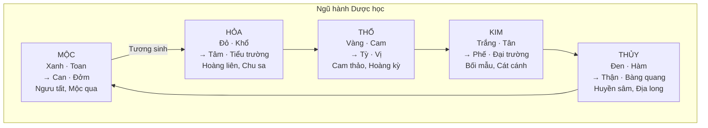
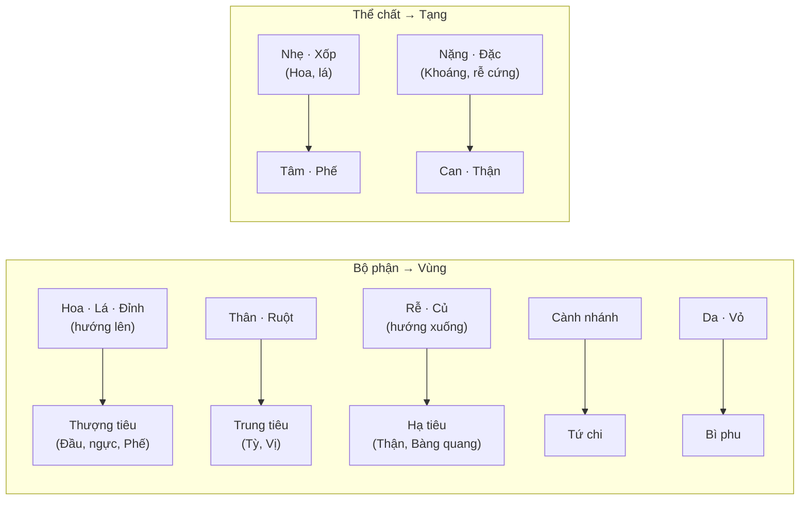
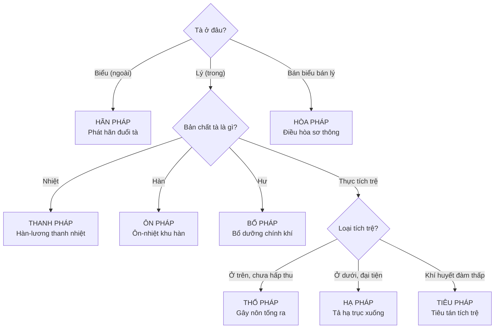
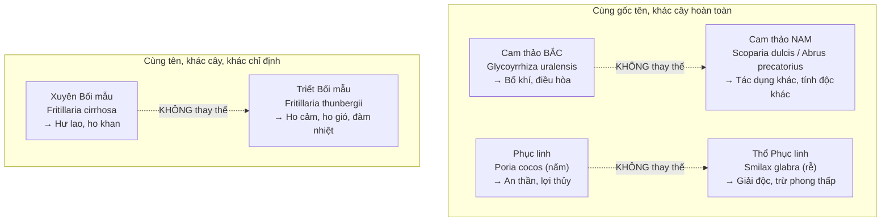
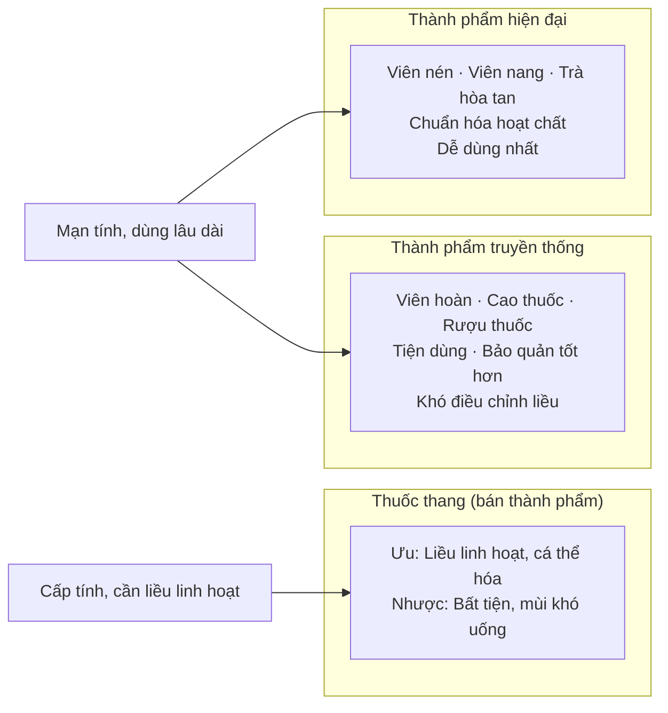

import MedicalNote from '~/components/MedicalNote.astro';
import KeyPoints from '~/components/KeyPoints.astro';
import RedFlags from '~/components/RedFlags.astro';
import CompareTable from '~/components/CompareTable.astro';
import ClinicalPearl from '~/components/ClinicalPearl.astro';

## Mục tiêu bài giảng

Sau bài này người học **hiểu được** (không chỉ thuộc):

- [ ] Tại sao có đến 11 cách phân loại thuốc YHCT — và hệ thống nào dùng trên lâm sàng
- [ ] Logic Âm-Dương trong chọn thuốc: "bệnh thể nào → chọn thuốc gì"
- [ ] Tại sao Ngũ hành không chỉ là triết học mà là hệ thống định hướng chọn thuốc thực dụng
- [ ] Bát pháp: sắp xếp tư duy điều trị, không phải danh sách 8 mục cần nhớ
- [ ] Tại sao đặt tên thuốc đúng rất quan trọng về mặt an toàn lâm sàng

<MedicalNote title="Góc nhìn giảng viên">
  **Điều GS 30 năm sẽ nói đầu bài:** "Học bài này không phải để nhớ 11 cách phân loại. Học để hiểu rằng khi chọn một vị thuốc, người thầy thuốc YHCT luôn trả lời ngầm 4 câu hỏi: *Bệnh thể thuộc Âm hay Dương? Thuốc cần vào kinh nào? Hướng tác dụng lên hay xuống? Cần phối hợp pháp trị gì?*"
</MedicalNote>

---

## Bức tranh tổng thể — 4 câu hỏi khi chọn thuốc YHCT

---

## 1. Tại sao có 11 cách phân loại?

Thuốc YHCT được phân loại theo **nhiều hệ quy chiếu** khác nhau, phục vụ các mục đích khác nhau:

| Hệ phân loại | Dùng để làm gì | Ứng dụng |
|---|---|---|
| Âm dương | Chọn thuốc theo bệnh thể | Tư duy lâm sàng hằng ngày |
| Ngũ hành | Định hướng quy kinh | Cá thể hóa điều trị |
| Bát pháp | Xác định chiến lược trị bệnh | Xây dựng bài thuốc |
| Công năng | Tra cứu nhanh tác dụng | Danh mục thuốc Việt Nam |
| Tính vị + Dược lý | Nghiên cứu khoa học | Kết hợp Đông-Tây y |
| Nguồn gốc | Quản lý dược liệu | Lý Thời Trân, Tuệ Tĩnh |

**Trên lâm sàng thực tế:** Dùng chủ yếu **Bát pháp + Công năng + Tính vị**. Các hệ còn lại phục vụ học thuật và nghiên cứu.

---

## 2. Âm dương — Logic chọn thuốc

### 2.1. Quy tắc cốt lõi

> **Âm bệnh → Dương thuốc. Dương bệnh → Âm thuốc.**

Đây là nguyên tắc **bù đắp cân bằng** (principle of opposition):

### 2.2. Ma trận Âm-Dương của thuốc

4 kết hợp cần phân biệt:

<CompareTable
  headers={["Loại", "Tính", "Vị", "Đặc điểm", "Ví dụ"]}
  rows={[
    ["Âm trong Âm", "Hàn", "Khổ, hàm", "Lạnh + đắng/mặn — tác dụng mạnh nhất nhóm Âm", "Hoàng liên, Hoàng bá, Bồ công anh"],
    ["Âm trong Dương", "Ôn", "Khổ, hàm", "Ấm + đắng/mặn — Âm nhưng không gây hàn", "Câu tích, Tắc kè, Cốt toái bổ"],
    ["Dương trong Dương", "Ôn/Nhiệt", "Tân, cam", "Nóng + cay/ngọt — tác dụng mạnh nhất nhóm Dương", "Phụ tử, Quế chi, Bạch chi"],
    ["Dương trong Âm", "Hàn/Lương", "Tân, cam", "Mát + cay/ngọt — Dương nhưng không gây nhiệt", "Bạc hà, Cúc hoa, Cát căn"],
  ]}
/>

### 2.3. Từ vị thuốc → bài thuốc: Tính Âm-Dương của phương

Ví dụ hai bài thuốc điều trị bệnh ngoại cảm — cùng "bổ Phế giải biểu" nhưng khác thể:

| Bài thuốc | Thành phần | Tính Âm-Dương | Dùng khi |
|---|---|---|---|
| **Ma hoàng thang** | Ma hoàng, Quế chi, Hạnh nhân, Cam thảo | Dương trong Dương | Ngoại cảm phong HÀN — không mồ hôi, sợ lạnh nhiều |
| **Ngân kiều tán** | Kim ngân, Liên kiều, Bạc hà, Kinh giới | Dương trong Âm | Ngoại cảm phong NHIỆT — sốt cao, họng đau, miệng khát |

<ClinicalPearl>

**Kinh giới** có trong cả hai bài vì tính Âm-Dương rất **trung lập** (gần Bình): dùng được với cả phong hàn và phong nhiệt. Đây là ví dụ cụ thể về "tính tương đối của Âm dương trong thuốc YHCT."

</ClinicalPearl>

---

## 3. Ngũ hành — Bản đồ định hướng tạng phủ

### 3.1. Từ màu sắc + vị → tạng đích

### 3.2. Chế biến thay đổi màu-vị → thay đổi quy kinh

| Mục tiêu kinh | Phụ liệu / Cách chế | Ví dụ |
|---|---|---|
| **Thận** (Thủy, Đen, Mặn) | Tẩm muối (NaCl) | Đỗ trọng, Trạch tả, Câu tích |
| **Tỳ Vị** (Thổ, Vàng, Ngọt) | Sao vàng / chích Mật ong / chích Hoàng thổ | Hoàng kỳ, Cam thảo, Bạch truật |
| **Phế** (Kim, Trắng, Cay) | Tẩm dịch Sinh khương | Đảng sâm, Cát cánh |
| **Tâm** (Hỏa, Đỏ, Đắng) | Tẩm Thần sa / Chu sa | Xương bồ |
| **Can** (Mộc, Xanh, Chua) | Tẩm giấm / chích mật bò | Hương phụ, Thiên nam tinh |
| **Thận** (cầm máu) | Sao đen (thay đổi màu) | Hà diệp, Trắc bá diệp, Ngải diệp |

**Cơ sở thực tiễn:** Đây không chỉ là lý thuyết. Sao vàng tạo mùi thơm → kích thích tiêu hóa (Tỳ Vị). Tẩm muối thay đổi tính tan của alkaloid → phân phối nhiều hơn vào mô thận.

### 3.3. Phân loại theo đặc điểm dược liệu — Nguyên lý đồng khí tương cầu

---

## 4. Bát pháp — Chiến lược điều trị, không phải danh sách

### 4.1. Logic Bát pháp

Bát pháp KHÔNG phải 8 hộp rời nhau. Chúng là **8 chiến lược** xuất phát từ 2 câu hỏi:

### 4.2. Bát pháp trên lâm sàng

<CompareTable
  headers={["Pháp", "Câu hỏi quyết định", "Thuốc chủ", "Khi NÀO dùng"]}
  rows={[
    ["HÃN", "Tà còn ở Biểu không?", "Ma hoàng, Quế chi (hàn); Bạc hà, Cúc hoa (nhiệt)", "Ngoại cảm còn biểu chứng (sợ lạnh/nhiệt, đau đầu, không mồ hôi)"],
    ["THỔ", "Độc/đàm còn ở Thượng tiêu chưa xuống không?", "Thường sơn, Qua để, Đờm phàn", "Ngộ độc < 4-6h, đàm trọc bít khiếu — bệnh nhân còn THỰC"],
    ["HẠ", "Có lý thực ở Đại trường/thủy ẩm không?", "Đại hoàng, Mang tiêu (tả hạ); Cam toại (trục thủy)", "Táo bón lý thực, cổ trướng, thủy thũng nặng"],
    ["HÒA", "Tà ở bán biểu bán lý không? Hay khí Can uất?", "Sài hồ, Hương phụ, Hậu phác", "Thiếu dương chứng, Can khí uất kết"],
    ["THANH", "Nhiệt đã vào lý chưa?", "Thạch cao, Hoàng liên, Kim ngân, Sinh địa", "Sốt cao, nhiệt nhập Khí phận hoặc Dinh Huyết"],
    ["ÔN", "Có hàn ở Lý (dương hư, thoát dương) không?", "Phụ tử, Nhục quế, Can khương", "Chứng hàn nội, Dương hư, trụy mạch"],
    ["TIÊU", "Có tích trệ (huyết ứ, đàm thấp, thực tích) không?", "Tam thất, Phục linh, Kê nội kim, Bán hạ", "Huyết ứ, thấp trở, tích thực, đàm ẩm"],
    ["BỔ", "Có hư chứng (khí/huyết/âm/dương) không?", "Nhân sâm, Đương quy, Thục địa, Lộc nhung", "Chính khí hư nhược, cần bổ dưỡng lâu dài"],
  ]}
/>

<ClinicalPearl>

**Phối hợp pháp:** Bổ pháp thường không dùng đơn lẻ. Bổ khí (Nhân sâm) + Hành khí (Trần bì) để tránh "bổ mà không tiêu." Bổ âm (Thục địa) + Lợi thấp (Trạch tả, Phục linh) như trong Lục vị để tránh "bổ mà gây trệ." Đây là nguyên tắc **phối ngũ bù trừ** trong bài thuốc cổ điển.

</ClinicalPearl>

<RedFlags title="Sai lầm khi áp dụng Bát pháp">

- **Dùng Hãn pháp khi biểu đã giải** → gây thoát tân dịch, hại Vị khí.
- **Dùng Thổ pháp khi bệnh nhân hư yếu** → nôn không cầm, tổn thương chính khí.
- **Dùng Bổ pháp khi còn tà thực** → "bổ giặc" — tà khí mạnh thêm, bệnh nặng hơn.
- **Dùng Hạ pháp quá mức** → mất nước, điện giải, tổn Tỳ Vị.

</RedFlags>

---

## 5. Đặt tên thuốc — Tại sao quan trọng về mặt an toàn

### 5.1. Nguyên tắc đặt tên và ứng dụng tra cứu

Hiểu nguyên tắc đặt tên giúp:

- **Đọc tên mới và suy ra bộ phận dùng:** "Hoa" → hoa; "Diệp" → lá; "Căn" → rễ; "Tử" → hạt.
- **Nhận ra địa phương trong tên:** "Xuyên" = Tứ Xuyên; "Triết" = Triết Giang; "Nam" = Việt Nam / miền Nam.
- **Tránh nhầm lẫn nguy hiểm.**

### 5.2. Các bẫy tên thuốc nguy hiểm lâm sàng

<ClinicalPearl>

**Quy tắc nhớ:** Thêm "Nam" hoặc "Thổ" trước tên thuốc Trung = có thể là cây hoàn toàn khác, thậm chí độc tính khác. Thêm tên tỉnh Trung Quốc = cùng họ nhưng khác loài, khác chỉ định. **Luôn xác nhận tên khoa học** khi kê đơn hoặc mua dược liệu.

</ClinicalPearl>

---

## 6. Dạng thành phẩm — Chọn dạng nào?

---

## 7. Câu hỏi tư duy cuối bài

1. **Bệnh nhân 60 tuổi, Thận dương hư, sợ lạnh, đau lưng gối, tiểu đêm nhiều.** Bạn cần vị thuốc vào kinh Thận, tính ôn, chế biến để tăng quy kinh Thận. Đỗ trọng thô vs Đỗ trọng chích muối — chọn cái nào và vì sao?

2. **Bệnh nhân ngộ độc thức ăn 2 giờ, còn tỉnh, thực chứng.** Theo Bát pháp, ưu tiên pháp gì trước: Thổ pháp hay Hạ pháp? Căn cứ quyết định là gì?

3. **Tại sao "Lục vị hoàn" — bài thuốc BỔ THẬN ÂM — lại có Trạch tả và Phục linh (thuốc lợi thủy)?** Giải thích theo nguyên tắc phối ngũ Bổ-Tiêu phối hợp.
