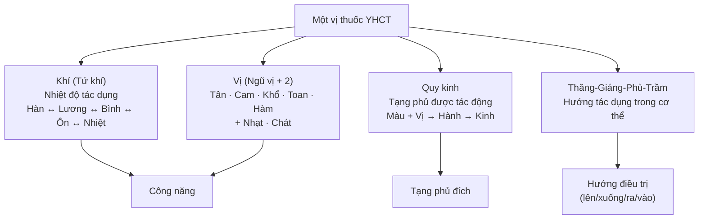
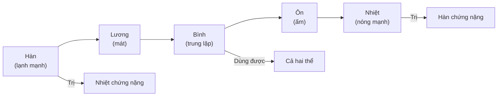
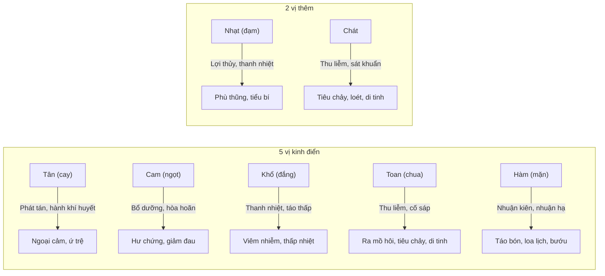
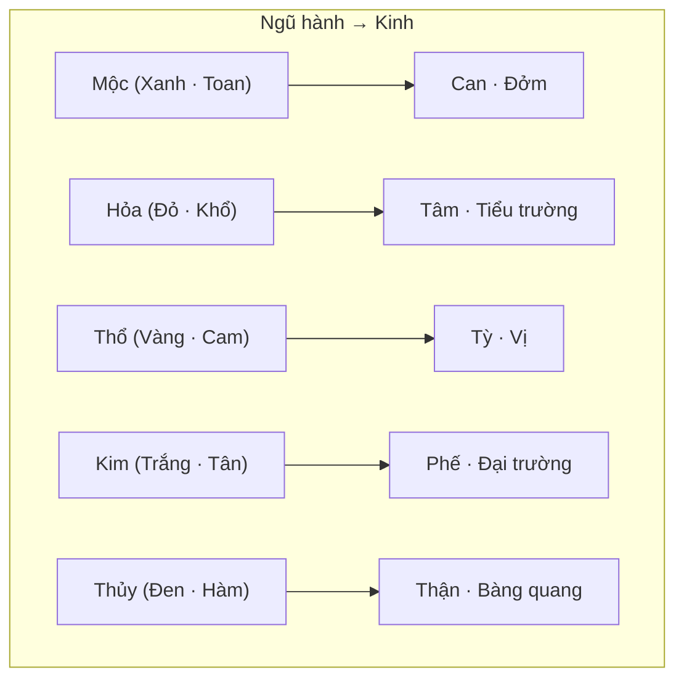
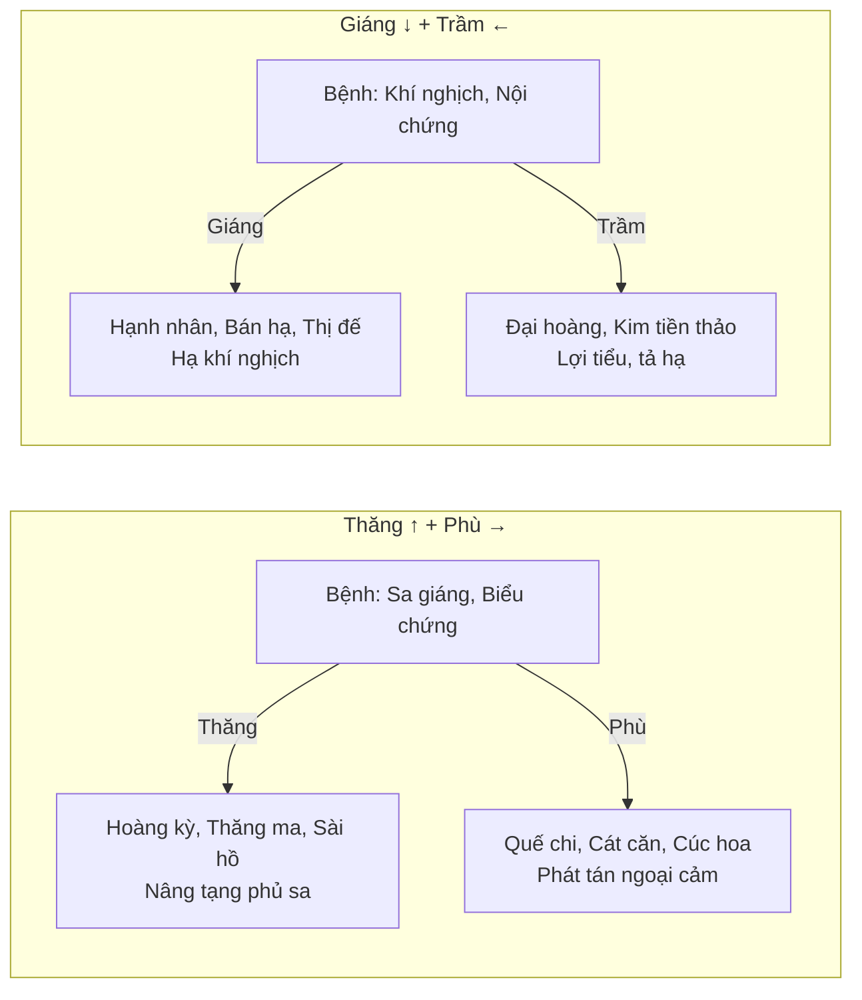
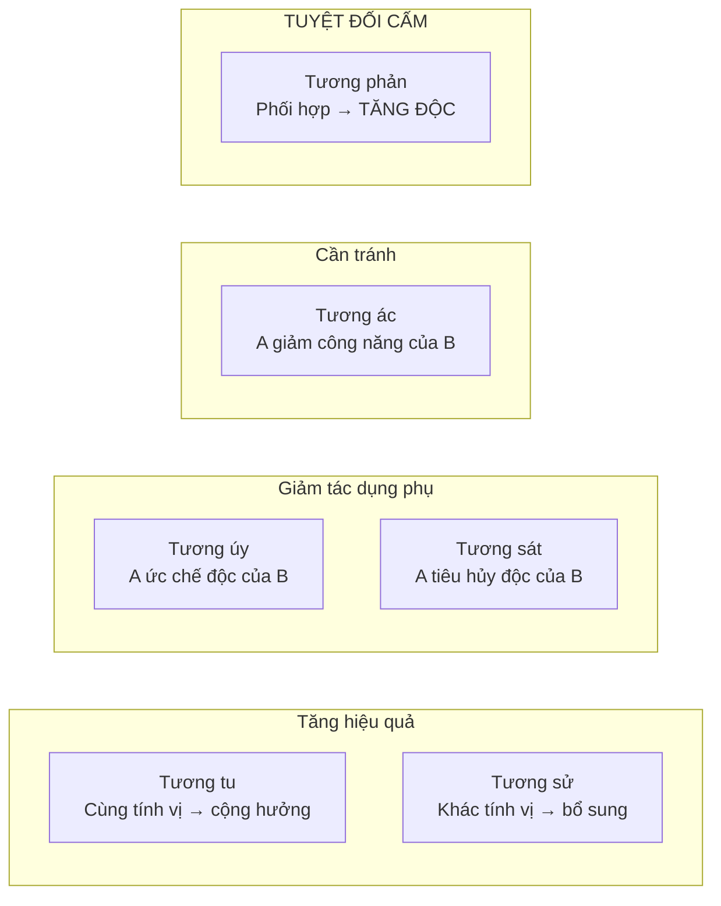
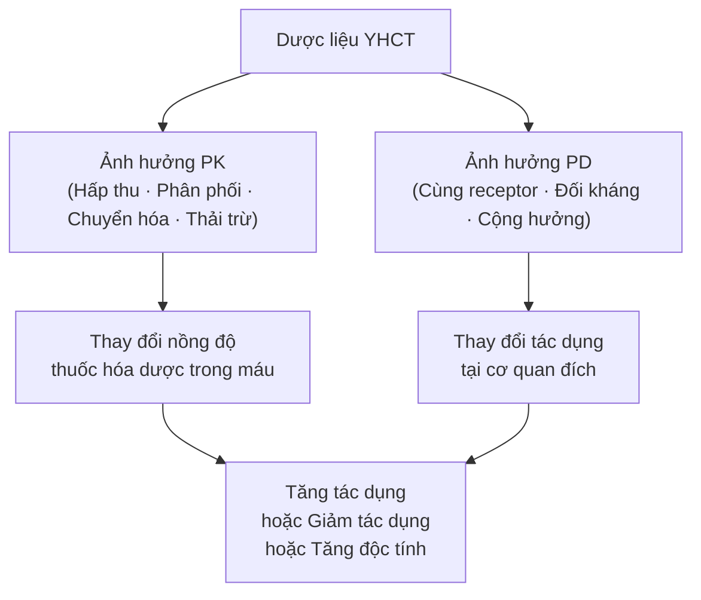

import MedicalNote from '~/components/MedicalNote.astro';
import KeyPoints from '~/components/KeyPoints.astro';
import RedFlags from '~/components/RedFlags.astro';
import CompareTable from '~/components/CompareTable.astro';
import ClinicalPearl from '~/components/ClinicalPearl.astro';

## Mục tiêu bài giảng

Sau bài này người học **hiểu được** (không chỉ thuộc):

- [ ] Tại sao Tứ khí không phải "cảm giác nóng lạnh khi uống" mà là tác dụng dược lý trên bệnh thể
- [ ] Logic quy kinh theo Ngũ hành — và cách chế biến thay đổi quy kinh
- [ ] Phân biệt 6 loại phối ngũ: loại nào tăng, loại nào giảm, loại nào cấm
- [ ] Thập bát phản và Thập cửu úy: tại sao quan trọng và khi nào có ngoại lệ
- [ ] Liên hệ tính năng YHCT với cơ chế dược lý hiện đại

<MedicalNote title="Góc nhìn giảng viên">
  **Điều GS 30 năm sẽ nói đầu bài:** "Biết tính vị quy kinh là biết 'thân thế' của từng vị thuốc — giống như biết chuyên khoa và kinh nghiệm của từng bác sĩ. Kê toa đúng nghĩa là ghép đúng người đúng việc, không phải nhớ bảng tra."
</MedicalNote>

---

## Bức tranh tổng thể — 4 chiều mô tả một vị thuốc

---

## 1. Tứ khí — Không phải cảm giác, là dược lý

### 1.1. Sai lầm phổ biến

> **Tứ khí KHÔNG phải là vị thuốc nóng hay lạnh khi uống.** Gừng có vị tân (cay, nóng khi nếm) nhưng không hoàn toàn là "nhiệt" theo Tứ khí.

Tứ khí = **phản ứng của cơ thể với thuốc trên bệnh nền đặc định:**

- Thuốc làm giảm nhiệt chứng → tính Hàn/Lương
- Thuốc làm giảm hàn chứng → tính Ôn/Nhiệt

### 1.2. Bậc thang Tứ khí

### 1.3. Cơ chế YHHĐ tương ứng

| YHCT | YHHĐ |
|---|---|
| Thuốc hàn-lương | Ức chế trung khu điều nhiệt, ức chế TKTW, giảm trương lực, chống viêm |
| Thuốc ôn-nhiệt | Kích thích thần kinh giao cảm, tăng chuyển hóa, co mạch ngoại vi, tăng tạo nhiệt |

<CompareTable
  headers={["Tính", "Ví dụ", "Dùng cho", "Cơ chế YHHĐ sơ bộ"]}
  rows={[
    ["Hàn", "Thạch cao, Hoàng liên, Miết giáp", "Sốt cao, Tâm hỏa, Âm hư phục nhiệt", "Hạ nhiệt trung khu, chống viêm"],
    ["Lương", "Mạch môn, Kim tiền thảo, Lạc tiên", "Ho do nhiệt, Bàng quang thấp nhiệt", "Lợi tiểu nhẹ, kháng khuẩn"],
    ["Bình", "Cam thảo, Đảng sâm, Mật ong", "Cả hàn chứng lẫn nhiệt chứng", "Điều hòa — dùng an toàn rộng rãi"],
    ["Ôn", "Ma hoàng, Tía tô, Kinh giới", "Ngoại cảm phong hàn", "Tinh dầu tăng tiết mồ hôi, giãn mạch ngoại vi"],
    ["Nhiệt", "Quế nhục, Phụ tử", "Thận hư hàn, Thoát dương, Hàn nhập lý", "Alkaloid kích thích tim mạch, tăng tuần hoàn"],
  ]}
/>

---

## 2. Ngũ vị — Công năng và thành phần hóa học

### 2.1. Bản đồ 7 vị

### 2.2. Thành phần hóa học → Vị

| Vị | Thành phần chính | Ví dụ thuốc |
|---|---|---|
| Tân | Tinh dầu, alkaloid (capsaicin, piperin) | Gừng, Ớt, Tiêu, Tía tô |
| Cam | Carbohydrat, đường, saponin | Cam thảo, Mật ong, Nhân sâm |
| Khổ | Glycosid, alkaloid, polyphenol | Hoàng liên, Xuyên tâm liên, Long đởm thảo |
| Toan | Acid hữu cơ (citric, malic, oxalic) | Ô mai, Kim anh, Ngũ vị tử |
| Hàm | Muối khoáng, mucopolysaccharid | Hải tảo, Long cốt, Thạch quyết minh |
| Nhạt | Đường, muối khoáng nhẹ | Bạch phục linh, Thông thảo |
| Chát | Tannin | Búp Ổi, Liên nhục, Khiếm thực |

### 2.3. Ngũ cấm và Ngũ nghi

**Ngũ cấm** — tạng bị bệnh cấm dùng vị khắc tạng đó (Ngũ hành tương khắc):

| Tạng bệnh | Cấm vị | Hành khắc |
|---|---|---|
| Tỳ (Thổ) | Toan (Mộc) | Mộc khắc Thổ |
| Phế (Kim) | Khổ (Hỏa) | Hỏa khắc Kim |
| Thận (Thủy) | Cam (Thổ) | Thổ khắc Thủy |
| Can (Mộc) | Tân (Kim) | Kim khắc Mộc |
| Tâm (Hỏa) | Hàm (Thủy) | Thủy khắc Hỏa |

<ClinicalPearl>

**Ngũ cấm trên lâm sàng:** Bệnh nhân Tỳ hư (tiêu hóa yếu, đầy bụng) không nên dùng nhiều vị thuốc vị chua (Ô mai, Kim anh) — vì "Toan thuộc Mộc, Mộc khắc Thổ" → làm yếu Tỳ thêm. Điều này tương ứng YHHĐ: acid thực phẩm kích thích tiết gastrin, tăng axit dạ dày — bất lợi khi Tỳ Vị đã yếu.

</ClinicalPearl>

---

## 3. Quy kinh — Logic "bản đồ" thuốc

### 3.1. Quy kinh theo Ngũ hành

### 3.2. Phân tích trường hợp kinh điển

Hoàng liên, Hoàng bá, Hoàng cầm, Chi tử — đều vị khổ tính hàn, đều thanh nhiệt. Nhưng:

| Vị thuốc | Quy kinh chính | Chỉ định ưu tiên |
|---|---|---|
| Hoàng liên | Tâm | Tâm hỏa — loét miệng, bứt rứt, mất ngủ |
| Hoàng bá | Thận | Thận hỏa — âm hư phát nhiệt, đạo hãn |
| Hoàng cầm | Phế | Phế hỏa — viêm phổi, ho ra máu |
| Chi tử | Tam tiêu | Tam tiêu hỏa — bứt rứt toàn thân |

### 3.3. Thay đổi quy kinh bằng chế biến — kỹ thuật "redirect"

| Phụ liệu tẩm | → Kinh | Ví dụ |
|---|---|---|
| Muối | Thận | Đỗ trọng, Hương phụ, Trạch tả tẩm muối |
| Giấm | Can | Diên hồ, Sài hồ tẩm giấm |
| Rượu | Thăng (đưa thuốc lên) | Hoàng liên sao rượu → trị Tâm hỏa |
| Mật ong / Hoàng thổ | Tỳ Vị | Bạch truật, Hoàng kỳ tẩm Mật ong |
| Chu sa | Tâm | Xương bồ tẩm Chu sa |
| Sao đen | Thận (cầm máu) | Hà diệp, Trắc bá diệp, Hoa hòe sao đen |

---

## 4. Thăng Giáng Phù Trầm — Hướng tác dụng trong cơ thể

### 4.1. 4 chiều hướng và ứng dụng

### 4.2. Quy tắc hình thức → Khuynh hướng

| Thể chất / Tính vị | Khuynh hướng |
|---|---|
| Hoa, lá, vỏ, lông → Nhẹ | Thăng phù |
| Khoáng thạch, hạt → Nặng | Trầm giáng |
| Vị tân, cam · Tính ôn nhiệt | Thăng phù (Dương) |
| Vị khổ, toan, hàm · Tính hàn lương | Trầm giáng (Âm) |

### 4.3. Thay đổi khuynh hướng bằng chế biến

| Vị thuốc | Bản chất | Sau chế biến | Kết quả |
|---|---|---|---|
| Hoàng liên | Giáng (trị Trung-Hạ tiêu) | Sao rượu | Thăng → trị Tâm hỏa, loét miệng |
| Bán hạ | Trầm (giáng Vị khí nghịch) | Sao nước Gừng | Phù → phát tán |
| Sinh khương | Phù, thăng (phát tán phong hàn) | Nướng (Bào khương) | Trầm → ôn trung tán hàn |
| Sài hồ | Thăng | Sao giấm | Giáng → nhập kinh Can |

<ClinicalPearl>

**"Chính trị" vs "Tòng trị":** Dùng thuốc ngược chiều bệnh = Chính trị (thường dùng). Dùng thuốc cùng chiều bệnh = Tòng trị (ví dụ: dùng thuốc thăng trong chứng ói nghịch nếu thực chứng ở thượng tiêu — mục tiêu là "dẫn tà ra theo chiều tự nhiên của nó").

</ClinicalPearl>

---

## 5. Phối ngũ — 6 loại và logic sử dụng

### 5.1. Phân loại theo hiệu quả

### 5.2. Phân tích chi tiết từng loại

<CompareTable
  headers={["Loại", "Cơ chế", "Ví dụ điển hình", "Ứng dụng"]}
  rows={[
    ["Tương tu", "Hai vị cùng tính vị, phối → cộng hưởng tuyến tính", "Kim ngân + Liên kiều (thanh nhiệt giải độc); Đại hoàng + Mang tiêu (tả hạ)", "Cố ý phối để tăng tác dụng chính"],
    ["Tương sử", "Hai vị khác tính vị, phối → synergy bổ sung góc nhìn", "Liên kiều + Ngô thù du → tăng cầm nôn (ức chế tiết dịch vị)", "Phối khi cần tấn công đa cơ chế"],
    ["Tương úy", "B có độc tính; A ức chế độc B mà không mất công năng chính của B", "Bán hạ (kích ứng họng) úy Sinh khương (chế Bán hạ bào chế)", "Dùng để giảm độc trong bào chế"],
    ["Tương sát", "A tiêu hủy hoàn toàn độc tính của B", "Đậu xanh sát Ba đậu; Phòng phong sát Thạch tín", "Dùng khi giải độc cấp"],
    ["Tương ác", "A kiềm chế công năng của B (hai tính xung đột)", "Hoàng cầm (hàn) ác Sinh khương (ôn) → tính ôn bị trung hòa", "Tránh phối trừ khi có chủ đích"],
    ["Tương phản", "Phối hợp → tạo độc mới hoặc tăng hại mạnh", "Cam thảo phản Cam toại; Ô đầu phản Bối mẫu", "TUYỆT ĐỐI CẤM — ngoại trừ trường hợp đặc biệt có chuyên gia"],
  ]}
/>

### 5.3. Thập bát phản — thuộc lòng

| Vị trung tâm | Phản với (cấm phối) |
|---|---|
| **Cam thảo** | Đại kích · Nguyên hoa · Cam toại · Hải táo |
| **Ô đầu** (Xuyên ô, Thảo ô, Phụ tử) | Bối mẫu · Qua lâu · Bán hạ · Bạch liễm · Bạch cập |
| **Lê lô** | Nhân sâm · Sa sâm · Đan sâm · Khổ sâm · Tế tân · Bạch thược |

**Ghi nhớ nhanh:** "Cam-Ô-Lê" — 3 vị trung tâm. Cam (4 cấm), Ô (5 cấm), Lê (6 cấm) = 15 + 3 = 18 vị.

<RedFlags title="Sai lầm nghiêm trọng về phối ngũ">

- **Dùng Nhân sâm với Lê lô** → Lê lô phản Nhân sâm: có báo cáo gây mù mắt (Tế tân + Lê lô).
- **Cam thảo trong bài thuốc lợi thủy mà có Nguyên hoa** → Nguyên hoa mất tác dụng lợi thủy và tăng độc tính.
- **Nhầm tương úy vs tương phản:** "Bán hạ úy Sinh khương" (úy = tốt, Sinh khương giảm độc) ≠ "Bán hạ phản Ô đầu" (phản = xấu, tăng độc). Úy = kiêng nể (có ích). Phản = đối kháng (có hại).

</RedFlags>

---

## 6. Tương tác Hóa dược — YHCT

### 6.1. Cơ chế tương tác

### 6.2. Các cặp tương tác quan trọng lâm sàng

| YHCT | Hóa dược | Hậu quả | Cơ chế |
|---|---|---|---|
| Bạch quả (Ginkgo) | Warfarin, aspirin, clopidogrel | Tăng xuất huyết | Ức chế kết tập tiểu cầu cộng hưởng |
| Đan sâm | Warfarin | Tăng kháng đông | Tương tự warfarin (tác động coumarin) |
| Nhân sâm | Metformin | Hạ đường huyết quá mức | Nhân sâm cũng hạ glucose |
| Cam thảo | Corticoid uống/bôi | Tăng tác dụng corticoid | Glycyrrhizin ức chế chuyển hóa cortisol |
| Ma hoàng | Caffein, chất kích thích | Tăng huyết áp, loạn nhịp | Ephedrin + caffein → synergy giao cảm |
| Vỏ hạt Mã đề, Thảo quyết minh | Nhiều thuốc uống | Giảm hấp thu | Chất xơ hòa tan bẫy thuốc trong ruột |

<ClinicalPearl>

**Hỏi bệnh nhân đúng cách:** Khi tiếp nhận bệnh nhân dùng warfarin, aspirin, hoặc thuốc hạ đường huyết, PHẢI hỏi về việc dùng: Ginkgo, Nhân sâm, Gừng, Đan sâm, Cam thảo — vì bệnh nhân thường không xem thuốc YHCT là "thuốc thật" và không tự báo cáo.

</ClinicalPearl>

---

## 7. Câu hỏi tư duy cuối bài

1. **Bệnh nhân bị sa dạ dày, lại có triệu chứng Vị khí nghịch (ợ hơi, buồn nôn).** Thầy thuốc vừa cần dùng thuốc thăng (nâng dạ dày) vừa cần dùng thuốc giáng (hạ nghịch khí). Hai chiều này mâu thuẫn nhau không? Nguyên tắc phối ngũ nào giải quyết?

2. **Hoàng liên bản chất là giáng (trị Trung-Hạ tiêu).** Khi sao rượu nó lại đi lên trị Tâm hỏa. Cơ chế YHHĐ của rượu làm thay đổi dược động học Hoàng liên như thế nào? (Gợi ý: nghĩ đến tính bay hơi và tan trong dầu của rượu)

3. **Cam thảo phản Cam toại, nhưng bài Cam toại tán lại phối cả hai.** Đây là vi phạm quy tắc hay là ngoại lệ có chủ đích? Nguyên tắc "tòng trị" giải thích điều này như thế nào?
