import MedicalNote from '~/components/MedicalNote.astro';
import KeyPoints from '~/components/KeyPoints.astro';
import RedFlags from '~/components/RedFlags.astro';
import CompareTable from '~/components/CompareTable.astro';
import ClinicalPearl from '~/components/ClinicalPearl.astro';

## Mục tiêu bài giảng

Sau bài này người học **hiểu được** (không chỉ thuộc):

- [ ] Tại sao alkaloid base không tan nước — và lâm sàng dùng dạng muối vì lý do gì
- [ ] Tại sao chỉ cần biết aglycon để biết nhóm glycosid nào và tác dụng gì
- [ ] Cơ chế phá huyết của saponin và tại sao không tiêm tĩnh mạch
- [ ] Flavonoid tác dụng bền thành mạch theo cơ chế nào
- [ ] Tannin giải độc alkaloid dựa trên nguyên lý gì
- [ ] Glycosid tim nguy hiểm ở điểm nào — từ cơ chế suy ra được dấu hiệu độc

<MedicalNote title="Góc nhìn giảng viên">
  **Điều GS 30 năm sẽ nói đầu bài:** "Học hóa dược liệu không phải để nhớ công thức. Học để hiểu rằng tính chất hóa lý của phân tử QUYẾT ĐỊNH cách chiết xuất, cách bào chế, cách dùng và cơ chế tác dụng. Nếu hiểu tại sao alkaloid base không tan nước, bạn tự suy ra được vì sao morphin phải dùng dạng HCl khi tiêm, và vì sao không được tiêm saponin."
</MedicalNote>

---

## 1. Bản đồ tổng thể — Hữu cơ sơ cấp vs thứ cấp

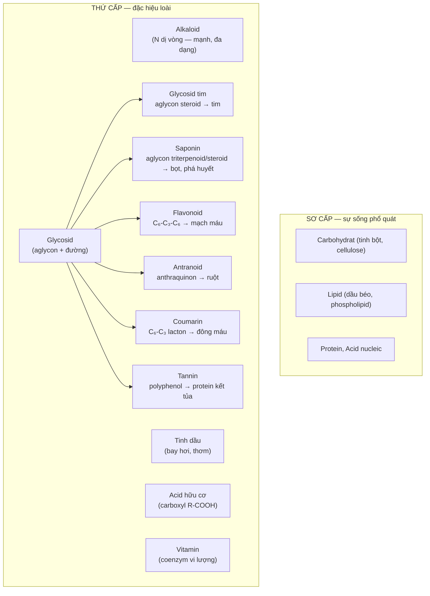

**Nguyên tắc vàng:** Trong nhóm hữu cơ thứ cấp, **aglycon quyết định tất cả** — tên nhóm, tác dụng, độ tan aglycon. Phần đường chỉ quyết định độ tan tổng thể và dược động học.

---

## 2. Alkaloid — Đọc tính chất từ cấu trúc

### 2.1. Tại sao alkaloid có tính kiềm?

Alkaloid có nguyên tử Nitơ với cặp electron tự do (lone pair) → nhận proton H⁺ → base.

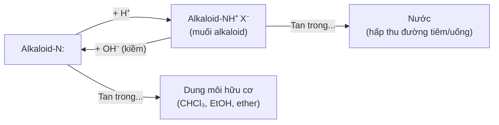

**Lâm sàng trực tiếp:**
- Atropin base → tan chloroform, không tan nước → không tiêm được.
- Atropin sulfat → tan nước → tiêm được.
- Morphin base → không tan nước → morphin HCl dùng tiêm.
- **Quy tắc:** Dược phẩm tiêm có alkaloid → luôn ở dạng muối.

### 2.2. Phân loại cấu trúc — Nhớ theo tác dụng

<CompareTable
  headers={["Nhóm cấu trúc", "Ví dụ", "Receptor / Cơ chế", "Tác dụng"]}
  rows={[
    ["Isoquinolin", "Morphin, Codein", "μ-opioid receptor (GPCR)", "Giảm đau mạnh, ức chế TKTW"],
    ["Isoquinolin", "Papaverin", "PDE inhibitor → ↑ cAMP", "Giãn cơ trơn (mạch, phế quản)"],
    ["Isoquinolin", "Berberin", "Ức chế IKr tim, NF-κB", "Chống loạn nhịp, kháng khuẩn"],
    ["Quinolin", "Quinin", "Ức chế DNA polymerase ký sinh trùng", "Sốt rét"],
    ["Indol", "Vincristin, Vinblastin", "Ức chế polymerization tubulin → mitosis", "Chống ung thư"],
    ["Tropan", "Atropin", "Block muscarinic receptor (M1-M3)", "Liệt phó giao cảm"],
    ["Purin", "Caffein", "Ức chế PDE, antagonist adenosine", "Kích thích TKTW, giãn phế quản"],
    ["Phenylalkylamin", "Ephedrin", "Kích thích α và β adrenergic", "Phát hãn, giải biểu hàn"],
    ["Diterpen", "Aconitin", "Kích hoạt kênh Na⁺ VG (Nav)", "Tê đau, loạn nhịp khi quá liều"],
  ]}
/>

### 2.3. Nhận diện alkaloid trong dược liệu

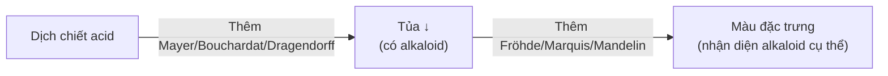

- Tủa: có/không có alkaloid (định tính).
- Màu: alkaloid gì (định loại).

<RedFlags title="Aconitin — Alkaloid diterpen cực độc">

- Phụ tử (Aconitum) chứa aconitin kích hoạt kênh Nav → khử cực kéo dài → loạn nhịp tim.
- Khoảng an toàn cực hẹp: liều trị ≈ 0,3–2 mg; liều độc ≈ 3–5 mg.
- Triệu chứng ngộ độc: tê lưỡi/môi ngay sau uống, tim đập loạn, hạ HA, ngừng tim.
- Chế biến đúng (thủy phân 8 giờ) giảm aconitin → benzoylaconin (ít độc hơn 200 lần).
- **Không dùng Phụ tử sống (Ô đầu sống).**

</RedFlags>

---

## 3. Glycosid — Aglycon quyết định tất cả

### 3.1. Cấu trúc cơ bản

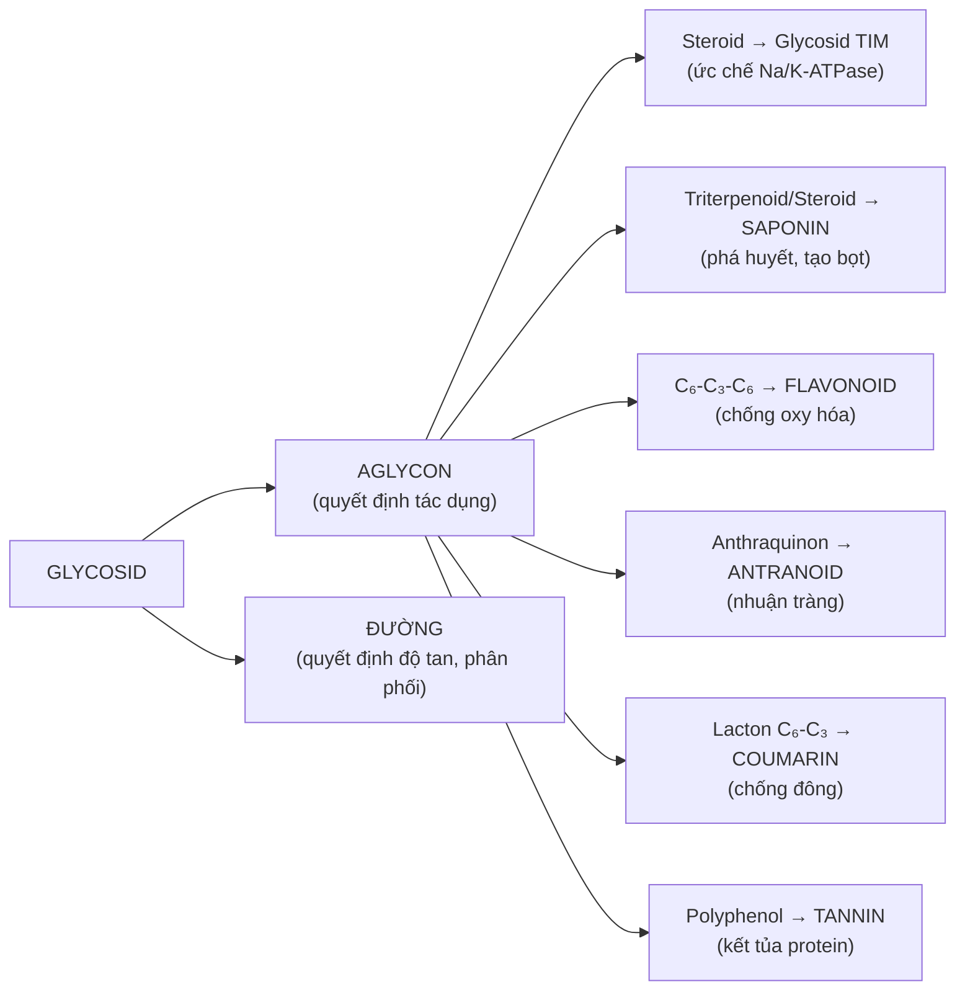

**Quy tắc độ tan:** Aglycon (ít đường) → kém tan nước, tan hữu cơ → chiết bằng chloroform, ether. Glycosid (có đường) → tan nước, ít tan hữu cơ → chiết bằng cồn-nước.

### 3.2. Glycosid tim — Cơ chế và độc tính

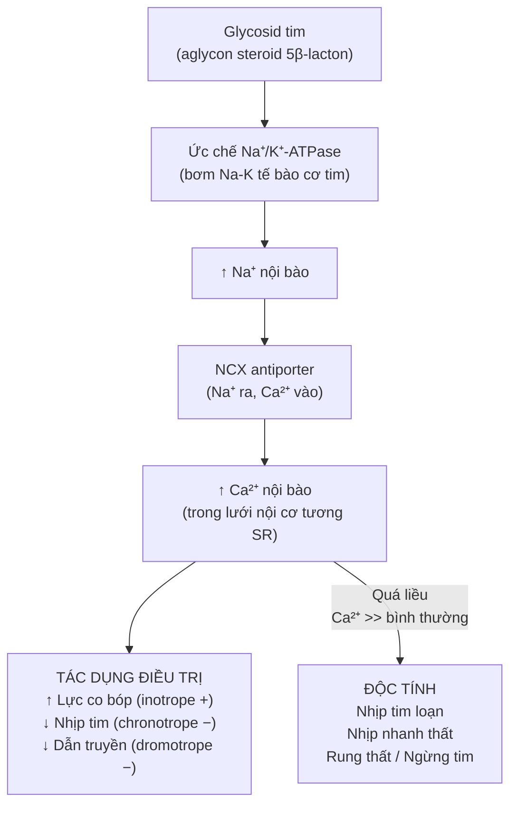

**Dấu hiệu ngộ độc sớm:** nôn, chán ăn, nhìn màu vàng (xanthopsia) — dừng thuốc ngay.

<ClinicalPearl>

**Cây Trúc đào trong sân bệnh viện là nguy cơ thực sự.** Tất cả bộ phận (lá, hoa, quả, nhựa) chứa oleandrin — glycosid tim mạnh. Đã có ca ngộ độc từ hun khói thịt bằng cành Trúc đào. Không nhầm với cây cảnh vô hại.

</ClinicalPearl>

### 3.3. Saponin — Tại sao không tiêm tĩnh mạch?

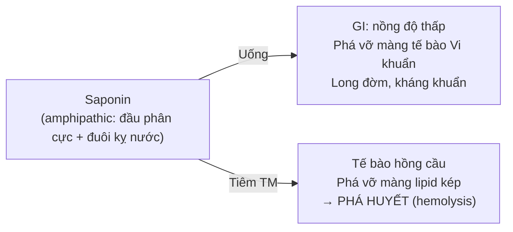

Saponin là **amphipathic** — có phần phân cực (đường) và phần kỵ nước (aglycon steroid/triterpenoid). Ở nồng độ đủ cao trong máu → chèn vào màng lipid kép → phá màng hồng cầu → hemolysis cấp tính. Ở GI: nồng độ loãng, màng TB ruột bảo vệ bởi chất nhầy → an toàn.

---

## 4. Flavonoid — Chống oxy hóa theo cơ chế nào?

### 4.1. Cấu trúc và cơ chế dập tắt gốc tự do

Flavonoid có nhiều nhóm -OH phenol → cho H• cho gốc tự do → biến gốc tự do thành phân tử ổn định.

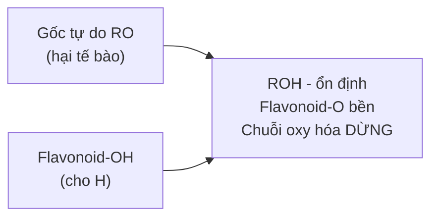

**Hệ quả sinh học:**
- Bảo vệ collagen thành mạch khỏi oxy hóa → làm bền mao mạch (rutin, quercetin)
- Bảo vệ LDL khỏi oxy hóa → giảm xơ vữa động mạch
- Bảo vệ DNA khỏi oxy hóa bức xạ (dùng trong xạ trị)

### 4.2. Màu → Nhóm → Tác dụng

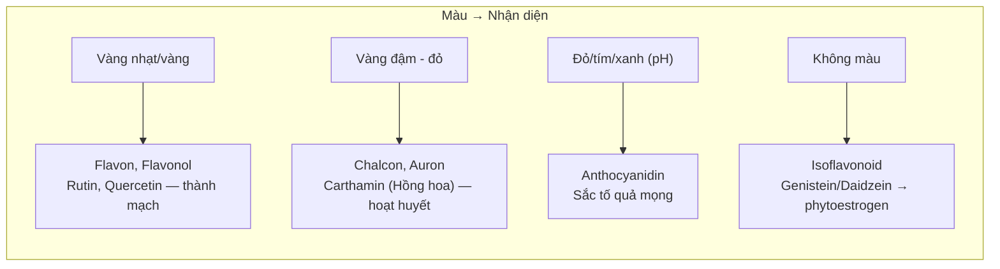

<ClinicalPearl>

**Phytoestrogen — lưỡi dao 2 lưỡi.** Genistein (Đậu nành) và daidzein (Sắn dây) gắn receptor estrogen (ERβ) → tốt cho phụ nữ mãn kinh (giảm bốc hỏa, bảo vệ xương). Nhưng BN ung thư vú ER+ không được dùng nhiều đậu nành vì phytoestrogen có thể kích thích tế bào ung thư.

</ClinicalPearl>

---

## 5. Tannin — Giải độc bằng kết tủa

### 5.1. Cơ chế kết tủa protein

Tannin (polyphenol, PM 600-2.000) có nhiều nhóm -OH phenol → tạo liên kết hydro và tương tác kỵ nước với protein → phức tannin-protein không tan:

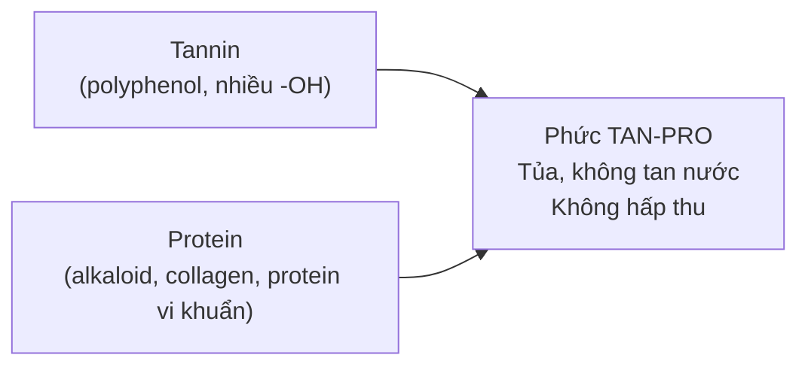

**3 ứng dụng lâm sàng:**

| Ứng dụng | Cơ chế |
|---|---|
| Giải độc alkaloid | Tannin + alkaloid → tủa tanat, không hấp thu → rửa dạ dày có tannin |
| Giải độc kim loại nặng | Tannin + Pb²⁺, Hg²⁺ → phức chelat/tủa → không hấp thu qua ruột |
| Trị tiêu chảy | Tannin + protein niêm mạc ruột → lớp bảo vệ → giảm bài tiết và co se |

### 5.2. Hai loại tannin — Phân biệt thực hành

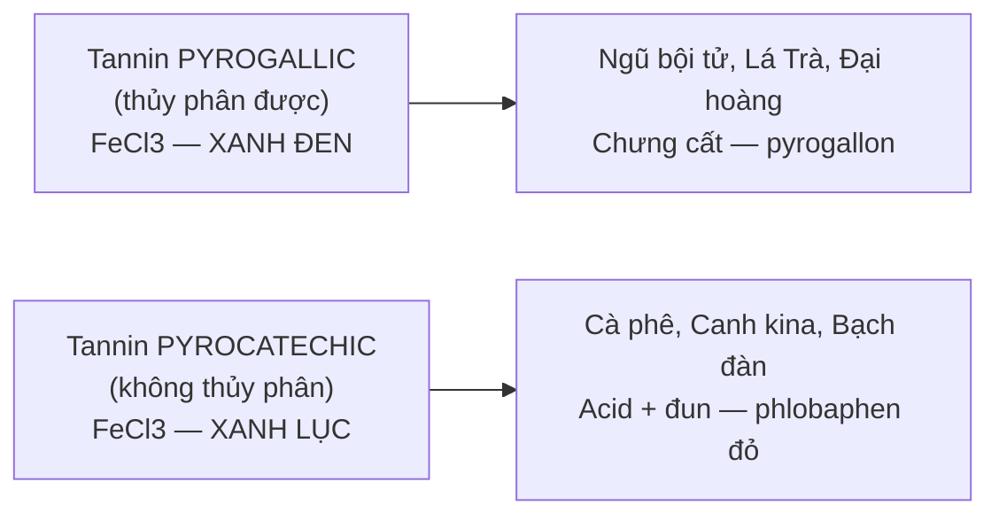

---

## 6. Antranoid — Khi nào nhuận, khi nào tẩy?

### 6.1. Cơ chế tác dụng ruột

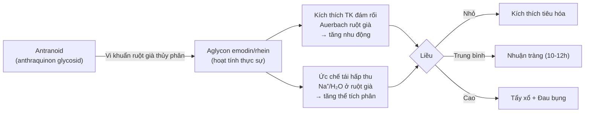

<RedFlags title="Antranoid — Thận trọng đặc biệt">

- **Có thai:** Antranoid kích thích cơ trơn tử cung → nguy cơ sinh non, sảy thai.
- **Cho con bú:** Bài tiết qua sữa → tiêu chảy ở trẻ bú.
- **Viêm bàng quang, viêm ruột:** Không dùng vì kích thích cơ trơn.
- **Đại hoàng mới thu hái:** Chứa dạng khử (anthron) gây đau bụng cấp — phải để 1 năm.

</RedFlags>

---

## 7. Coumarin và Tinh dầu — Tóm lược cơ chế

### 7.1. Coumarin chống đông — Logic từ cấu trúc

Warfarin và dicoumarol (coumarin) ức chế cạnh tranh vitamin K epoxide reductase → thiếu vitamin K dạng hoạt động → các yếu tố đông máu II, VII, IX, X không được carboxylate → không đông máu.

**Nguy hiểm:** Aflatoxin (coumarin nấm mốc) không chống đông mà gây ung thư gan — phải phân biệt hoàn toàn với coumarin dược dụng.

### 7.2. Tinh dầu — Bay hơi, kháng khuẩn tiếp xúc

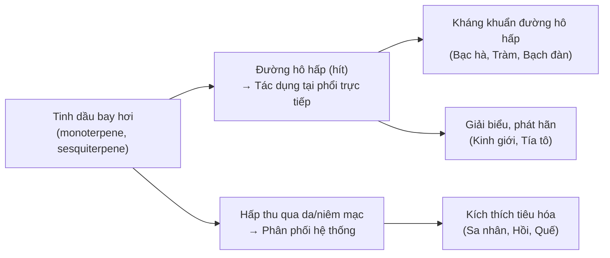

---

## 8. Câu hỏi tư duy cuối bài

1. **Morphin base không tan nước, nhưng morphin sulfat tan tốt.** Khi dùng morphin sulfat tiêm TM vào cơ thể, ở pH sinh lý 7,4 thì morphin tồn tại ở dạng base hay muối? Dạng nào vào được não qua BBB?

2. **Bệnh nhân ngộ độc kim loại nặng (chì).** Trong phác đồ cấp cứu, nếu dùng tannin (Trà đặc) để trung hòa tại GI, cơ chế là gì? Tại sao vẫn cần dùng chelating agent hệ thống (như DMSA) sau đó?

3. **Lô hội (Aloe vera) chứa antranoid dạng khử (aloin).** Tại sao dùng gel Lô hội bôi ngoài da an toàn, nhưng uống nhựa Lô hội lại nguy hiểm cho người có thai?
