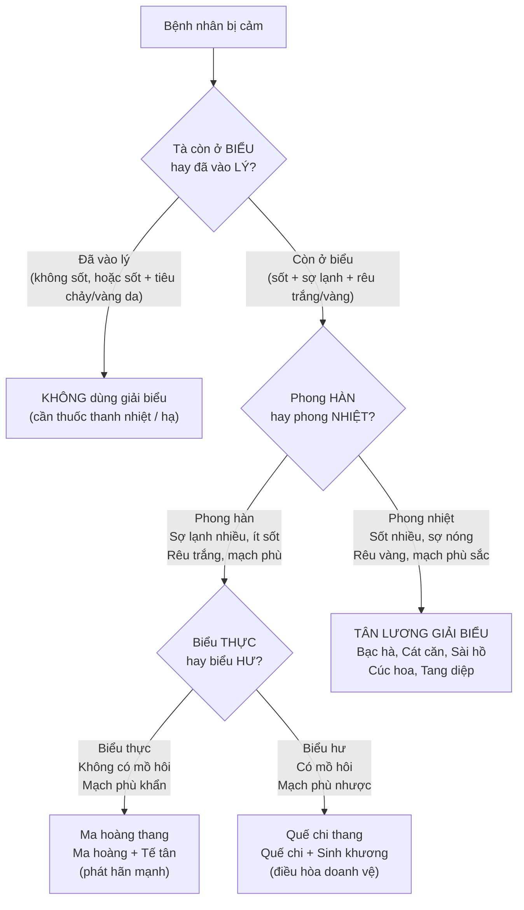
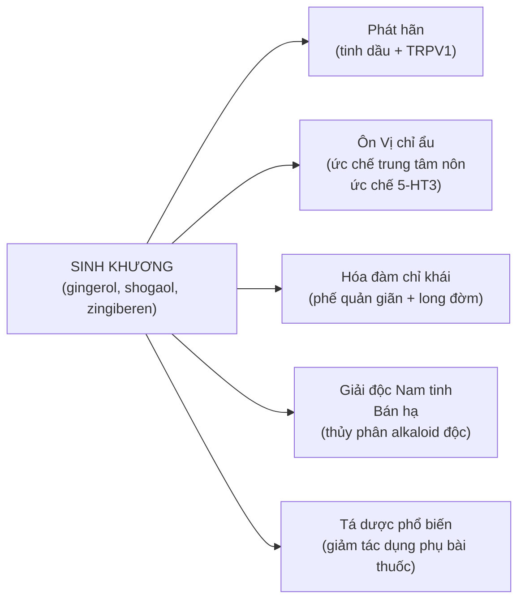
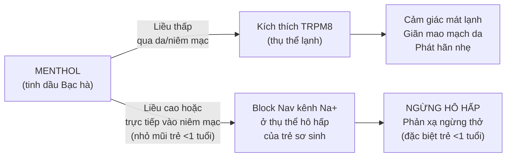
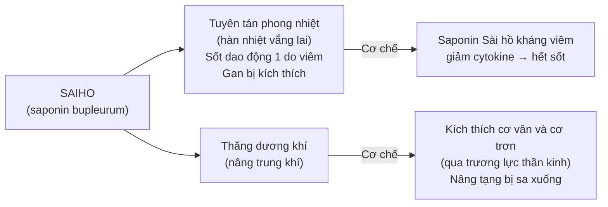
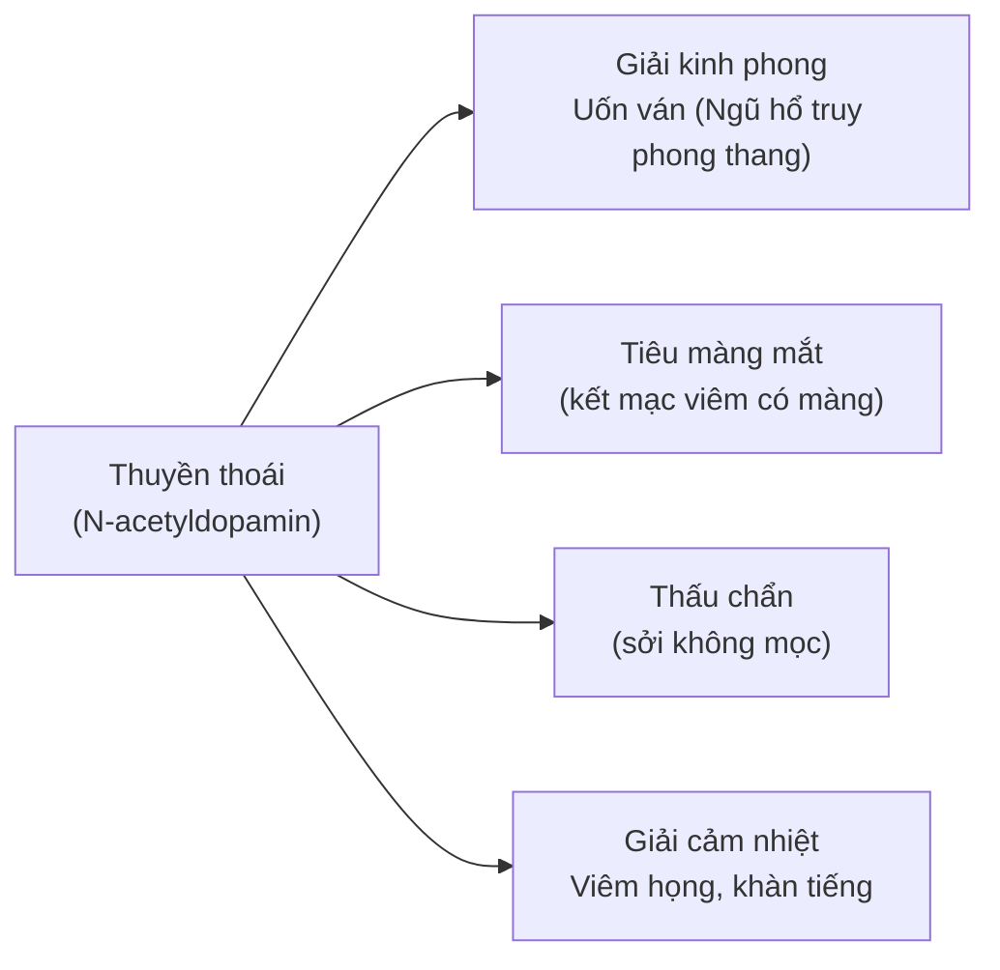

import MedicalNote from '~/components/MedicalNote.astro';
import KeyPoints from '~/components/KeyPoints.astro';
import RedFlags from '~/components/RedFlags.astro';
import CompareTable from '~/components/CompareTable.astro';
import ClinicalPearl from '~/components/ClinicalPearl.astro';

## Mục tiêu bài giảng

Sau bài này người học **hiểu được** (không chỉ thuộc):

- [ ] Tại sao thuốc giải biểu phát hãn được — cơ chế nào trong tinh dầu kích thích mồ hôi?
- [ ] Phân biệt biểu thực vs biểu hư từ triệu chứng → chọn đúng nhóm thuốc
- [ ] Tại sao Ma hoàng và Quế chi đều trị phong hàn nhưng lại chỉ định ngược nhau?
- [ ] Kinh giới dùng được cả hàn lẫn nhiệt — theo logic nào?
- [ ] Sài hồ trị hàn nhiệt vãng lai và sa giáng — 2 chỉ định tưởng chừng không liên quan?
- [ ] Tại sao menthol (Bạc hà) nguy hiểm với trẻ < 1 tuổi?

<MedicalNote title="Góc nhìn giảng viên">
  **Điều GS 30 năm sẽ nói đầu bài:** "Thuốc giải biểu chỉ có 1 mục tiêu: đưa tà ra qua mồ hôi. Câu hỏi không phải 'thuốc nào trị cảm?' mà là: 'Tà ở đâu? Loại gì? Cơ thể người bệnh thế nào?' Trả lời 3 câu đó, bạn tự tìm ra thuốc."
</MedicalNote>

---

## 1. Bản đồ tư duy lâm sàng — 3 câu hỏi trước khi chọn thuốc

---

## 2. Tại sao gọi là "giải biểu"? — Cơ chế phát hãn

Câu hỏi sâu: tinh dầu làm ra mồ hôi theo cơ chế nào?

```mermaid
flowchart LR
    TD["Tinh dầu\n(menthol, cinnamaldehyde\nzingiberen, perillaldehyd)"] -->|"Hít/uống, hấp thu qua GI"| BLOOD["Vào máu\nhấp thu nhanh nhờ lipophilic"]
    BLOOD -->|"Đến da"| TRPV["Kích thích TRPV1/TRPM8\n(thụ thể nhiệt/lạnh trên da)"]
    TRPV --> CGRP["Giải phóng CGRP\n(Calcitonin Gene-Related Peptide)"]
    CGRP --> VASD["Giãn mao mạch da\nTăng tưới máu dưới da"]
    VASD --> SWEAT["Tăng tiết mồ hôi\n(tuyến mồ hôi ngoại tiết)"]
    SWEAT --> COOL["Bốc hơi mồ hôi\nHạ thân nhiệt"]
    COOL --> TAKHIET["TÀ RA THEO MỒ HÔI\n(Biểu giải)"]
```

**Ý nghĩa lâm sàng:**
- Phải uống nóng + đắp chăn kín → duy trì nhiệt độ da cao → tuyến mồ hôi hoạt động
- Sắc nhanh đậy nắp kín → tinh dầu không bay trước khi uống
- Không nên tắm ngay sau uống → mồ hôi dừng sớm, tà không ra hết

---

## 3. Tân ôn giải biểu — Phân tích từng vị theo logic

### 3.1. Ma hoàng vs Quế chi — Cùng trị phong hàn, chỉ định ngược nhau

<CompareTable
  headers={["", "Ma hoàng", "Quế chi"]}
  rows={[
    ["Bộ phận", "Toàn cây (ephedrin)", "Cành non (cinnamaldehyde)"],
    ["Hoạt chất chính", "Alkaloid ephedrin", "Tinh dầu (cinnamaldehyde, eugenol)"],
    ["Cơ chế phát hãn", "Kích thích giao cảm → tuyến mồ hôi hoạt động mạnh", "TRPV1 → giãn mao mạch → thoát nhiệt"],
    ["Chỉ định", "Biểu THỰC: không có mồ hôi, mạch phù khẩn", "Biểu HƯ: đã có mồ hôi, mạch phù nhược"],
    ["Kiêng kỵ", "Dương hư tự ra mồ hôi (sẽ làm nặng thêm)", "Sốt cao, âm hư dương thịnh, phụ nữ có thai"],
    ["Thêm tác dụng", "Bình suyễn (beta-2 giãn phế quản) + Lợi niệu (viêm cầu thận)", "Ôn kinh thông mạch (đau khớp do hàn)"],
    ["Bài thuốc", "Ma hoàng thang (Ma hoàng + Quế chi + Hạnh nhân + Cam thảo)", "Quế chi thang (Quế chi + Thược dược + Sinh khương + Đại táo + Cam thảo)"],
  ]}
/>

<ClinicalPearl>

**Quy tắc ngón tay cái:** Biểu thực = "thực" như cái nắp bị đóng kín → cần Ma hoàng "mở" mạnh. Biểu hư = "hư" như cái van bị hở → cần Quế chi "điều chỉnh" nhẹ. Dùng ngược → biểu hư dùng Ma hoàng → mồ hôi nhiều hơn → mất tân dịch nặng hơn.

</ClinicalPearl>

### 3.2. Sinh khương — Đa năng nhất trong tân ôn

Sinh khương đặc biệt vì quy vào **6 kinh** (Tâm, Phế, Tỳ, Vị, Thận, Đại trường) — rộng nhất nhóm.

### 3.3. Kinh giới — Trung tính, linh hoạt nhất nhóm

**Câu hỏi:** Tân ôn giải biểu sao lại dùng được cả phong nhiệt?

Trả lời: Kinh giới có **tinh dầu ceton đặc thù** (dehydroelsholtzia ceton, elsholtzia ceton) — không quá ấm như Ma hoàng/Quế chi, chỉ tính **hơi ấm** (vị cay hơi đắng, tính ấm). Khi phối hợp với thuốc tân lương (Bạc hà, Liên kiều, Ngưu bàng), tính ôn bị trung hòa → dùng được phong nhiệt.

**Bào chế thay đổi công năng:**
- Kinh giới tươi/khô → Phát tán giải biểu
- Kinh giới sao vàng → Giảm phát tán, tăng giải dị ứng da
- Kinh giới thán (sao cháy) → **Mất phát tán, thành cầm máu** (chỉ huyết)

### 3.4. Tế tân — Giảm đau mạnh nhất nhóm

Tế tân chứa **metyl-eugenol** (phenol), có tác dụng gây tê cục bộ bằng cách block kênh Na+ có kiểm soát điện thế (voltage-gated Na channel) → giảm đau dữ dội (đau răng, đau đầu do hàn). Đây là cơ chế giống lidocain nhưng từ thiên nhiên.

<RedFlags title="Tế tân — Giới hạn liều">

- Tế tân chứa **acid aristolochic** (nếu lẫn rễ Asarum — họ Aristolochiaceae). Acid aristolochic gây tổn thương ống thận và ung thư đường tiết niệu.
- Liều an toàn: **4–8 g/ngày**. Không dùng kéo dài.
- **Không phối hợp Lê lô** (Veratrum) — tương kỵ cổ điển (Thập bát phản).

</RedFlags>

---

## 4. Tân lương giải biểu — Logic theo chỉ định đặc hiệu

### 4.1. Bạc hà — Menthol và 2 cơ chế

<RedFlags title="Bạc hà và trẻ dưới 1 tuổi — TUYỆT ĐỐI KHÔNG">

- **Không xông**: tinh dầu Bạc hà vào niêm mạc hô hấp trẻ → phản xạ ngừng thở.
- **Không nhỏ mũi, không thoa vùng mũi miệng** của trẻ < 1 tuổi.
- **Không cho uống nước có menthol** (kể cả nước cất tinh dầu Bạc hà).
- Người lớn và trẻ > 2 tuổi: menthol an toàn.

</RedFlags>

### 4.2. Cát căn — Đau gáy và chẩm là đặc chỉ định

**Quy kinh Tỳ, Vị** → Dương minh kinh đi qua vùng gáy, chẩm → khi cảm nhiệt có cứng gáy đặc hiệu dùng Cát căn.

Puerarin (isoflavonoid của Cát căn) có tác dụng giãn động mạch đốt sống → cải thiện lưu lượng máu cột sống cổ → hết đau gáy.

### 4.3. Sài hồ — 2 chỉ định tưởng không liên quan

**Tại sao Sài hồ vừa trị cảm sốt vừa trị sa tử cung?**

**Hàn nhiệt vãng lai** (sốt cao - lạnh rùng mình luân phiên): cơ chế là viêm gan/mật kích thích thần kinh phế vị → tự chủ thần kinh dao động → sốt dao động. Saponin Sài hồ kháng viêm gan mật → hết triệu chứng.

<ClinicalPearl>

**Sài hồ + liều cao = ngộ độc gan.** Saponin Sài hồ có tính kích thích. Liều > 15 g/ngày kéo dài → viêm gan do thuốc. Người có tiền sử viêm gan B/C phải thận trọng đặc biệt khi dùng Sài hồ kéo dài.

</ClinicalPearl>

### 4.4. Tang diệp — Cổ biểu liễm hãn (độc đáo không vị nào có)

Tang diệp có **2 tác dụng đối lập với tân ôn**:
- Tuyên tán phong nhiệt → **giải cảm** (thúc mồ hôi khi bị nhiệt)
- **Cổ biểu liễm hãn** → **cầm mồ hôi** (trị mồ hôi trộm, tự ra mồ hôi nhiều)

Cơ chế: Quercetin trong Tang diệp ức chế phosphodiesterase → cAMP tăng → đóng kênh Cl- của tuyến mồ hôi → giảm tiết mồ hôi. Khi kết hợp Mẫu lệ (nung) → tăng liễm hãn.

### 4.5. Thuyền thoái — Vị thuốc từ xác ve sầu

Thành phần N-acetyldopamin (catecholamine) từ xác ve sầu:
- Chống co giật: ức chế receptor glycin (ức chế tăng hưng phấn tủy sống)
- Tiêu màng mắt: có thể do tác dụng kháng viêm kết mạc và antifibrotic

---

## 5. Bài thuốc mẫu — So sánh 2 bài kinh điển

<CompareTable
  headers={["", "Ma hoàng thang", "Ngân kiều tán"]}
  rows={[
    ["Nhóm", "Tân ôn giải biểu", "Tân lương giải biểu"],
    ["Thành phần", "Ma hoàng 9g + Quế chi 6g + Hạnh nhân 6g + Cam thảo 3g", "Kim ngân 30g + Liên kiều 30g + Bạc hà 18g + Kinh giới 12g + Cát cánh 18g + Cam thảo 15g"],
    ["Chỉ định", "Phong hàn biểu thực: sốt rét run, không mồ hôi, đau đầu dữ, mạch phù khẩn", "Phong nhiệt: sốt cao, đau họng, ít mồ hôi, rêu vàng"],
    ["Logic phối hợp", "Ma hoàng phát hãn mạnh + Quế chi ôn kinh tăng thấu + Hạnh nhân thông Phế khí", "Kim ngân-Liên kiều kháng khuẩn/viêm + Bạc hà phát tán + Kinh giới trung tính"],
    ["Tác dụng", "Phát hãn giải biểu, tuyên Phế bình suyễn", "Tân lương giải biểu, thanh nhiệt giải độc"],
  ]}
/>

---

## 6. Kiêng kỵ theo cơ chế — Không phải chỉ học thuộc

| Kiêng kỵ | Lý do cơ chế |
|---|---|
| Sốt không biểu chứng | Tà đã vào lý — giải biểu hao tân dịch không đuổi được tà |
| Tăng huyết áp | Thăng tán → tăng áp lực mạch máu não |
| Xuất huyết | Phát tán làm huyết lưu thêm, không cầm được |
| Âm hư sốt lâu | Tân dịch đã thiếu → giải biểu lấy thêm tân dịch → càng thiếu |
| Dương hư tự ra mồ hôi | Ma hoàng → phát hãn thêm → mất dương khí |
| Mụn nhọt đã vỡ | Không còn cần thấu chẩn — chuyển sang thanh nhiệt giải độc |

---

## 7. Câu hỏi tư duy cuối bài

1. **Bệnh nhân cảm lạnh, sốt nhẹ 37.8°C, rét run, không ra mồ hôi, mạch phù khẩn.** Bạn chọn Ma hoàng thang. Bệnh nhân uống 1 thang nhưng ra mồ hôi quá nhiều, kiệt sức. Sai ở đâu? Cần điều chỉnh gì trong bài thuốc?

2. **Phụ nữ 35 tuổi bị cảm phong nhiệt, sốt 38.5°C, họng đỏ, miệng khô.** Sau khi dùng Ngân kiều tán 3 ngày còn sốt, thêm kiết lị. Bác sĩ có thể dùng tiếp tân lương giải biểu không? Tại sao?

3. **Thuyền thoái (xác ve sầu) được dùng để trị uốn ván.** Cơ chế dược lý nào giải thích được điều này? Liên hệ với thuốc YHHĐ nào điều trị uốn ván?
