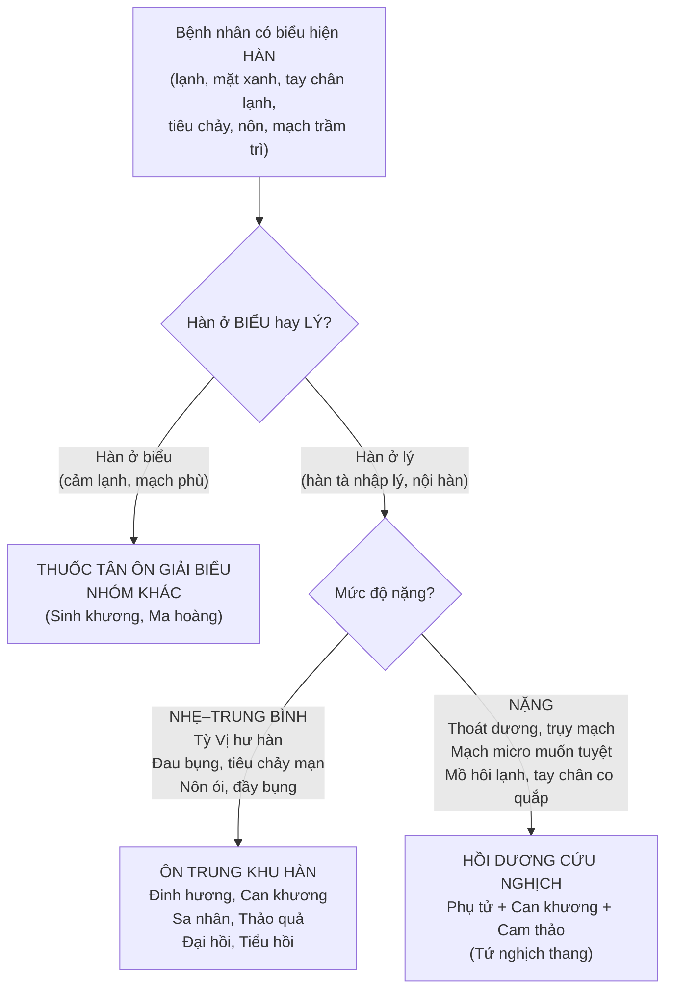
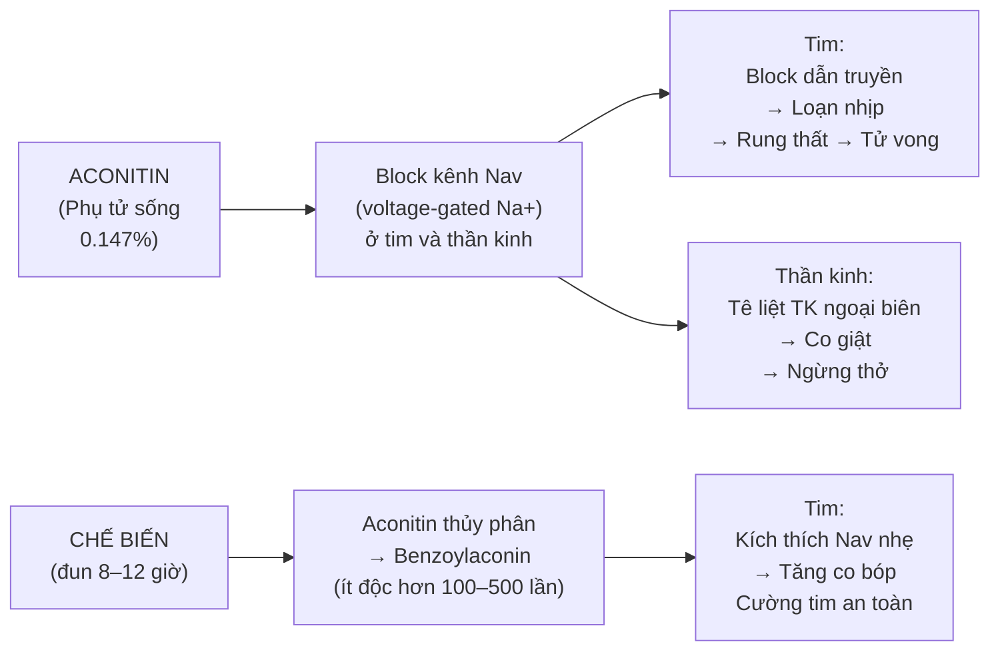
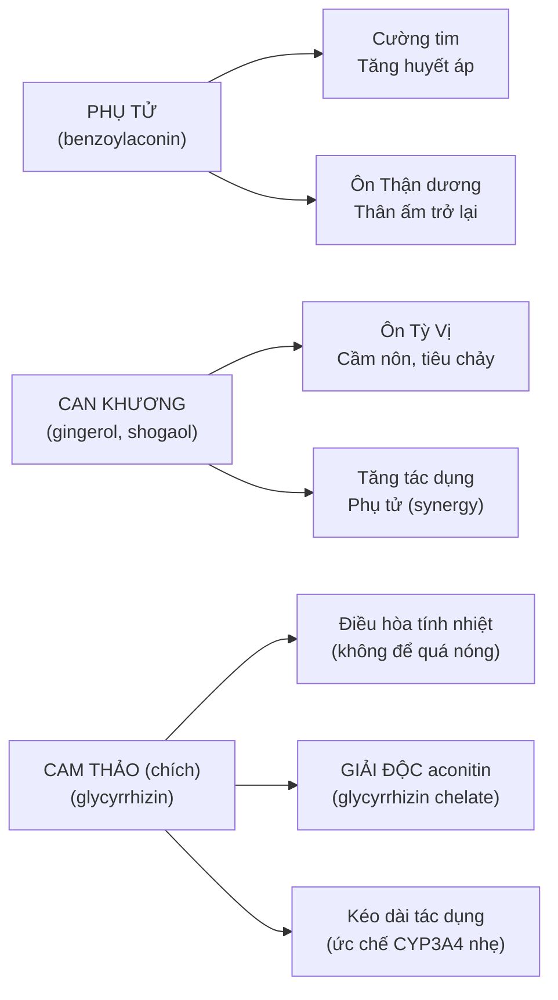

import MedicalNote from '~/components/MedicalNote.astro';
import KeyPoints from '~/components/KeyPoints.astro';
import RedFlags from '~/components/RedFlags.astro';
import CompareTable from '~/components/CompareTable.astro';
import ClinicalPearl from '~/components/ClinicalPearl.astro';

## Mục tiêu bài giảng

Sau bài này người học **hiểu được** (không chỉ thuộc):

- [ ] Tại sao phải phân biệt 2 nhóm khử hàn — chỉ định nào dùng nhóm nào?
- [ ] Tại sao Phụ tử bắt buộc phải chế biến — cơ chế độc tính aconitin?
- [ ] Bài Tứ nghịch thang — logic phối hợp và vai trò của từng vị?
- [ ] Chân nhiệt giả hàn là gì và tại sao lại là bẫy nguy hiểm?
- [ ] 18 phản Phụ tử — cơ chế tương kỵ (không chỉ học thuộc)?
- [ ] Đinh hương trị nấc — cơ chế eugenol tác động thần kinh phế vị?

<MedicalNote title="Góc nhìn giảng viên">
  **Điều GS 30 năm sẽ nói đầu bài:** "Thuốc khử hàn là nhóm thuốc mạnh nhất và nguy hiểm nhất trong YHCT. Phụ tử có thể cứu người khỏi choáng — nhưng cũng có thể giết người nếu dùng sai chứng. Câu hỏi không phải 'bệnh nhân có lạnh không?' mà là: 'Đây là hàn thực hay nhiệt giả hàn? Âm dương của ai đang suy?'"
</MedicalNote>

---

## 1. Bản đồ tư duy lâm sàng — Khi nào cần thuốc khử hàn?

---

## 2. Phụ tử — Vị thuốc nguy hiểm nhất, cũng hiệu quả nhất

### 2.1. Tại sao phải chế biến?

Phụ tử sống chứa **aconitin** — alkaloid độc nhất trong thực vật YHCT Việt Nam.

**Kết luận thực tế:**
- Phụ tử chế (Hắc phụ, Bạch phụ) → uống được, aconitin 0,058%
- Ô đầu sống → **chỉ dùng ngoài** (cồn xoa bóp), không bao giờ uống
- Luôn sắc lâu (>1 giờ) để phân hủy aconitin còn lại

### 2.2. Liều Phụ tử — Ranh giới trị liệu và độc tính

| Liều | Tác dụng | Nguy cơ |
|---|---|---|
| 4–12 g/ngày | Cường tim, ôn dương | An toàn nếu đã chế đúng |
| > 12 g/ngày | Quá liều | Loạn nhịp, hạ huyết áp |
| > 20 g/ngày | Ngộ độc nặng | Ngừng tim, tử vong |

<ClinicalPearl>

**Cách nhận biết ngộ độc Phụ tử sớm:** Bệnh nhân vừa uống thuốc có Phụ tử → xuất hiện tê lưỡi, môi, ngón tay → đây là dấu hiệu sớm của block Nav ngoại biên. Dừng thuốc ngay, cho uống giải độc (Kim ngân hoa + Đậu xanh + Cam thảo + Sinh khương).

</ClinicalPearl>

---

## 3. Bài Tứ nghịch thang — Phân tích logic phối hợp

**Thành phần:** Phụ tử 9–12g + Can khương 9g + Cam thảo 6g (chích)

**Chỉ định:** Thoát dương, vong dương — mồ hôi tự vã ra, tay chân co quắp, mạch vi muốn tuyệt.

**Tại sao Cam thảo không thể bỏ?** Cam thảo chích (tẩm mật) không chỉ "điều hòa" — glycyrrhizin tạo phức chelate với aconitin còn lại sau chế biến, làm giảm thêm độc tính khoảng 30–50%. Bỏ Cam thảo = tăng nguy cơ ngộ độc.

---

## 4. So sánh Phụ tử và Nhục quế — Cùng nhóm, khác cơ chế

<CompareTable
  headers={["", "Phụ tử", "Nhục quế"]}
  rows={[
    ["Hoạt chất chính", "Benzoylaconin (sau chế)", "Cinnamaldehyde (tinh dầu)"],
    ["Cơ chế YHHĐ", "Kích thích Nav → cường tim, tăng huyết áp", "TRPV1 → giãn mạch → ấm người + ức chế tiểu cầu"],
    ["Tốc độ tác dụng", "Nhanh (cấp cứu thoát dương)", "Chậm hơn (mạn tính, duy trì)"],
    ["Ôn tạng chủ yếu", "Tâm Thận (cường tim + ấm Thận)", "Can Thận (thông kinh + ấm Thận)"],
    ["Bài thuốc điển hình", "Tứ nghịch thang, Chân vũ thang", "Bát vị Quế Phụ (Kim Quỹ Thận khí hoàn)"],
    ["Cách dùng đặc biệt", "Sắc lâu; đã chế biến", "Không nấu lâu (cinnamaldehyde bay hơi); mài vào thang"],
  ]}
/>

---

## 5. Nhóm ôn trung khu hàn — Logic theo cơ quan đích

### 5.1. Đinh hương — Trị nấc theo cơ chế thần kinh

**Câu hỏi:** Tại sao Đinh hương trị nấc mà không phải chỉ là "ôn Vị"?

Nấc (hiccup) xảy ra khi dây thần kinh hoành (phrenic) hoặc phế vị (vagus) bị kích thích bất thường → co thắt cơ hoành.

Eugenol trong Đinh hương:
1. Ức chế kênh Nav ở đầu tận thần kinh phế vị → giảm xung động kích thích cơ hoành
2. Tác dụng kháng viêm (ức chế COX-2) → giảm viêm vùng thực quản – dạ dày gây kích thích phế vị

**Lâm sàng:** Đinh hương + Thập đế (Persimmon calyx) = bài Đinh hương Thập đế thang — cổ điển nhất trị nấc do hư hàn.

### 5.2. Ngô thù du — Đau đầu do hàn và cơ chế evodiamin

Evodiamin (alkaloid chính Ngô thù du) → ức chế reuptake serotonin tại synapse → tăng 5-HT → ức chế truyền đau theo đường nociceptive → **giảm đau đầu migraine và cước khí (đau bàn chân lạnh)**

**Chỉ định đặc hiệu của Ngô thù du:** Đau đầu đỉnh (nhóm Can kinh đi đến đỉnh đầu), cước khí (đau chân lạnh tím), nôn chua — hội chứng Thổ mộc sinh khắc (Can phạm Vị).

### 5.3. Sa nhân — An thai qua cơ chế nào?

Sa nhân (camphor + bornyl acetate) → kháng viêm (ức chế prostaglandin, TNF-alpha) → giảm co tử cung → an thai.

**Lưu ý:**
- Camphor liều cao → kích thích co tử cung → trái chiều
- Sa nhân liều điều trị (3–6g) → camphor nồng độ thấp → an thai
- Không dùng kéo dài > 3 tháng khi mang thai

---

## 6. Bẫy lâm sàng — Chân nhiệt giả hàn

<RedFlags title="Không nhầm Shock nhiễm trùng với Hàn chứng">

**Biểu hiện bề ngoài giống nhau:**
- Tay chân lạnh, mặt xanh nhợt
- Mạch nhỏ, khó bắt
- Người bệnh muốn đắp chăn

**Điểm khác biệt quyết định:**

| | Hàn chứng thực sự | Chân nhiệt giả hàn (Shock nhiễm khuẩn) |
|---|---|---|
| Mạch | Trầm trì, lực yếu | Nhanh nhỏ (> 100/phút) |
| Sốt | Không sốt hoặc hạ nhiệt | Sốt cao > 39°C (hoặc hạ nhiệt do suy tim) |
| Nguyên nhân | Hàn tà nhập lý thực sự | Vi khuẩn → cytokine → giãn mạch ngoại biên |
| Dùng Phụ tử | CÓ chỉ định | **CHỐNG CHỈ ĐỊNH** — Phụ tử ôn nhiệt làm nặng hơn |

</RedFlags>

---

## 7. 18 phản Phụ tử — Cơ chế tương kỵ

Theo lý luận Thập bát phản: Phụ tử kỵ **Bán hạ, Qua lâu (Thiên hoa phấn), Bối mẫu, Bạch cập, Bạch liễm**.

**Cơ chế thực nghiệm (hiện biết):**

| Cặp tương kỵ | Cơ chế nghi ngờ |
|---|---|
| Phụ tử + Bán hạ | Cả 2 alkaloid cùng block Nav → tích cộng độc tính tim |
| Phụ tử + Qua lâu (Thiên hoa phấn) | Trichosanthin + aconitin → tăng độc tính gan |
| Phụ tử + Bối mẫu | Isosteroidal alkaloid Bối mẫu + aconitin → tương tác chưa rõ cơ chế nhưng in vivo tăng LD50 |

**Thực tế lâm sàng:** Nghiên cứu hiện đại chưa chứng minh đầy đủ cơ chế, nhưng **tránh kết hợp là an toàn hơn** — liều Phụ tử đã đủ để lo về độc tính.

---

## 8. Bài thuốc mẫu — Bát vị Quế Phụ (Kim Quỹ Thận khí hoàn)

| Vị | Liều | Vai trò |
|---|---|---|
| Thục địa | 24g | Bổ Thận âm (nền) |
| Sơn thù | 12g | Bổ Can Thận |
| Sơn dược | 12g | Bổ Tỳ Thận |
| Trạch tả | 9g | Lợi thấp |
| Phục linh | 9g | Kiện Tỳ |
| Đan bì | 9g | Thanh nhiệt hoạt huyết |
| **Nhục quế** | **3g** | **Ấm mệnh môn** |
| **Phụ tử (chế)** | **3g** | **Ôn Thận dương** |

**Logic:** 6 vị trên bổ âm (nền dương phải có âm để tựa), 2 vị cuối ôn dương — tỷ lệ nhỏ để "thiếu lửa" thay vì "chữa cháy". Đây là bài **bổ Thận dương mạn tính**, không phải cấp cứu thoát dương.

---

## 9. Câu hỏi tư duy cuối bài

1. **Bệnh nhân 70 tuổi, mùa đông, tiêu chảy 3 ngày, tay chân lạnh, mạch trầm trì.** Bác sĩ YHCT cho bài có Phụ tử 12g. Bệnh nhân uống xong 2 giờ sau tê lưỡi, buồn nôn. Đây là ngộ độc hay phản ứng bình thường? Cần làm gì ngay?

2. **Phụ nữ 28 tuổi, thai 14 tuần, động thai, xuất huyết nhẹ âm đạo.** Thầy thuốc YHCT muốn dùng Sa nhân để an thai. Có dùng được không? Liều bao nhiêu? Những vị nào cần phối hợp?

3. **Shock nhiễm trùng sau phẫu thuật ruột thừa: tay chân lạnh, mạch 120/phút, HA 80/50 mmHg, sốt 40°C.** Gia đình muốn kết hợp YHCT, đề xuất dùng Phụ tử hồi dương. Bạn có đồng ý không? Tại sao? Phân biệt cơ chế sinh lý bệnh với hàn chứng thực sự.
