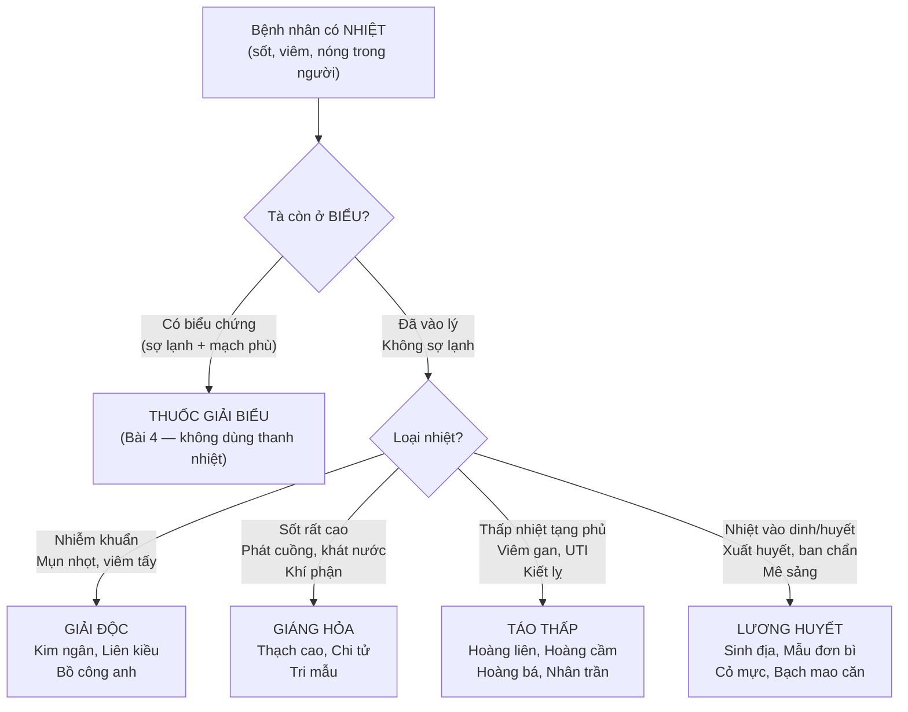
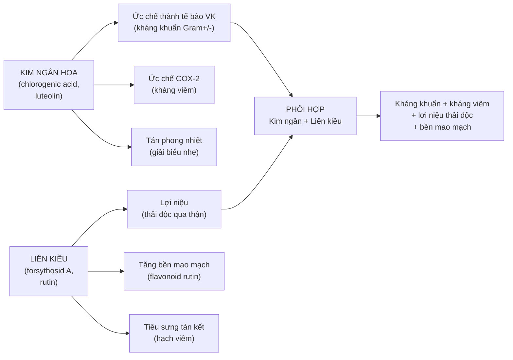
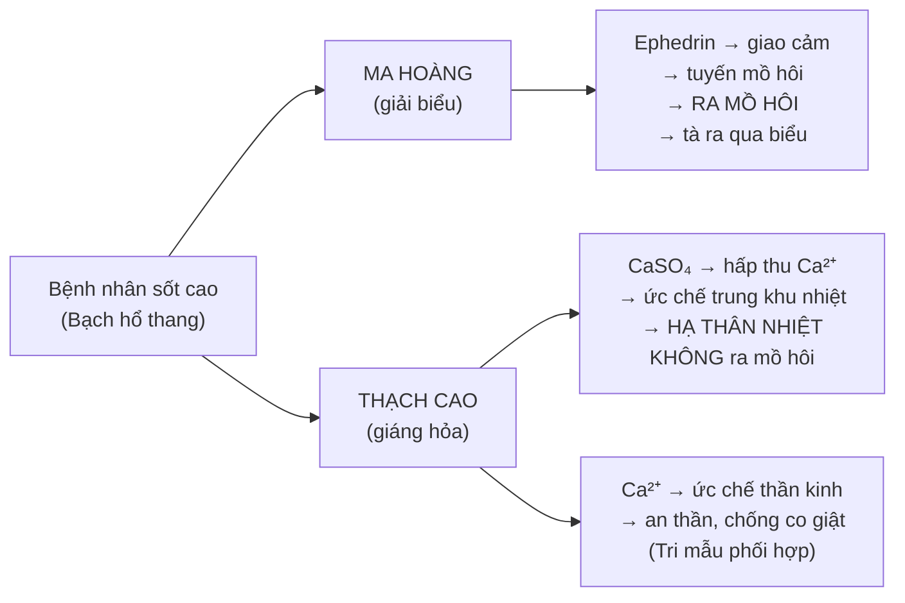
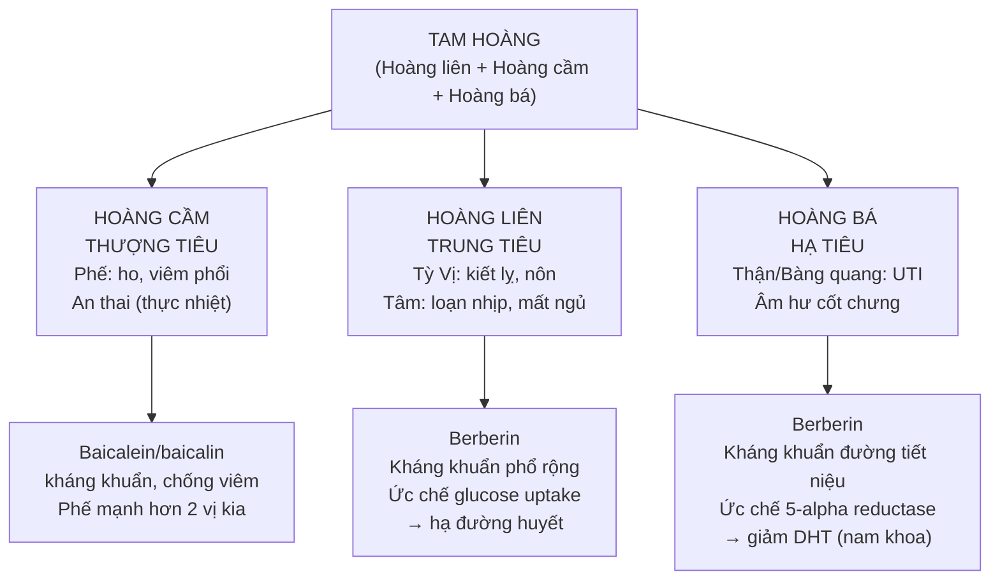
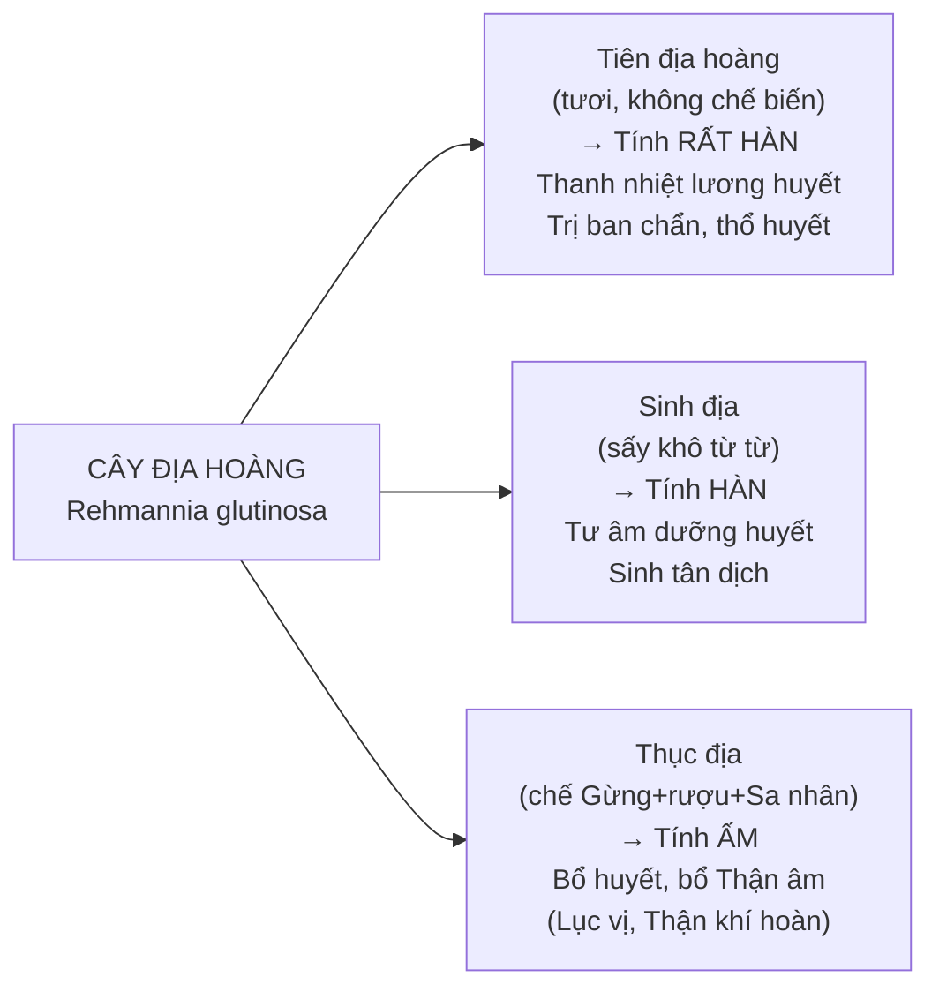

import MedicalNote from '~/components/MedicalNote.astro';
import KeyPoints from '~/components/KeyPoints.astro';
import RedFlags from '~/components/RedFlags.astro';
import CompareTable from '~/components/CompareTable.astro';
import ClinicalPearl from '~/components/ClinicalPearl.astro';

## Mục tiêu bài giảng

Sau bài này người học **hiểu được** (không chỉ thuộc):

- [ ] 4 nhóm thanh nhiệt ứng với 4 giai đoạn/vị trí bệnh theo lý luận ôn bệnh?
- [ ] Tại sao Thạch cao hạ sốt không gây mồ hôi — khác gì Ma hoàng, Quế chi?
- [ ] Tam hoàng (Hoàng liên/cầm/bá) — cùng berberin sao lại chỉ định khác nhau?
- [ ] Sinh địa tươi vs khô — tính khác nhau, dùng khi nào?
- [ ] Địa cốt bì vs Mẫu đơn bì — cả 2 trị cốt chưng, phân biệt như thế nào?
- [ ] Kim ngân hoa + Liên kiều — tại sao luôn đi cặp trong bài tân lương giải biểu?

<MedicalNote title="Góc nhìn giảng viên">
  **Điều GS 30 năm sẽ nói đầu bài:** "Nhóm thanh nhiệt không phải để 'hạ sốt'. Sốt chỉ là dấu hiệu — câu hỏi là: Nhiệt đang ở đâu? Khí hay huyết? Thực hay hư? Thấp hay táo? Trả lời đúng 3 câu đó, bạn mới biết dùng nhóm nào trong 4 nhóm."
</MedicalNote>

---

## 1. Bản đồ tư duy lâm sàng — Chọn nhóm theo vị trí nhiệt

---

## 2. Nhóm 1: Giải độc — Logic cặp Kim ngân + Liên kiều

### 2.1. Tại sao Kim ngân và Liên kiều luôn đi cặp?

**Kết luận:** Kim ngân giỏi kháng khuẩn trực tiếp; Liên kiều giỏi thải độc và bền mao mạch. Phối hợp = tấn công đa hướng vi khuẩn + bảo vệ mao mạch không thấm huyết tương.

### 2.2. Bạch hoa xà thiệt thảo — Khi nào thêm vào?

**Chỉ định chuyên biệt:** Ung thư + nhiễm khuẩn phối hợp. Bạch hoa xà thiệt thảo ức chế nhiều dòng ung thư (vú, ruột kết, gan) qua con đường apoptosis.

**Liều khác thường:** 15–60 g (khô) hoặc 60–360 g (tươi) — cao gấp 4–10 lần vị thuốc thông thường. Nguyên nhân: iridoid asperulosid nồng độ thấp trong dược liệu, cần liều lớn để đạt nồng độ điều trị.

---

## 3. Nhóm 2: Giáng hỏa — Thạch cao vs các vị khác

### 3.1. Thạch cao — Tại sao hạ sốt không gây mồ hôi?

**Lý luận lâm sàng:** Sốt cao khí phận (Dương minh kinh) không còn biểu chứng → không cần ra mồ hôi → Thạch cao ức chế trực tiếp trung khu nhiệt.

**Bài Bạch hổ thang:** Thạch cao 30–60g + Tri mẫu 12g + Gạo tẻ 30g + Cam thảo 6g → Thạch cao giáng hỏa mạnh, Tri mẫu dưỡng âm sinh tân (chống háo khát do sốt cao), Gạo bảo vệ Tỳ Vị.

### 3.2. Chi tử — Thanh Tâm nhiệt, trừ phiền

Chi tử (gardeninosid) đặc biệt vào kinh **Tâm** và **Tam Tiêu** → tác dụng chuyên biệt với trạng thái phiền không ngủ do Tâm hỏa.

**Chỉ định đặc hiệu:**
- Mất ngủ bứt rứt do Tâm hỏa → Chi tử + Đậu xị (Chí chi thị thang)
- Vàng da nhiệt → Chi tử + Nhân trần + Hoàng bá (Nhân trần Chi tử thang)

### 3.3. Tri mẫu — Vị thuốc "đa dụng" nhất nhóm giáng hỏa

Tri mẫu là vị duy nhất trong nhóm giáng hỏa **vừa thanh thực nhiệt vừa thanh hư nhiệt**:
- Thực nhiệt (sốt cao) → Tri mẫu + Thạch cao
- Hư nhiệt (âm hư hỏa vượng) → Tri mẫu + Hoàng bá (Tri bá địa hoàng hoàn)

---

## 4. Nhóm 3: Táo thấp — Tam hoàng theo tạng

### 4.1. Logic phân công Thượng-Trung-Hạ tiêu

### 4.2. Hoàng liên — Điểm đặc biệt nhất tam hoàng

**Liều dùng phụ thuộc vào mục tiêu:**
- Liều nhỏ (2–4 g) → kích thích tiêu hóa, kiện Vị
- Liều lớn (8–12 g) → thanh nhiệt táo thấp mạnh, nhưng gây nôn, tổn thương Tỳ Vị

<ClinicalPearl>

**Berberin (Hoàng liên) và đường huyết.** Berberin ức chế complex I ty thể → AMPK kích hoạt → tăng GLUT4 màng tế bào → tăng uptake glucose → hạ đường huyết. Cơ chế tương tự metformin nhưng qua con đường khác (AMPK thay vì ức chế gluconeogenesis). Thực tế lâm sàng: BN đái tháo đường type 2 dùng Hoàng liên kết hợp → có thể cần giảm liều metformin.

</ClinicalPearl>

### 4.3. Nhân trần — Vị thuốc đặc hiệu viêm gan

Nhân trần (*Adenosma caeruleum*) chứa cineol (tinh dầu) + flavonoid + coumarin → tăng tiết mật, giảm bilirubin, kháng viêm gan. Đây là vị thuốc **không thể thiếu** trong các bài trị hoàng đản (vàng da) do thấp nhiệt ở Can Đởm.

**Bài Nhân trần Chi tử thang:** Nhân trần 30g + Chi tử 12g + Đại hoàng 9g → điều trị vàng da viêm gan thấp nhiệt.

---

## 5. Nhóm 4: Lương huyết — Phân biệt 6 vị

### 5.1. Sinh địa — 3 dạng bào chế, 3 tác dụng

**Quy tắc lâm sàng:** Sốt cao đang xuất huyết → Tiên địa hoàng. Hậu sốt âm hư → Sinh địa. Thiếu máu mạn tính, Thận âm hư → Thục địa.

### 5.2. Địa cốt bì vs Mẫu đơn bì — Cùng trị cốt chưng, khác điểm nào?

<CompareTable
  headers={["", "Địa cốt bì (vỏ rễ Câu kỷ)", "Mẫu đơn bì (vỏ rễ Mẫu đơn)"]}
  rows={[
    ["Tính vị", "Ngọt, hàn", "Đắng cay, hơi hàn"],
    ["Quy kinh", "Phế Can Thận", "Tâm Can Thận"],
    ["Cốt chưng", "Có mồ hôi trộm (đạo hãn)", "Không mồ hôi"],
    ["Thêm tác dụng", "Thanh Phế giáng hỏa (ho khạc máu)", "Hoạt huyết tán ứ (bế kinh, chấn thương)"],
    ["Cơ chế YHHĐ", "Kukoamin A — hạ HA, hạ đường huyết", "Paeonol — ức chế COX-1/2, kháng viêm"],
    ["Không dùng khi", "Tỳ hư tiêu chảy", "Phụ nữ có thai, kinh nguyệt nhiều"],
  ]}
/>

### 5.3. Cỏ mực — Thuốc cầm máu kiêm bổ Can Thận

Cỏ mực (Ecliptae) là vị thuốc hiếm hoi vừa lương huyết chỉ huyết **vừa** bổ Can Thận âm. Trong điều trị sốt xuất huyết Dengue dân gian: 50–100 g lá tươi giã, vắt lấy nước uống — có cơ sở với nghiên cứu hiện đại cho thấy ecliptin và wedelolacton tăng tiểu cầu.

---

## 6. Bài thuốc kinh điển — Thanh ôn bại độc ẩm

**Chỉ định:** Ôn bệnh giai đoạn khí huyết đều nhiệt — sốt cao, phát cuồng, xuất huyết, ban chẩn.

| Vị | Nhóm | Vai trò |
|---|---|---|
| Thạch cao 30g | Giáng hỏa | Hạ sốt khí phận |
| Sinh địa 15g | Lương huyết | Lương huyết, dưỡng âm |
| Hoàng liên 6g | Táo thấp | Thanh Tâm nhiệt |
| Chi tử 9g | Giáng hỏa | Trừ phiền, lợi tiểu |
| Mẫu đơn bì 9g | Lương huyết | Hoạt huyết lương huyết |
| Huyền sâm 12g | Lương huyết | Tư âm giáng hỏa |
| Kim ngân hoa 15g | Giải độc | Kháng khuẩn, giải độc |
| Liên kiều 9g | Giải độc | Tán phong, thải độc |

**Logic:** Bài này dùng cả 4 nhóm — thực tế ôn bệnh giai đoạn nặng nhiệt đi qua tất cả các phần (khí → dinh → huyết).

---

## 7. Câu hỏi tư duy cuối bài

1. **Bệnh nhân sốt 40°C, không ra mồ hôi, khát nước, phát cuồng, mạch hồng đại.** Dùng Bạch hổ thang (Thạch cao + Tri mẫu). Bệnh nhân uống xong 3 ngày, sốt hạ nhưng không hết, thêm đại tiện bí táo. Thêm vị thuốc gì? Tại sao?

2. **Phụ nữ 30 tuổi, viêm gan B mạn tính, ALT tăng, da vàng, tiểu vàng.** Bác sĩ YHCT kê Nhân trần 30g + Chi tử 12g + Hoàng bá 9g. Giải thích logic phối hợp và cơ chế của từng vị trị viêm gan.

3. **Bệnh nhân âm hư: sốt về chiều, đổ mồ hôi trộm, đau nhức trong xương.** Tại sao Tri mẫu + Hoàng bá (Tri bá địa hoàng hoàn) được dùng chứ không phải Thạch cao + Tri mẫu (Bạch hổ thang)?
