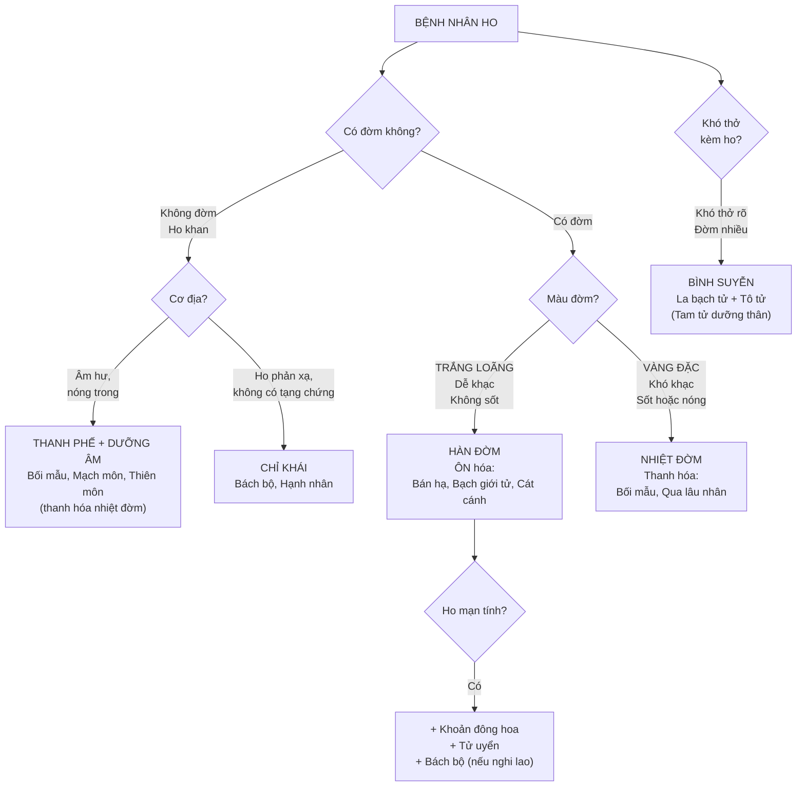
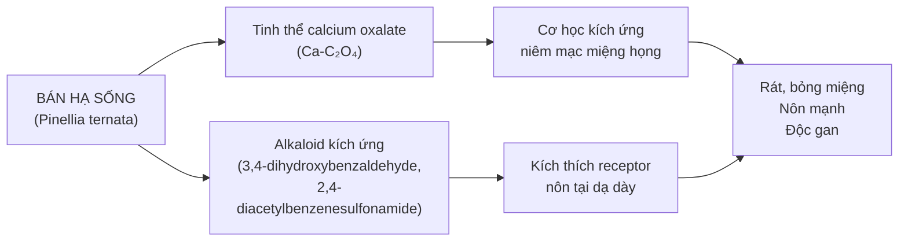
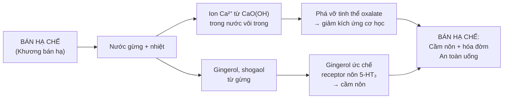
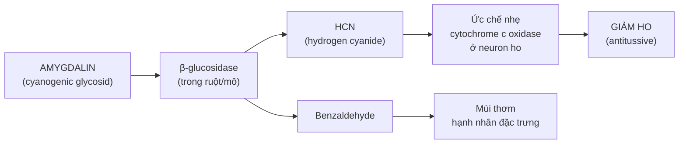
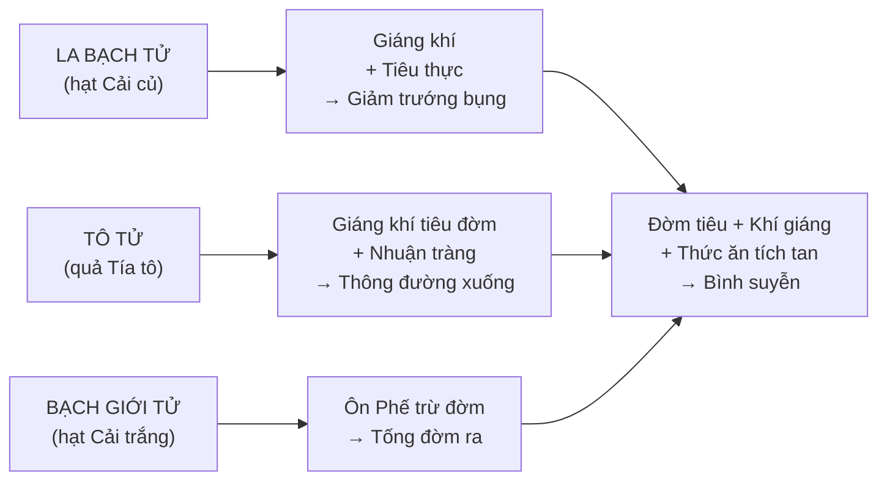

import MedicalNote from '~/components/MedicalNote.astro';
import KeyPoints from '~/components/KeyPoints.astro';
import RedFlags from '~/components/RedFlags.astro';
import CompareTable from '~/components/CompareTable.astro';
import ClinicalPearl from '~/components/ClinicalPearl.astro';

## Mục tiêu bài giảng

Sau bài này người học **hiểu được** (không chỉ thuộc):

- [ ] Tại sao cùng là "ho" mà phải dùng nhóm thuốc khác nhau?
- [ ] Bán hạ sống độc gì, chế biến thay đổi thành phần nào, tác dụng đổi thế nào?
- [ ] Amygdalin (Hạnh nhân) hoạt động ra sao — tại sao có thể vừa chữa ho vừa gây ngộ độc?
- [ ] Cát cánh "dẫn thuốc vào Phế" theo cơ chế gì?
- [ ] Tam tử dưỡng thân thang — logic phối hợp 3 vị La bạch tử + Tô tử + Bạch giới tử?
- [ ] Bối mẫu vs Tang bạch bì — cùng thanh Phế, khác điểm nào?

<MedicalNote title="Góc nhìn giảng viên">
  **Điều GS 30 năm sẽ nói đầu bài:** "Ho không phải bệnh — ho là triệu chứng. Muốn chọn đúng thuốc phải trả lời 4 câu: Đờm loãng hay đặc? Màu gì? Có sốt không? Ho mới hay lâu ngày? Bốn câu đó quyết định bạn dùng ôn hay thanh, hóa đờm hay chỉ khái, cấp hay mạn."
</MedicalNote>

---

## 1. Bản đồ tư duy lâm sàng — Chọn nhóm theo đặc điểm ho

---

## 2. Bán hạ — Tại sao sống khác chế?

### 2.1. Cơ chế độc tính của Bán hạ sống

### 2.2. Cơ chế chế biến với gừng

**Kết luận lâm sàng:** Bán hạ chế vừa hóa đờm vừa **cầm nôn** — hai tác dụng ngược nhau với Bán hạ sống. Đây là ví dụ điển hình chế biến đảo ngược tác dụng.

### 2.3. Mai hạch khí — Chỉ định đặc biệt của Bán hạ

**Mai hạch khí** = cảm giác có vật gì mắc trong cổ họng, không nuốt được không nhổ được, không đau (do đờm kết hợp khí trệ). 

**Bài Bán hạ Hậu phác thang:** Bán hạ 12g + Hậu phác 9g + Phục linh 12g + Sinh khương 15g + Tô diệp 6g  
→ Bán hạ hóa đờm tán kết + Hậu phác hành khí giáng nghịch = đờm tiêu + khí thông → cục trong cổ tan.

---

## 3. Amygdalin (Hạnh nhân) — Con dao hai lưỡi

### 3.1. Cơ chế chữa ho

### 3.2. Nguy cơ khi quá liều

HCN dư → ức chế mạnh cytochrome c oxidase → tế bào không sử dụng được O₂ → **methemoglobin** → thiếu O₂ tế bào → ngộ độc cấp.

**Triệu chứng ngộ độc amygdalin:** Đau đầu, buồn nôn, khó thở, tím tái (môi tím), co giật.

**Giải độc:** Methylene blue (IV) + Oxy liệu pháp cao áp.

**Liều an toàn:** 4,5–9g/ngày, sao vàng trước (nhiệt phá vỡ một phần amygdalin → giảm HCN sinh ra khi uống).

---

## 4. Cát cánh — "Thuyền chở thuốc vào Phế"

### 4.1. Cơ chế saponin dẫn thuốc

Saponin Cát cánh (platycodin) có tính surfactant → khi uống:
1. Kích thích nhẹ niêm mạc dạ dày → phản xạ tiết dịch phế quản → đờm loãng hơn → dễ khạc
2. Tăng IgA tại niêm mạc đường hô hấp → tăng miễn dịch tại chỗ
3. Vị đắng cay → đi vào kinh Phế (lý luận quy kinh)

### 4.2. Bài nùng — Tác dụng đặc biệt của Cát cánh

**Phế ung/Phế nùng** (áp-xe phổi) = đờm mủ ứ đọng.  
Cát cánh "bài nùng" = tăng co cơ phế quản → đẩy mủ lên → ho ra ngoài.

**Bài Cát cánh Cam thảo thang** (viêm họng): Cát cánh 8g + Cam thảo 4g  
→ Cát cánh thông Phế lợi hầu + Cam thảo giải độc, giảm đau họng. Đơn giản nhất, hiệu quả nhất nhóm hầu họng.

---

## 5. Tam tử dưỡng thân thang — Phân tích 3 vị

**Chỉ định:** Người cao tuổi ho suyễn lâu ngày, đờm nhiều, bụng đầy trướng, ăn kém.

**Tại sao 3 vị này luôn dùng chung?** Bệnh COPD theo YHCT có đờm + khí nghịch + tích trệ — 3 vị nhắm đúng 3 mặt, không vị nào giải quyết được cả 3.

---

## 6. Bối mẫu vs Tang bạch bì — Cùng thanh Phế, khác gì?

<CompareTable
  headers={["", "Bối mẫu (Fritillaria)", "Tang bạch bì (Morus alba)"]}
  rows={[
    ["Tính vị", "Đắng ngọt, hơi hàn", "Ngọt, hàn"],
    ["Quy kinh", "Phế Tâm", "Phế"],
    ["Cơ chế chính", "Alkaloid fritimin → giãn phế quản (β-agonist nhẹ)", "Flavonoid/resveratrol → ức chế viêm + lợi niệu"],
    ["Chỉ định ưu tiên", "Ho khan, đờm có máu, tràng nhạc (tán kết)", "Ho + phù (kết hợp Phế nhiệt + thủy thấp)"],
    ["Thêm tác dụng", "Tán kết: bướu cổ, hạch viêm", "Lợi thủy tiêu thũng (phù)"],
    ["Kiêng kỵ", "Kỵ Ô đầu/Phụ tử (18 phản)", "Không có kiêng kỵ đặc biệt"],
  ]}
/>

---

## 7. Mạch môn vs Thiên môn — Phân biệt 2 vị thường dùng chung

| | Mạch môn | Thiên môn đông |
|---|---|---|
| Quy kinh | Tâm Phế Vị | Phế Thận |
| Tạng đích | **Phế** (chính) + Tâm | **Thận** (chính) + Phế |
| Dùng khi | Phế âm hư: ho khan, khát, mất ngủ | Phế Thận đều hư: ho kéo dài, lưng mỏi |
| Tính | Hơi hàn, không nề trệ | Hàn hơn, nề trệ hơn |
| Phối hợp | Thiên môn khi cần thêm bổ Thận | Mạch môn khi cần thêm dưỡng Tâm |

---

## 8. Bách bộ — Vị thuốc kháng lao đặc biệt

Bách bộ là vị duy nhất trong nhóm có alkaloid **tuberostemonin** ức chế *Mycobacterium tuberculosis* (vi khuẩn lao). Cơ chế: tuberostemonin ức chế DNA gyrase của M. tuberculosis (tương tự fluoroquinolone nhưng yếu hơn nhiều lần).

**Dùng trong lao hạch (tràng nhạc):** Bách bộ thường phối Mạch môn + Sinh địa + Bối mẫu.

**Sát trùng giun kim:** Sắc 40g, thụt hậu môn — tuberostemonin ức chế thần kinh-cơ giun → giun tê liệt → bị tống ra.

---

## 9. Câu hỏi tư duy cuối bài

1. **Bệnh nhân 65 tuổi, COPD, ho mạn tính, đờm trắng nhiều, bụng đầy, ăn kém.** Chọn bài thuốc nào? Phân tích vai trò từng vị trong Tam tử dưỡng thân thang với bệnh nhân này.

2. **Trẻ em 8 tuổi, ho khan kéo dài 3 tuần sau viêm họng, nghi lao hạch cổ.** Bạn sẽ dùng vị thuốc nào trong nhóm chỉ khái? Tại sao Bách bộ là lựa chọn ưu tiên?

3. **Bán hạ chế và Trúc nhự đều có tác dụng chỉ ẩu (cầm nôn). Tại sao người Tỳ Vị hư hàn nôn mửa dùng Bán hạ + Gừng, còn người Vị nhiệt nôn mửa dùng Trúc nhự + Hoàng liên?** Giải thích logic YHCT và cơ chế YHHĐ.
