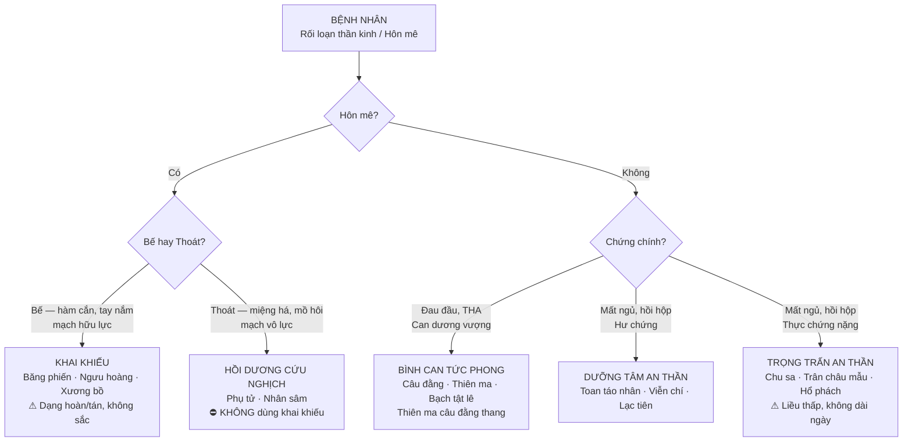
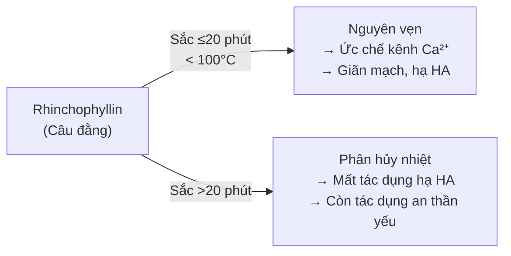

import CompareTable from '~/components/CompareTable.astro';
import ClinicalPearl from '~/components/ClinicalPearl.astro';
import RedFlags from '~/components/RedFlags.astro';
import MedicalNote from '~/components/MedicalNote.astro';

## 1. Luồng tư duy lâm sàng — Bài 8 từ đầu đến cuối



---

## 2. Phân tầng hư-thực: Chìa khóa chọn nhóm an thần

Bài này có 2 nhóm an thần — nhưng cơ chế hoàn toàn khác:

<CompareTable
  headers={["", "Dưỡng Tâm an thần (hư)", "Trọng trấn an thần (thực)"]}
  rows={[
    ["Cơ chế YHCT", "Tâm huyết / âm hư → Tâm không tàng thần", "Đờm hoả / Can dương vượng → Tâm thần bất an"],
    ["Bệnh nhân", "Mệt mỏi, xanh xao, mạch tế nhược", "Dễ cáu, mặt đỏ, mạch huyền hoạt"],
    ["Chất thuốc", "Thảo mộc nhẹ, tính bình", "Khoáng vật nặng — tiết giáng"],
    ["Tác dụng", "Dưỡng huyết, tạo giấc ngủ sinh lý", "Trấn áp trực tiếp — giảm kích thích TKTW"],
    ["Ví dụ", "Toan táo nhân, Viễn chí, Lạc tiên", "Chu sa, Trân châu mẫu, Hổ phách"],
    ["Dùng lâu dài?", "Được", "Không — tích lũy độc (đặc biệt Chu sa)"],
  ]}
/>

---

## 3. Câu đằng — "con dao hai lưỡi" của thời gian sắc

Rhinchophyllin (alkaloid chính) ức chế kênh Ca²⁺ → giãn mạch → hạ huyết áp.

**Nhưng:**  rhinchophyllin bị thủy phân và oxy hóa ở nhiệt độ cao ≥ 100°C trong >20 phút → mất tác dụng.



**Kỹ thuật sắc đúng:** Sắc thang thuốc bình thường ~30 phút → **cho Câu đằng vào 10 phút cuối**, tắt lửa. Không sắc từ đầu cùng với các vị khác.

---

## 4. Chu sa — hiểu HgS để dùng đúng

**Thành phần:** HgS (thủy ngân(II) sulfid).

Tại sao HgS ít độc hơn Hg tự do?

| Dạng Hg | Hấp thu | Độc tính |
|---|---|---|
| HgS (Chu sa) | Hấp thu rất kém ở ruột, độ tan thấp | Thấp khi dùng đúng liều/thời gian |
| Hg⁰ (kim loại) | Bay hơi, hấp thu qua phổi | Rất cao — gây viêm não, thận |
| Hg²⁺ (ion) | Tan tốt, hấp thu nhanh | Cao — gây viêm thận cấp |

**Tại sao không sao chế?**

```
HgS  --[nhiệt]-->  Hg⁰  +  S  -->  SO₂
```

Sao chế → HgS bị nhiệt phân → Hg⁰ bay hơi → hít vào phổi → độc thần kinh/thận nặng.

**Chế đúng:** Thủy phi (mài Chu sa với nước → lắng → gạn → phơi khô) → giữ nguyên HgS, loại bỏ tạp chất.

<RedFlags title="Chu sa — 3 tình huống nguy hiểm">

1. **Sao chế trực tiếp** → HgS → Hg⁰ → hít vào phổi → ngộ độc thủy ngân cấp.
2. **Dùng kéo dài** (>1 tháng liên tục) → tích lũy Hg²⁺ dù hấp thu ít → suy thận mạn.
3. **Phối hợp acid mạnh** (thuốc tây) → HgS + HCl → HgCl₂ (cực độc) → suy thận cấp.

</RedFlags>

---

## 5. Khai khiếu — tại sao không sắc?

Băng phiến (D-borneol) và Ngưu hoàng (acid cholic/bilirubin) đều có đặc điểm:

- Nhiệt độ sôi thấp hoặc dễ bay hơi
- Tinh thể/bột mịn tan trong chất mang (mật ong, bột khác) → hoàn, tán
- Sắc nước nóng → hoạt chất vào hơi nước → mất trước khi người bệnh uống

**Xương bồ là ngoại lệ duy nhất** — asarone bền hơn với nhiệt, sắc được nhưng không nên sắc lâu.

<ClinicalPearl>

**An cung ngưu hoàng hoàn** — bài thuốc cấp cứu kinh điển YHCT cho hôn mê do nhiệt bế: Ngưu hoàng + Chu sa + Hoàng liên + Hoàng cầm + Chi tử + Uất kim + Băng phiến + Xạ hương + Trân châu. Tất cả thành phần đều không sắc — tán bột, luyện mật ong thành viên 3 g, uống với nước ấm hoặc dùng qua sonde dạ dày cho bệnh nhân hôn mê.

</ClinicalPearl>

---

## 6. Phân biệt 5 vị có tác dụng "minh mục" (sáng mắt)

Nhiều vị trong bài này có tác dụng minh mục nhưng cơ chế khác nhau:

| Vị thuốc | Nhóm | Cơ chế minh mục | Chỉ định mắt |
|---|---|---|---|
| **Thạch quyết minh** | Trọng trấn | CaCO₃ → bình Can tiềm dương → giảm áp lực nhãn áp | Mắt mờ do Can dương vượng (THA, glaucoma YHCT) |
| **Thảo quyết minh** | Dưỡng Tâm | Anthraglycosid → kháng oxy hóa | Đau mắt đỏ, sợ ánh sáng |
| **Câu đằng** | Bình Can | Rhinchophyllin → hạ HA → giảm phù não/nhãn áp | Đau đầu + mắt mờ do THA |
| **Bạch tật lê** | Bình Can | Saponin → bình Can minh mục | Mắt mờ do Can khí uất kết |
| **Trân châu mẫu** | Trọng trấn | CaCO₃ + glycoprotein → thanh Can | Mắt đỏ, sưng do Can phong nhiệt |

---

## 7. Viễn chí — vị thuốc "nối Tâm-Thận"

Viễn chí quy 3 kinh: **Tâm + Phế + Thận** — hiếm có trong nhóm an thần.

Ý nghĩa lâm sàng:
- **An thần ích trí:** Mất ngủ kèm hay quên, giảm trí nhớ — gợi ý Tâm-Thận bất giao (mất ngủ người cao tuổi)
- **Hóa đờm chỉ khái:** Ho đờm đặc khó khạc — dùng Viễn chí thay vì phải kết hợp 2 vị
- **Viễn chí chích mật:** Giảm kích ứng họng do saponin → dùng khi bệnh nhân than đắng họng sau uống

<MedicalNote>

**Không dùng Viễn chí cho:** Phụ nữ có thai (kích thích tử cung), viêm loét dạ dày (saponin kích ứng niêm mạc), trầm cảm (chưa rõ cơ chế nhưng sách cảnh báo), bệnh nhân dùng sắt (kỵ kim loại).

</MedicalNote>

---

## 8. Bạch tật lê — từ "bình Can" đến testosterone

Saponin steroid trong Bạch tật lê (*Tribulus terrestris*) → kích thích tuyến yên tiết LH → tăng testosterone.

**YHCT lý giải:** Can chủ cân, Can khí uất kết → tắc sữa, đau sườn, giảm libido. Bình Can giải uất → khí huyết lưu thông → "bình thường hóa" các chức năng phụ thuộc Can.

**YHHĐ:** Nghiên cứu Vladimir Neychev (2016) xác nhận tác dụng tăng LH/testosterone, nhưng hiệu quả trên người còn tranh luận.

---

## 9. 3 câu hỏi tư duy

1. Bệnh nhân 65 tuổi, THA, đau đầu vùng đỉnh, mất ngủ khó vào giấc, ra mồ hôi trộm ban đêm, lưỡi đỏ ít rêu. Chọn nhóm thuốc gì? Vì sao không phải Chu sa?

2. Bài thuốc Thiên ma câu đằng thang: tại sao cần phối Ngưu tất (dẫn huyết xuống dưới) và Đỗ trọng (bổ Thận)? Tức là bài này trị Can dương vượng hay trị cả Thận âm hư?

3. Có thể cho Băng phiến vào nồi sắc cùng các vị khác không? Nếu bệnh nhân không nuốt được, xử trí thế nào?
