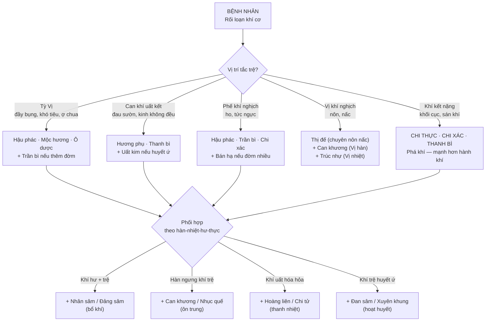
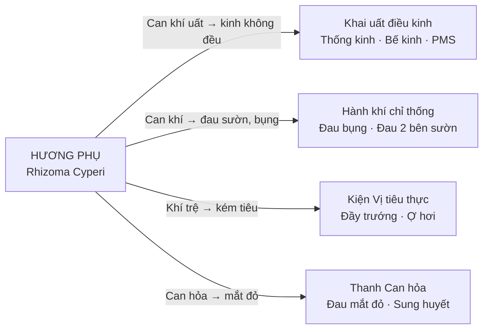
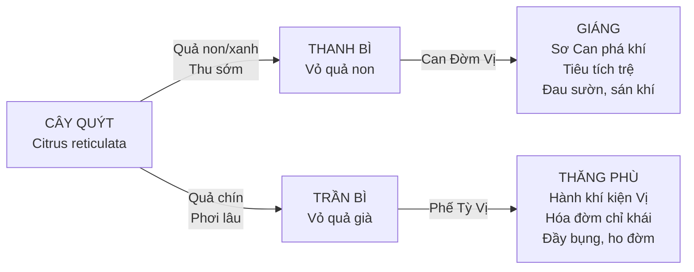
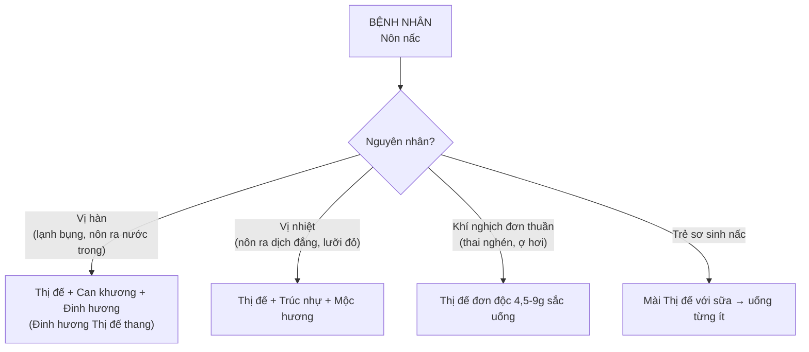
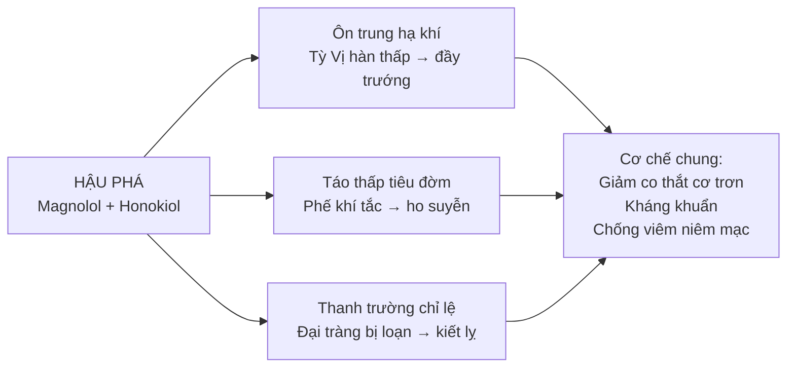

import CompareTable from '~/components/CompareTable.astro';
import ClinicalPearl from '~/components/ClinicalPearl.astro';
import RedFlags from '~/components/RedFlags.astro';
import MedicalNote from '~/components/MedicalNote.astro';

## 1. Luồng tư duy lâm sàng — Bài 9 từ đầu đến cuối

---

## 2. Phân tầng hành khí vs giáng khí: Chìa khóa chọn nhóm

Bài 9 có 2 nhóm — nhưng mức độ bệnh khác nhau hoàn toàn:

<CompareTable
  headers={["", "Hành khí giải uất", "Giáng khí (Phá khí)"]}
  rows={[
    ["Mức độ tắc trệ", "Nhẹ — khí vận hành khó khăn, uất kết", "Nặng — khí nghịch lên, khí kết thành khối cục"],
    ["Cơ chế YHCT", "Khí tắc → huyết trệ → đau; điều hòa khí cơ", "Khí đảo chiều (thượng nghịch) hoặc ngưng tụ lâu ngày"],
    ["Bệnh cảnh điển hình", "Đau bụng âm ỉ, kinh không đều, tức ngực nhẹ", "Ho suyễn khó thở, nôn nấc liên tục, bụng cứng trướng, sán khí"],
    ["Cường độ", "Nhẹ-vừa; dùng được dài ngày hơn", "Mạnh; không dùng kéo dài; kiêng thai"],
    ["Đại biểu", "Hương phụ, Mộc hương, Hậu phác, Trần bì, Ô dược", "Chi thực, Chi xác, Thanh bì, Thị đế"],
    ["Tính", "Ôn, mùi thơm, khô táo", "Một số hơi hàn (Chi thực, Chi xác); một số ôn (Thanh bì)"],
  ]}
/>

---

## 3. Hương phụ — "thuốc vạn năng của phụ nữ"

YHCT có câu: *"Hương phụ là khí trung chi huyết dược"* — nghĩa là vị thuốc điều hòa khí đồng thời ảnh hưởng đến huyết, đặc biệt ở phụ nữ.

**Tại sao Hương phụ điều kinh được?**

- Tinh dầu Hương phụ (α-cyperone) có tác dụng **phytoestrogen** — bắt chước estrogen ở thụ thể ER-β.
- Ức chế tổng hợp prostaglandin (PG) → giảm co thắt tử cung → giảm thống kinh.
- Giãn cơ trơn tử cung → điều hòa co bóp → kinh đều hơn.

**Lâm sàng:** Hương phụ không chỉ dùng riêng mà thường phối:
- + Ích mẫu → hoạt huyết điều kinh (chứng huyết ứ)
- + Ngải diệp → ôn kinh (chứng cung lạnh)
- + Bạch thược → giảm đau (chứng Can khí uất kết)

---

## 4. Mộc hương kỵ lửa — giải thích cơ chế

Thành phần tác dụng chính của Mộc hương là **costunolide** và **dehydrocostus lactone** (sesquiterpene lactone) trong tinh dầu.

**Tại sao không sắc?**

| Phương pháp dùng | Điều xảy ra | Kết quả |
|---|---|---|
| Sắc lâu (>30 phút, >100°C) | Sesquiterpene lactone bị thủy phân + bay hơi cùng hơi nước | Mất 70-80% hoạt chất → mất tác dụng kháng co thắt, kháng khuẩn |
| Dạng bột (4-6 g) | Hoạt chất nguyên vẹn | Tác dụng đầy đủ |
| Mài với nước sắc thuốc khác | Hoạt chất hòa tan vào dung dịch đã nguội | Tác dụng tốt nhất |

**Kỹ thuật đúng:** Sắc bài thuốc thang hoàn chỉnh, lấy ra, để nguội bớt (~60°C), rồi mài hoặc khuấy bột Mộc hương vào → uống ngay.

<ClinicalPearl>

**Bài Mộc hương tân lang hoàn** (Mộc hương + Tân lang/Cau + Đại hoàng + Khiên ngưu tử) — bài kinh điển trị thực tích nặng, bụng cứng trướng, táo bón. Mộc hương dùng **bột** (không sắc), khuấy vào nước sắc của các vị khác. Logic: Mộc hương hành khí + Tân lang phá khí + Đại hoàng tả hạ → giải phóng "tắc nghẽn" từ cả 3 hướng.

</ClinicalPearl>

---

## 5. Thanh bì vs Trần bì — cùng nguồn, đối lập tác dụng

Đây là cặp phân biệt quan trọng nhất trong bài:

**Logic YHCT giải thích sự khác nhau:**

- Quả non (Thanh bì) → khí chất tập trung, cô đặc, mạnh → đi xuống (giáng), phá mạnh.
- Quả già phơi lâu (Trần bì = "bì trần cũ") → khí đã chuyển hóa, nhẹ nhàng → đi lên (thăng), hòa hoãn.

<CompareTable
  headers={["Tiêu chí", "Thanh bì", "Trần bì"]}
  rows={[
    ["Quy kinh chính", "Can, Đờm, Vị", "Phế, Tỳ, Vị"],
    ["Hướng tác dụng", "Giáng (đi xuống)", "Thăng phù (nhẹ, đi lên)"],
    ["Cường độ", "Mạnh — phá khí", "Nhẹ — hành khí"],
    ["Chỉ định đặc trưng", "Đau sườn (Can khí), sán khí, hạch vú", "Ho đờm, đầy bụng, buồn nôn"],
    ["Phối hợp điển hình", "Hương phụ + Uất kim (đau sườn)", "Bán hạ + Phục linh (đờm thấp)"],
    ["Kiêng kỵ", "Can huyết hư không khí trệ", "Âm hư có nhiệt, ho khan"],
  ]}
/>

---

## 6. Thị đế — đơn giản nhưng không thể thay

Thị đế (tai hồng, đài hoa quả hồng) là vị thuốc **chuyên biệt nhất bài** — chỉ làm một việc: giáng Vị khí nghịch để trị nôn nấc.

**Thuật toán dùng Thị đế:**

**Tác dụng YHHĐ:** Acid ursolic trong Thị đế có tác dụng **ức chế thụ thể 5-HT3** ở vùng Area postrema và ruột — đây là cơ chế tương tự một số thuốc chống nôn hiện đại (ondansetron).

---

## 7. Nguyên tắc phối hợp hành khí + hoạt huyết

Nguyên tắc YHCT: **"Khí hành thì huyết hành, khí trệ thì huyết ứ."**

Vì vậy, trong nhiều bệnh cảnh có cả khí trệ lẫn huyết ứ (chấn thương, thống kinh, đau mãn tính), cần phối hợp cả 2 nhóm:

| Bệnh cảnh | Thuốc hành khí | Thuốc hoạt huyết |
|---|---|---|
| Thống kinh | Hương phụ, Ô dược | Ích mẫu, Đan sâm |
| Chấn thương đau | Mộc hương, Trần bì | Xuyên khung, Đào nhân |
| Đau dạ dày mãn | Hậu phác, Sa nhân | Tam thất, Uất kim |
| Đau sườn | Hương phụ, Thanh bì | Uất kim, Diên hồ sách |

**Lý do:** Hành khí giúp hoạt huyết "đi" được, hoạt huyết xử lý huyết ứ đã hình thành. Chỉ dùng một trong hai sẽ không triệt để.

---

## 8. Hậu phác — đa năng hơn tưởng

Hậu phác có 3 công năng nhìn có vẻ không liên quan nhưng cùng một cơ chế:

**Bình Vị tán** — bài thuốc kinh điển dùng Hậu phác: Thương truật + Hậu phác + Trần bì + Cam thảo + Đại táo. Trị Tỳ Vị hàn thấp, bụng đầy, ăn kém, buồn nôn.

---

<RedFlags title="Điểm dễ nhầm — bẫy thi">

- **Thanh bì kiêng Can huyết hư** (không có khí trệ). Nếu đau sườn do huyết hư (không phải khí trệ) → Thanh bì làm nặng hơn vì phá khí mà không có khí dư để phá.
- **Mộc hương không sắc** — dạng bột/mài. Nếu đề hỏi "kỵ lửa" → Mộc hương.
- **Hương phụ bình — không phải ôn** (tính bình, không phải tính ôn như đa số nhóm). Điểm khác biệt so với các vị khác.
- **Thị đế** không có tác dụng "giảm đau" mà **chuyên giáng nghịch** — đừng dùng cho bụng đầy trướng không có nôn nấc.
- **Giáng khí kiêng phụ nữ có thai** — Chi thực, Chi xác, Thanh bì đều kiêng thai.
- **Không sắc lâu** — nguyên tắc chung cho tất cả vị hành khí có tinh dầu. Không chỉ Mộc hương.

</RedFlags>

---

## 9. 3 câu hỏi tư duy

1. Bệnh nhân nữ 35 tuổi, kinh nguyệt không đều 3 tháng nay, đau bụng kinh dữ, ngực tức, dễ cáu, lưỡi tím nhạt, mạch huyền sáp. Dùng Hương phụ thôi có đủ không? Cần thêm gì và tại sao?

2. Thanh bì và Trần bì đều từ vỏ quýt — tại sao YHCT phân biệt chúng rõ ràng thành 2 vị khác nhau? Cơ sở lý luận YHCT là gì? YHHĐ giải thích khác biệt đó ra sao?

3. Bệnh nhân nôn nấc sau phẫu thuật ổ bụng, Vị nhiệt (lưỡi đỏ rêu vàng). Chọn Thị đế phối với gì? Nếu bệnh nhân không nuốt được, xử trí thế nào?
