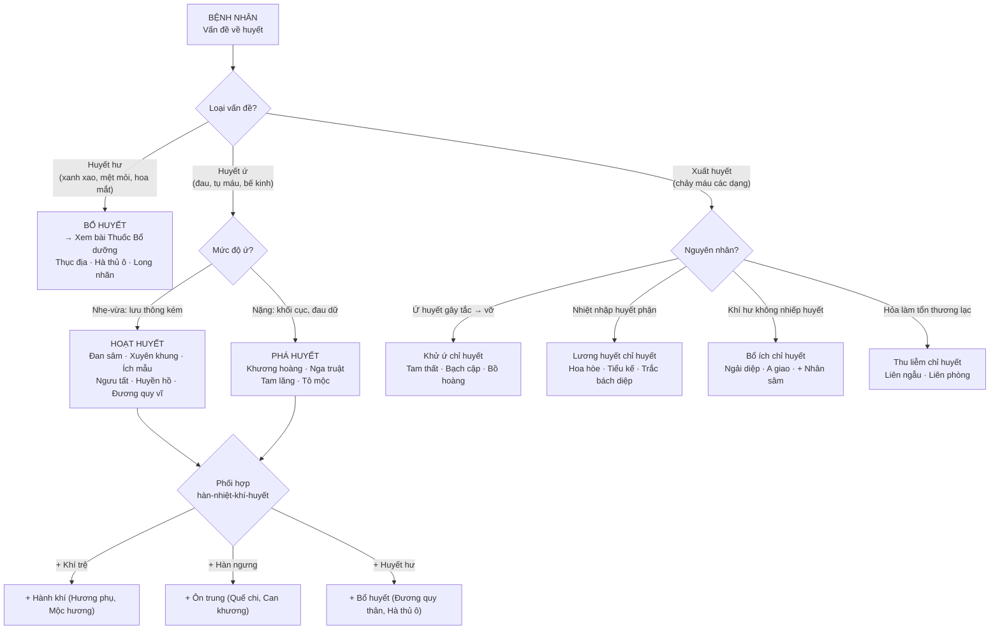
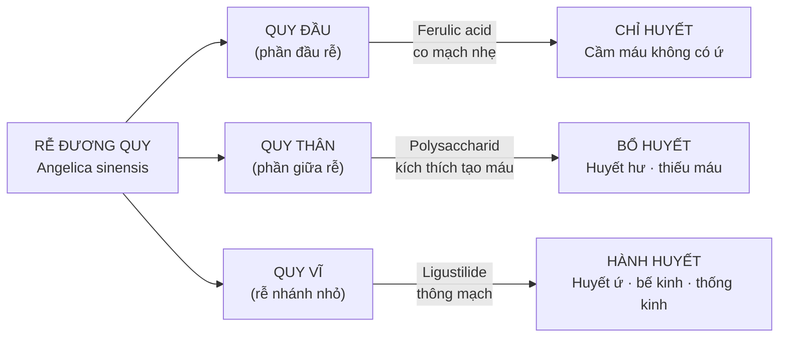
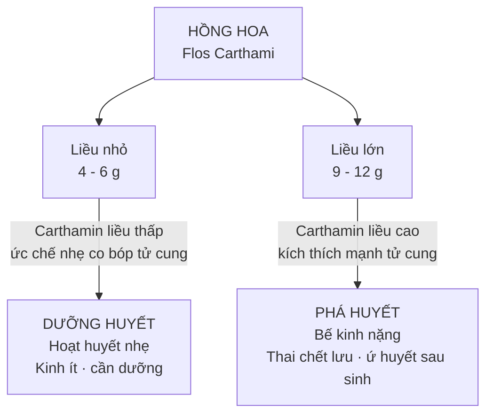
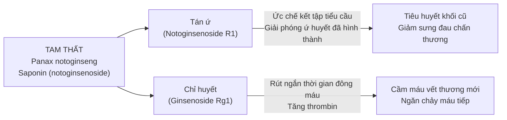
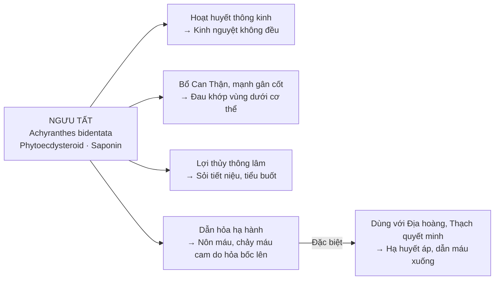

import CompareTable from '~/components/CompareTable.astro';
import ClinicalPearl from '~/components/ClinicalPearl.astro';
import RedFlags from '~/components/RedFlags.astro';
import MedicalNote from '~/components/MedicalNote.astro';

## 1. Luồng tư duy lâm sàng — Bài 10 từ đầu đến cuối

---

## 2. Đương quy — 3 phần 3 cơ chế: giải thích sâu

<ClinicalPearl>

**Quy đầu → Chỉ huyết | Quy thân → Bổ huyết | Quy vĩ → Hành huyết**

Đây không phải phân loại tùy tiện — có nền tảng dược học:
- **Quy đầu** giàu **ferulic acid** và **Z-butylidenephthalide** (cầm máu, co mạch).
- **Quy thân** giàu **polysaccharid** (kích thích tạo máu, dưỡng huyết).
- **Quy vĩ** (rễ nhánh nhỏ) giàu **ligustilide** và **tinh dầu** dễ bay → kích thích tuần hoàn, thông mạch.

</ClinicalPearl>

**Ứng dụng lâm sàng:**

| Trường hợp | Dùng phần nào | Phối hợp |
|---|---|---|
| Xuất huyết không ứ | Quy đầu | Bạch cập, Tam thất |
| Thiếu máu, huyết hư | Quy thân / Toàn Đương quy | Thục địa, Hà thủ ô |
| Bế kinh, thống kinh | Quy vĩ | Hồng hoa, Ích mẫu |
| Vừa huyết hư vừa huyết ứ | Toàn Đương quy | Xuyên khung, Bạch thược (Tứ vật thang) |

---

## 3. Hồng hoa — cơ chế liều phụ thuộc

Hồng hoa là vị thuốc rõ ràng nhất minh họa nguyên tắc **"liều thấp vs liều cao → tác dụng đối lập"**:

**Cơ chế YHHĐ:**
- Hydroxysafflor yellow A (HSYA) ở liều thấp: bảo vệ tế bào thần kinh, chống đông máu nhẹ.
- Carthamin ở liều cao: tăng co bóp tử cung mạnh (tác dụng oxytocin-like) → dùng đẩy thai chết lưu, huyết ứ sau sinh.

<MedicalNote>

**Phân biệt với Đào nhân:** Đào nhân (hạt đào) cũng hoạt huyết tương tự Hồng hoa nhưng thêm tác dụng **nhuận tràng** (dầu béo). Cặp Đào nhân + Hồng hoa thường dùng chung cho chứng vừa huyết ứ vừa táo bón (sau sinh bí đại tiện + đau bụng ứ huyết).

</MedicalNote>

---

## 4. Bồ hoàng — "sống hoạt / sao chỉ": hiểu sâu cơ chế

| Dạng chế biến | Hóa học | Cơ chế | Tác dụng |
|---|---|---|---|
| **Bồ hoàng sống** | Flavonoid + Typhaneosid còn nguyên | Ức chế kết tập tiểu cầu, tăng tuần hoàn | **Hoạt huyết** — tán ứ, thông kinh |
| **Bồ hoàng sao đen** | Nhiệt phá vỡ một phần flavonoid → tạo sản phẩm than hóa | Chất than (carbon) hấp phụ + đông máu | **Chỉ huyết** — cầm máu |

**Tương tự trong YHCT:** Nguyên tắc này (sao cháy/sao đen → chỉ huyết) áp dụng cho nhiều vị:
- Hoa hòe sống → lương huyết; Hoa hòe sao đen → chỉ huyết tốt hơn.
- Bồ hoàng, Trắc bách diệp — cùng nguyên tắc.

<ClinicalPearl>

**Bẫy thi:** Đề cho bệnh nhân xuất huyết + ứ huyết → "dùng Bồ hoàng sao hay sống?" Đáp án: **Tam thất** — không phải Bồ hoàng, vì Tam thất vừa cầm máu vừa tan ứ đồng thời, còn Bồ hoàng chỉ làm được một trong hai tùy dạng chế biến.

</ClinicalPearl>

---

## 5. Tam thất — "vừa tán ứ vừa chỉ huyết": logic YHCT-YHHĐ

**Tại sao Tam thất làm được cả 2 việc tưởng đối lập?**

**Giải thích:** Các saponin khác nhau trong Tam thất có **cơ chế ngược nhau** nhưng **tác động ở thời điểm khác nhau**:
- Khi có ứ huyết (cục máu đông cũ, không có vết thương mới) → saponin hoạt huyết chiếm ưu thế.
- Khi có chảy máu tươi → saponin cầm máu chiếm ưu thế.
- Khi có cả hai (chấn thương có máu chảy + máu tụ) → cả hai tác dụng đồng thời.

**Đây là lý do Tam thất là vị thuốc DUY NHẤT trong nhóm chỉ huyết dùng được cho cả 2 tình huống.**

---

## 6. Khương hoàng (Curcumin) — đa cơ chế rõ ràng nhất nhóm

Khương hoàng/Nghệ vàng có hoạt chất **curcumin** (curcuminoid) được nghiên cứu nhiều nhất trong YHCT:

<CompareTable
  headers={["Cơ chế YHHĐ", "Tác dụng", "YHCT tương ứng"]}
  rows={[
    ["Ức chế NF-κB → COX-2 ↓, IL-6 ↓, TNF-α ↓", "Kháng viêm mạnh, đa mô đích", "Tiêu sưng, chỉ thống"],
    ["Ức chế kết tập tiểu cầu, ức chế thrombin", "Chống đông, chống huyết khối", "Phá huyết, hành huyết"],
    ["Kích thích tế bào gan tiết mật, bảo vệ gan", "Lợi mật, giải độc gan", "Lợi mật, thông Can"],
    ["Ức chế tăng sinh tế bào ung thư (nhiều dòng)", "Chống ung thư (nghiên cứu)", "Tiêu tích, tán kết"],
    ["Ức chế α-amylase, α-glucosidase", "Hạ đường huyết sau ăn", "Hỗ trợ Tỳ Vị"],
    ["Kháng khuẩn rộng phổ", "Chống nhiễm khuẩn", "Sinh cơ, lành vết thương"],
  ]}
/>

**Tại sao dân gian hầm gà với Nghệ cho phụ nữ sau sinh?**
- Curcumin kích thích co tử cung, giúp tống sản dịch (huyết ứ sau sinh).
- Đồng thời kháng viêm → giảm nguy cơ nhiễm khuẩn hậu sản.
- Bổ sung dinh dưỡng từ thịt gà → phục hồi sức khỏe.

---

## 7. Ngưu tất — "dẫn thuốc xuống dưới"

Ngưu tất có đặc điểm YHCT gọi là **"dẫn thuốc"** (dược dẫn) — không chỉ tác dụng trực tiếp mà còn hướng tác dụng của cả bài thuốc xuống vùng chân, thắt lưng, thận.

**Điểm lâm sàng:** Ngưu tất thường đặt ở cuối bài thuốc để **dẫn hướng xuống dưới**. Khi cần trị đau đầu do huyết áp cao → thêm Ngưu tất để "kéo" máu xuống khỏi đầu.

---

## 8. Phân tầng chỉ huyết — chọn nhóm đúng

<CompareTable
  headers={["Nhóm", "Cơ chế chính", "Bệnh cảnh chỉ định", "Đại biểu"]}
  rows={[
    ["Khử ứ chỉ huyết", "Vừa tan ứ vừa cầm máu", "Xuất huyết + có ứ huyết cùng lúc (chấn thương, trĩ xuất huyết có sung huyết)", "Tam thất, Bạch cập, Bồ hoàng sao đen"],
    ["Lương huyết chỉ huyết", "Thanh nhiệt lương huyết, giảm tính thấm mao mạch", "Xuất huyết do nhiệt tà (sốt + chảy máu, huyết nhiệt)", "Hoa hòe, Tiểu kế, Trắc bách diệp, Cỏ mực"],
    ["Thu liễm chỉ huyết", "Tannin làm se niêm mạc, đông protein mặt vết thương", "Xuất huyết mãn tính, âm hư nội nhiệt", "Liên ngẫu, Liên phòng, Trắc bách diệp"],
    ["Bổ ích chỉ huyết", "Bổ khí nhiếp huyết (Tỳ quản lý huyết)", "Tỳ hư không thống nhiếp huyết: rong kinh kéo dài, chảy máu khi mệt mỏi", "Ngải diệp, A giao + Hoàng kỳ, Bạch truật"],
  ]}
/>

---

## 9. Nguyên tắc phối hợp hành huyết + hành khí

YHCT: **"Khí vi huyết chi soái, huyết vi khí chi mẫu"** — Khí là tướng soái của huyết (khí đi thì huyết đi, khí dừng thì huyết ứ).

| Bệnh cảnh | Thuốc hành huyết | Thuốc hành khí | Logic phối hợp |
|---|---|---|---|
| Thống kinh do khí-huyết cùng trệ | Hồng hoa, Ích mẫu | Hương phụ, Ô dược | Hành khí thì huyết chạy được |
| Chấn thương sưng đau | Tam thất, Xuyên khung | Mộc hương, Hậu phác | Khí thông → huyết tan nhanh hơn |
| Đau đầu mạch máu | Xuyên khung, Đan sâm | Sài hồ, Uất kim | Can khí uất → mạch co → đau |
| Nhọt độc sưng đau giai đoạn đầu | Nhũ hương + Một dược | Mộc hương | Nhũ hương thiên khí, Một dược thiên huyết |

---

<RedFlags title="Điểm dễ nhầm — bẫy thi">

- **Đương quy 3 phần:** Quy đầu KHÔNG phải Quy vĩ (hay nhầm). Đầu = chỉ, Vĩ = hành.
- **Hồng hoa liều lớn kích thích tử cung** — không chỉ phụ nữ có thai mới cần cẩn thận: bệnh nhân tim mạch, co thắt tử cung → cũng nguy hiểm với liều cao.
- **Bồ hoàng sống vs sao đen ngược nhau** — dùng nhầm sẽ phản tác dụng.
- **Khương hoàng kỵ người hư yếu** (cơ thể suy nhược không có ứ trệ). Phá huyết mạnh = hao tổn khí huyết thêm.
- **Ngưu tất kiêng thai và băng huyết** — hoạt huyết mạnh, dẫn huyết xuống, tăng nguy cơ sảy thai và chảy máu nhiều hơn.
- **Bạch cập kỵ Ô đầu/Phụ tử/Thiên hùng** (thập bát phản) — không có ngoại lệ.
- **Tam thất vừa ứ vừa chỉ**: câu hỏi kinh điển "xuất huyết + ứ huyết cùng lúc → dùng gì?" → **Tam thất**.
- **Thuốc chỉ huyết lương huyết sao cháy** để tăng chỉ huyết — nếu đề hỏi "dạng bào chế để cầm máu" → sao đen/sao cháy.

</RedFlags>

---

## 10. 3 câu hỏi tư duy

1. Bệnh nhân nữ 45 tuổi, rong kinh 10 ngày không cầm, lưỡi nhợt, mạch tế, mặt xanh xao, chân tay lạnh (Tỳ hư không nhiếp huyết). Chọn nhóm chỉ huyết nào? Có cần phối thêm gì không? Nếu chảy máu nhiều đến choáng thì xử trí thế nào?

2. Tại sao YHCT nói "khí trệ thì huyết ứ"? Giải thích bằng sinh lý học hiện đại: co thắt mạch máu do gì, ứ huyết cơ chế nào? Điều này ảnh hưởng thế nào đến nguyên tắc luôn phối hành khí + hành huyết?

3. Curcumin (Khương hoàng) vừa phá huyết vừa kháng viêm vừa bảo vệ gan — trong YHHĐ hiện đại, đây là ứng viên điều trị bệnh gì? Tại sao dù nghiên cứu nhiều, thuốc từ curcumin vẫn khó thương mại hóa (gợi ý: sinh khả dụng)?
