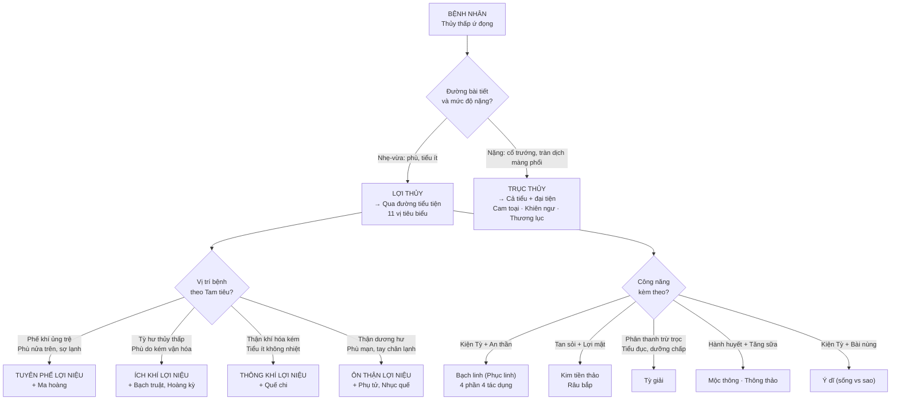
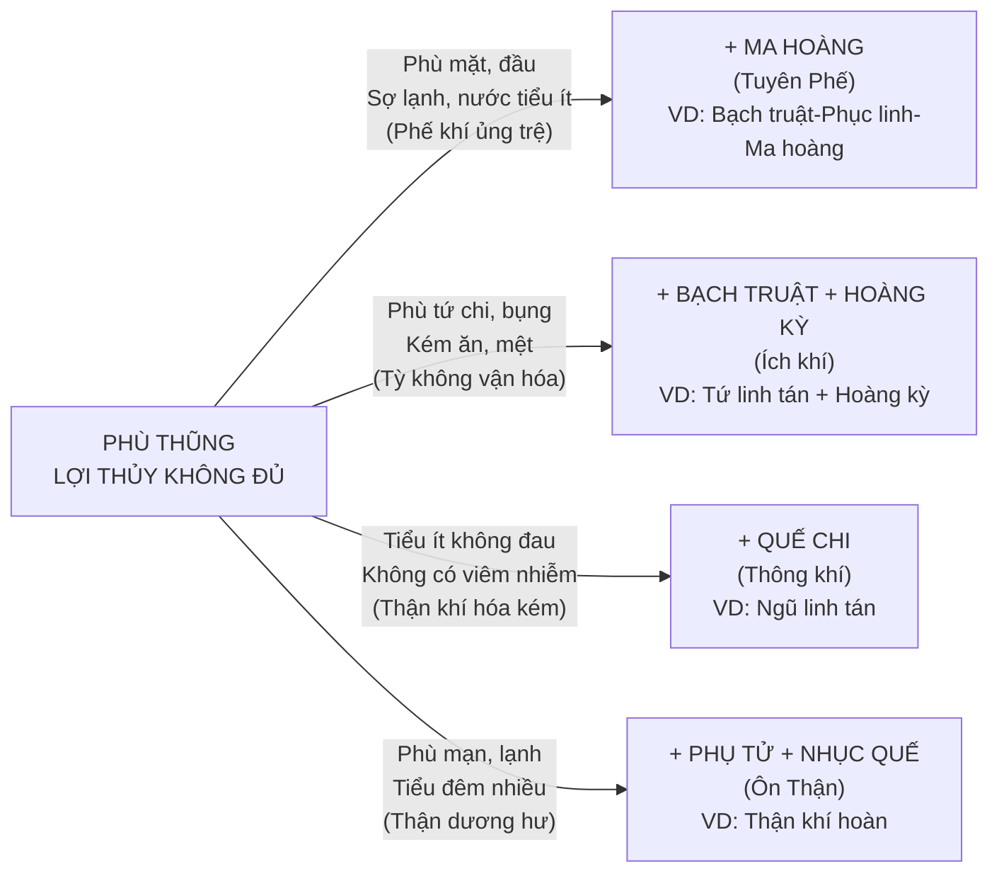
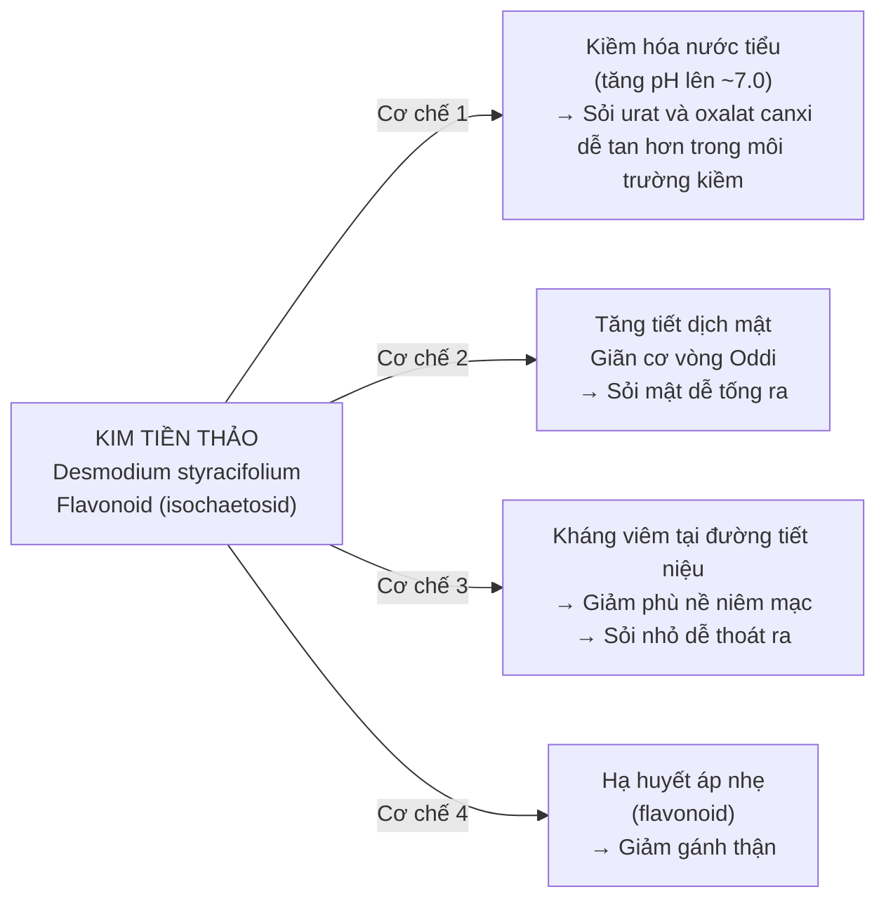
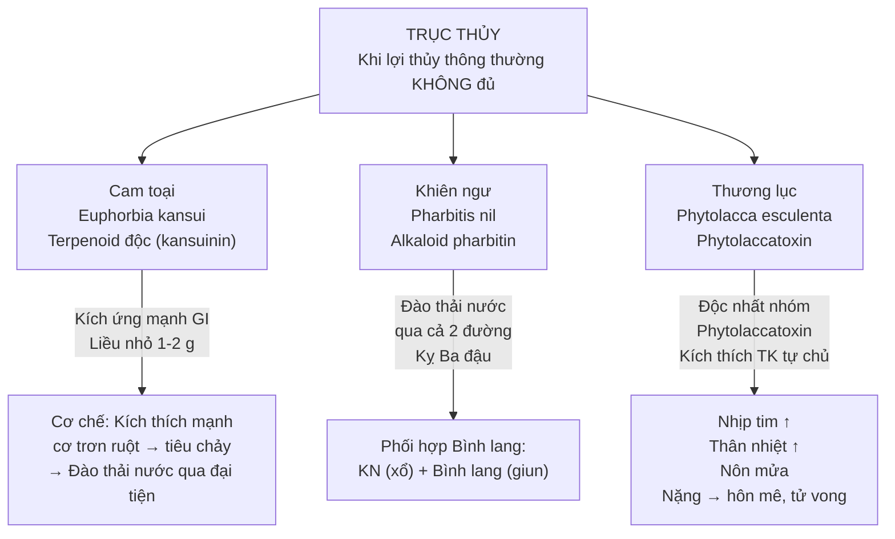

import CompareTable from '~/components/CompareTable.astro';
import ClinicalPearl from '~/components/ClinicalPearl.astro';
import RedFlags from '~/components/RedFlags.astro';
import MedicalNote from '~/components/MedicalNote.astro';

## 1. Luồng tư duy lâm sàng — Bài 11 từ đầu đến cuối

---

## 2. YHCT: "Tỳ-Phế-Thận" là 3 cơ quan điều hòa thủy dịch

**Nguyên lý YHCT:** Thủy dịch trong cơ thể được điều hòa bởi 3 tạng:
- **Tỳ** vận hóa thủy thấp (chuyển hóa, phân phối).
- **Phế** thông điều thủy đạo (điều phối đường lưu thông).
- **Thận** khí hóa Bàng quang (tạo áp lực đẩy thủy ra ngoài).

Khi 3 tạng này suy kém → thủy thấp ứ đọng → phù, tiểu ít, đàm ẩm.

**YHHĐ tương đương:**
- Tỳ vận hóa = albumin gan (duy trì áp lực keo) + lymph drainage.
- Phế thông điều = Atrial natriuretic peptide (ANP) từ tâm nhĩ điều hòa lợi niệu.
- Thận khí hóa = GFR (mức lọc cầu thận) + hệ RAA (renin-angiotensin-aldosterone).

---

## 3. 4 phép phối hợp — áp dụng lâm sàng cụ thể

---

## 4. Phục linh — 4 phần: giải thích cơ chế phân biệt

**Phục linh** là toàn bộ nấm. Mỗi phần có **thành phần hóa học khác nhau** → tác dụng khác nhau:

| Phần | Vị trí | Hoạt chất nổi bật | Tác dụng chính |
|---|---|---|---|
| **Phục linh bì** | Vỏ ngoài | Pachymose (polysaccharide thô) cao nhất | Lợi niệu tiêu thũng — đào thải nước ra ngoài mạnh nhất |
| **Xích phục linh** | Lớp hồng bên trong vỏ | Triterpenoid cao hơn | Lợi thấp nhiệt — viêm tiết niệu, nước tiểu đỏ |
| **Bạch phục linh** | Lõi trắng | Beta-glucan (pachymaran) + enzym | Kiện Tỳ — điều hòa vi sinh đường ruột, hỗ trợ tiêu hóa |
| **Phục thần** | Lõi có rễ Thông xuyên qua | Triterpenoid đặc biệt (poricoic acid) | An thần — điều hòa GABA, giảm lo âu |

<ClinicalPearl>

**Khi kê đơn Phục linh:** Không ghi chung "Phục linh 15 g" mà cần xác định:
- Phù toàn thân → Phục linh **bì** 12 g.
- Tiểu đỏ, viêm bàng quang → **Xích** Phục linh 12 g.
- Tiêu chảy Tỳ hư → **Bạch** Phục linh 15 g.
- Mất ngủ, hồi hộp → Phục **thần** 12 g.

Thực tế trên lâm sàng và trong các bài thuốc, "Phục linh" thường ngầm hiểu là Bạch Phục linh (lõi trắng) nếu không ghi rõ.

</ClinicalPearl>

---

## 5. Trạch tả vs Trư linh vs Bạch linh — chọn đúng tình huống

<CompareTable
  headers={["Tình huống lâm sàng", "Chọn vị nào", "Lý do"]}
  rows={[
    ["Phù + kém ăn + tiêu chảy Tỳ hư", "Bạch linh (Phục linh)", "Vừa lợi thủy vừa kiện Tỳ — giải cả nguyên nhân lẫn triệu chứng"],
    ["Phù + tiểu đỏ + viêm đường tiết niệu", "Trạch tả hoặc Trư linh", "Lợi thủy mạnh hơn; Trạch tả thêm hạ urê, cholesterol"],
    ["Phù + mất ngủ + hồi hộp", "Phục thần (Bạch linh + rễ Thông)", "Phục thần an thần đặc biệt — trong Bổ Tâm đan"],
    ["Phù nặng + tiểu đục + khí hư bạch đới", "Tỳ giải + Trư linh", "Tỳ giải phân thanh trừ trọc; Trư linh lợi tiểu mạnh"],
    ["Phù + Thận hư hoạt tinh (không nhiệt)", "KHÔNG dùng Trạch tả", "Trạch tả tính hàn — làm tổn thương Thận dương thêm"],
    ["Phù + Âm hư thấp nhiệt", "KHÔNG dùng Bạch linh", "Bạch linh tính bình nhưng lợi thủy kéo dài tổn thương tân dịch"],
  ]}
/>

---

## 6. Kim tiền thảo — cơ chế tan sỏi

Kim tiền thảo là vị thuốc YHCT được chứng minh YHHĐ rõ nhất trong nhóm này về cơ chế:

**Điểm lâm sàng:** Kim tiền thảo liều 15-30 g (lớn hơn nhiều so với vị thông thường) — đây là liều trị liệu cần thiết để đạt pH kiềm hóa nước tiểu. Dùng lâu dài 4-8 tuần mới thấy hiệu quả. Thường phối hợp Râu bắp + Kim tiền thảo để tăng lợi niệu.

---

## 7. Ý dĩ — sống vs sao vàng: nguyên tắc tương tự Bồ hoàng

| | Ý dĩ **sống** | Ý dĩ **sao vàng** (hoặc sao với nước gừng) |
|---|---|---|
| Tính | Hàn | Bình/ôn (sau khi chế biến) |
| Tác dụng chính | Lợi thấp nhiệt, thanh nhiệt bài nùng | Ôn bổ Phế Tỳ, kiện Tỳ chỉ tả |
| Chỉ định | Phù thũng có nhiệt, Phế ung (áp-xe phổi), viêm ruột thừa, mụn mặt | Tiêu chảy Tỳ hư, kém ăn, hư nhược |
| Cơ chế chuyển hóa | Nhiệt phá vỡ liên kết trong tinh bột → thay đổi cấu trúc polysaccharide | → tính hàn giảm, tính ôn tăng (lý do tương tự rang gừng) |

<MedicalNote>

**Bài Phì nhi cam tích tán** dùng Ý dĩ **sao vàng** (không dùng sống) vì bệnh nhân là trẻ em Tỳ hư, thêm Ý dĩ sống (tính hàn) sẽ làm nặng Tỳ hư thêm. Logic: Tỳ hư → kiêng hàn. Tương tự: người Tỳ hư tiêu chảy dùng Bồ hoàng cũng phải sao đen, không dùng sống.

</MedicalNote>

---

## 8. Tỳ giải — "phân thanh trừ trọc": cơ chế lọc dưỡng chấp

**"Phân thanh trừ trọc"** là công năng độc đáo của Tỳ giải trong YHCT:
- **Thanh** = thủy trong (nước tiểu bình thường).
- **Trọc** = thủy đục (dưỡng chấp, protein niệu, chất cặn bã).

**YHCT logic:** Thận khí yếu → không phân tách được thanh và trọc → dưỡng chấp lọt vào nước tiểu → tiểu đục.

**YHHĐ:** Saponin steroid (dioscin) trong Tỳ giải:
- Ức chế enzyme phospholipase A2 → giảm viêm cầu thận → giảm protein niệu.
- Điều hòa chuyển hóa lipid → giảm dưỡng chấp niệu.
- Kháng khuẩn đường tiết niệu → giảm pyuria (mủ niệu).

**Chỉ định:** Tiểu ra dưỡng chấp (chyluria), tiểu đục do nhiễm ký sinh trùng filaria, khí hư bạch đới nhiều. Phối hợp điển hình: Tỳ giải + Thạch xương bồ + Ô dược (bài Tỳ giải phân thanh ẩm).

---

## 9. Trục thủy — hiểu độc tính để dùng an toàn

**Nguyên tắc:** Trục thủy không dùng cho hư chứng. Chỉ dùng khi phù nặng thực chứng và thầy thuốc có kinh nghiệm.

<ClinicalPearl>

**Khi gặp ngộ độc Thương lục:** Triệu chứng tăng dần: nôn mửa → tiêu chảy → đau bụng → nhịp tim nhanh → thân nhiệt tăng → hôn mê. Xử trí: Rửa dạ dày + than hoạt tính + điều trị triệu chứng (atropine nếu nhịp nhanh). Không có antidote đặc hiệu. Liều dùng tối đa 9 g — không vượt quá.

</ClinicalPearl>

---

## 10. Mộc thông vs Thông thảo — cùng tên "thông" nhưng khác mức độ

<CompareTable
  headers={["Tiêu chí", "Mộc thông", "Thông thảo"]}
  rows={[
    ["Nguồn gốc", "Thân leo Clematis spp.", "Lõi thân Tetrapanax papyrifer"],
    ["Tính vị", "Đắng, hàn (mạnh hơn)", "Ngọt nhạt, vi hàn (nhẹ hơn)"],
    ["Mức độ lợi tiểu", "Mạnh — tiết giáng mạnh", "Nhẹ — hòa hoãn hơn"],
    ["Tác dụng thêm", "Hành huyết, thông kinh (tác dụng trên mạch máu)", "Thông khí, tăng tiết sữa (tác dụng trên Phế khí)"],
    ["Chỉ định đặc biệt", "Bí tiểu nặng, kinh bế, huyết ứ, đau khớp do huyết trệ", "Sữa ít sau sinh, phù nhẹ có nhiệt, không dùng được thuốc mạnh"],
    ["Kiêng kỵ", "Thận trọng phụ nữ có thai (hành huyết)", "Kiêng thai phụ; người khí hư không nhiệt"],
    ["Hoạt chất nổi bật", "Saponin triterpenoid + alkaloid", "Triterpen glycosid + ức chế NO (thần kinh)"],
  ]}
/>

---

<RedFlags title="Điểm dễ nhầm — bẫy thi">

- **Trục thủy ≠ Lợi thủy:** Câu hỏi "thuốc đưa nước ra qua đại tiện" → **trục thủy** (Cam toại, Khiên ngư, Thương lục). Câu hỏi "lợi tiểu" → lợi thủy thông thường.
- **Phục linh kỵ Giấm** — không phổ biến nhưng đề hay hỏi kiêng kỵ đặc biệt. Giấm (acid acetic) có thể làm kết tủa polysaccharide Phục linh → mất tác dụng.
- **Trạch tả kiêng Thận hư hoạt tinh** (không có thấp nhiệt) — lý do: tính hàn + lợi tiểu mạnh tổn thương Thận khí thêm.
- **Thông thảo kiêng thai** — liên quan tác dụng thông khí, thông nhũ → có thể kích thích co bóp.
- **Tỳ giải chuyên "tiểu đục, dưỡng chấp"** — không dùng cho bí tiểu thông thường không có tiểu đục.
- **Ý dĩ sống vs sao vàng:** Tiêu chảy Tỳ hư → sao vàng (không dùng sống vì tính hàn làm nặng Tỳ hư).
- **Khiên ngư kỵ Ba đậu** — cả hai đều xổ mạnh; phối hợp gây mất nước nghiêm trọng.
- **Liều trục thủy rất nhỏ:** Cam toại 1-2 g, Thương lục 3-9 g — sai liều có thể độc.
- **Không dùng lợi thủy khi bí tiểu do thiếu tân dịch** — khác hoàn toàn với bí tiểu do thấp nhiệt. Nhầm chỉ định làm mất thêm tân dịch.

</RedFlags>

---

## 11. 3 câu hỏi tư duy

1. Bệnh nhân nam 65 tuổi, phù 2 chân, tiểu ít, kém ăn, tiêu chảy 3-4 lần/ngày, lưỡi nhợt bệu, mạch tế nhược (Tỳ hư không vận hóa). Chọn lợi thủy phép nào? Phối hợp vị gì? Tại sao không dùng Trạch tả hay Trư linh?

2. Bệnh nhân 45 tuổi, sỏi niệu quản trái 7 mm, đau quặn thận từng cơn, tiểu buốt, nước tiểu vàng đục. YHCT chẩn: thấp nhiệt hạ tiêu. Lợi thủy nhóm nào? Kim tiền thảo trị sỏi theo cơ chế gì? Cần phối hợp thêm vị nào (gợi ý: thanh nhiệt, chỉ thống)?

3. Bệnh nhân xơ gan cổ trướng, phù bụng lớn, suy gan Child-Pugh C. Lợi thủy thông thường không hiệu quả. YHCT cân nhắc trục thủy (Cam toại). Nhưng bệnh nhân suy gan → chuyển hóa thuốc kém, nguy cơ ngộ độc cao. Tại sao suy gan lại tăng nguy cơ ngộ độc Cam toại? Hướng xử trí thay thế an toàn hơn?
