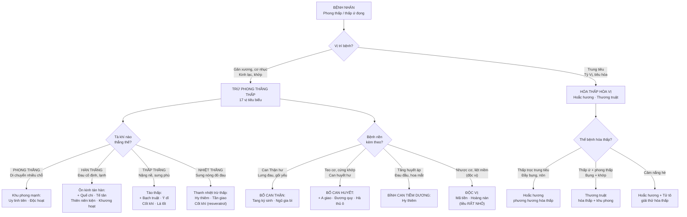
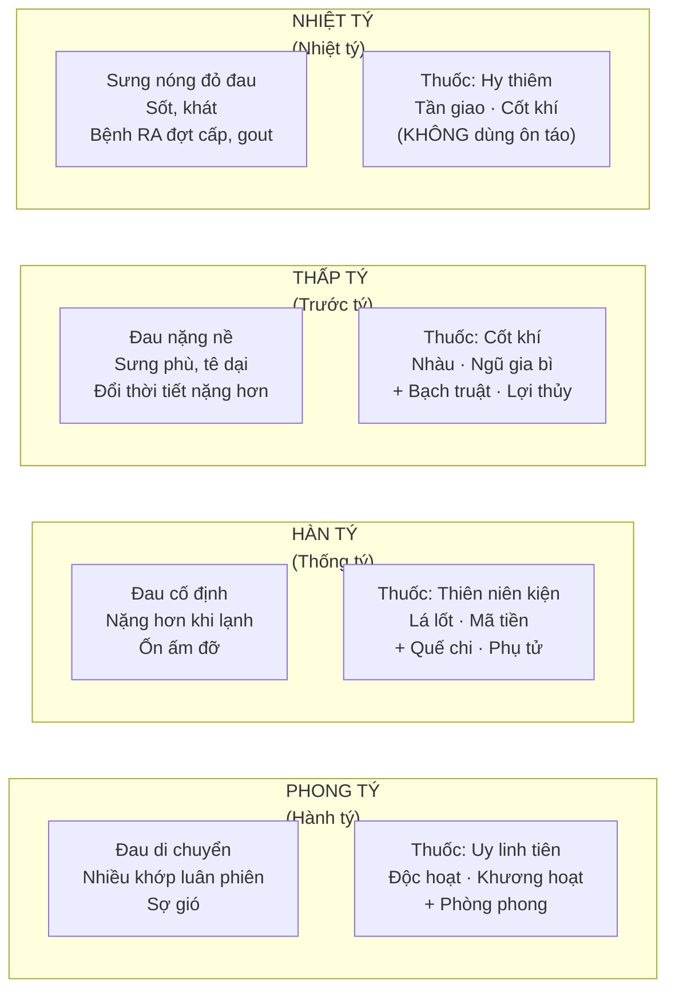
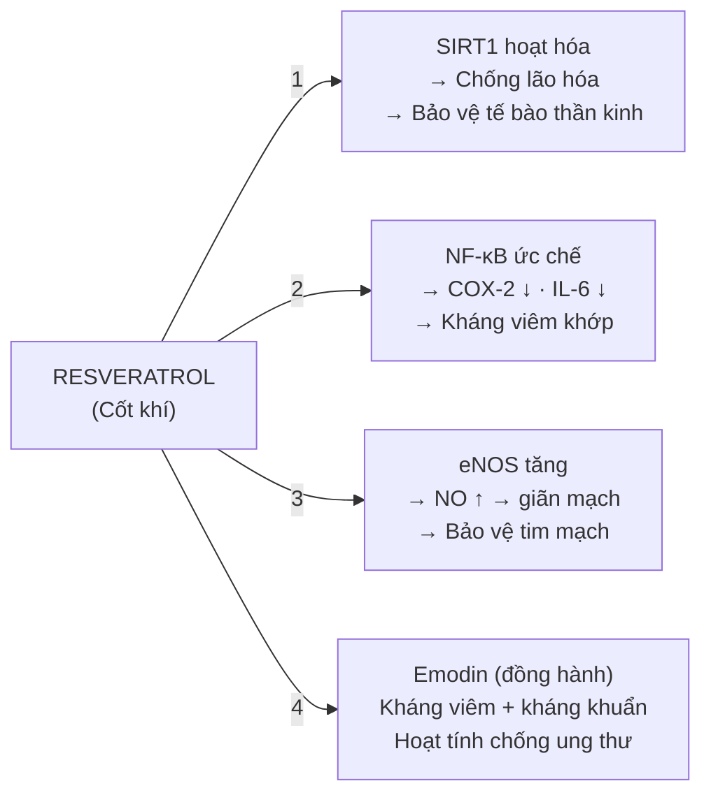

import CompareTable from '~/components/CompareTable.astro';
import ClinicalPearl from '~/components/ClinicalPearl.astro';
import RedFlags from '~/components/RedFlags.astro';
import MedicalNote from '~/components/MedicalNote.astro';

## 1. Luồng tư duy lâm sàng — Bài 12 từ đầu đến cuối



---

## 2. YHCT: "Tý chứng" — tà phong-hàn-thấp ứ đọng

**Định nghĩa YHCT:** "Tý" = bế tắc. Tý chứng = Phong + Hàn + Thấp xâm nhập vào kinh lạc, gân xương → khí huyết lưu thông bị cản trở → đau nhức, tê dại, co rút.

**YHHĐ tương đương:**
- Phong (tán mạn) = Migratory arthritis — đau di chuyển nhiều khớp.
- Hàn (co cứng) = Cold-induced vasospasm + joint stiffness.
- Thấp (sưng nề) = Synovial effusion, periarticular edema.
- Nhiệt thắng = Inflammatory arthritis (RA đợt cấp), gout cấp.

**Câu nguyên tắc kinh điển:** "Phong thắng hành, hàn thắng thống, thấp thắng trước" (Phong di chuyển → Hàn đau cố định → Thấp nặng nề dính).

---

## 3. Phân tầng 4 thể + phối hợp thuốc



---

## 4. Mã tiền vs Hoàng nàn — cùng strychnin, dùng thế nào?

Đây là **cặp vị thuốc dễ nhầm nhất** trong bài vì cùng họ Loganiaceae, cùng alkaloid độc.

<CompareTable
  headers={["Tiêu chí", "Mã tiền (Semen Strychni)", "Hoàng nàn (Cortex)"]}
  rows={[
    ["Nguồn thực vật", "Strychnos nux-vomica — hạt", "Strychnos wallichiana — vỏ thân/cành"],
    ["Alkaloid chính", "Strychnin 1.5–5% + Brucin ~0.5%", "Strychnin + Brucin (tỷ lệ thấp hơn)"],
    ["Liều người lớn", "0,05–0,10 g/lần × 3 lần/ngày", "≤0,1 g/lần × 2–4 lần/ngày, max 0,4 g/ngày"],
    ["Trẻ em", "≥3 tuổi: 0,005 g/tuổi; <2 tuổi CẤMDÙNG", "Dưới 5 tuổi CẤMDÙNG"],
    ["Chỉ định ưu tiên", "Nhược cơ, liệt mềm, bại liệt trẻ em, đau khớp cấp/mạn", "Bán thân bất toại, đau TK ngoại biên, ghẻ ngứa mạn tính"],
    ["Cơ chế giảm đau/liệt", "Strychnin kích thích tủy sống liều nhỏ → tăng trương lực cơ", "Tương tự (cơ chế strychnin giống nhau)"],
    ["Triệu chứng ngộ độc", "Ngáp → chảy nước dãi → co giật kiểu uốn ván → tử vong 5 phút–5 giờ", "Tương tự ngộ độc strychnin"],
    ["Kiêng kỵ", "Phụ nữ có thai, cho con bú", "Phụ nữ có thai, cho con bú; trẻ <5 tuổi"],
  ]}
/>

<ClinicalPearl>

**Mã tiền chế ≠ Mã tiền sống:** "Mã tiền chế" đã qua chế biến (sao dầu, sao cát) → giảm hàm lượng strychnin 40–60%. Liều trong nguyen-thuy là liều của Mã tiền **chế**, không phải sống. Mã tiền sống độc hơn nhiều — không bào chế đúng cách là nguy hiểm tính mạng.

</ClinicalPearl>

---

## 5. Resveratrol trong Cốt khí — hoạt chất "thời thượng"

**Cốt khí** (*Polygonum cuspidatum*) là một trong những nguồn resveratrol phong phú nhất trong tự nhiên — hàm lượng cao hơn cả vỏ nho đỏ (wine).



**YHCT mô tả:** Cốt khí "trừ thấp, chỉ khái, hóa đờm, sát trùng" — tưởng đơn giản nhưng YHHĐ giải thích qua:
- Trừ thấp (khớp) = kháng viêm COX-2/NF-κB.
- Chỉ khái (ho Phế nhiệt) = resveratrol kháng virus hô hấp + kháng viêm phổi.
- Sát trùng (mụn nhọt) = emodin kháng khuẩn tại chỗ.

---

## 6. Hy thiêm — vị thuốc "2 trong 1": khu phong + hạ áp

**Hy thiêm** (*Siegesbeckia orientalis*) có 2 công năng YHCT quan trọng:
1. Khu phong trừ thấp → viêm khớp nhiệt loại.
2. Bình Can tiềm dương → tăng huyết áp với đau đầu, hoa mắt.

**Tại sao lại "bình Can tiềm dương"?**
- Can dương vượng = tăng huyết áp trong YHCT.
- Darutosid (diterpen của Hy thiêm): giãn mạch ngoại vi → hạ HA.
- Flavonoid: ức chế ACE nhẹ (cơ chế tương tự ức chế men chuyển).
- Ức chế miễn dịch → giảm viêm mạch máu.

**Điểm lâm sàng:** Bệnh nhân viêm khớp dạng thấp + tăng huyết áp → Hy thiêm là lựa chọn vừa trị khớp vừa trị HA. Không cần 2 thuốc riêng biệt.

**Kiêng kỵ đặc biệt: Kỵ Sắt** — Không sắc trong nồi sắt, không dùng kèm vật dụng sắt. Lý do: Tannin + flavonoid trong Hy thiêm tạo phức với ion sắt (Fe²⁺/Fe³⁺) → kết tủa, mất hoạt tính.

---

## 7. Tang ký sinh — "tầm gửi" với 4 công năng độc đáo

**Tang ký sinh** ký sinh trên cây Dâu → hút chất dinh dưỡng từ Dâu → tích lũy quercetin, avicularin từ vật chủ. Đây là lý do YHCT giải thích tại sao tầm gửi mang tính bổ hơn cây chủ ở một số mặt.

| Công năng | Cơ chế YHHĐ | Ứng dụng lâm sàng |
|---|---|---|
| Trừ phong thấp | Quercetin ức chế COX-2, ức chế cytokine viêm | Viêm khớp + đau lưng mỏi gối do Can Thận hư |
| Bổ Can Thận mạnh gân cốt | Quercetin + avicularin điều hòa osteoblast/osteoclast | Loãng xương, thoái hóa khớp mạn tính |
| An thai | Flavonoid giảm co bóp tử cung (ức chế PGF2α) + chống viêm màng ối | Động thai, xuất huyết dọa sảy |
| Lợi sữa | Prolactin-like effect (cơ chế chưa rõ hoàn toàn) | Ít sữa sau sinh |

<ClinicalPearl>

**Bài An thai Thánh dược (dân gian):** Tang ký sinh 12 g + A giao 12 g + Ngải diệp 6 g. Logic YHHĐ: Tang ký sinh (giảm co tử cung) + A giao (gelatin bổ huyết + cầm máu) + Ngải diệp (ôn kinh, giảm co bóp ở liều nhỏ). Bài thuốc kinh điển cho "huyết hư động thai".

</ClinicalPearl>

---

## 8. Ké đầu ngựa (Thương nhĩ tử) — khu phong + thông xoang

**Điểm đặc biệt:** Ké đầu ngựa quy kinh **Phế** (không quy Can/Thận như các vị khu phong khác). Vì sao?

```
KÉ ĐẦU NGỰA → quy Phế → thông Ty khiếu (mũi)

YHCT lý luận: Phế khai khiếu ở MŨI
→ Phế khí không thông → mũi ngạt, xoang nghẹt
→ Dùng vị quy Phế để "tuyên Phế thông mũi"

YHHĐ: Sesquiterpenoid Xanthium
→ Ức chế phospholipase A2 (chống viêm mũi dị ứng)
→ Giảm phù nề niêm mạc xoang
→ Tương tự cơ chế kháng histamin + NSAIDs tại chỗ
```

**Thương nhĩ tử 16 g sao vàng + tán bột uống** — bài đơn giản nhất điều trị viêm xoang mũi mạn trong YHCT. Cũng có thể phối hợp Bạc hà + Tế tân để xông mũi (mở rộng mạch niêm mạc + ức chế phản ứng dị ứng).

---

## 9. Thương truật "minh mục" — cơ chế tại sao hóa thấp lại trị quáng gà?

**Quáng gà (dạ manh)** trong YHCT = Can huyết không lên nuôi mắt → thị lực kém khi ánh sáng yếu.

**YHHĐ:** Quáng gà = thiếu Vitamin A (rhodopsin trong tế bào que võng mạc cần Vitamin A).

**Cơ chế Thương truật → minh mục:**

```
THƯƠNG TRUẬT chứa β-eudesmol + sesquiterpen
    ↓
Cải thiện chuyển hóa lipid ở gan
    ↓
Tăng hấp thu beta-carotene → chuyển hóa thành Retinol (Vitamin A)
    ↓
Retinol → Retinal → Rhodopsin (sắc tố thị giác tế bào que)
    ↓
Cải thiện thị lực ban đêm (quáng gà → minh mục)
```

<MedicalNote>

**Lưu ý:** Cơ chế trên còn đang được nghiên cứu. Trên lâm sàng thực tế, quáng gà do thiếu Vitamin A nặng cần bổ sung Vitamin A trực tiếp — Thương truật chỉ là hỗ trợ, không thay thế. YHCT thường phối hợp Thương truật với Can dê/lợn (nguồn Vitamin A thật sự) để trị dạ manh.

</MedicalNote>

---

## 10. Hoắc hương vs Thương truật — 2 vị hóa thấp hòa Vị khác nhau ra sao?

<CompareTable
  headers={["Tiêu chí", "Hoắc hương", "Thương truật"]}
  rows={[
    ["Bộ phận dùng", "Toàn cây trên mặt đất", "Thân rễ"],
    ["Hoạt chất chủ lực", "Patchouli alcohol (tinh dầu 1–2.5%)", "Sesquiterpen (atractylol, β-eudesmol)"],
    ["Tính vị", "Cay, vi ôn (nhẹ hơn)", "Cay, đắng, ôn (mạnh hơn)"],
    ["Quy kinh", "Phế, Tỳ, Vị", "Tỳ, Vị"],
    ["Công năng thêm", "Giải thử (cảm nắng hè) + Chỉ ẩu (nôn)", "Khu phong trừ thấp + Phát hãn + Minh mục"],
    ["Dùng dạng nào tốt nhất", "Sắc cho vào sau, hãm, hoặc bột (tinh dầu dễ bay)", "Sắc bình thường; sao vàng cho người thấp nhẹ"],
    ["Kiêng kỵ", "Âm hư, khí hư", "Táo bón, nhiều mồ hôi"],
    ["Bài thuốc điển hình", "Hoắc hương chính khí tán (cảm nắng, nôn tiêu chảy)", "Bình vị tán (Hậu phác + Thương truật — hóa thấp)"],
  ]}
/>

---

<RedFlags title="Điểm dễ nhầm — bẫy thi">

- **Hy thiêm kỵ sắt** — không sắc nồi sắt, không dùng dụng cụ sắt. Lý do: tạo phức chelate với Fe → mất hoạt tính.
- **Mã tiền phân biệt liều:** 0,05–0,10 g/lần (không phải 0,5–1 g). Nhầm đơn vị → ngộ độc!
- **Hoàng nàn max 0,4 g/ngày** (4 lần × 0,1 g), không phải 4 g/ngày.
- **Thương truật sống ≠ sao:** Sống = táo thấp mạnh (thấp nhiều, nhiệt). Sao vàng = nhẹ nhàng hơn (thấp nhẹ, Tỳ hư).
- **Hóa thấp hòa Vị cho vào sau cùng khi sắc** — tinh dầu bay hơi ở nhiệt độ cao, sắc lâu mất tác dụng.
- **Tang chi ≠ Tang ký sinh:** Tang chi (cành Dâu) không bổ Thận, không an thai. Tang ký sinh (tầm gửi trên Dâu) mới có 4 công năng đặc biệt.
- **Cốt khí tính hàn** (vị hơi đắng, tính hàn) — khác với hầu hết vị trừ phong thắng thấp tính ôn. Dùng cho tý chứng **nhiệt** là đúng; hàn tý thì cẩn thận.
- **Mắc cở (Mimosa) rễ liều 120 g** — số thực, không phải lỗi. Rễ ít hoạt chất hơn lá nên liều cao hơn gấp 10–20 lần.
- **Nhàu (rễ) quy Thận, Đại trường** — không quy Can như đa số vị trừ phong. Nhuận tràng + hạ HA + trừ phong — 3 tác dụng không hay thấy ở vị trừ phong khác.
- **Hoắc hương giải thử (cảm nắng)** — không phải thuốc thanh nhiệt, không dùng cho sốt nhiễm khuẩn thuần túy. Chỉ trị thử thấp (cảm nắng + ẩm thấp mùa hè).

</RedFlags>

---

## 11. 3 câu hỏi tư duy

1. Bệnh nhân nữ 55 tuổi, viêm khớp dạng thấp (RA) đợt cấp — khớp gối sưng nóng đỏ đau, CRP 45 mg/L, tăng huyết áp 160/95 mmHg, mất ngủ, lưỡi đỏ ít rêu (âm hư nội nhiệt). Theo YHCT: Bốn thể tý nào? Chọn vị gì từ bài 12? Phối hợp thêm nhóm thuốc nào (gợi ý: từ bài 9-11)?

2. Mã tiền được dùng trị "nhược cơ" và "liệt mềm" — điều này có vẻ nghịch lý vì strychnin độc thần kinh. Giải thích cơ chế YHHĐ tại sao liều nhỏ strychnin lại CÓ THỂ cải thiện nhược cơ? Ngưỡng độc và ngưỡng điều trị cách nhau bao nhiêu?

3. Một thầy thuốc YHCT kê đơn: Hoắc hương 9 g + Thương truật 9 g + Bạch truật 12 g + Phục linh 15 g + Lá lốt 12 g cho bệnh nhân bị viêm ruột mạn tính, đau khớp, phù chân nhẹ (Tỳ hư thấp khốn + phong hàn thấp tý). Phân tích vai trò từng vị trong bài thuốc này theo YHCT và YHHĐ.
