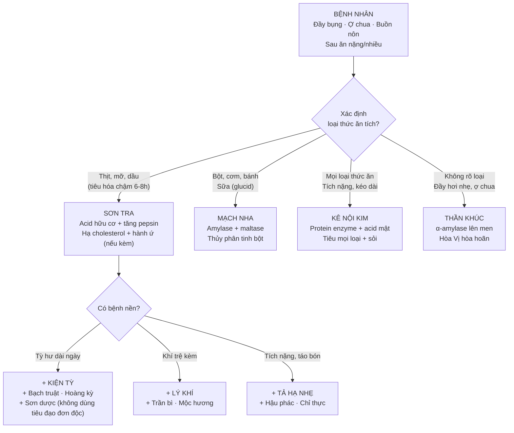
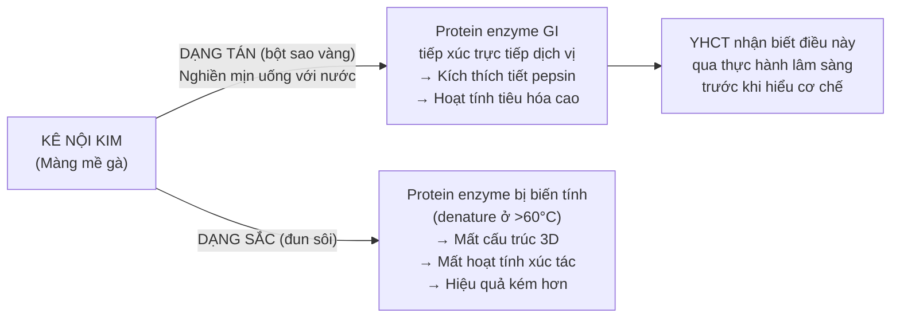
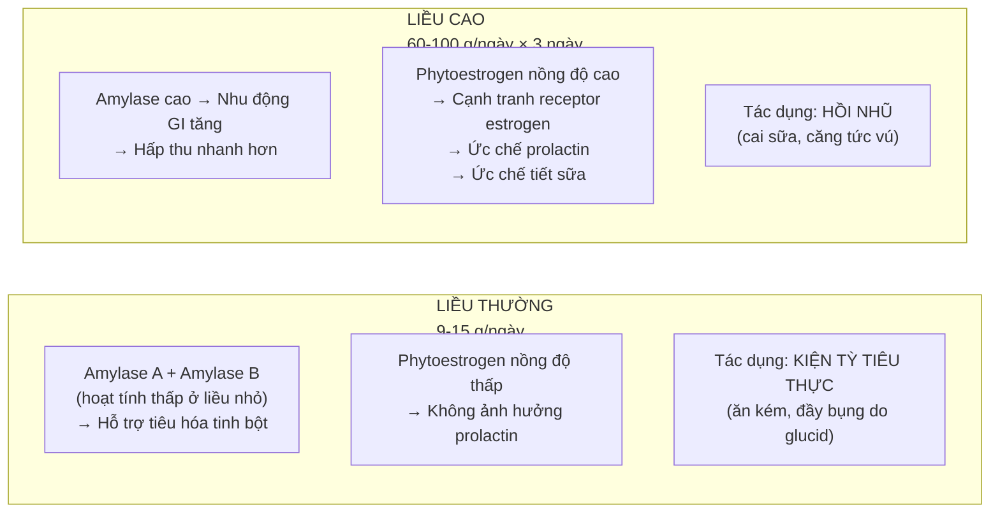
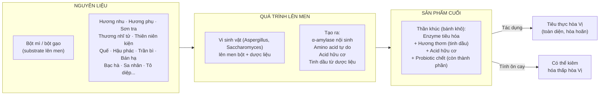

import CompareTable from '~/components/CompareTable.astro';
import ClinicalPearl from '~/components/ClinicalPearl.astro';
import RedFlags from '~/components/RedFlags.astro';
import MedicalNote from '~/components/MedicalNote.astro';

## 1. Luồng tư duy lâm sàng — Bài 13



---

## 2. YHCT: "Thực tích" là gì, khác "Tỳ hư" thế nào?

**Thực tích (食積):** Thức ăn tích tụ dạ dày-ruột → không tiêu được → sinh chướng khí, đầy bụng, ợ chua, nôn, tiêu chảy phân thối. Nguyên nhân: ăn quá nhiều, ăn thức ăn khó tiêu, ăn quá nhanh.

**Tỳ hư:** Chức năng Tỳ vận hóa suy giảm → tiêu hóa kém mạn tính, người mệt, kém ăn. Nguyên nhân: thể chất hư nhược, bệnh lâu ngày.

| | Thực tích | Tỳ hư |
|---|---|---|
| Nguyên nhân | Ăn nhiều/khó tiêu (cấp) | Tỳ yếu mạn tính |
| Triệu chứng | Đầy trướng sau ăn, đau quặn, ợ chua thối | Kém ăn không đau, người mệt, tiêu chảy nhão |
| Điều trị | Tiêu đạo trước | Kiện Tỳ trước / phối hợp |
| YHCT gọi | "Thực chứng" | "Hư chứng" |
| Dùng tiêu đạo đơn độc? | Được | KHÔNG (làm nặng hơn) |

**Nguyên tắc quan trọng:** Không dùng thuốc tiêu đạo đơn độc khi Tỳ hư → phải phối hợp kiện Tỳ. Chỉ tiêu đạo đơn thuần khi thực chứng rõ ràng.

---

## 3. Kê nội kim — tại sao phải dùng dạng tán?

**Nguyên tắc hiếm gặp:** Hầu hết thuốc YHCT dùng sắc tốt. Kê nội kim là ngoại lệ — dạng tán hiệu quả hơn sắc.



**Thực hành:** Kê nội kim sao vàng nghiền bột mịn (có thể mua dạng bột sẵn), uống 3–9 g/ngày với nước ấm. Không pha chung khi sắc các vị khác.

---

## 4. Mạch nha — 2 liều, 2 tác dụng hoàn toàn khác

**Nghịch lý Mạch nha:** Cùng một vị thuốc, tăng liều → tác dụng đảo chiều:



<ClinicalPearl>

**Mạch nha hồi nhũ — thực hành:** Sao vàng 80–100 g sắc uống mỗi ngày, uống 3 ngày liên tục. Không dùng cho phụ nữ có thai (gây cạn sữa cho tương lai) hay đang cho con bú (trừ khi muốn cai sữa). Thường phối hợp thêm Sơn tra để tiêu thực kèm (bú bé, sữa ứ lại → tiêu ứ đồng thời).

</ClinicalPearl>

---

## 5. Sơn tra — vị tiêu đạo "kiêm hoạt huyết"

**Sơn tra độc đáo** vì ngoài tiêu thực còn có công năng **hành ứ** — tác dụng trên huyết (không thường thấy ở vị tiêu đạo).

### Cơ chế tiêu thịt mỡ

```
ACID TARTARIC + ACID CITRIC (Sơn tra)
    ↓
pH dịch vị ↓ (acid hóa môi trường)
    ↓
Pepsinogen → Pepsin (hoạt hóa cần pH 1.5-3.5)
    ↓
Pepsin thủy phân protein thịt hiệu quả hơn
    ↓
YHCT: "Tiêu thịt mỡ đặc biệt"
```

```
ACID HỮU CƠ + FLAVONOID (Sơn tra)
    ↓
Tăng tiết lipase từ tụy (qua CCK)
    ↓
Emulsification và tiêu hóa mỡ tốt hơn
    ↓
YHCT: "Tiêu thức ăn nhiều dầu mỡ"
```

### Cơ chế hành ứ + hạ cholesterol

```
VITEXIN + HYPEROSIDE + QUERCETIN (Sơn tra flavonoid)
    ↓
Ức chế kết tập tiểu cầu (giảm TXA2)
    ↓
Giãn mạch vành (tăng NO)
    ↓
YHCT: "Hành ứ" = cải thiện vi tuần hoàn
    ↓
Ứng dụng: Sản hậu ứ huyết (sau sinh huyết ứ bụng dưới)
```

```
TRITERPENOID ACID (ursolic acid, oleanolic acid) trong Sơn tra
    ↓
Ức chế HMG-CoA reductase
    ↓
Tổng hợp cholesterol gan ↓
    ↓
LDL-C ↓, HDL-C ↑
    ↓
YHCT: Chưa có tên riêng — nhưng trong thực tế dùng Sơn tra + tim mạch hiệu quả
```

<MedicalNote>

**Sơn tra + bệnh tim mạch:** Nghiên cứu hiện đại cho thấy Hawthorn (*Crataegus* sp., họ cùng chi với Malus) có tác dụng tim mạch rõ ràng — hạ HA, tăng co bóp tim, hạ cholesterol. Sơn tra (*Malus doumeri*) có thành phần tương tự nhưng khác loài. Ở Trung Quốc, bài thuốc Sơn tra dùng phổ biến cho tăng cholesterol và xơ vữa động mạch nhẹ — một ví dụ "thuốc tiêu đạo kiêm tim mạch" bất ngờ.

</MedicalNote>

---

## 6. Thần khúc — sản phẩm lên men độc đáo

**Thần khúc không phải vị thuốc đơn** — đây là sản phẩm lên men từ bột mì/gạo + nhiều vị thuốc, tương tự khái niệm "probiotics kết hợp enzyme" trong YHHĐ.



**Tại sao Thần khúc tính ôn-cay** (dù bột mì tính bình)? Vì trong thành phần có Quế, Hậu phác, Sa nhân, Bán hạ — tất cả tính ôn cay → tổng hòa ra sản phẩm tính ôn.

---

## 7. Bài "Mạch Sơn Thần" + biến thể lâm sàng

**Bài cơ bản:** Mạch nha sao 12 g + Sơn tra sống 12 g + Thần khúc 12 g.

| Phối hợp thêm | Lý do | Tình huống |
|---|---|---|
| + Kê nội kim 6 g (bột uống riêng) | Tích nặng, nhiều loại thức ăn | Trẻ em cam tích nặng |
| + Trần bì 6 g + Mộc hương 6 g | Khí trệ kèm (đầy hơi nhiều) | Đầy bụng + ợ hơi nhiều |
| + Bạch truật 12 g + Hoàng kỳ 12 g | Tỳ hư kèm thực tích | Người già, ốm lâu ngày bị thực tích |
| + Hậu phác 9 g + Chỉ thực 9 g | Táo bón do tích (cần tống ra) | Tích nặng + không đi ngoài được |
| + Kim tiền thảo 20 g + Kê nội kim bột | Thực tích + sỏi mật | Sỏi mật kèm tiêu hóa kém |

---

<RedFlags title="Điểm dễ nhầm — bẫy thi">

- **Kê nội kim KHÔNG sắc** — dùng dạng tán. Đề hỏi "cách dùng tốt nhất" → tán bột sao vàng uống.
- **Mạch nha liều cao 60–100 g ≠ tiêu thực** — ở liều này tác dụng là HỒI NHŨ (cai sữa). Nhầm liều là nhầm tác dụng.
- **Sơn tra xanh gây hại** — không dùng quả xanh dù cùng tên. Chỉ dùng quả chín (đỏ).
- **Sơn tra có công năng hành ứ** — không phải thuốc lý huyết nhưng có tác dụng phụ trên huyết. Cần thận trọng người có xuất huyết tiêu hóa.
- **Thần khúc tính ôn-cay** do thành phần dược liệu ôn trong bài lên men (không phải bột mì tính bình) — dùng cho người thực nhiệt cẩn thận.
- **Tiêu đạo kiêm kiện Tỳ ≠ tiêu đạo đơn thuần:** Kê nội kim "kiện Vị tiêu thực", Mạch nha "kiện Tỳ tiêu thực" — cả 2 vừa tiêu vừa bổ nhẹ. Chỉ Sơn tra là tiêu thực "tiêu cực" hơn (không kiêm bổ).

</RedFlags>

---

## 8. 3 câu hỏi tư duy

1. Bệnh nhân 35 tuổi, sau tiệc nhậu: đầy bụng, ợ hôi mùi thịt, buồn nôn nhưng không sốt, không tiêu chảy. YHCT chẩn: Thực tích đình trệ trung tiêu. Chọn bài tiêu đạo nào? Nếu thêm rượu (thấp nhiệt) thì phối hợp gì?

2. Mạch nha có tác dụng "hồi nhũ" ở liều cao. Nhưng sách nói "Mạch nha sống kiện Tỳ dưỡng Vị" — liệu phụ nữ đang cho con bú dùng Mạch nha sống liều bình thường có ảnh hưởng sữa không? Giải thích cơ chế liều phụ thuộc.

3. Bệnh nhân cao tuổi 70 tuổi, Tỳ hư mạn tính, sau Tết ăn nhiều thịt mỡ bị đầy bụng, nặng hơn thường ngày. Không thể chỉ dùng tiêu đạo đơn thuần — tại sao? Thiết kế bài thuốc 5–6 vị tích hợp tiêu đạo + kiện Tỳ.
