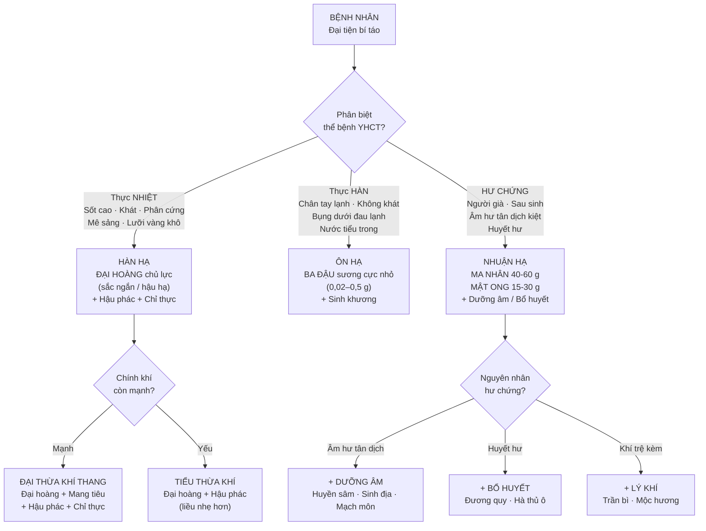
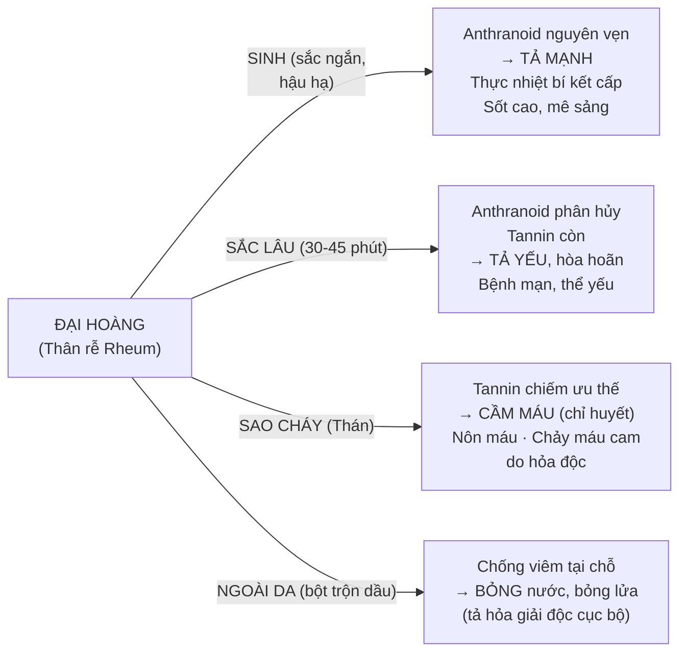
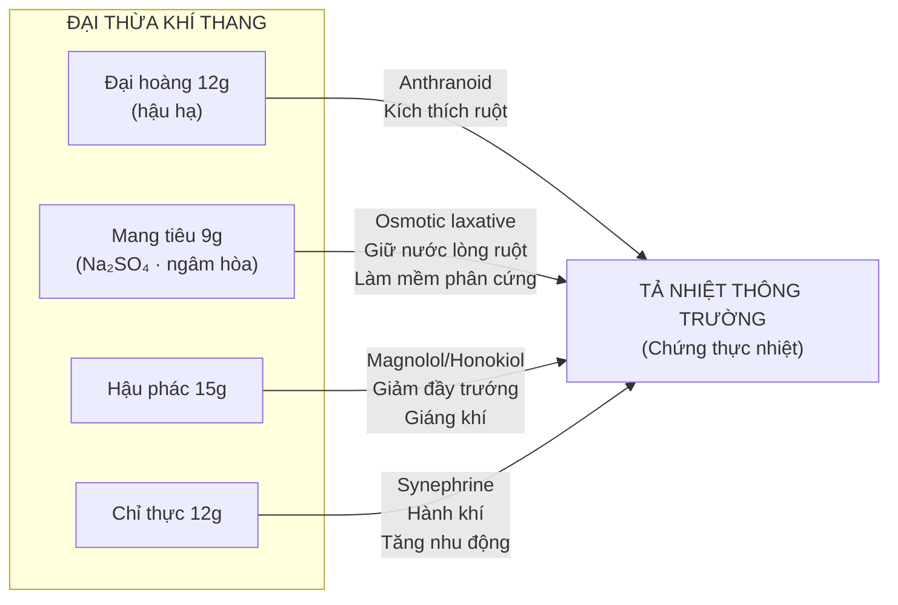
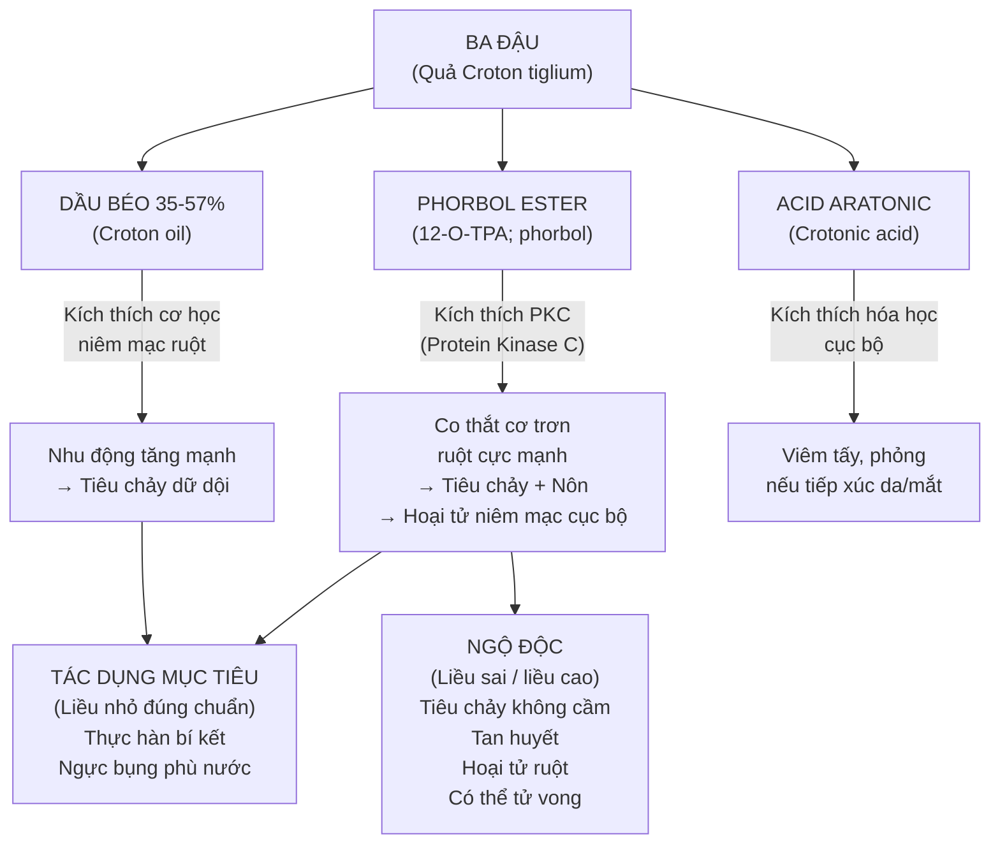
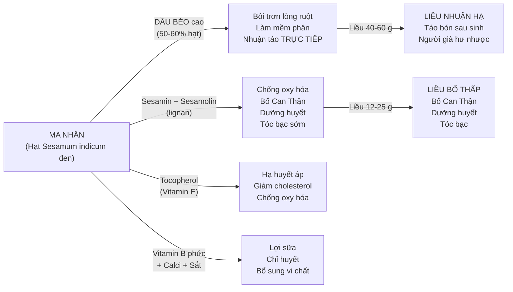
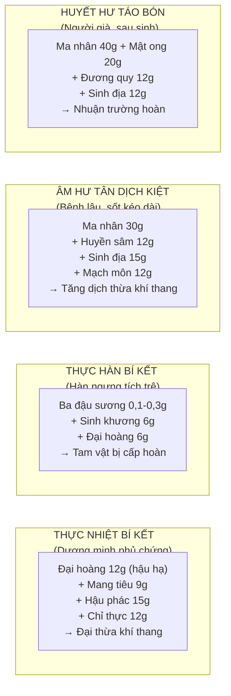

import CompareTable from '~/components/CompareTable.astro';
import ClinicalPearl from '~/components/ClinicalPearl.astro';
import RedFlags from '~/components/RedFlags.astro';
import MedicalNote from '~/components/MedicalNote.astro';

## 1. Luồng tư duy lâm sàng — Bài 14



---

## 2. Nguyên tắc "giải biểu trước, công lý sau"

**Tại sao KHÔNG dùng tả hạ khi còn biểu chứng?**

```
BIỂU CHỨNG CÒN (cảm mạo, sốt, sợ lạnh, nhức mỏi)
    ↓
Bệnh tà ở biểu — chưa vào lý
    ↓
Dùng tả hạ (thuốc đẩy xuống dưới) khi tà còn ở biểu
    ↓
"Dẫn tà vào lý" — kéo bệnh tà vào sâu hơn
    ↓
Bệnh trở nên phức tạp hơn (biểu lý đồng bệnh, khó điều trị)
    ↓
NGUYÊN TẮC: Giải biểu TRƯỚC → Tà vào lý rồi mới công lý
```

**Ngoại lệ:** Biểu lý cùng cấp (vừa cảm vừa táo bón nặng) → dùng phép "biểu lý song giải" (Phòng phong thông thánh tán là ví dụ kinh điển).

---

## 3. Đại hoàng — vị thuốc "3 mặt"

**Đây là vị thuốc biến hóa theo chế biến rõ nhất trong YHCT:**



### Tại sao Đại hoàng phối Cam thảo lại giảm tả?

```
Cam thảo → Glycyrrhizin
    ↓
Glycyrrhizin liên kết với anthranoid (hình thành complex)
    ↓
Hấp thu anthranoid chậm hơn + thải trừ dần
    ↓
Nồng độ anthranoid trong lòng ruột giảm
    ↓
Tả yếu, hòa hoãn
    ↓
YHCT nói: "Cam thảo điều hòa các vị thuốc"
```

### Đại thừa khí thang — giải mã cơ chế 4 vị



<ClinicalPearl>

**Lâm sàng Đại thừa khí thang hiện đại:** Nghiên cứu Trung Quốc áp dụng trong tắc ruột cơ năng (paralytic ileus) sau mổ, viêm tụy cấp (giảm áp lực ổ bụng), và hội chứng nhiễm khuẩn đường tiêu hóa nặng. Cơ chế: Đại hoàng tống xuất nội độc tố khỏi lòng ruột nhanh (giảm thời gian tiếp xúc với niêm mạc), Mang tiêu làm tăng áp suất thẩm thấu kéo nước vào lòng ruột → nhu động phục hồi.

</ClinicalPearl>

---

## 4. Ba đậu — ôn hạ cực độc, dùng cực ít

**Ba đậu là vị thuốc nguy hiểm nhất trong tả hạ.** Cần hiểu rõ để tránh sai lầm lâm sàng.



### Ba đậu sương — bước quan trọng giảm độc

```
BA ĐẬU nguyên hạt
    ↓
Ép lấy dầu → Bỏ dầu (loại bỏ phần lớn phorbol ester + croton oil)
    ↓
BA ĐẬU SƯƠNG = Bã đậu sau ép
    ↓
Giảm 60-80% độc tính
    ↓
Liều lên được 0,5–1 g (vs 0,02–0,5 g nguyên hạt)
    ↓
Vẫn còn tác dụng ôn hạ (các thành phần còn lại trong bã)
```

### Giải độc Ba đậu

```
ĐẬU XANH + HOÀNG LIÊN sắc uống
    ↓
Protein đậu xanh → Liên kết với phorbol ester (adsorption)
→ Giảm hấp thu phorbol vào máu
    ↓
Hoàng liên (Berberin) → Kháng khuẩn + Giảm viêm niêm mạc
→ Bảo vệ niêm mạc GI đã bị tổn thương
    ↓
ĐỒNG THỜI:
Nước cháo lạnh uống → Làm loãng nồng độ phorbol → Giảm kích thích
Nước cháo ấm uống → Kích thích thêm nếu chưa xổ đủ (nghịch lý)
```

---

## 5. Ma nhân (Mè đen) — nhuận hạ "kiêm bổ"

**Điểm độc đáo:** Ma nhân vừa nhuận táo vừa bổ → dùng được lâu dài.



### Phân biệt Ma nhân vs Đại ma nhân (cần sa)

| | **Ma nhân (Vừng đen)** | **Đại ma nhân (Hỏa ma nhân)** |
|---|---|---|
| Tên khoa học | *Sesamum indicum* | *Cannabis sativa* |
| Họ thực vật | Vừng (Pedaliaceae) | Gai (Cannabaceae) |
| Hoạt chất | Dầu béo, sesamin, tocopherol | THC (tetrahydrocannabinol), CBD, dầu béo |
| Tác dụng | Nhuận hạ + Bổ Can Thận | Nhuận hạ nhẹ + Hoạt huyết (không có THC cao ở hạt) |
| Pháp lý | Thực phẩm bình thường | Kiểm soát (Cannabis) |
| YHCT gọi | Ma nhân | Đại ma nhân / Hỏa ma nhân |

---

## 6. Mật ong — "tất cả trong một" của nhuận hạ

**Mật ong không chỉ là nhuận trường** — đây là vị thuốc đa chức năng trong YHCT:

| Công năng YHCT | Ứng dụng thực tế | Cơ chế YHHĐ |
|---|---|---|
| Nhuận trường thông tiện | Táo bón nhẹ — 10-20 ml/ngày; Thụt hậu môn trẻ em | Fructose + Sorbitol → osmotic giữ nước; bôi trơn |
| Bổ Trung | Tá dược bào chế hoàn/tán; nuôi dưỡng GI | Glucose + Fructose → năng lượng nhanh |
| Nhuận Phế chỉ khái | Ho khan không đờm; Phế táo | Serbitan glycoside → kháng viêm niêm mạc hô hấp |
| Hoãn cấp giảm đau | Đau dạ dày + Cam thảo | Làm dịu niêm mạc; Glycyrrhizin + Glucose giảm co thắt |
| Giải độc Ô đầu | Phối hợp với Ô đầu giảm độc | Alkaloid Aconitine liên kết với protein trong mật → giảm hấp thu |
| Dùng ngoài | Vết thương hở, bỏng, mụn nhọt | Kháng khuẩn qua H₂O₂ + Defensin-1 + pH thấp |

<MedicalNote>

**Mật ong tươi vs Mật ong luyện — tại sao khác nhau?**
- **Mật tươi:** Enzyme (invertase, glucose oxidase) còn nguyên vẹn → tạo H₂O₂ tự nhiên → kháng khuẩn; fructose + sorbitol → osmotic effect → nhuận trường tốt.
- **Mật luyện (đun cô đặc):** Enzyme bị biến tính (denaturation); đường cô đặc hơn; thêm thảo dược bài thuốc → tính ôn ấm tăng → phù hợp trị ho giảm đau (nhuận Phế, hoãn cấp) hơn nhuận trường. Ví dụ: Mật ong luyện trong Tỳ bà cao (Pipa Gao) — bài thuốc trị ho kinh điển Trung Quốc.

</MedicalNote>

---

## 7. Phối hợp lâm sàng theo thể bệnh



---

<RedFlags title="Bẫy thi — Bài 14">

- **Đại hoàng hậu hạ** — đề hay hỏi "cách sắc Đại hoàng trong Đại thừa khí thang" → Cho vào cuối, sắc thêm 5 phút (không sắc cùng lúc). Nếu sắc lâu cùng → anthranoid phân hủy → tả yếu.
- **Đại hoàng sao cháy ≠ tả mạnh** — ngược lại, sao cháy = cầm máu (tannin thán). Đề hỏi "chỉ huyết nôn máu do hỏa độc dùng Đại hoàng dạng nào" → Thán (sao cháy).
- **Ba đậu kỵ Khiên ngư** — không bao giờ phối hợp. Kỵ này phải thuộc lòng (nguy hiểm tính mạng).
- **Ba đậu tả nhiều → uống nước cháo LẠNH** (để cầm tiêu chảy). Tả ít → uống nước cháo NÓNG/ẤM (để kích thích thêm). Ngược chiều nhau.
- **Biểu chứng còn → không tả hạ** — câu hỏi tình huống: "Bệnh nhân sốt, sợ lạnh, đại tiện bí — có dùng Đại hoàng không?" → Không, phải giải biểu trước.
- **Ma nhân kiêng kỵ: Âm suy cơ thể khô ráo** — nghe có vẻ nghịch lý (Ma nhân nhuận mà lại kiêng âm hư?) → Vì dầu béo Ma nhân có thể làm nặng chứng khô nóng nếu không phối dưỡng âm. Phải phối hợp đúng.
- **Mật ong không cho trẻ dưới 1 tuổi** (đề dễ đánh bẫy ở câu hỏi "lưu ý khi dùng Mật ong") — Clostridium botulinum bào tử trong mật ong → trẻ sơ sinh thiếu acid dạ dày để tiêu diệt.
- **Anthranoid liều phụ thuộc** = hàn hạ theo liều: liều thấp nhuận, liều cao tả. Không phải nhuận hạ thuần túy. Đề thi hỏi "nhóm hoạt chất nào tả phụ thuộc liều" → Anthranoid.

</RedFlags>

---

## 8. 3 câu hỏi tư duy

1. Bệnh nhân 65 tuổi, sau viêm phổi kéo dài 2 tuần, sốt đã hạ nhưng đại tiện bí 5 ngày, miệng khô, lưỡi đỏ ít rêu, mạch tế sác. YHCT chẩn: Âm hư táo bón. Tại sao KHÔNG dùng Đại hoàng? Thiết kế bài thuốc 4–5 vị.

2. Đại hoàng có công năng "trục ứ thông kinh" (dùng cho bế kinh, chấn thương ứ huyết) — điều này có vẻ không liên quan đến tả hạ. Giải thích tại sao vị thuốc tả hạ lại có tác dụng hoạt huyết, trục ứ? Hoạt chất nào chịu trách nhiệm?

3. Mật ong "giải độc Ô đầu" — trong lâm sàng, Ô đầu thường được chế biến với Mật ong (Chế Ô đầu = đun với mật ong). Cơ chế nào của Mật ong làm giảm độc alkaloid aconitine? Liên hệ với tính chất "hoãn cấp" trong YHCT.
